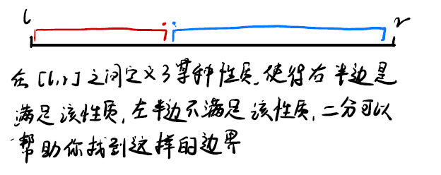
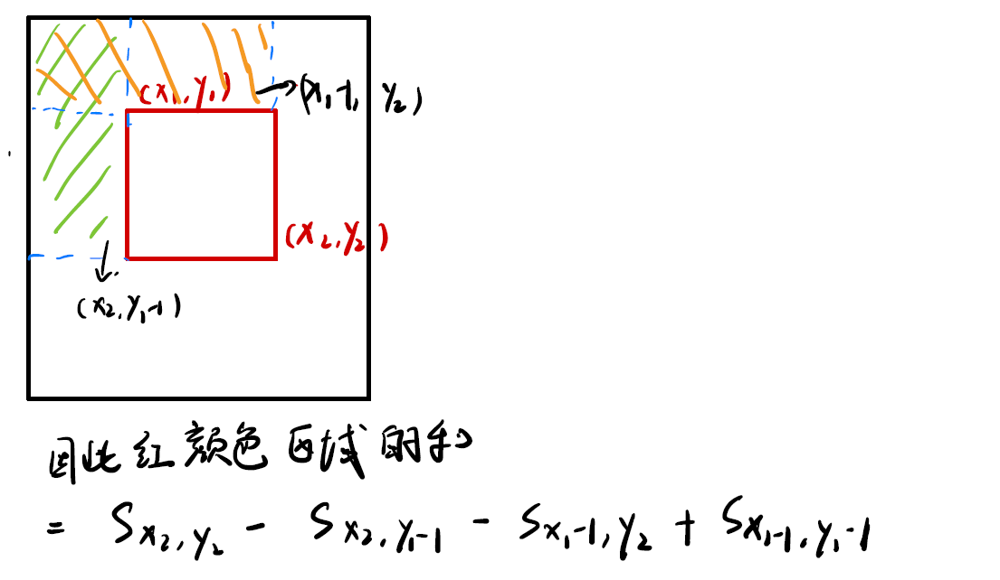
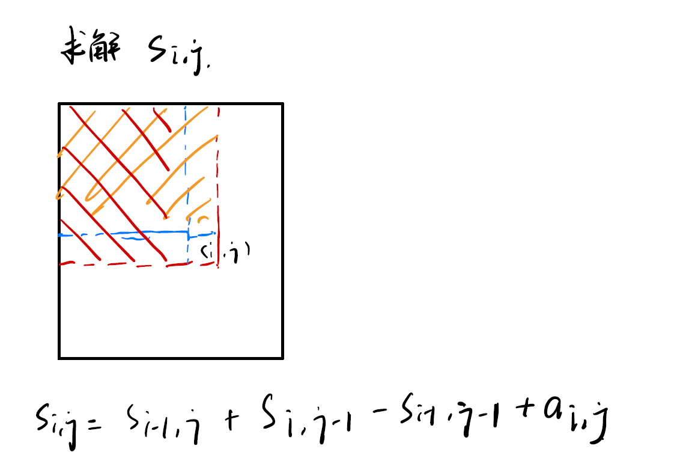
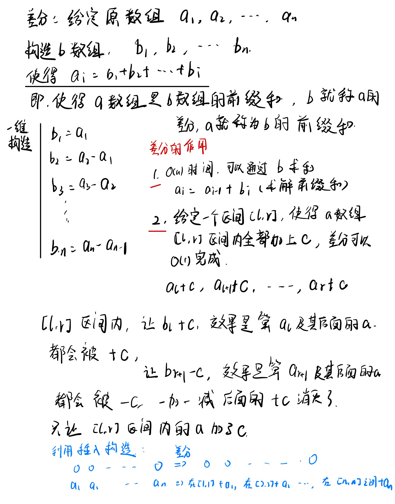

# AcWing 算法基础课

# 基础内容

## 快速排序

**模板**

```cpp
#include<iostream>

using namespace std;

const int N = 1e5 + 10;
int a[N];
int n;

void quick_sort(int q[],int l, int r){
    if (l >= r) return;
    int x = q[l + r >> 1], i = l - 1, j = r + 1;
    while (i < j)
    {
        do i++; while(q[i] < x);
        do j--; while (q[j] > x);
        if (i < j) swap(q[i], q[j]);       
    }
    quick_sort(q,l,j);
    quick_sort(q,j + 1,r);
}
int main(){
    scanf("%d ",&n);
    for (int i = 0; i < n; i++) scanf("%d ",&a[i]);
    quick_sort(a, 0, n-1);
    for (int i = 0; i < n; i++) printf("%d ",a[i]);
    return 0;
}
```

**说明**

x是划分数，有以下下几种取法

partition部分返回的结果下标模板是j

- `x=q[l]`
- `x=q[r]`
- `x=q[(l+r)/2]`
- x=随机取一个数

但是在这个模板中，如果`x=q[l]`，则下面的递归就不能写成

```cpp
qucik_sort(q,l,i-1);
quick_sort(q,i,r);
```

否则会死循环

同理

当使用模板那种写法时，x不能取q[r]

举例

q={1,2}

```
执行
quick_sort(q,0,1)
i=-1,j=2
x=1

x=q[l]
qucik_sort(q,l,i-1);
quick_sort(q,i,r);
=>
i=0 q[i]=1=x=1 i停下
j=1 q[j]=2>x=1 j--
j=0 q[j]=1=x=1 j停下
quick(q,0,-1)
quick(q,0,1) 这一步会造成死循环

执行
quick_sort(q,0,1)
x=q[r]
qucik_sort(q,l,i-1);
quick_sort(q,i,r);
x=2
i=0 q[i]=1<2 i++
i=1 q[i]=2==2 i停下
j=1 q[j]=2==2 j停下
quick_sort(q,0,0)
quick_sort(q,1,1)
```

## 快速选择算法

基于快排写

上述代码做一次划分，得到 `a[l,j]`和`a[j+1,r]`两个区间，保证了`a[l...j]<=x`和`a[j+1,..r]>=x`,因此判定需要选的第k个数是否在第一个区间就可以进行递归计算了。这里的参数`k`是指当前区间的第k小的数，因此比较`j-l`和`k-1`，`j - l + 1 >= k`，说明在第一个区间，否则在第二个区间中。此时需要选择第`k - (j - l + 1)`个数，删除了第一个区间中元素的个数。

在$O(\log n )$时间内选出top_k的数 

```cpp
#include<iostream>
#include<algorithm>

using namespace std;

const int N = 100000 + 10;
int a[N];

int nth(int q[],int l,int r,int k){
    if (l >= r) return q[l];
    
    int i = l - 1, j = r + 1, x = q[l + r >> 1];
    while (i < j){
        do i++; while(q[i] < x);
        do j--; while(q[j] > x);
        if (i < j) swap(q[i],q[j]);
    }
    if (j - l + 1 >= k)
        return nth(q, l, j, k);
    else
        return nth(q,j + 1, r, k- (j - l + 1));
}
int main(){
    int n,k;
    scanf("%d %d", &n, &k);
    for (int i = 0; i < n; i++) scanf("%d", &a[i]);
    int t = nth(a, 0, n-1, k);
    printf("%d", t);
    return 0;
}
```

## 归并排序

先归并，在排序

```cpp
#include<iostream>

using namespace std;   
const int N = 100000 + 10;
int n;
int tmp[N];
int q[N];

void merge_sort(int q[],int l,int r) {
    if (l >= r) return;
    int mid = (l + r) >> 1;
    merge_sort(q, l, mid), merge_sort(q, mid + 1, r);
    int i = l, j = mid + 1;
    int k = l;
    while (i <= mid && j <= r)
        if (q[i] < q[j]) tmp[k++] = q[i++];
        else tmp[k++] = q[j++];

    while(i<=mid) tmp[k++] = q[i++];
    while(j<=r) tmp[k++] =q[j++];

    for (int t = l; t<=r; t++)
        q[t] =tmp[t];
}

int main(){
    scanf("%d",&n);
    for (int i = 0; i < n; i++) scanf("%d", &q[i]);
    merge_sort(q,0,n-1);
    for (int i = 0; i < n; i++) printf("%d ",q[i]);
    return 0;
}
```

## 逆序对的数量

[逆序对的数量](https://www.acwing.com/problem/content/790/)

基于归并过程求解逆序对

```cpp
#include<iostream>

using namespace std;

typedef long long LL;
const int N = 100000 + 10;
int q[N],tmp[N];
int n;

LL merge_sort(int q[],int l ,int r){
    if (l >= r) return 0;
    int mid = l + r >> 1;
    LL cnt1 = merge_sort(q, l, mid), cnt2 = merge_sort(q, mid + 1, r);
    int i = l, j = mid + 1;
    int k = l;
    LL cnt3 = 0;
    while (i <= mid  && j <= r) {
        if (q[i] > q[j]) {
            tmp[k++] = q[j++];
            //当比较出一个j出来的情况的时候,i~mid和j均组成了逆序对
            cnt3 += mid - i + 1;
        }
        else    tmp[k++] = q[i++];
    }
    while ( i <= mid) tmp[k++] = q[i++];
    while ( j <= r) tmp[k++] = q[j++];
    
    for (int t = l; t <= r; t++)
        q[t] = tmp[t];
    return cnt1 + cnt2 + cnt3;
    
}
int main(){
    scanf("%d", &n);
    for (int i = 0; i < n; i++) scanf("%d",&q[i]);
    int res = merge_sort(q, 0, n - 1);
    printf("%lld\n",res);
    return 0;
}
```

## 二分查找

**整数二分**

有单调性的话一定可以二分，但是没有单调性有可能也可以二分。

可以使用二分的条件:二段性，一段满足条件，而另一个段不满足条件

二分的本质:帮助你找到边界

在下图中，我们假定蓝色段满足某种性质，而红色段不满足



两个边界都可以寻找，既可以找到蓝色边界点，也可以找到红色边界点，是两个不同的模板

```
寻找红色边界点的二分
Step 1. 取中间数mid = (l+r)/2
Step 2. check(红色性质是否满足)
{
true: 说明mid在红色区域 => 答案区间在[mid,r]
false: 说明mid在蓝色区域 => 答案区间[l,mid-1]
}
根据上面的说明,我们可以发现这里取中间数必须取上整,不能取下整,因为我们有可能转到[mid,r]区间,取下整的情况下,[mid,r]可能变成[l,r],造成死循环

寻找蓝色边界点的二分
Step 1. 取中间数mid = (l+r)/2
Step 2. check(蓝色性质是否满足)
{
true: 说明mid在蓝色区间 => 答案区间在[l,mid]
false:说明mid在红色区间 => 答案区间[mid+1,r]
}
```

按照上述的方式进行二分,推出循环的时候一定是l=r的时候，因为我们可以采用l或者是r作为寻找到得到的结果,所属的区间一定不会超过原本给定的区间,最多到区间的边界。但是在区间边界时，这个结果不一定是我们想要的，有可能当前区间根本不存在要求的结果，我们可以之后检查一下值来确定。

模板

```cpp
//寻找蓝颜色分界点
//区间被划分为[l,mid]和[mid+1,r]
int bsearch_1(int q[],int l,int r)
{
    int mid =(l+r)>>1;
    while(l<r)
    {//check蓝颜色性质
        if (check(mid)) r = mid;
        else l = mid + 1;
    }
    return l;
}

//寻找红颜色分界点
//区间被划分为[l,mid-1]和[mid,r]
int bsearch_2(int q[],int l,int r)
{
    int mid =(l+r+1)>>1;
  	while(l<r)
    {//check红颜色性质
    	if (check(mid)) l=mid;
    	else r= mid-1; 
    }
	return l;
}
```

模板的使用

**一般来说需要确定check函数，根据check函数正负确定l，r的更新方式，从确实是否需要补上+1**

第二种划分方式需要(l+r+1)>>1的原因

如果 r=l+1，那么mid就等于l，如果check成功了，那么l还等于l，[l,r]范围没变，会造成死循环。

说明:这两种二分写法是**一定有解**。只不过这个解可能不是题目要求的解而已。

二分的时候每一次都能保证**所选定的区间内是有答案的**。

浮点数二分

模板

```cpp
//以求解一个数的平方根为例，但是这个解法要求该平方根一定在[0,x]之间
double fbsearch(double x)
{
    double l=0,r=x;
    //for(int i=0;i<100,i++)
    //不用精度限制，直接指定次数
    while(r-l>1e-8)
    {
        double mid =(l+r)/2;
        //mid*mid>=x 是check函数
        if (mid * mid >= x)	r=mid;
        else l =mid;
    }
    return l;
}
```
[查找数的范围](https://www.acwing.com/problem/content/791/)

二分模板使用

```cpp
#include<iostream>
using namespace std;
const int N = 100000 + 10;
int n,m;
int q[N];
int main(){
    scanf("%d %d",&n,&m);
    for (int i = 0; i < n; i++)
        scanf("%d",&q[i]);
    while( m--) {
        int x = 0;
        scanf("%d",&x);
        int l = 0, r = n-1;
        while (l < r){
            int mid = (l + r) >> 1;
            if (q[mid] >= x) r = mid;
            else l = mid + 1;
        }
        if (q[l] != x) {
            puts("-1 -1");
            continue;
        }
        printf("%d ",l);
        l = 0, r = n-1;
        while (l < r){
            int mid = (l + r + 1) >> 1;
            if (q[mid] <= x) l = mid;
            else r = mid -1;
        }
        printf("%d\n",l);
    }
    return 0;
}
```

浮点数二分例题

[数的三次方根](https://www.acwing.com/problem/content/792/)

```cpp
#include<iostream>

using namespace std;
double n;
const double eps = 1e-8;
double cube_root(double x) {
    double l = 1, r = x;
    if (x < 1) 
        l = x, r = 1;
    
    while (r - l > eps) 
    {
        double mid = (l + r) / 2;
        if (mid * mid * mid < x) l = mid;
        else r = mid;
    }
    return l;
}
int main() {
    scanf("%lf",&n);
    if (n >= 0)
        printf("%.6lf",cube_root(n));
    else
        printf("%.6lf",-cube_root(-n));
    return 0;
    
}
```

----------

高精度计算主要讲解了4种

第一种是大数加大数

第二种是大数减大数

第三种是大数乘小数

第四种是大数除小数

## 高精度加法

**大数的表示**

高精度计算，因为不能使用int来表示数据，因此，需要先表示数字。表示数字使用数组来表示，也可以使用字符串，链表等等结构，其实是差不多的。

同时，使用数组来表示数字，一位数字放在一个数组元素中，这个时候就需要考虑怎么存放数字，有两种方式，第一种方式是个位放到前面，和平时书写数字是的顺序相反。第二种是和平时书写方式相同，把个位放到最后去。

这里采用第一种保存方式，个位放到最前面。因为对于加法，乘法这种计算，往往产生进位就会导致多一位出来，而对于数组来说，在最后面插入一个元素比在最前面插入一个元素的代价要小的多。

**加法**(高精度数字+高精度数字)

整体操作模拟手工计算加法的流程。

```cpp
//C=A+B A>=0 B>=0
vector<int> add(vector<int>& A,vector<int>& B)
{
    vector<int> C;
    int t=0;
    for (int i=0 ; i<A.size() || i<B.size();i++)
    {
        if (i<A.size()) t+= A[i];
        if (i<B.size()) t+= B[i];
        C.push_back(t%10);  
        t=t/10;
    }
    //最后的进位
    if (t) C.push_back(t);
    return C;
}

//第二种写法
vector<int> add(vector<int>& A, vector<int>& B) 
{
    if (A.size() < B.size()) return add(B, A);
    
    vector<int> C;
    int t = 0;
    for (int i = 0; i < A.size(); i ++ )
    {
        t += A[i];
        if (i < B.size()) t += B[i];
        C.push_back(t % 10);
        t /= 10;
    }
    
    if (t) C.push_back(t);
    return C;
}

// 读取数字,采用string读，然后初始化到vector里面,注意读取string没法用scanf
string a,b;
cin >> a >> b;  //这样可以正常读取
```

## 高精度减法

```cpp
bool cmp(vector<int>& A,vector<int>& B)
{
       //判断A，B的大小，保证 A>B
	if (A.size()!=B.size())
        return A.size()>B,size();
    for (int i=A.size()-1;i>=0;i++)
            if (A[i]!=B[i]) return A[i]>B[i];
    return true;
}

//C=A-B(要求A>B>0)
vector<int> sub(vector<int>& A,vector<int>& B)
{
   	vector<int> C;
    int t;
    for (int i=0;i<A.size();i++)
    {
        t=A[i]-t;
        if (i<B.size()) t-=B[i]
        C.push_back((t+10)%10);
        if (t<0) t=1;
        else t=0;
    }
    //清除前导0,最高位借位,可能导致前导0
    while(C.size()>1 && C.back()==0) C.pop_back();
    return C;
}
```

## 高精度乘法

```cpp
//C = A*b
vector<int> mul(vector<int>& A,int b)
{
    vector<int> C;
    int t=0;
    for (int i = 0; i < A.size() || t; i++)
    {
        if (i < A.size()) t = A[i]*b+t;
        C.push_back(t % 10);
        t = t / 10;
    }
    // *0会导致多余的前导0
    while(C.size() > 1 && C.back() == 0) C.pop_back();
    return C;
}
```

## 高精度除法

```cpp
// C =A/b
#include<algorithm>
vector<int> div(vector<int>& A,int b,int& r)
{
    vector<int> C;
    r=0;
    for (int i=A.size()-1;i>=0;i--)
    {
        r =r * 10 + A[i];
        C.push_back(r/b);
        r =r % b;
    }
    reverse(C.begin(),C.end());
    while(C.size()>1 && C.back()==0) C.pop_back();
    return C;
}
```

## 一维前缀和

给定一个数组$a=[a_1,a_2,a_3,...,a_n]$,这个数组的前缀和$S=[S_0,S_1,S_2,...S_n]$数组中每一项为$S_i,S_i=a_1+a_2+...+a_i$

其中$S_0=0$，是特例。

前缀和数组可以帮助你在O(1)时间内就算出数组中任意一段连续的数字序列的和，比如说$[a_i \ to \ a_j]=S_j-S_{i-1}$，使用$S_0$之后可以把公式统一起来，当i=1时，$a[1,j]=S_j =S_j-S_0$因此前缀和一般从1开始，把0留出来。

模板

```cpp
#include<iostream>

using namespace std;

const int N = 1e5 + 10;
int n,m;
int a[N],s[N];

int main() {
    scanf("%d%d",&n,&m);
    for (int i = 1; i <= n; i ++) scanf("%d",&a[i]);
    
    for (int i = 1; i <=n; i++) s[i] = s[i-1] + a[i];
    
    while(m--) {
        int l,r;
        scanf("%d%d",&l,&r);
        printf("%d\n",s[r] - s[l-1]);
    }
    return 0;
}
```

## 二维前缀和

快速计算一个子矩阵的和，前缀和数组中的元素$S_{ij}$左上角所有元素的和。

想要求解一个左上角元素为$(x_1,y_1)$右下角元素为$(x_2,y_2)$的子矩阵的和

根据图解可以看出计算公式

**计算子矩阵的公式：**



初始化二维前缀和的公式




```cpp
#include<iostream>

using namespace std;

int n,m,q;
const int N = 1010;
int a[N][N], s[N][N];

int main() {
    cin >> n >> m >> q;
    for (int i = 1; i <= n; i++)
        for (int j = 1; j <= m; j++)
            scanf("%d",&a[i][j]);
    // init
    for (int i = 1; i <= n; i++)
        for (int j=1; j <=m; j++)
            s[i][j] = s[i-1][j] + s[i][j-1] - s[i-1][j-1] + a[i][j];
    while (q--) {
        int x1,y1,x2,y2;
        cin >> x1 >> y1 >> x2 >> y2;
        int res = s[x2][y2] - s[x2][y1-1] - s[x1-1][y2] + s[x1-1][y1-1];
        printf("%d\n",res);
    }
    return 0;
}
```

## 差分

差分是前缀和的逆运算

```
给定原数组a [a_1,a_2,...,a_n]
我们需要构造数组b [b_1,b_2,...,b_n]
使得a数组对应的项是b数组的前缀和
即 a[i] = b_1 + b_2 + ... + b_i

// 一维构造情况,考虑a是前缀和,从前缀和中求出每个子元素
b1 = a1 - a0
b2 = a2 - a1
b3 = a3 - a2
...
b_n = a_n - a_{n-1}

// 差分和前缀和是逆运算
当我们知道b数组之后,可以在O(n)时间内求出a数组
for (int i = 1; i <= n; i++)
	a[i] =a[i-1] + b[i];

// 差分作用
给定区间a[l,r],将a[l,r]区间内所有的数全都加上c,差分可以将这个操作变为O(1)
我们将b[l]+c,这样在计算a[l]到a[n]的时候每一个a都会加上C
然后我们在将b[r+1]-C,这样在计算a[r+1]...a[n]的时候每一个a都会减C
所以我们的操作为
b[l] + C,b[r+1]-C;

// 利用插入来构造差分数组
我们已知a数组
b数组初始化为0,那么b数组是一个全0的数组c的差分
现在我们将c数组变成a数组
那么根据差分的操作
我们对b数组进行差分操作,使c[i,i] + a[i]
for (int i = 1; i <=n; i++)
{
	b[i] + a[i];
	b[i+1] - a[i];
}

// 注解
因为差分一般也需要涉及前缀和,因此从1开始会比较好
```

差分的介绍以及一维差分



利用差分，让数组a的某一段都加上c的代码

```cpp
#include<iostream>

using namespace std;
const int N = 1e5 + 10;
int n,m;

int a[N],b[N];

void insert(int l, int r,int c) {
    b[l] += c;
    b[r+1] -=c;
}

int main() {
    cin >> n >> m;
    for (int i = 1; i <= n; i++) {
        cin >> a[i];
        insert(i,i,a[i]);
    }
    while(m--) {
        int l,r,c;
        cin >> l >> r >> c;
        insert(l,r,c);
    }
    for (int i = 1; i <= n; i++) a[i] = a[i-1] + b[i];
    for (int i = 1; i <= n; i++) printf("%d ",a[i]);
    return 0;
}
```

## 二维差分

```
二维差分和二维前缀和的逆运算
原矩阵a[i][j]
然后我们根据原矩阵构造差分矩阵b[i][j]
满足a[i][j] 是b[i][j]前面的数的二维前缀和
即
a[i][j] = b[1][1] + b[1][2] + .... + b[i][1] + ... b[i][j]
二维差分的作用在O(1)时间内内a中某一个子矩阵加C
考虑a中的一个子矩阵
[x1,y1] [x2,y2]

b[x1,y1] += c 效果使得a[x1,y1]右下角下所有点都+C
b[x2+1,y1] -= c
b[x1,y2+1] -= c
b[x2+1,y2+1] += c

// 二维矩阵的差分矩阵也是进行和一维差分类似的构造
给定矩阵a
我们先初始化一个全0的矩阵b,它是一个全零的矩阵c的差分
现在我们把c变成a
那么进行的操作就是
差分(i,j,i,j,a[i,j])
```

```cpp
#include<iostream>

using namespace std;
const int N =1010;
int a[N][N],b[N][N];
int n,m,q;

void insert(int x1,int y1,int x2,int y2,int c) {
    b[x1][y1] += c;
    b[x2+1][y1] -= c;
    b[x1][y2+1] -= c;
    b[x2+1][y2+1] += c;
}

int main() {
    cin >> n >> m >> q;
    for (int i = 1; i <= n; i++)
        for (int j = 1; j <= m; j++) {
            cin >> a[i][j];
            insert(i,j,i,j,a[i][j]);
        }
    while(q--) {
        int x1,y1,x2,y2,c;
        cin >> x1 >> y1 >> x2 >> y2 >> c;
        insert(x1,y1,x2,y2,c);
    }
    
    for (int i = 1; i <= n; i ++)
        for (int j = 1; j <= m; j ++) 
            a[i][j] = a[i-1][j] + a[i][j-1] - a[i-1][j-1] + b[i][j];
    
    for (int i = 1; i <= n; i ++) {
        for (int j =1; j <= m; j++) 
            printf("%d ",a[i][j]);
        printf("\n");
    }
    return 0;
}
```

## 双指针算法

- 有两个序列，两个指针分别指向不同的序列，例子是归并排序
- 只有一个序列，两个指针分别指向序列的不同位置(或者相同)，例子是快速排序，一般用这两个指针维护一个区间

```cpp
for (int i=0,j=0;i<n;i++)
{
	while(j<i && check(i,j)) j++;
    
	//具体问题逻辑
}
// 这个模板i,j的起始位置都是0,并且维护的区间是[j,i]
// 我们也可以自己改变i,j的起始位置，例如
for (int i=n-1,j=0; i >=0; i--) {
    while(j < i && check(i,j)) j++;
    // 具体问题逻辑
}
//这个模板i起始为n-1,j起始位置0,并且维护的区间是[j,i]

// 双指针的核心想法
/*因为有i，j两个指针,因为组合是O(n^2)的，所有的指针的情况可以组合形成一个矩阵,而当我们只移动i或者只移动j的时候，我们直接走过了一行或者一列,因此双指针是O(n).不过这里我们据需要保证我们可以直接走过一行或者一列，那些点不会是最有解*/

// 维护一个窗口只是双指针的一个作用
// 双指针也有其他的用法
```

经典题目

最长连续不重复子序列

```cpp
#include<iostream>

using namespace std;

const int N = 1e5+10;
int a[N];
int c[N]; // 维护区间内各个字符出现的次数
int n;
int main() {
    cin >> n;
    for (int i = 0; i < n; i++) cin >> a[i];
    int res = 0;
    // j表示以i为结尾的最长不重复连续子序列的开头,当i增加的时候,j也只能增加
    for (int i = 0, j = 0; i < n; i++) {
        c[a[i]]++;
        while( c[a[i]] != 1) { 
            c[a[j]] --;
            j++;
        }
        res = max(res, i-j+1);
    }
    cout << res << endl;
}
```


整体的滑动窗口算法比较像双指针

求解某一段连续区间满足某种性质，这种问题可以采用滑动窗口求解，在滑动中保存最大值，即可求出最优解，设区间为[i,j],从[0,0]开始，j++ 向着一个方向(增加，直到满足性质或者是别的)，i++向着相反的方向(减少，直到不满足性质，或者别的)，在这其中遍历了所有区间，保存好最优解输出即可。

把滑动窗口想象成一个队列，**i**是队列头，**j**是队列尾，然后想一个队列内元素应该满足的性质，这个性质应该是**j**第一次入队就可以满足的性质。之后在其他元素入队的过程中，和单调队列求解滑动窗口的最小(大)值相似，**j**需要入队，但是j的入队可能会导致队列内元素不满足性质，因此需要让**i**这边出队做好**j**入队的准备。通过**i**出队来控制队列中的状态。

[例题分析](https://leetcode-cn.com/problems/minimum-size-subarray-sum/)

代码

```cpp
class Solution {
public:
    int minSubArrayLen(int target, vector<int>& nums) {
        int n = nums.size();
        int res = n;
        int nums_sum = 0;
     	//这个题目求解连续和>=k的最小区间长度,j++的过程中sum不断变大,而i++的过程中，让和不满足>=k的条件
        //这里队列里的性质是队列内元素和<k,因此在i出队之后的区间[i,j]是满足题目性质的。
        for (int i=0,j=0,sum=0;j<n;j++)
        {
            nums_sum+=nums[j];
            sum += nums[j];   //j入队
            while(sum>=target) //i出队,做好下一个j入队的准备
            {
                res = min(res,j-i+1);  //这边一定是可行解
                sum -= nums[i];
                i++;
            }
        }
        if (res==n && nums_sum<target) return 0;
        return res;
    }
};
```

[例题分析](https://leetcode-cn.com/problems/maximize-the-confusion-of-an-exam/)

```cpp
class Solution {
public:
    int maxConsecutiveAnswers(string answerKey, int k) {
        return max(getCnt(answerKey,'T',k),getCnt(answerKey,'F',k));
    }
    int getCnt(string s,char c,int k)
    {
        int res = 0;
        int n = s.size();
        //这道题求解的是包含字符c的个数<=k的最大区间长度
        //这里队列里面元素的性质是[i,j]之间字符c的数量<=k
        for (int i=0,j=0,cnt=0;j<n;j++)
        {
            if (s[j]==c) cnt++; //j++的过程中,让统计的c的数量(cnt)++,
            while(cnt>k) //i++的过程中,cnt保持<=k的状态
            {
                if (s[i]==c) cnt--;
                i++;
            }
            res = max(res,j-i+1);
        }
        return res;
    }
};
```


```cpp
for (int i=0,j=0;j<n;j++)
{
	j++导致的性质变化  //这句和while循环可以调换顺序，需要具体问题具体分析
	while(满足性质)
	{
        //这里有可能,比如求最小区间,i
		i++导致的性质变化
	}
    //这里也有可能
   //你需要在这个过程确定那个地方的区间是可行解，然后保存最优解
}
```


## 位运算

常用的位运算操作

```cpp
1. n的二进制表示中，第k位是几,k=0~31,0是个位
a = n>>k & 1;
2. lowbit操作(提取一个二进制数中的最后一位1)(树状数组的基本操作)
 // -x 取反在+1,最后一位1前面的数字+1不影响，只取反，和x做按位与,变成全零,最后一位1后面的形式(1000...)取反加1之后不变,做按位与也不变
int lowbit(x) {
    return x & -x;
}
a = n & -n;  //这个的结果只保留了最后一位1，其余为均是0
a = n & n-1 // 这个的结果是将n的最后一个1变成0

```

## 离散化

特指整数的离散化

对于一些值域范围很大，但是数字很稀疏的一些数，开过长的数组会导致大量空间的浪费，

所以需要一些手段，把这些数字映射到从0开始的一些自然数

给定一个数组a，将数组a离散化

- a[]中可能有重复元素

- 如何求出x(a[]中的一个元素)离散化的值

- 假定a是有序的

```cpp
#include<iostream>
#include<vector>
#include<algorithm>
using namespace std;
// 数字n个,查询2m个,都需要离散化,这些下标都需要离散化
typedef pair<int,int> PII;
const int N = 3e5 + 10;
int a[N],s[N];
int n,m;

vector<int> alls;
vector<PII> items,querys;


int find(int x) {
    int l = 0, r = alls.size() - 1;
    while(l < r) {
        int mid = (l+r) >> 1;
        if (alls[mid] >= x) r = mid;
        else l = mid + 1;
    }
    return l + 1; // 映射到1,2,3,...
}

int main() {
    cin >> n >> m;
    //item
    for (int i = 0; i < n; i ++) {
        int x,c;
        cin >> x >> c;
        items.push_back({x,c});
        alls.push_back(x);
    }
    // query
    for (int i = 0; i < m; i++) {
        int l,r;
        cin >> l >> r;
        querys.push_back({l,r});
        alls.push_back(l);
        alls.push_back(r);
    }
    // 去重
    sort(alls.begin(),alls.end());
    alls.erase(unique(alls.begin(),alls.end()),alls.end());
    // 插入
    for (int i = 0; i < items.size(); i++) {
        int x = items[i].first, c = items[i].second;
        a[find(x)] += c;
    }
    // 求前缀和
    for (int i = 1; i <= alls.size(); i++) s[i] = s[i-1] + a[i];
    // 处理查询
    for (auto q : querys) {
        int l = find(q.first), r = find(q.second);
        cout << s[r] - s[l-1] << endl;
    }
    return 0;
}
```

## 区间合并

将所有存在交集的区间合并，排序贪心

```cpp
#include<iostream>
#include<algorithm>
#include<vector>

using namespace std;

typedef pair<int,int> PII;
vector<PII> a;
int n;

bool cmp(const PII &t1, const PII &t2) {
    return t1.first <= t2.first;
}

int main() {
    cin >> n;
    for (int i=0; i<n; i++){
        int l,r;
        cin >> l >> r;
        a.push_back({l,r});
    }
    sort(a.begin(),a.end(),cmp);
    int st = -1e9 - 10, ed = -1e9 - 10;
    int res = 0;
    for (auto item : a) {
        int l = item.first, r = item.second;
        if (l > ed) {
            res ++;
            st = l;
            ed = r;
        } else
            ed = max(r,ed);
    }
    cout << res << endl;
}
```