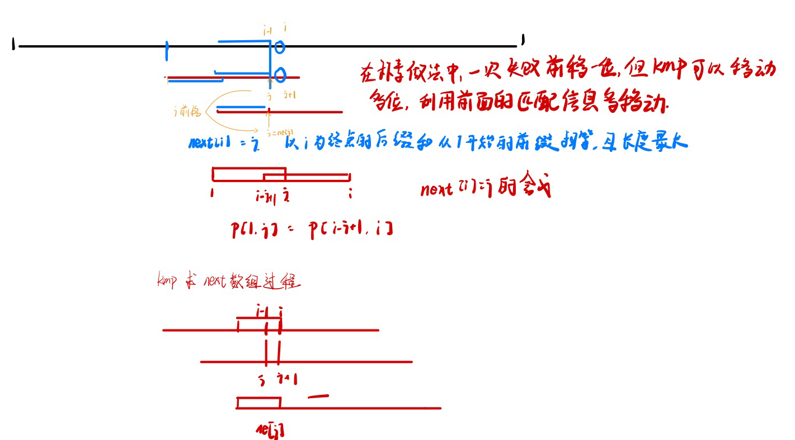
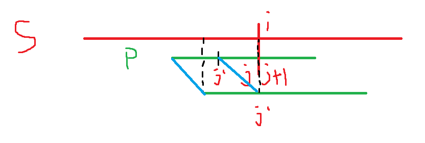
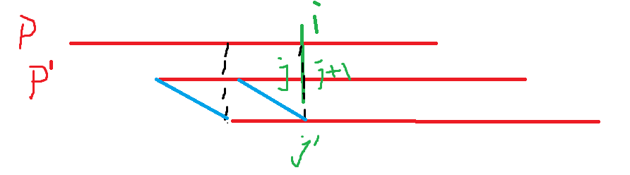

# AcWing 算法基础课

# 数据结构

## 数组模拟单链表

使用数据模拟单链表

单链表头插法O(1),知道当前点的坐标，可以在O(1)时间内向后插入，和删除下一个点

数组模拟使用的变量

- `e[N]` 存储节点值
- `ne[N]` 存储节点的next
- `head` 存储头节点
- 使用 `-1` 表示空节点

e[N] ne[N] ,e是值列表，ne是next指针列表,null值用-1表示

```cpp
#include<iostream>

const int n = 1e5 + 10;
// head 指向头节点下标,e[head]即为第一个点的值
// e[i] 表示第i个点的值
// ne[i] 表示第i个点的next
//idx存储当前已经用到的点
int head,e[N],ne[N],idx;

// 链表需要的操作
// 初始化
void init() {
    head = -1,idx = 0;
}
// 头插法
void add_head(int x) {
    e[idx]=x,ne[idx]=head,head=idx,idx++;
}
// 将x插入节点k的下一个位置(节点k,下标,即为指针)
void add(int k, int x) {
    e[idx] =x,ne[idx]=ne[k],ne[k]=idx,idx++;
}
// 将下标为k的点的后面的点删除
void remove(int k) {
    ne[k]=ne[ne[k]];
}
```

acwing上的模拟题

```cpp
#include<iostream>

using namespace std;
const int N = 1e5 + 10;
int head,e[N],ne[N],idx;

void init() {
    head = -1;
    idx = 0;
}
void addHead(int x) {
    e[idx]=x,ne[idx]=head,head = idx++;
}
//在k之后添加节点
void addAfter(int k,int x) {
    e[idx] = x,ne[idx] = ne[k],ne[k] =idx++;
}
// 移除k的下一个节点
void remove(int k) {
    ne[k] = ne[ne[k]];
}
int main() {
    init();
    int m = 0;
    cin >> m;
    while(m--) {
        char op;
        cin >> op;
        if (op == 'H') {
            int x;
            cin >> x;
            addHead(x);
        } else if (op == 'D') {
            int k;
            cin >> k;
            if (k > 0) remove(k-1);
            else head = ne[head];
        } else if ( op == 'I') {
            int x,k;
            cin >> k >> x;
            addAfter(k-1,x);
        }
    }
    for (int i=head; i!=-1; i=ne[i]) {
        cout << e[i] << " ";
    }
    return 0;
}
```

## 数组模拟双链表

双链表可以在O(1)时间内左侧插入，右侧插入，删除自己，这些操作需要知道节点自己。

同时双链表可以在O(1)时间内实现头插和尾插。

需要的变量

- `l[N],r[N]` 保存各个点左侧值和右侧值
- `head,tail` 保存头尾节点，一般使用0号点作为head，1号点作为tail
- `e[N]` 保存节点值

```cpp
// 各种操作
#include<iostream>

const int N = 1e5 + 10;
int e[N],l[N],r[N],idx;
int head = 0,tail = 1;
void init() {
    r[head] = tail;
    l[tail] = head;
    idx = 2;
}
// 在k之后插入,在k之前插入可以使用addAfter(l[k],x)来实现
void addAfter(int k, int x) {
    int ne = r[k]; 
    e[idx] = x;
    l[idx] = k,r[idx] = r[k];
    r[k] = idx,l[ne] = idx;
    idx++;
}
void addBefore(int k,int x) {
    addAfter(l[k],x);
}
// 删除下标为k的点
void remove(int k) {
    int pre = l[k],ne = r[k];
	r[pre] = ne;
    l[ne] = pre;
}
// print
void print() {
    for (int i = r[head]; i!= tail; i=r[i]) cout << e[i] << " ";
}
```


在下面的代码中，0是头，1是尾，就算链表为0，这两个点也不会被删除

手写双链表入门题目:https://leetcode-cn.com/problems/lru-cache/,用双链表来保存使用情况，tail就是最近最少使用的节点。

```
0 6(2) 5(3) 4(1) 1
```

```
0 4(1) 3(2) 1
```


```cpp
#include<iostream>

using namespace std;

const int N = 100010;

int e[N],l[N],r[N],idx;

void init()
{
    r[0] = 1,l[1] = 0;
    idx = 2;
}

void remove(int k)
{
    r[l[k]] = r[k];
    l[r[k]] =l[k];
}

void add(int k,int x)  //在节点k右侧插入一个点,只需要实现右侧插入，左侧插入可以通过add(l[k],x)来实现
{
    e[idx] = x;
    l[idx] =k;
    r[idx] =r[k];
    r[l[idx]] = idx;
    l[r[idx]]=idx;
    idx++;

    /*另一种插入方法
    e[idx]=x;
    l[idx]=k;
    r[idx]=r[k];
    l[r[k]]=idx; //这里要优先写l[r[k]],因为后面r[k]会变
    r[k]=idx;
    idx++;
    */
}
int main()
{
    int m;
    cin>>m;
    int k,x;
    init();
    while(m--)
    {
        string op;
        cin>>op;
        if (op=="L")
        { 
            cin>>x;
            add(0,x);
        }
        else if (op=="R") 
        {
            cin>>x;
            add(l[1],x);
        }
        else if (op=="D") 
        {
            cin>>k; //idx从2开始，第k个插入的数下标是k+1
            remove(k+1);
        }
        else if (op=="IL")
        {
            cin>>k>>x;
            add(l[k+1],x);
        }else
        {
            cin>>k>>x;
            add(k+1,x);
        }
    }

    for (int i=r[0];i!=1;i=r[i]) cout<<e[i]<<" ";
    cout<<endl;
}
```

## 数组模拟栈

```cpp
// version 2
int stk[N],tt = 0; // 栈顶下标tt,在使用时0下标不存内容
stk[++tt] = x; // push
tt-- // pop
stk[tt] // top
if (tt) return not empty // 检测是否非空
 
// version1
// tt是栈顶下标
int stk[N],tt=0;
//push 如果要使用栈中元素，在算右值的时候,栈顶下标仍然是tt,在算出右值，并赋值给左值的时候，tt先自增在赋值
stk[++tt] =x;
//pop
tt--;
//is_empty()
if (tt) not empty;
else empty;
//取栈顶元素
stk[tt]
```

例题: [模拟栈](https://www.acwing.com/problem/content/830/)
```cpp
#include<iostream>

using namespace std;
const int N = 1e5+10;
int stk[N], tt = 0;

void push(int x) {stk[++tt] = x;}

int pop() {return stk[tt--];}

int top() {return stk[tt];}

bool _is_empty() {return tt <= 0;}

int main() {
    int m;
    cin >> m;
    while(m--) {
        string op;
        cin >> op;
        int x;
        if (op == "push") {
            cin >> x;
            push(x);
        }
        else if (op == "query") {
            cout << top() << endl;
        }
        else if (op == "pop") {
            pop();
        }
        else {
            string res = _is_empty() ? "YES" : "NO";
            cout << res << endl;
        }
    }
    return 0;
}
```

例题:[表达式求值](https://www.acwing.com/problem/content/description/3305/)
```cpp
#include<iostream>
#include<stack>
#include<ctype.h>
#include<unordered_map>

using namespace std;

stack<int> nums;
stack<char> ops;

void eval() {
    int b = nums.top(); nums.pop();
    int a = nums.top(); nums.pop();
    char op = ops.top(); ops.pop();
    int res = 0;
    switch (op) {
        case '+':
            res = a + b;
            break;
        case '-':
            res = a - b;
            break;
        case '*':
            res = a * b;
            break;
        case '/':
            res = a / b;
    }
    nums.push(res);
}

int main() {
    string s;
    cin >> s;
    unordered_map<char, int> pr={{'+',1},{'-',1},{'*',2},{'/',2}};
    for (int i = 0; i < s.size(); i++) {
        if (isdigit(s[i])) {
            int j = i;
            int x = 0;
            while(j < s.size() && isdigit(s[j])) {
                x = x*10 + s[j++] - '0';
            }
            i = j-1;
            nums.push(x);
        } 
        else if (s[i] == '(') {
            ops.push('(');
        } else if (s[i] == ')') {
            while(ops.size() && ops.top() != '(') eval();
            ops.pop();
        } else {
            // 把所有优先级>=s[i]的操作全做了
            // 因为减法不满足交换律
            // 1 - 2 + 1 必须先算1-2,而不能先算 2 + 1
            while(ops.size() && pr[ops.top()] >= pr[s[i]]) eval();
            ops.push(s[i]);
        }
    }
    while(ops.size()) eval();
    cout << nums.top() << endl;
}
```
 
## 数组模拟队列

```cpp
// version 2
// 先进先出
int q[N] hh= 0,tt=-1 // 这个实际模拟的是双端队列,hh队头,tt队尾
hh++ // 队头弹出
q[++tt] // 队尾入队
if (hh <= tt) not empty else empty // 判断非空
q[hh] // 队首值
q[tt] // 队尾值
tt-hh + 1 // 队列中的元素个数
 
// version 1
int q[N],hh=0,tt=-1;
//向队尾插入一个元素
q[++tt]=x
//从队头弹出一个元素
hh++;
//队列是否为空
if (hh<=tt) not empty
else empty
//队首值，队尾值
q[hh]
q[tt]
 //队列中元素的个数
    tt-hh+1;
```

模拟队列,例题
```cpp
#include<iostream>

using namespace std;

const int N = 1e5+10;

int q[N], hh = 0, tt = -1;

int main() {
    int m;
    cin >> m;
    while (m --) {
        string op;
        cin >> op;
        int x;
        if (op =="push") {
            cin >> x;
            q[++tt] = x;
        } 
        else if (op == "pop") {
            hh++;
        }
        else if (op == "query") {
            cout << q[hh] << endl;
        } else {
            string res = hh > tt ? "YES" : "NO";
            cout << res << endl;
        }
    }

}
```

## 单调栈

顾名思义，栈中的元素单调上升或下降

一般而言是用来寻找数组中某个元素(左/右)边最近的比他(大/小)的数

找左侧的数,从左边开始遍历,要留下小数,就把大数全删了
找右侧的数，从右边开始遍历,要留下大数,就把小数全删了

```cpp
//例题
//给定一个长度为 N 的整数数列，输出每个数左边第一个比它小的数，如果不存在则输出 -1。
//这个例题中，对于要寻找的数x的所有左边的任意两个下标x,y:设x<y,如果n[x]>=n[y],那么
//n[x]就不可能是答案，因为n[y]总是比n[x]好的。
//不存在这样的逆序对，那么栈中的元素就是单调递增的
const int N =100010;
int n,x;
int stk[N],tt;
int main(){
    scanf("%d",&n);
    for (int i=0;i<n;i++)
    {
        scanf("%d",&x) ;
        while(tt && stk[tt]>=x) tt--;
        if (tt) printf("%d ",stk[tt]);
        else printf("-1 ");
        stk[++tt] =x;
    }
    return 0;
}
//时间复杂度是O(n)的，因为对于数组中的每一个元素最多入栈一次，然后出栈一次

//稍微变形
//给定一个长度为 N 的整数数列，输出每个数左边第一个比它大的数，如果不存在则输出 -1。
//要求栈中的元素是单调递减的,从栈顶开始看，弹出所有比当前数x小的数，然后将x加入，这样栈就是单调递减的
const int N=1000010;
int n,x;
int stk[N],tt;
int main(){
    scanf("%d",&n);
    for (int i=0;i<n;i++)
    {
        scanf("%d",&x) ;
        while(tt && stk[tt]<=x) tt--;
        if (tt) printf("%d ",stk[tt]);
        else printf("-1 ");
        stk[++tt] =x;
    }
    return 0;
}
```

STL版本

```cpp
#include<iostream>
#include<stack>

using namespace std;

int n;

int main()
{
    stack<int> stk;
    scanf("%d",&n);
    for (int i=0;i<n;i++)
    {
        int x;
        scanf("%d",&x);

        while(stk.size() && stk.top()>=x) stk.pop();
        if (stk.empty()) printf("-1 ");
        else printf("%d ", stk.top());
        stk.push(x);
    }
    return 0;
}
//找左侧第一个小于x的数，从开头开始，单调递增栈
//找左侧第一个大于x的数，从开头开始，单调递减栈
//找右侧第一个小于x的数，从最后开始，单调递增栈
//找右侧第一个大于x的数，从最后开始，单调递减栈
```

```cpp
#include<iostream>
#include<stack>

const int N = 1e5 + 10;
using namespace std;
int n;
int a[N];
int b[N];
int main() {
    stack<int> stk;
    cin >> n;
    for (int i = 0; i < n; i++)
        cin >> a[i];
    // 控制<= 还是等于看弹栈的条件,是否允许等于的存在
    // 左侧第一个大于x的数,栈里存的数需要比x大,而x又在栈顶,因此<=x的需要全部弹出,这是一个单调递减栈
    for (int i = 0; i < n; i++) {
        while (stk.size() && stk.top() <= a[i]) stk.pop();
        if (stk.empty()) cout << "-1 ";
        else cout << stk.top() << " ";
        stk.push(a[i]);
    }
    cout << endl;
    // 右侧第一个小于x的数,栈里存的数需要比x小,x在栈顶,因此>=x的需要全部弹出,这是一个单调递增栈
    while(!stk.empty()) stk.pop();
    for (int i=  n-1; i>= 0; i --) {
        while(stk.size() && stk.top() >= a[i]) stk.pop();
        if (stk.empty()) b[i] = -1;
        else b[i] = stk.top();
        stk.push(a[i]);
    }
    for (int i =0; i < n; i++) cout << b[i] << " ";
    cout << endl;
    // 右侧第一个大于x的数,栈里存的数需要比x大,x在栈顶,因此<=x的需要全部弹出,这是一个单调递减栈
    while(!stk.empty()) stk.pop();
    for (int i=  n-1; i>= 0; i --) {
        while(stk.size() && stk.top() <= a[i]) stk.pop();
        if (stk.empty()) b[i] = -1;
        else b[i] = stk.top();
        stk.push(a[i]);
    }
    for (int i =0; i < n; i++) cout << b[i] << " ";
    cout << endl;
    
    return 0;
}
```

## 单调队列

一般用来求解滑动窗口中的最大值/最小值

step 1. 判断队头是否在窗口中,不在的话弹出队头(滑动窗口特有的)
step 2. 根据要保留<=x的数还是>=x的数,弹出队尾的值
step 3. 新值x入队
step 4. 这个窗口已经调整好了,可以获取max 值 or min 值了
```cpp
#include<iostream>
using namespace std;

const int N =1000010;
int n,k;
int a[N],q[N];
int main()
{
    scanf("%d%d",&n,&k);
    for (int i=0;i<n;i++) scanf("%d",&a[i]);
    //定义队头和队尾
    int hh=0,tt=-1;
    //找最小值,队列是单调递增序列,最小值在队头的位置,从队尾开始弹出大于等于a[i]的元素，然后将a[i]加入队尾
    for(int i=0;i<n;i++)
    {
        //判断当前队头是否在窗口中
        //      2 3 4  5] k=3 5-3=2 q[hh]<i-k+1
        if (hh<=tt && q[hh]<i-k+1) hh++;
        while(hh<=tt && a[q[tt]]>=a[i]) tt--;
        q[++tt]=i;
        if (i>=k-1) printf("%d ",a[q[hh]]);
    }
    puts("");
    //找最大值
    hh=0,tt=-1;
    //找最大值,队列是单调递减序列,最大值在队头的位置,从队尾开始弹出小于等于a[i]的元素,然后将a[i]加入队尾
    for(int i=0;i<n;i++)
    {
        //判断当前队头是否在队列中
        if (hh<=tt && q[hh]<i-k+1) hh++;
        while (hh<=tt && a[q[tt]]<=a[i]) tt--;
        q[++tt] =i;
        if (i>=k-1) printf("%d ",a[q[hh]]);
    }
    puts("");
    return 0;
}
```

STL版本,更好记也更好理解

```cpp
#include<iostream>
#include<deque>

using namespace std;

const int N = 1000010;
int n,k;
int a[N];

int main()
{
    scanf("%d%d",&n,&k);
    for (int i=0;i<n;i++) scanf("%d",&a[i]);
    deque<int> q;
    
    for (int i=0;i<n;i++)
    {
        if (q.size() && q.front()<i-k+1) q.pop_front(); //判断当前的最小节点是否还在窗口内,用while循环也可
        //不写的话,就会有窗口前面的小值一直霸占队头最小的位置,但是实际上该元素已经不在窗口里面了。
        while(q.size() && a[q.back()]>=a[i]) q.pop_back();
        q.push_back(i);
        
        if (i>=k-1) 
        {
            printf("%d ", a[q.front()]);
        }
    }
    
    puts("");
    q.clear();
    for (int i=0;i<n;i++)
    {
        if( q.size() && q.front()<i-k+1) q.pop_front();
        while(q.size() && a[q.back()]<=a[i]) q.pop_back();
        q.push_back(i);
        if (i>=k-1) printf("%d ", a[q.front()]);
    }
    return 0;
}
```


## KMP算法



```cpp
#include<iostream>
using namespace std;

const int N =100010,M =1000010;
int n,m;
char p[N],s[M];
int ne[N];
// S是模式串,P是模板串
int main()
{
    cin>>n>>p+1>>m>>s+1; //下标从1开始..
    //ne[1]=0,不用算，表示前面匹配成功的长度只有1,没法凑前缀=后缀
    //整体的计算过程很像动态规划，在计算ne[i]之前,i前面的的ne都已经计算好了，
    //然后利用ne[i]=j来获取前面的匹配信息,
    //根据j=ne[j]来获取
    //在上一个循环中,ne[i-1]等于j,然后看p[i]是否等于[j+1],如果相等，j直接++
    //如果不等，则需要j =ne[j],来让j后退(递归式)，来看前面的满足前缀等于后缀的j，如果j退到退无可退，那么j=0,检查一下p[j+1]和p[i]是否相等，相等则j++，这样的条件都没有的话j就会等于0
     for (int i=2,j=0;i<=n;i++)
     {
         while (j && p[j+1]!=p[i]) j =ne[j];
         if (p[j+1]==p[i]) j++;
         //ne[i]=j的含义是以i为终点的后缀和从1开始的前缀相等,且其最大长度为j
         ne[i] =j;
     }
    // kmp匹配过程
    for (int i=1,j=0;i<=m;i++)
    {
        while(j && p[j+1]!=s[i]) j =ne[j];  // j没有退回起点 && p[j+1]和s[i]不匹配，j=ne[j]
        if (p[j+1]==s[i]) j++; // 退出循环的是两个条件或者的不满足关系，当是第二个条件不满足时，判断一下当前是否匹配，匹配的话j++
        //当j退无可退之后,但是j+1和i也不匹配，那么i++,看模板串的下一位
        if(j==n)
        {
            printf("%d ",i-n);// 输出每一个匹配的开始位置，以0为开始下标
            j =ne[j]; //匹配成功之后往后退一步，来进行接下来的匹配
            //匹配成功    
        }
    }
    return 0;
}
```


第二次看讲解的理解，我认为第二次理解的更深刻，更好懂一些

问题描述：设长字符串为S，长度为n，需要匹配的模式串为P，长度为m。字符串匹配问题即是寻找在S串中所有P串的出现。

1.首先我们来看字符串匹配的暴力做法，KMP做法可以从暴力延伸出来

暴力的做法就是遍历S串的每一个位置，然后把这个位置当作开始位置，匹配m次，看是否能和P串匹配。

```cpp
s [1...n]
p [1...m]
for (int i = 1; i <= n - m + 1; i ++ ) 
{
	bool flag = true;
	for (int j = 0; j < m; j ++) 
	{
		if (s[i + j] != p[j + 1]) 
        {
            flag = false;
            break;
        }
        if (flag) 
        {
          //匹配成功
        }
	}
}
```

但是当匹配失败的时候前面已经有很多匹配成功的字符，我们可以利用这些字符，使得我们不必在S串一个一个字符跳。

设当前匹配字符是S串的第`i`个位置，P串的第`j+1`个位置，此时我们发现`s[i]`和`p[j+1]`不匹配，然后我们需要将P串向后移，那么最多可以后移多少呢？

虽然在图示上我们发现了P串在向后移，但是下标`j`实际上是变小了，指向了P串较前面的位置。

后移时，我们需要保证在`s[i]`前面可以匹配，这样我们只需要从i位置继续向后匹配即可。那么我们可以得到图示上的关系。

**用黑色虚线括起来的三部分是匹配的**

**移动之后可以发现，用蓝线括起来的是同一个串**

所以我们可以发现移动前后是一个前缀和后缀相同的串。在图上表示的就是

$p[1,j^\prime] = p[j -j^\prime + 1, j]$表示的串相同，我们可以发现按照这种方式，`j`需要移动到`j^\prime`的位置上。

同时我们为了保证不错过任何一次匹配，我们需要下标`j`向前移动的最大，即需要求出前缀和后缀匹配的最长的串，即是`next[]`数组，这个数组和S串没有关系。next数组保存的内容是`next[j] = j'`, 表示的含义是 p[1, j'] = p[j-j'+1, j]相同,且是此时最小的j',即前移的最多



假设我们已经知道了next数组，我们先看这个数组怎么在KMP中使用。

字符串下标从1开始

```cpp
for (int i = 1, j = 0; i <= n; i ++ )
{
	//当s[i] != p[j + 1]时,j向后退,直到j退成0或者是s[i] == p[j+1],匹配成功了。
    //j退成0之后就退无可退了,说明s[i]和p[1]不匹配,该i++了
	while (j && s[i] != p[j + 1]) j = next[j];
	if (s[i] == p[j + 1]) j ++; //需要把j==0和s[i] == p[j+1]区分开
    if (j == m) 
    {
        //匹配成功
    }
}
```

求解next数组，求解next数组采用了和KMP过程类似的做法。可以看成P和P求解匹配，当模式串的是前缀，当S串的是后缀。



```cpp
//next[1] = 0,不需要求解
for (int i = 2; j = 0; i <= m; i ++ )
{
	while(j && p[i] != p[j + 1]) j = next[j];
	if (p[i] == p[j + 1]) j++;
	next[i] = j;
}
```

综合以上两部分，我们就可以得到KMP的做法，注意这里匹配成功之后我们在将j向后退一步，继续进行匹配

```cpp
#include<iostream>

using namespace std;

const int N = 1e6 + 10, M = 1e5 + 10;

char s[N], p[M];
int n, m;
int ne[N];

int main() 
{
    cin >> m >> p + 1 >> n >> s + 1;
    
    for (int i = 2, j = 0; i <= m; i ++ ) 
    {
        while( j && p[i] != p[j + 1]) j = ne[j];
        if (p[i] == p[j + 1]) j ++;
        ne[i] = j;
    }
    
    for (int i = 1, j = 0; i <= n; i ++)
    {
        while(j && s[i] !=p[j + 1]) j = ne[j];
        if (s[i] == p[j + 1]) j ++;
        if (j == m) 
        {
            cout << i - m << " ";
            j = ne[j];
        }
    }
}
```

## Trie树

Trie树是用来高效的**存储**和**查找**字符串的一种数据结构，把多个字符的行进路径存储为一棵树，因此Trie树可以看到相应的前缀信息

```cpp
#include<iostream>

const int N =100010;
// son[N][26]保存N个节点的儿子,cnt[N]表示以这个节点结尾的词的个数，idx表示用到的节点
int son[N][26],cnt[N],idx; 
char str[N];

void insert(char str[])
{
    int p=0;
    for (int i=0;str[i];i++)
    {
        int u =str[i]-'a';
        if (!son[p][u]) son[p][u] =++idx;
        p =son[p][u];
    }    
    cnt[p]++;
}
int query(char str[])
{
    int p=0;
    for (int i=0;str[i];i++)
    {
        int u =str[i]-'a';
        if (!son[p][u]) return 0;
        p =son[p][u];
    }
    return cnt[p];
}

int main()
{
    int n;
    scanf("%d",&n);
    while(n--)
    {
        char op[2];
        scanf("%s%s",op,str);
        if (op[0] =='I') insert(str);
        else printf("%d\n",query(str));
    }
    return 0;
}
```

[最大异或对](https://www.acwing.com/problem/content/145/)
```cpp
#include<iostream>

using namespace std;

const int N = 32e5+10, M=1e5+10;

int a[M];
int son[N][2],val[N],idx;

// 将x按照二进制表示插入到Trie树中
void insert(int x) {
    int p = 0;
    for (int i = 31; i >= 0; i--) {
        int u = x >> i & 0x1;
        if (!son[p][u]) son[p][u] = ++idx;
        p = son[p][u];
    }
    val[p] = x;
}

// xor 不同为1,相同为1,从高位找,优先不同
int search(int x) {
    int p = 0;
    int res = 0;
    for (int i = 31; i>= 0; i--) {
        int u = x >> i & 0x1;
        if (son[p][!u]) {
            res += 1 << i;
            p = son[p][!u];
        } else p = son[p][u];
    }
    return res;
}

int main() {
    int n;
    cin >> n;
    for (int i = 0; i < n; i++) cin >> a[i];
    for (int i = 0; i < n; i++) insert(a[i]);
    int res = 0;
    for (int i = 0; i < n; i++) res = max(res,search(a[i]));
    cout << res << endl;
}
```

## 并查集

并查集支持的操作，在近乎O(1)的时间复杂度之内快速的支持以下两个操作

1.将两个集合合并 2.询问两个元素是否同一个集合当中

集成集合的信息
1. 并查集可以知道集合中点的个数(注意操作的时候先把额外信息合并好,最后在合并集合)

基本原理:每个集合用一棵树来表示，树根的编号就是集合的编号，每个节点存储他们的父节点，p[x]表示x的父节点

**问题1**：如何判断树根 if (p[x]==x)【设只有树根的p[x]=x】

**问题2**：如何求x的集合编号 while(p[x]!=x) x=p[x]

**问题3**：如何合并两个集合(p[x]是x的集合编号，p[y]是y的集合编号): p[y] =x  return x or p[x] =y return y。相当于直接把一棵树直接加到另一颗树上

**时间复杂度集中在问题2中**

优化 只搜索一遍，在搜索之后将x到根之间的所有点的父节点都指向根，可以大大加快查询的速度，这个优化叫**路径压缩**。加上这个优化之后时间复杂度就是接近O(1)的了。

```cpp
#include<iostream>
using namespace std;

const int N =100019;

int p[N];

int n, m;

int find(int x) //返回x的祖宗节点，加上路径压缩
{
    if (p[x] != x) p[x]=find(p[x]);
    return p[x];
}

int main()
{
    scanf("%d%d",&n,&m);
    for (int i=1;i<=n;i++) p[i]=i;
    while(m--)
    {
        char op[2];
        int a,b;
        scanf("%s%d%d",op,&a,&b); //用字符串读字母的原因是scanf读字符串会忽略空格之类的东西
        if (op[0]=='M') p[find(a)]=find(b);
        else{
            if (find(a)==find(b)) puts("Yes");
            else puts("No");
        }
    }
}
```
例题：[连通块中点的数量](https://www.acwing.com/problem/content/839/)
```cpp
//在并查集中维护一些额外的变量，比如集合中元素的个数
#include<iostream>
using namespace std;

const int N =100010;

int p[N],si[N];

int n, m;

int find(int x) //返回x的祖宗节点+路径压缩
{
    if (p[x]!=x) p[x]=find(p[x]);
    return p[x];
}

int main()
{
    scanf("%d%d",&n,&m);
    for (int i=1;i<=n;i++) {
        p[i]=i;
        si[i]=1;
    }
    while(m--)
    {
        char op[5];
        int a,b;
        scanf("%s",op); 
        if (op[0]=='C') 
        {
            scanf("%d%d",&a,&b);
            if (find(a)==find(b)) continue;
            si[find(b)] +=si[find(a)];
            p[find(a)]=find(b);
        }
        else if (op[1]=='1')
        {
            scanf("%d%d",&a,&b);
            if (find(a)==find(b)) puts("Yes");
            else puts("No");
        }else
        {
            scanf("%d",&a);
            printf("%d\n",si[find(a)]);
        }
    }
}
```

## 堆

手写一个堆，以最小堆为例

最小堆中，每一个节点的左右节点元素的值都比自己小，在整棵树上都成立，所以堆顶元素就是这个堆内的最小元素

堆的数据结构用数组表示，一个堆是一个完全二叉树。采用数组表示堆，设定堆顶元素的下标为1(从1开始)。如果当前元素x，那么x的左子树是2x，x的右子树是2x+1

堆的操作通过以下两个函数完成

```cpp
//将下标为index的元素向上调整，以符合堆的性质
up(index)
//将下标为index的元素向下调整，以符合堆的性质  
down(index)
```

要完成的操作

```cpp
//1.插入一个数 
heap[++size]=x;up(size)
//2.求集合中的最小值
heap[1]
//3.删除最小值
heap[1]=heap[size],size--;down(1)
//4.删除任意一个元素，不知道是要向上调整还是向下调整，可以都做一遍
heap[k]=heap[size],size--;up(k);down(k);
//5.修改任意一个元素
heap[k];up(k);down(k);
```

模拟堆

```cpp
#include<iostream>
#include<algorithm>
#include<string.h>

using namespace std;

const int N =100010;

int h[N],ph[N],hp[N],cnt;
//ph pointer 2 heap      hp: heap 2 pointer
//为了将堆的元素下标和插入顺序下标对应起来从而有数组ph[N]和hp[N]
void heap_swap(int a,int b)
{
    swap(ph[hp[a]],ph[hp[b]]);
    swap(hp[a],hp[b]);
    swap(h[a],h[b]);
}

void down(int u)
{
    int t=u;
    if (u * 2 <= cnt && h[u * 2] < h[t]) t = u * 2;
    if (u * 2 + 1 <= cnt && h[u * 2 + 1] < h[t]) t = u * 2 + 1;
    if (u != t)
    {
        heap_swap(u, t);
        down(t);
    }
}

void up(int u)
{
    while(u/2 && h[u/2] > h[u])
    {
        heap_swap(u/2 ,u);
        u /= 2;
    }
}
int main()
{
    int m=0,n=0; //在这边忘记初始化m为0导致debug了很久都没找到问题所在
    scanf("%d",&n);
    while(n--)
    {
        char op[5];
        int k,x;
        scanf("%s",op);
        if (!strcmp(op,"I")) //插入数x
        {
            scanf("%d",&x);
            cnt++;
            m++;
            ph[m]=cnt;hp[cnt]=m;
            h[cnt]=x;
            up(cnt);
        }
        else if (!strcmp(op,"PM")) printf("%d\n",h[1]); //输出最小值
        else if (!strcmp(op,"DM"))//删除最小值
        {
            heap_swap(1,cnt);
            cnt--;
            down(1);
        }
        else if (!strcmp(op,"D")) //删除第k个插入的值
        {
            scanf("%d",&k);
            k =ph[k];
            heap_swap(k,cnt);
            cnt--;
            up(k);
            down(k);
        }
        else //修改第k个插入的值
        {
            scanf("%d%d",&k,&x);
            k =ph[k];
            h[k]=x;
            up(k);
            down(k);
        }
    }
    return 0;
}

```

## 哈希表

拉链法哈希

哈希表的删除一般不会直接删除，而是找到之后打一个标记，说明该点已经被删除了。

```cpp
#include<cstring>
#include <iostream>

using namespace std;

//拉链法完成哈希表，对于哈希表的每一项，都用一个链表来保存映射到该项的值，然后再链表中找该值是否存在
//
// 哈希mod的数一般取质数，并且离2整数次幂近
const int N =100003;


int h[N],e[N],ne[N],idx;

void insert(int x)
{
    int k =(x % N + N) % N; //x%N有可能是负数，通过+N再模N可以将其变为整数
    //头插法拉链
    e[idx] =x;
    ne[idx] =h[k];
    h[k] =idx++;
}

bool find(int x)
{
    int k = (x % N + N) % N;
    for (int i =h[k];i!=-1;i=ne[i])
    {
        if (e[i]==x) return true;
    }
    return false;
}
int main()
{
    int n;
    scanf("%d",&n);
    //将链表初始化为空
    memset(h,-1,sizeof h); //在cstring库中
    while(n--)
    {
        char op[2];
        int x;
        scanf("%s%d",op,&x);
        if (*op=='I') insert(x);
        else
        {
            if (find(x)) puts("Yes");
            else puts("No");
        }
    }
    return 0;
}
```

开放寻址法的哈希表

```cpp
#include <iostream>
#include <cstring>
using namespace std;

//采用开放寻址法，一般要模的数需要是上限的2到3倍，这样冲突的概率比较小。
//而且总共只有N个操作，这样坑位一定不会满，可以保证每一个人都有位置
const int N = 200003;
//使用一个不在数据范围内的数表示该位置为空，这个数是0x3f3f3f3f
int h[N],null = 0x3f3f3f3f;


//对于一个已经存在的数，find函数会返回它的下标，对于一个不存在的数，find函数会返回它应该存的位置
int find(int x)
{
    int k = (x % N + N) % N;
    while (h[k] != null && h[k] != x)
    {
        k++;
        if (k==N) k=0;
    }
    return k;
}

int main()
{
    int n;
    scanf("%d",&n);
    //memset是按字节初始化的
    memset(h,0x3f,sizeof h); 
    
    while(n--)
    {
        char op[2];
        int x;
        scanf("%s%d",op,&x);
        int k =find(x);
        if (*op=='I')
        {
             h[k]=x;
        }
        else
        {
            if (h[k]!=null) puts("Yes");
            else puts("No");
        }
    }
    return 0;
}
```

**字符串哈希**

字符串哈希采用一种叫字符串前缀哈希的算法。

对于一个给定的字符串


```
例如str=“ABCABCABCACWing”
规定h[0]=0 是长度为0的字符串的hash值
通过计算得出
h[1]="A"的哈希值
h[2]="AB"的哈希值
h[3]="ABC"的哈希值
....
就可以通过公式得到该字符串的每一个字串的哈希值
```
**如何计算字一个符串的哈希值**
将一个字符串看成一个P进制的数，例如，给定"ABCD",那么这个字符串就有4位，可以看成$(ABCD)p$,该数转换为10进制就是$A*p^3+B*p^2+C*p^1+D*p^0$，转为数字可以进行取模操作。$h(ABCD)=A*p^3+B*p^2+C*p^1+D*p^0 mod \ Q$就是ABCD的哈希值。

**注**

1.**不能将字母映射为0**，因为这个该字母的重复会被映射为同一个数字

2.**字符串哈希乐观的RP(人品)足够好，不存在冲突**，完全不考虑。**有一个经验值，当p=131 or 13331，Q=2^64，这样取在一般情况都不会冲突**

**如何通过h数组得到任意一个子串的哈希值**

配合前缀哈希用一个公式计算出所有子串的哈希值

假设求解字符串字串区间[l,r]的哈希值，已知h[1~l]和h[1~r]的哈希值，**类似于前缀和做法**，因此初始化也和前缀和类似

公式为$hash(r2l)=h[r]-h[l-1]*p^{r-l+1}$

对于Q=2^64次方，可以采用unsigned long long来存哈希值，溢出就是取模

字符串哈希代码

```cpp
#include <iostream>

using namespace std;

const int N =100010,P=131;

typedef unsigned long long ULL;

char str[N];
int m,n;
//h[N] 字符串前缀哈希，p存储公式需要乘的数的次方
// h[i] 表示前i个字符的hash值
ULL h[N],p[N];


ULL get(int l,int r)
{
    return h[r]-h[l-1]*p[r-l+1];
}

int main()
{
    scanf("%d%d%s",&n,&m,str+1);
    p[0]=1;
    for (int i = 1;i <= n;i ++)
    {
        h[i] = h[i-1]*P + str[i];
        p[i] = p[i-1]*P;
    }
    while(m -- )
    {
        int l1,r1,l2,r2;
        scanf("%d%d%d%d",&l1,&r1,&l2,&r2);
        if (get(l1,r1) == get(l2,r2)) puts("Yes");
        else puts("No");
    }
    return 0;
}
```

## STL介绍

```cpp
1.vector，变长数组，采用倍增的思想，支持比较操作(按字典序)
头文件
#include<vector>
定义
	vector<int> a;
	vector<int>a(10); 定义一个长度为10的vector,均初始化为0
	vector<int>a(10,3); 定义一个长度为10,所有元素都为3的vector
函数
    size() 大小
    empty() 是否为空
    clear() 清空
    front() 返回vector的第一个元素
    push_back() 向vector的最后插入一个元素
    pop_back() 弹出最后一个元素
    []
迭代器
    begin(),end() ,第一个元素,最后一个元素后面的那个数,使用类似指针的方式使用
倍增的思想
    系统为某一个程序分配空间式，所需的时间与空间大小无关，与申请次数有关
vector 遍历
vector<int> a;
METHOND 1:
for (int i=0;i<a.size();i++) cout<<a[i]<<endl;
METHOND 2:
for (vector<int>::iterator i =a.begin();i!=a.end();i++) cout<<*i<<endl;
for (auto it = a.begin(); it !=a.end();i++) cout<< *i << endl;
vector<int>::iterator可以写成auto C++11新特性
METHOND 3:
for (auto x :a) cout<<x<<endl;

2.pair <类型,类型> 变量名
定义
    pair<int,string> p;
初始化
    p =make_pair(10,"abc"); //METHOND 1
    p ={10,"abc"} //METHOND 2,C++11新特性
常用函数
    p.first,  获取第一个元素
    p.second 获取第二个元素
    
3.string
处理string常用的头文件 cstring,string
常用函数
    substr(子串起始位置,子串长度); 返回子串
    c_str() 返回这个string对应的字符数组的头指针
    size()/length() 返回字符串长度
    empty() 是否为空
    clear() 清空

4.queue 队列
头文件
    #include<queue>
定义
    queue<int> q;
常用函数
    size();
    empty();
    push(); 向队尾插入
    front();查看队头 back(); 查看队尾
    pop();从队头弹出
    注:queue无clear函数,清空采用 q = queue<int>();即可

5.优先队列(堆)
头文件
    #include<queue>
定义
    priority_queue<int> pq;
    默认的优先队列是大根堆，如果需要定义小根堆,采用以下方式,或者是用大根堆来存储-x
    priority_queue<int,vector<int>,greater<int>> pq;
常用函数
    size();
    empty();
    push(); 向堆中插入一个元素
    top(); 返回堆顶
    pop(); 弹出堆顶
    无clear函数

6.stack(栈)
头文件
    #include<stack>
函数
    size();
    empty();
    push();
    top(); 查看栈顶元素
    pop();

7.deque(双端队列)
#include<deque>
    deque相当于一个加强版的vector,但是速度较慢
    常用函数
    size();
    empty();
    clear();
    front(); /back();
    push_back();/pop_back();
    push_front();/pop_front();
    [];
    迭代器
    begin();end();
    
8. set,map,multiset,multimap,基于(平衡二叉树)红黑树,动态维护有序序列
    采用迭代器迭代会直接得到有序结果
头文件
    #include<set> => set,multiset
    #include<map> => map,multimap
函数
    size();
    empty();
    clear();
    begin();/end(); ++,--的时间复杂度为O(logn)
set/multiset区别
    set不允许元素重复，如果有重复元素就会忽略，但是multiset允许，对于map和multimap同理
set/multiset常用函数
    size();
    empty();
    clear();
    insert(); 插入一个数
    find(); 查找一个数
    count(); 数某一个数的个数
    erase(); 传入数字或迭代器，删除该迭代器元素或者是这个数字的所有出现，时间复杂度O(k+logn),k为数字出现次数
    lower_bound(x); 返回大于等于x的最小数的迭代器
    upper_bound(x); 返回大于x的最小的数的迭代器
map/multimap常用函数
    常用函数
    insert(); 插入pair
    erase(); 输入迭代器或者pair
    [],multimap不支持此操作，时间复杂度为O(logn), e,g a["yac"]=10; cout<<a["yac"]<<endl;
    find(); 查找key值，返回指向对应pair的迭代器
    
9. unordered_set,unordered_map,unordered_multiset,unordered_multimap,基于哈希表实现
#include<unordered_set> => unordered_set,unordered_multiset
#include<unordered_map> => unordered_map,unordered_multimap
增删改查时间复杂度均是O(1),
不支持lower_bound()和upper_bound()和迭代器的++,--

10.bitset 压位,一个二进制位就是bitset中一个元素
#include<bitset>
定义
    bitset<1000> a; 定义了一个长度为1000的bitset a;
    支持操作
    ~, &, | , ^
    >>,<<
    ==,!=
    []
    
    count() 返回有多少个1
    any() 判断是否至少有一个0
    none() 判断是否全为0
    set() 把所有位置都置1
    set(k,v) 把第k位变为v
    reset() 把所有位置都置0
    filp() 等价于~
    filp（k) 把第k位取反

```
