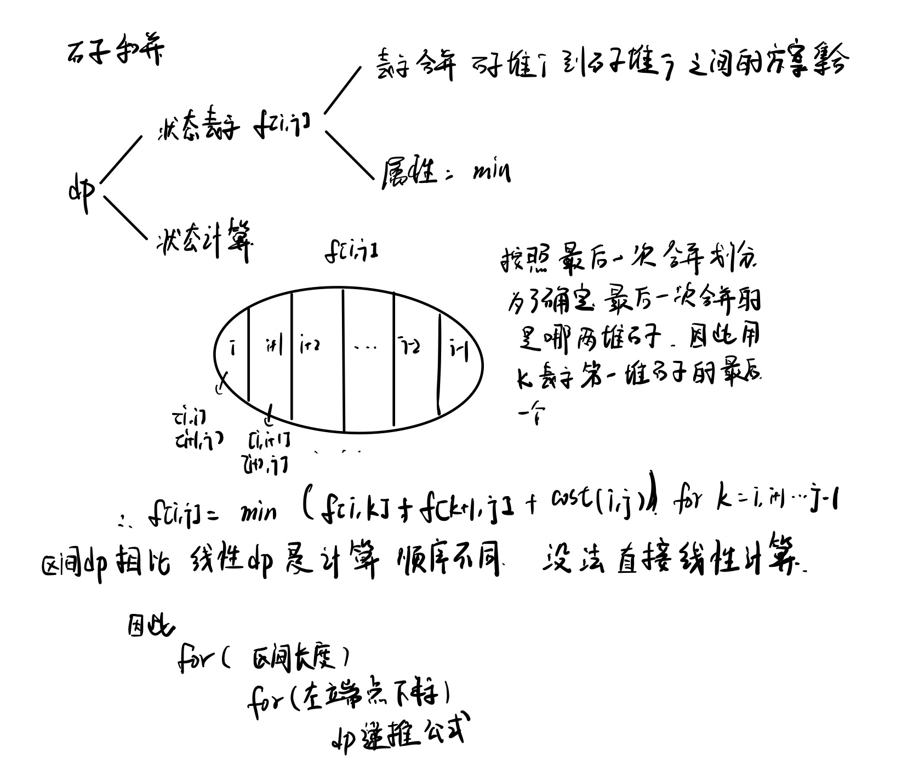

# AcWing 算法基础课

# 动态规划

动态规划时间复杂度分析：转移状态*转移方程计算需要的时间

dp考虑三件事来保证整个过程不出错

1. 状态表示
2. 状态转移
3. 状态初始化

## 背包问题

有一个专门介绍背包问题的背包九讲，网址如下

https://github.com/tianyicui/pack/blob/master/V2.pdf

### 01背包

问题描述

有 N 件物品和一个容量是 V 的背包。每件物品只能使用一次。

第 i 件物品的体积是 vi，价值是 wi。

求解将哪些物品装入背包，可使这些物品的总体积不超过背包容量，且总价值最大。
输出最大价值。


朴素做法，采用了二维数组

```cpp
#include<iostream>

using namespace std;

const int N = 1010;

int v[N],w[N];
int n,m;

// f[i,j] 表示只使用前i个物品时,体积不超过j的最大价值
// f[i,j] = max(f[i-1,j], f[i-1,j - v[i]] + w[i]

int f[N][N];

int main() {
    cin >> n >> m;
    for (int i = 1; i <= n; i++) cin >> v[i] >> w[i];
    // init f[0,0~m] = 0
    // init f[0~n,0] = 0
    for (int i =1; i <= n; i++) 
        for (int j=1; j <= m;j++)
        {
            f[i][j] = f[i-1][j];
            if (j >= v[i]) f[i][j] = max(f[i][j], f[i-1][j-v[i]] + w[i]);
        }
    cout << f[n][m] << endl;
}
```

**对01背包做优化**

因为递推方程只使用了i-1层的数据，因此可以使用滚动数组来代替二维数组。

```cpp
#include<iostream>

using namespace std;

const int N =1010;

int n,m;

int v[N],w[N];
int f[N];

int main()
{
    cin>>n>>m;
    for (int i=1;i<=n;i++) cin>>v[i]>>w[i];
    // 初始化 f[0~m]全是0 i=0
    for (int i=1;i<=n;i++)
        for (int j=m;j>=v[i];j--)
        {
            //当前i，并且滚动数组里面存的是i-1层的内容
            //同时因为更新f[j]需要用到i-1层的f[j-v[i]],所以从大到小更新,这样才用到的是i-1层的f[j-v[i]]
             f[j] = max(f[j],f[j-v[i]]+w[i]); 
        }
    cout<<f[m]<<endl;
    return 0;
}
```

### 完全背包

完全背包相对于01背包的区别在于每件物品的数量无限。


代码

```cpp
#include<iostream>

using namespace std;

const int N = 1010;
int n,m;
int v[N],w[N];
int f[N];

int main()
{
    cin>>n>>m;    
    for (int i =1 ;i<=n;i++)
        cin>>v[i]>>w[i];
    //初始化 f[0~m] i=0,装0间物品
    for (int i=1;i<=n;i++)
        for (int j =v[i];j<=m;j++) //因为完全背包使用的是第i层的f[j-v[i]],因此需要从小到达枚举体积,循环方向的限制是使用滚动数组造成的.
            f[j] =max(f[j],f[j-v[i]]+w[i]);
    cout<<f[m]<<endl;
    return 0;
    
}
```

### 多重背包

#### 多重背包三种写法

**写法一朴素写法**

时间复杂度是$O(NVS)$

```
for 枚举物品
	for 枚举体积
		for 枚举决策
```

```cpp
#include<iostream>
using namespace std;
const int N = 110;
int v[N],w[N],s[N];
int f[N][N];
int n,m;
int main()
{
	cin>>n>>m;
    for (int i=1;i<=n;i++)
        cin>>v[i]>>w[i]>>s[i];
	
    for (int i=1;i<=n;i++)
        for (int j=0;j<=m;j++)
            for (int k=0;k<=s[i];k++)
                if (j >= k*v[i]) f[i][j] = max(f[i][j],f[i-1][j- k*v[i] ] + k*w[i]);
    cout<<f[n][m]<<endl;
    return 0;
}
```

**写法二：二进制优化**

把2的次方个数的的物品绑定成一个物品，然后把剩余物品个数绑定到一起，增加了这么多物品之后当作01背包来做,这个做法的关键是要证明这种绑定方法可以表示出每一个数字，根据二进制数字表示，剩余物品前的数字都可以表示(部分1),剩余物品后面的数字减去这个剩余物品数，这个数是在前一部分的数字表示范围内的。这样就可以表示出全部的选择范围

绑定的数字是`1,2,4,8,...,2^k,c`,其中`c = s - (1+2+4+...+2^k)`，即减去前面数字的和，因此判断是否继续循环下去是看`s - (2^(k+1))`是否还能减过

需要多开数组空间,N*log(s)用来存物品,时间复杂度$NV \log(s)$

```cpp
#include<iostream>

using namespace std;
const int N = 12010, M = 2010;

int v[N] ,w[N];
int f[M];

int n,m;

int main () 
{
    cin >> n >> m;
    int cnt = 0;
    for (int i = 0 ; i < n; i ++)
    {
        int a, b, s;
        cin >> a >> b >> s;
        int k = 1;

        while (k <= s) 
        {
            cnt ++;
            v[cnt] = k * a;
            w[cnt] = k * b;
            s -= k;
            k *= 2;
        }
        if (s) 
        {
            cnt ++;
            v[cnt] = s * a;
            w[cnt] = s * b;
        }
    }
    
    for (int i = 1; i <= cnt; i++)
        for (int j = m; j >= v[i]; j--)
            f[j] = max(f[j],f[j - v[i]] + w[i]);
    
    cout << f[m] << endl;
    return 0;
} 
```

 带注释版,写的很清晰
```cpp
#include<iostream>

using namespace std;

// 把多重背包优化成01背包
// 物品i,v[i],w[i],s[i] 
// 针对s[i],把2的次方个物品绑定成一个,(即1,2,4,8,16...)
// 根据二进制表示可以(如果最后就到16),我们可以表示0~16内的所有数
// s[i]不一定就是2的次方,
// 假设最后出来5个绑定,即 出现 11111(5),还剩下一些物品，设为x
// 下面均是二进制表示
// 那么s[i] = 1xxxxx (11111(5) + x) 
// s[i] < 111111(6) 
// => 11111(5) + x < 111111(6) 
// => x < 100000(6) => x <= 11111(5)

// => for 11111(5) < t <= s[i]
// 0 < t - x <= s[i] - x = 11111(5)
// 因此可以将x作为最后一组物品, 剩下的t-x也可以表示出来

// 估计01背包开的数据范围
// s[i] < 2000 < 2^11 - 1 使用11位二进制可以表示(最多11个物品,开到12)
// n < 1000 ,所以 01背包的物品个数最多 12*1000 + 10 = 12010

const int N = 12010, M = 2010;
int v[N], w[N];
int f[M];
int n,m;

int main() {
    cin >> n >> m;
    int cnt = 0;
    for (int i = 0; i < n; i++) {
        int a,b,c;
        cin >> a >> b >> c;
        int k = 1;
        while(c-k >= 0) {
            cnt++;
            v[cnt] = k*a;
            w[cnt] = k*b;
            c -= k;
            k <<= 1;
        }
         if (c) {
            cnt++;
            v[cnt] = c*a;
            w[cnt] = c*b;
        }
    }
    for (int i = 1; i <= cnt; i++)
        for (int j=m; j >= v[i]; j--)
            f[j] = max(f[j],f[j-v[i]]+w[i]);
    cout << f[m] << endl;
    
}
```
**写法三单调队列优化**

具体到多重背包的朴素分析过程中

```
f[i][j] = max(f[i-1][j],f[i-1][j-1*v]+1*w,f[i-1][j-2*v]+2*w)+...+f[i-1][j-s*v]+s*w
f[i][j-v]= max(f[i-1][j-1*v],f[i-1][j-2*v]+1*w,+...+f[i-1][j-s*v]+(s-1)*w+f[i-1][j-(s+1)v]+s*w)
f[i][j-2V]= ...
因此在求解这一系列的f[i][j-kv]的过程中
f[i][j]求{f[i-1][j],f[i-1][j-v],...,f[i-1][j-sv]}里面的最大值(s+1个),算上f[i-1][j]
f[i][j-v]求{f[i-1][j-v],f[i-1][j-2v],...,f[i-1][j-(s+1)v]}这里面的最大值(s+1个)
继续往下罗列,就会发现这些求解过程就像一个滑动窗口一直向前滑,直到不能向前滑为止,因此可以使用滑动窗口求最值得方法来进行求解
j,j-v,j-2v..这些数字mod v 的值都是一样的,这样就可以确定出来滑动窗口处理的数组
设 j mod v = r，所以这个数组长下面这个样子
[f[r],f[r+v],f[r+2v],...,f[j-2v],f[j-v],f[j]] 省略了[i-1] <-|-> j = r+kv j-v =r+(k-1)v ...
在这个数组内从前向后依次求解窗口大小为s的滑动窗口的最大值
一些特殊情况:
1.对于对于因为体积上限,没法把s+1(算上一个也不放)个物品都放进去的情况
	f[i][r+kv] 求{f[i-1][r+kv],f[i-1][r+(k-1)v],...,f[i-1][r]} (不足s+1个)
	因此这种情况就是该数组开始求解滑动窗口最值时,前面窗口长度不足s个情况,仍然可以求解
2.每一项除了f[i-1][r+kv]之外还有一个 +kw,因为这一项存在没法直接用滑动窗口求解
	因此对于窗口内每一项来说,前一项相比于后一项会少加一个w,因此把数组内元素改变成
	[f[r],f[r+v],f[r+2v],...,f[j-2v],f[j-v],f[j]]
-按项相减
	[0*w ,1*w   ,2*w    ,...,(k-2)*w,(k-1)*w,k*w]
这个操作就是针对这个数组内某一个元素a[i] = a[i]-i*w从模拟出这种相对关系
这样就是采用单调队列求解滑动窗口的最大值了,但是需要注意,只有求出来的数组下标是正确的，数组内容并不是f[i-1][j-kv]+cw这样的值
知道数组下标之后更新最值
f[i][j] = f[i][r+tv]+k*w
r+tv = j-kv => k = (j-r)/v-t
时间复杂度 N*r*V/r = O(NV) r是每一次的余数个数  
伪代码:
q[N] 队列
f[N][N] dp数组
for i in 物品: 
	v 体积
	w 价值
	s 最多可以放的个数 
	for r in [0~v[i]-1] //物品i体积的余数
		for (int k = 0 ; k*v <= m ; k++) //r+kv (k=0,1,2,...,)  
            if (队列不空 && 队列内元素>=s个) 队头出队
            while(队列不空 && 队尾元素小于新入队值(f[i-1][r+k*v]-k*w)) 队尾离开
            元素k入队->f[i-1][r+k*v]-k*w
            max_index = 队头t f[i-1][r+t*v]
			f[i][r+kv](f[i][j]) = f[i-1][r+t*v] + (k-2t)*w;
```


```cpp
#include<iostream>
using namespace std;
int n,m;
int main(){

}
```

多重背包和01背包的区别是给定了每个物品的数量


采用朴素做法的多重背包

```cpp
#include<iostream>

using namespace std;

const int N =110;

int n,m;

int v[N],w[N],s[N];
int f[N][N];

int main()
{
    cin>>n>>m;
    for (int i=1;i<=n;i++)
        cin>>v[i]>>w[i]>>s[i];
    
    for (int i=1;i<=n;i++)
        for (int j=1;j<=m;j++)
            for (int k=0;k<=s[i] && k*v[i]<=j;k++)
            {
                // if (k==0) f[i][j] =f[i-1][j];
                // else f[i][j]=max(f[i][j],f[i-1][j-k*v[i]]+k*w[i]);
                f[i][j]=max(f[i][j],f[i-1][j-k*v[i]]+k*w[i]);
            }
            
    cout<<f[n][m]<<endl;
    return 0;
                
}
```

对多重背包做优化


优化代码

```cpp
#include<iostream>

using namespace std;

const int N = 12010,M =2010;

int n,m,cnt;

int v[N],w[N];
int f[M];

int main()
{
    cin>>n>>m;
    for (int i=1;i<=n;i++)
    {
        int a,b,s; //a体积,b价值,s数量
        cin>>a>>b>>s;
        int k=1;
        //二进制优化
        while(k <= s)
        {
            cnt ++;
            v[cnt] = k * a;
            w[cnt] = k * b;
            s -= k;
            k *= 2;
        }
        if (s > 0)
        {
            cnt ++;
            v[cnt] = s*a;
            w[cnt] = s*b;
        }
    }
    n=cnt;
    //改换成成了等价的01背包
    for (int i=1;i<=n;i++)
        for (int j=m;j>=v[i];j--)
            f[j] = max(f[j],f[j-v[i]]+w[i]);
    
    cout<<f[m]<<endl;
    return 0;
}
```

### 分组背包

[分组背包](https://www.acwing.com/problem/content/9/)


代码

```cpp
#include<iostream>
#include<algorithm>

using namespace std;

const int N = 110;
int n,m;

int v[N][N],w[N][N];
int f[N];
int cnt[N];

int main()
{
    cin>>n>>m;
    for (int i=1;i<=n;i++)
    {
        cin>>cnt[i];
        for (int j = 1;j <= cnt[i];j ++)
            cin>>v[i][j]>>w[i][j];
    }
    
    for (int i = 1;i <= n;i ++)
        for (int j = m;j >= 1;j --)
            for (int k = 1;k <=cnt[i];k ++)
            {
                if (j>=v[i][k]) f[j] = max(f[j],f[j-v[i][k]]+w[i][k]);
            }
    
    cout<<f[m]<<endl;
    return 0;
        
}
```

### 背包问题的使用

题目地址

https://leetcode-cn.com/problems/minimum-time-to-finish-the-race/

这道题和多重背包类似，多重背包采用了二进制优化+01背包解题。

而这道题不是二进制优化，而是直接线性的来，就是把捆绑方式变了，但是还是进行了捆绑，捆绑完之后根据题意来说，这是一个完全背包问题，而不是01背包。同时在捆绑的时候，并没有保存每一个轮胎分别跑x圈的cost，(在背包里面相当于一个物品使用x个)，而是只保存跑x圈最小的cost。

这里可以证明一下，那些大的物品并不会选到，如果会选到那些，那么最小的是比那些更好的，完全可以替换。

这样降低了可选物品的数量，来降低了复杂度

## 线性DP

### 数字三角形

题目网址

https://www.acwing.com/problem/content/900/

分析过程


代码

```cpp
#include<iostream>
#include<algorithm>

using namespace std;

const int N = 510,INF =1e9;
int n;
int a[N][N];
int f[N][N];
int main()
{
    cin>>n;
    for (int i =1;i<=n;i++)
        for (int j =1;j<=i;j++)
            cin>>a[i][j];
    //为了避免边界的条件判断,将初值初始化为负无穷
    for (int i =1;i<=n;i++)
        for (int j = 0;j<=i+1;j++)  //j需要初始化0和i+1,来保证边界,自己拿两个边界试一下就知道了
            f[i][j] =-INF;
    f[1][1]=a[1][1];
    for (int i=2;i<=n;i++)
        for (int j =1;j<=i;j++)
            f[i][j] = max(f[i-1][j-1]+a[i][j],f[i-1][j]+a[i][j]);
    
    int res =-INF;
    for (int i=1;i<=n;i++) res =max(res,f[n][i]);
    cout<<res<<endl;
    return 0;
    
}
```

### 最长上升子序列

[最长上升子序列](https://www.acwing.com/activity/content/problem/content/1003/)

分析


根据上面的分析直接实现，时间复杂度是n^2的，如果遇到10^5的数据范围，一定会超时。

代码

```cpp
#include<iostream>

using namespace std;

const int N = 1010;
int n;
int a[N],f[N];

int main()
{
    cin>>n;
    for (int i= 1;i<=n;i++) cin>>a[i];

    for (int i=1;i<=n;i++)
        for (int k=0;k<=i-1;k++)
            if (k == 0) f[i] =1;
            else 
            {
               if (a[k]<a[i]) f[i] = max(f[i],f[k]+1); 
            }
            
    
    int res=0;
    for (int i =1;i <=n;i++) res =max(res,f[i]);
    cout<<res<<endl;
    return 0;
}
```

### 最长上升子序列优化
[最长上升子序列优化](https://www.acwing.com/activity/content/problem/content/1004/)


这样分析时间复杂度是$O(n \log n)$，这里二分，寻找小于a[i]的最大的数，a[i]替换他后面那个数也是可以的。

代码

```cpp
#include<iostream>
#include<algorithm>

using namespace std;

const int N = 100010;
int n;
int a[N];
int q[N];

int main()
{
    cin>>n;
    for (int i=1;i<=n;i++) scanf("%d",&a[i]);
    int len = 0;
    q[++len] =a[1];
    for (int i=2;i<=n;i++)
    {
        if (q[len]<a[i]) q[++len] = a[i];
        else
        {
            int l = 0 , r=len;
            while(l<r)
            {
                int mid = l+r+1>>1;
                if (q[mid]<a[i]) l=mid;
                else r = mid - 1;
            }
            q[r+1] = a[i];
        }
    }
    cout<<len<<endl;
    return 0;
}
```

### 最长公共子序列

分析


代码

```cpp
#include<iostream>

using namespace std;

const int N =1010;
int n,m;
char a[N],b[N];

int f[N][N];

int main()
{
    scanf("%d%d",&n,&m);
    scanf("%s%s",a+1,b+1);

    for (int i =1 ;i<=n;i++)
        for (int j =1;j<=m;j++)
        {
            f[i][j] =max(f[i-1][j],f[i][j-1]);
            if (a[i]==b[j]) f[i][j] =max(f[i][j],f[i-1][j-1]+1);
        }
    cout<<f[n][m]<<endl;
    return 0;
}
```

### 最短编辑距离

分析

状态表示和最长公共子序列相同，状态计算依据最后一步操作的类型分类来看，然后在所有操作类型中选择次数最小的即可。

代码

```cpp
#include<iostream>
#include<cstring>
using namespace std;
const int N = 1010;
char a[N],b[N];
int f[N][N];
// 状态表示 f[i][j] 表示将a[1...i] 变为b[1...j] 需要的最少操作次数
// 删a[i]  = f[i-1][j] + 1
// 在a[i]后面添加b[j] = f[i][j-1] + 1
// 将a[i] 变成b[j] = f[i-1][j-1] + 1
// a[i] == b[j] 时, = f[i-1][j-1]
int n,m;
int main() {
    cin >> n >> a+1 >> m >> b+1;
    // init f[0][j] = j
    // init f[i][0] = i
    memset(f,0x3f,sizeof f);
    for (int i = 0; i <= n; i++) f[i][0] = i;
    for (int j = 0; j <= m; j++) f[0][j] = j;
    
    for (int i = 1; i <= n; i++)
        for (int j = 1; j <= m; j++) {
            f[i][j] = min(f[i-1][j],f[i][j-1]) + 1;
            if (a[i] != b[j])
                f[i][j] = min(f[i][j],f[i-1][j-1]+1);
            else 
                f[i][j] = min(f[i][j],f[i-1][j-1]);
        }
    cout << f[n][m] << endl;
}
```

## 区间DP

### 石子合并

[题目链接](https://www.acwing.com/problem/content/284/)

分析



代码

```cpp
#include<iostream>

using namespace std;

const int N = 310;

int n;
int s[N];
int f[N][N];

int main()
{
    cin>>n;
    for (int i=1;i<=n;i++) cin>>s[i];
    
    for (int i=1;i<=n;i++) s[i]+=s[i-1]; //前缀和
    //len=1时,区间长度为1,只有一堆石子,合并代价为0,不用计算
    for (int len = 2;len<=n;len++) //区间长度
        for (int i = 1; i <= n-len+1; i++) //左端点下标
        { 
            int l =i,r = i+len-1; //左右端点下标
            f[l][r] = 1e8;
            for (int k =l;k<=r-1;k++) //dp的递推公式
            {
                f[l][r] =min(f[l][r],f[l][k]+f[k+1][r]+s[r]-s[l-1]);
            }
        }
    cout<<f[1][n]<<endl;
    return 0;
}
```


## 计数类DP

### 整数划分

[题目链接](https://www.acwing.com/problem/content/902/)

分析思路一


代码

```cpp
#include<iostream>

using namespace std;

const int N =1010,mod =1e9+7;

int n;
int f[N];

int main()
{
    cin>>n;
    f[0]=1;
    for (int i=1;i<=n;i++)
        for (int j=i;j<=n;j++)
            f[j] = (f[j]+f[j-i]) % mod;
            
    cout<<f[n]<<endl;
    return 0;
    
}
```

思路二

分析


代码

```cpp
#include<iostream>

using namespace std;

const int N =1010,mod =1e9+7;

int n;
int f[N][N];

int main()
{
    cin>>n;
    f[0][0]=1;
    for (int i=1;i<=n;i++) //总和
        for (int j=1;j<=i;j++) //划分的数
                f[i][j] = (f[i-1][j-1]+f[i-j][j]) % mod;
    int res =0;
    for (int i =1;i<=n;i++) res = (res+f[n][i]) % mod;
    cout<<res<<endl;
    return 0;
    
}
```


## 数位统计DP

### 计数问题

[题目链接](https://www.acwing.com/problem/content/340/)

分析


代码

```cpp
#include<iostream>
#include<algorithm>
#include<vector>

using namespace std;

int get(vector<int>& nums,int l,int r) //计算从l到r位的数字是多少
{
    int res = 0;
    for (int i=r;i>=l;i--) res = res*10 + nums[i];
    return res;
}

int power10(int i)
{
    int res =1;
    while(i--) res*=10;
    return res;
}

int count(int n,int x) //统计1~n中x出现的次数,x属于0~9
{
    if (!n) return 0;
    vector<int> nums;
    
    while(n)
    {
        nums.push_back(n % 10);
        n/=10;
    }
    n =nums.size();
    int res = 0;
    for (int i=n-1-!x;i>=0;i--)
    {
        if (i<n-1) //统计首位情况时，情况1不存在
        {
            int t =get(nums,i+1,n-1);
            if (x==0) res += (t-1) *power10(i); //统计0出现的情况是,从001开始
            else res += t * power10(i);
        }
        // if (x== 0 && i ==n-1) continue; //0不能在首位出现和!x同理
        if (nums[i] == x) res+=get(nums,0,i-1)+1;
        else if (nums[i]>x) res+= power10(i);
        
    }
    return res;
}
int main()
{
    int n,m;
    while(cin>>n>>m , n || m)
    {
        if (n<m) swap(n,m);
        for (int i =0;i<=9;i++)
            cout<< count(n,i)-count(m-1,i) << " ";
        cout<<endl;
    }

    return 0;
}
```

## 状态压缩DP

​	当做状态压缩的时候，你需要把压缩的状态和实际的状态一一对应的时候，你可以采用打表预处理的方式先把映射搞出来

### 蒙德里安的梦想

[题目链接](https://www.acwing.com/problem/content/293/)

**问题分析**


**实现代码**

```cpp
#include<iostream>
#include<algorithm>
#include<cstring>

using namespace std;

const int N = 12,M =1<<N;

long long f[N][M];
bool st[M]; 

/*
    n 行 m 列
    i的范围 1~m
    j的范围 0~ 1<<n
*/

int n,m;

int main()
{
    while(cin>>n>>m, n || m)
    {
        for (int i = 0;i < (1<<n);i ++)
        {
            int cnt = 0;
            st[i] = true;
            for (int k = 0;k < n;k ++)
            {
                if (i>>k & 1)
                {
                    if (cnt & 1) st[i] =false;
                    cnt = 0;
                }
                else cnt++;
            }
            if (cnt & 1) st[i]=false;
        }
        //初始化
        //不能从第0列横放,所以第一列对面转移的k
        memset(f,0,sizeof f);
        f[0][0] = 1 ; //f[0][其他]均为0,因为第0列只存在不摆放这一种方案 
        for (int i=1;i<=m;i++) //枚举列
            for (int j=0;j<(1<<n);j++) //枚举当前列的每一种情况
                for (int k=0;k<(1<<n);k++) //枚举每一种转移方案
                    if ((j & k) == 0 && st[j | k])  //注意位运算和 ==之前,先算位运算需要加括号
                        f[i][j] += f[i-1][k];

        //输出.不能从最后一列横放,因为这样装不下,所以最后一列的状态j是0
        cout<<f[m][0]<<endl;

    }
    return 0;
}
```


### 最短Hamilton路径

题目链接:https://www.acwing.com/problem/content/93/

题目求解的的是从节点0走到节点n-1并且每一个节点都只经过一次的最短路径

分析


代码

```cpp
#include <iostream>
#include <cstring>

using namespace std;

const int N = 21,M = 1<<21;
int n;

int g[N][N];
int f[M][N];

int main()
{
    scanf("%d",&n);
    for (int i=0;i<n;i++) 
        for (int j=0;j<n;j++)
        scanf("%d",&g[i][j]);
    

    memset(f,0x3f,sizeof f);
    f[1][0]=0;
    for (int i=1;i<(1<<n);i++)
        for (int j=0;j<n;j++)
        {
            if (i>>j & 1) 
                for (int k=0;k<n;k++) //g[k][j]
                    if ( i-(1<<j) >> k & 1)   
                        f[i][j] = min(f[i][j],f[i-(1<<j)][k]+g[k][j]);
        }

    
    cout<<f[(1<<n)-1][n-1]<<endl;
    return 0;
}
```


## 树形DP

### 没有上司的舞会

[题目链接](https://www.acwing.com/problem/content/287/)

题目中给定的职员构成了一棵树，需要从其中选择一些点(参会职员)出来，使得所有参会职员的快乐指数总和最大。但是不能同时选择一个节点和他的直接父节点(该职员的直接上司)

分析

这道题是一个树形dp的题目，但是设置的数组方式是根据这道题目设置，不具有普遍性


代码实现

```cpp
#include<iostream>
#include<algorithm>
#include<cstring>

using namespace std;

const int N = 6010,INF =0x3f3f3f3f;

int h[N],e[N],ne[N],idx;

int n;
int happy[N];
int f[N][2];
bool has_father[N];

void add(int a,int b)
{
     e[idx] = b,ne[idx] = h[a],h[a] = idx++;
}

void dfs(int u)
{
    f[u][1] = happy[u];

    for (int i = h[u]; i != -1; i = ne[i])
    {
        int j = e[i];
        dfs(j);
        f[u][0] += max(f[j][1],f[j][0]);
        f[u][1] += f[j][0];
    }
    return ;
}

int main()
{
    scanf("%d",&n);
    for(int i = 1;i<=n;i++)
        scanf("%d",&happy[i]);

    memset(h, -1,sizeof h); 

    for (int i = 1;i<=n-1;i++)//注意读取边的时候，n个点，n-1条边
    {
        int a,b;
        scanf("%d%d",&a,&b);
        add(b,a);
        has_father[a] = true;
    }
    int root = 0;
    for (int i = 1; i <= n; i ++)
        if (!has_father[i]) root = i;
    dfs(root);
    cout<<max(f[root][0],f[root][1])<<endl;
    return 0;
}
```

## 记忆化搜索

记忆化搜索时dp的一种实现方式，使用这种实现方式的时候，不需要思考dp数组应该按照什么样的方式计算才能保证我当前使用的数组元素在前面已经被计算出来了。记忆化搜索用递归实现，比起循环更容易实现，但是相比循环来说速度会比较慢。

### 滑雪

题目链接:https://www.acwing.com/problem/content/903/

这道题目分析也比较容易。主要是使用了记忆化搜索来完成dp的计算过程，如果要自己改成循环实现的，会写的很复杂。

分析


代码实现

```cpp
#include<iostream>
#include<cstring>
#include<algorithm>

using namespace std;

const int N = 310;

int n,m;
int w[N][N];
int f[N][N];

int dx[4] = {1,0,-1,0},dy[4] ={0,1,0,-1};
int dfs(int x, int y)
{
    if (f[x][y]!=-1) return f[x][y];
    f[x][y] = 1;
    for (int i=0;i<4;i++)
    {
        int a =x+dx[i],b =y+dy[i];
        if (a>=0 && a<=n-1 && b>=0 && b<=m-1 && w[a][b]<w[x][y])
            f[x][y] = max(f[x][y],dfs(a,b)+1);
    }
    return f[x][y];
}
int main()
{
    scanf("%d%d",&n,&m);
    for (int i=0;i<n;i++)
        for (int j=0;j<m;j++)
            scanf("%d",&w[i][j]);
    
    memset(f,-1,sizeof f);
    int res = 0;
    for (int i=0;i<n;i++)
        for (int j=0;j<m;j++)
            res =max(res,dfs(i,j));
    
    cout<<res<<endl;
    return 0;
}
```