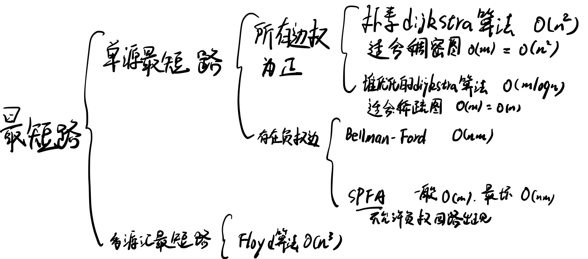

# AcWing 算法基础课

# DFS和BFS

|           | 数据结构 | 空间   | 特性             |
| --------- | -------- | ------ | ---------------- |
| DFS(深搜) | stack    | O(h)   | 不具有最短路特性 |
| BFS(广搜) | queue    | O(2^h) | 具有最短路特性   |

假设所有边的权重为1，BFS第一次找到某一个点的时候，起点到该点的距离就是起点到该点的最短距离，DFS不具有这种特性

DFS书写要点
1. 注意先写递归终止条件
2. 想明白每一层dfs应该如何进行遍历,每次遍历可以用那些值
3. dfs下一层的结束之后,需要恢复现场
   
例如数字全排列问题，使用了全局`sta[N]`的数组来表明数字是否被使用过,使用过的数字不在使用
数字全排列问题

```cpp
#include <iostream>

using namespace std;

int const N =10;

int path[N];
bool sta[N];
int n;
  
void dfs(int u)
{
    if (u==n)
    {
        for (int i=0;i<n;i++) printf("%d ",path[i]);
        puts("");
        return;
    }
    for (int i=1;i<=n;i++)
    {
        if (!sta[i])
        {
            path[u]=i;
            sta[i]=true;
            dfs(u+1);
            //回溯回来需要恢复现场,保证还是当初走之前的样子
            sta[i]=false;  
        }
    }
}
int main()
{
  
    scanf("%d",&n);
    dfs(0);
    return 0;
}
```

八皇后问题

```cpp
#include <iostream>

using namespace std;

int const N =20;

//在每一行放置一个皇后保证放置的时候不与之前的放置结果冲突，冲突就剪枝(放弃后面的所有搜索)
// 类似对于数字全排列的搜索,需要确定的当前行(u)的皇后放在那一列(i)上。
//1 2 3 4 5
//_ _ _ _ _
char queen[N][N];
// col[i]记录第i列是否有棋子,dg[i] 记录截距为i的对角线是否有棋子,udg[i]记录截距为i的反对角线是否有棋子
bool col[N],dg[N],udg[N];
int n;
  
void dfs(int u)
{
    if (u==n)
    {
        for (int i=0;i<n;i++) printf("%s\n",queen[i]);
        puts("");
        return;
    }
    for (int i=0;i<n;i++)
    {
        //u-i可能为负,因此开两倍(2N)的空间,给后面加n保证不为负
        if ( !col[i] && !dg[u+i]  && !udg[u-i+n])
        {
            queen[u][i]='Q';
            col[i] =true;
            dg[u+i] =true;
            udg[u-i+n] =true;
            dfs(u+1);
            queen[u][i]='.';
            col[i] =false;
            dg[u+i] =false;
            udg[u-i+n] =false;
        }
    }
}
int main()
{
  
    scanf("%d",&n);
    for (int i=0;i<n;i++)
        for (int j=0;j<n;j++)
            queen[i][j]='.';
    dfs(0);
    return 0;
    
}
```

宽搜模板


```
队列 queue <-初始状态(初始节点入队)
while (q不空)
{
	t  <- 队头
	扩展队头(入队)
}
```

注意:全部入队有一次访问,全部出队也有一次访问,写距离适合在入队的时候写,因为这个时候知道上一个点是什么

对于图的宽搜也是如此,表明该点已经被遍历应该在入队的时候表明,如果在出队的时候表明,可能会导致一个点已经在队列中等着被遍历,但是我们还是把他加入到了队列中

## 走迷宫

```cpp
#include<iostream>
#include<cstring>

using namespace std;
typedef pair<int,int> PII;
const int N = 110;

int g[N][N];
int d[N][N];
PII q[N*N];
int hh = 0, tt = -1;
int n,m;

void bfs() {
    // init
    memset(d,-1,sizeof d);
    q[++tt] = {0,0};
    d[0][0] = 0;
    int dx[4] = {0,1,0,-1},dy[4] = {1,0,-1,0};
    while (hh <= tt) {
        PII t = q[hh++];
        for (int i = 0; i < 4;i++) {
            int nx = t.first + dx[i],ny = t.second + dy[i];
            // d[nx][ny] !=-1,因为bfs只有在第一次搜索到的时候才是短路
            if (nx >= 0 && ny >= 0 && nx < n && ny < m && g[nx][ny] == 0 && d[nx][ny] ==-1) {
                d[nx][ny] = d[t.first][t.second] + 1;
                q[++tt] = {nx,ny};
            }
        }
    }
}

int main() {
    cin >> n >> m;
    for (int i = 0; i < n;i++)
        for (int j = 0; j < m;j++)
            cin >> g[i][j];
    bfs();
    cout << d[n-1][m-1] << endl;
    return 0;
}
```

## 八数码

```cpp
#include<iostream>
#include<unordered_map>
#include<queue>
using namespace std;

int bfs(string a) {
    string ans = "12345678x";
    // 确保第一次访问
    unordered_map<string,int> m;
    m[a] = 0;
    queue<string> q;
    q.push(a);
    int dx[4] = {0,1,0,-1},dy[4] ={1,0,-1,0};
    while (!q.empty()) {
        auto t = q.front();
        q.pop();
        int distance = m[t];
        if (t == ans) return distance;
        int idx = t.find('x');
        int x = idx / 3,y = idx % 3;
        for (int i = 0; i < 4; i++) {
            int nx = x + dx[i],ny = y + dy[i];
            if (nx >=0 && ny >= 0 && nx < 3 && ny <3) 
            {
                swap(t[idx],t[nx*3+ny]);
                if (!m.count(t)) 
                {
                    q.push(t);
                    m[t] = distance + 1;
                }
                 swap(t[idx],t[nx*3+ny]);   
            }
        }
    }
    return -1;
}

int main() {
    string a;
    for (int i = 0; i < 9; i++) {
        char c;
        cin >> c;
        a += c;
    }
    int res = bfs(a);
    cout << res << endl;    
}
```

## 树与图的存储

树与图有两种存储方式

树是一种特殊的图

稠密图用邻接矩阵，稀疏图用邻接表，**判断是否是稠密图，m>= n^2 / log n; m是边数，n是点数**

第一种是邻接矩阵，采用二维数组g\[N\]\[N\]来表示，g\[i\]\[j\]就表示从点i到点j之间有一条边。

第二种方式是邻接表，有n个点，是使用n的链表，其中每个链表中保存该点可以指向的点。

使用0x3f3f3f3f作为无穷大，而不使用0x7fffffff（int的最大值作为无穷大）的好处

- 很多时候我们并不是单纯拿无穷大作比较，而且运算后在比较，采用int的最大值导致我们做任何运算都会溢出。
- 0x3f3f3f3f的十进制1061109567,是10^9级别，和0x7fffffff一个数量级，而一般场合下的数据都是小于10^9的，所以它作为无穷大不会导致数据大于无穷大的情况。
- 另一方面，由于一般的数据都不会大于10^9，所以当我们把无穷大加上一个数据时，它并不会溢出（这就满足了“无穷大加一个有穷的数依然是无穷大”），事实上0x3f3f3f3f+0x3f3f3f3f=2122219134，这非常大但却没有超过32-bit int的表示范围，所以0x3f3f3f3f还满足了我们“无穷大加无穷大还是无穷大”的需求。
- 便于使用memset初始化，memset是按字节初始化的，而且0x3f3f3f3f的每一个字节都是0x3f,可以直接使用memset(g,0x3f,sizeof g)初始化

```cpp
//邻接矩阵表示图
int g[N][N];

int main()
{
    memset(g,0x3f,sizeof g);
    //读边代码
    //TODO
}
//注意就是初始化要全部初始化成最大值，表示两个点之间不可达。
```


```cpp
//邻接表 表示图的代码模板
int h[N],e[M],ne[M],idx;

void add(int a,int b)
{
    e[idx] =b,ne[idx] = h[a],h[a] = idx++;
}
int main()
{
    //m是边数,n是点数
    memset(h,-1,sizeof h);
    for (int i=0;i<n;i++)
    {
        int a,b;
        scanf("%d%d",&a,&b);
        add(a,b); // 有向图加边方式
        add(a,b),add(b,a) // 无向图加边方式
    }
}
```


## 树与图的遍历

树的遍历分为深度优先遍历和宽度优先遍历，就是将DFS和BFS结合到树/图中

注意下面这个代码dfs没有写出明显的终止条件,因为通过`st[N]`进行了控制,每个节点最多只访问一次

```cpp
int st[N];
int dfs(int u)
{
    //当前节点u
	for (int i=h[u];i!=-1;i=ne[i])
    {
        int j =e[i];
        if (!st[j])
        {
        	st[j] = true;
        	dfs(j);
        }
    }
}
```

```cpp
int q[N];
int st[N]; //visit数组 or 距离数组
int bfs()
{
	int hh=0,int tt=0;
    q[0] = 1//初始状态入队
	st[1] =true; // 图的第一个节点编号为1
    while(hh<=tt) //队列不空
    {
        int t =q[hh++];
        //扩展t
        for (int i=0;i!=-1;i=ne[i])
        {
            int j =e[i];
            if (!st[j])
            {
                st[j] =true;
                q[++tt] = j;
            }
        }
    }
}
```

## 树的重心

```cpp
#include<iostream>
#include<cstring>

using namespace std;

const int N = 1e5+10;

int h[N],e[2*N],ne[2*N],idx;
// 因为无向边,add两次,所以e和,ne得开两倍范围
int c[N]; // 记录以节点n为根的子树自己有几个节点
int ans = 0x3f3f3f3f;
int n;
// 头插法加入边a->b
void add(int a, int b) {
    e[idx] = b, ne[idx] = h[a], h[a] = idx++;
}

void dfs(int u) {
    c[u] = 1;
    int res = 0;
    for (int i = h[u]; i!=-1;i=ne[i]) {
        int j = e[i]; // 节点编号
        if (c[j]!=-1) continue;
        dfs(j);
        c[u] += c[j];
        res = max(res,c[j]);
    }
    res = max(res,n-c[u]);
    ans = min(ans,res);
    return;
} 

int main() {
    memset(h,-1,sizeof h);
    memset(c,-1,sizeof c);
    cin >> n;
    // 树节点比边多1
    for (int i = 0; i < n-1;i++) {
        int a,b;
        cin >> a >> b;
        add(a,b),add(b,a);
    }
    dfs(1);
    cout << ans << endl;
}
```


## 图中点的层次

```cpp
#include<iostream>
#include<cstring>
#include<queue>
using namespace std;

const int N = 1e5 + 10;
int h[N],e[N],ne[N],idx;

int c[N];
int n,m;
void add(int a,int b) {
    e[idx] =b, ne[idx] = h[a],h[a] = idx++;
}


void bfs() {
    queue<int> q;
    q.push(1);
    c[1] = 0;
    while(!q.empty()) 
    {
        int t = q.front();
        q.pop();
        for (int i = h[t]; i!=-1; i=ne[i]) {
            int j = e[i];
            if (c[j] !=-1) continue;
            q.push(j);
            c[j] = c[t] + 1;
        }
    }
}
int main() {
    memset(h,-1,sizeof h);
    memset(c,-1,sizeof c);
    cin >> n >> m;
    for (int i=0;i<m;i++) {
        int a,b;
        cin >> a >> b;
        add(a,b);
    }
    bfs();
     cout << c[n] << endl;
}
```

## 拓扑排序

只有有向无环图才有拓扑排序，成环的图没有拓扑排序。

拓扑排序里面只有前点指向后点的边，没有反向边。拓扑排序一般使用宽搜模板即可完成

step 1. 统计图中每个点的入度
拓扑排序从入度为0的点开始,遍历一轮之后,把这些点隐藏(在入度数组中让(i->j) j的入度减少)

```cpp
#include<iostream>
#include<cstring>

using namespace std;

const int N =1e5+10;

int h[N],e[N],ne[N],idx;
int d[N];
int q[N];
int n,m;

void add(int a,int b)
{
    e[idx]=b,ne[idx]=h[a],h[a]=idx++;
}
bool bfs()
{
    int hh=0,tt=-1;
    for (int i=1;i<=n;i++)  //将所有入度为0的点加入队列
        if (d[i]==0)
            q[++tt]=i;
    while(hh<=tt)  //数组模拟队列，hh<=tt表示队列不为空
    {
        int u = q[hh++];
        for(int i=h[u];i!=-1;i=ne[i])  //枚举u的所有出边
        {
            int j = e[i];
            d[j]--; //j的所有入边中减少u这个点
            if (d[j]==0) q[++tt]=j;
        }
    }
    return tt==n-1;  //当while循环结束时，队列为空，hh>tt,但是保存拓扑排序结果的是0~tt
}
int main()
{
    scanf("%d%d",&n,&m);
    memset(h,-1,sizeof h);
    while(m--)
    {
        int a,b;
        scanf("%d%d",&a,&b);
        add(a,b);
        d[b]+=1;
    }
    bool flag = bfs();
    if (!flag) printf("%d",-1);
    else
    {
        for (int i=0;i<n;i++)
            printf("%d ",q[i]);
    }
}
```

# 最短路

知识结构



## dijkstra算法

```cpp
    朴素dijkstra算法框架
    朴素dijkstra算法适合稠密图(m是n^2级别的)，算法复杂度是O(n^2),采用邻接矩阵存储图
    使用的数据结构
    S,保存已经找到最短路的点
    dist,保存当前确定的到每个点的最小距离
    dist[1] =0; dist[其他]=正无穷
    for (int i=0;i<n;i++)
    {
        t <- 不在S中的到源点距离最近的点 //直接遍历 O(n^2) 所有执行次数
        S <- t 将t加入S中  // O(n) 所有执行次数
        根据t更新当前最短距离
        就是更新dist[i] 取dist[i] 和 (dist[t] + 点t到点i的边权)之间的最小值 //O(m)，所有执行次数。 在这里，实际上是用了t的所有边来看dist是否可以经过t更新，所以实际上总的执行的次数是O(m)
    }
```

```cpp
	堆优化版dijkstra算法
	堆优化dijkstra算法适合稀疏图，算法复杂度是O(mlogn),采用邻接表存储图
 	使用的数据结构
    S,保存已经找到最短路的点,
	dist数组,heap堆,保存当前情况下确定的到每个点的最小距离
    
    for (heap不空)
    {
        t <- 不在S中的到源点距离最近的点 //堆优化 O(1),总共会进行O(n)次
        S <- t 将t加入S中  // O(1),总共会进行O(n)次
        根据t更新当前最短距离。 //执行m次，每次的时间复杂度是O(logn),所以这步总的时间复杂度是O(mlogn)
    }
堆有两种实现方式
    第一种是手写，需要可以修改任意元素的堆，需要写那个映射
    
    第二种是采用STL中的priority_queue，不支持修改任意元素。采用冗余的方法完成元素更新。
    当我们需要修改一个数的时候，将这个数加入堆中，这样堆中出现了冗余，一个点可能会对应多个值，
    但是我们有S来确保我们每一个点只会找一个最短路，利用S可以确定当前是否是冗余，
    如果是，直接跳过就可以。这样堆中最多会有m个元素，
    由于稀疏图m < n^2的，所以logm和logn是一个数量级的，时间复杂度不变。
    注意采用STL需要使用pair来将距离到对应的终点对应起来，并且需要距离在前，终点在后，
    因为pair的比较是先比first，在比second
```

dijkstra算法求解最短路方案:

从终点开始往回dfs或者bfs, 假设遇到了一条边(u->v),如果dist[u] = dist[v] + w(u->v),那么这条边就是最短路的一部分
如果题目是有向图,那么就需要建反图,在反图上遍历,如果题目是无向图,则可以直接在原图上遍历

示例题目: [LeetCode-100276. 最短路径中的边](https://leetcode.cn/problems/find-edges-in-shortest-paths/description/)

下面是参考代码(该图是无向图,因此可以在原图上遍历,参考代码除了给出了题目要求的解之外,还给出了输出路径的写法)

```cpp
typedef pair<int,int> PII;
const int INF = 0x3f3f3f3f;
struct Node {
    int j,w,idx;
};
class Solution {
public:
    vector<vector<Node>> g;
    vector<bool> findAnswer(int n, vector<vector<int>>& edges) {
        g = vector<vector<Node>>(n,vector<Node>{});
        int m = edges.size();
        for (int i = 0; i < m; i++) {
            auto &it = edges[i];
            int a = it[0], b = it[1], w = it[2];
            g[a].push_back({b,w,i});
            g[b].push_back({a,w,i});
        }
        vector<int> dist = vector<int>(n,INF);
        priority_queue<PII,vector<PII>, greater<PII>> pq;
        dist[0] = 0;
        pq.push({0,0});
        while(pq.size()) {
            auto t = pq.top();
            pq.pop();
            int d = t.first, u = t.second;
            if (d > dist[u]) continue;
            // u->other
            for (int i = 0; i < g[u].size(); i++) {
                // 0->u->j
                Node node = g[u][i];
                int j = node.j, w = node.w;
                if (dist[j] > d + w) {
                    dist[j] = d + w;
                    pq.push({d+w,j});
                }
            }
        }

        vector<bool> ans(m,false);
        if (dist[n-1] == 0x3f3f3f3f)
            return ans;
        
        // 从终点出发dfs
        vector<int> path{n-1};
        function<void(int)> dfs = [&](int u) {
            // dist[node] -> dist[u] j->u
            if (u == 0) {
                // for (auto i: path)
                //     printf("%d ",i);
                // printf("\n");
                return;
            }
            for (int i = 0; i < g[u].size(); i++) {
                Node node = g[u][i];
                if (dist[node.j] + node.w == dist[u]) {
                    ans[node.idx] = true;
                    path.push_back(node.j);
                    dfs(node.j);
                    path.pop_back();
                }
            }
        };
        
        dfs(n-1);
        return ans;
    }
};
```

```cpp
//朴素版本dijkstra算法
#include<iostream>
#include<cstring>

using namespace std;

const int N = 510;

int g[N][N];
int st[N];
int d[N];

int n,m;
int dijkstra()
{
    memset(d,0x3f,sizeof d);
    d[1]=0;
    for (int i =1;i<=n;i++)
    {
        int t = -1;
        for (int j=1;j<=n;j++)
        {
            if (!st[j] && (t==-1||d[t]>d[j]))
                t=j;
        }
        st[t]=true;
        for (int k=1;k<=n;k++)
        {
            d[k] = min(d[k],d[t]+g[t][k]);
        }
    }
    return d[n];
}
int main()
{
    memset(g,0x3f,sizeof g);
    scanf("%d%d",&n,&m);
    while(m--)
    {
        int a,b,c;
        scanf("%d%d%d",&a,&b,&c);
        g[a][b] = min(g[a][b],c);
    }
    int t =dijkstra();
    if (t==0x3f3f3f3f) puts("-1");
    else printf("%d ",t);
    return 0;
}
```
```cpp
//堆优化版dijkstra算法
#include <cstring>
#include <iostream>
#include <algorithm>
#include <queue>

using namespace std;

typedef pair<int,int> PII;

const int N = 100010,M = 200010;

int n, m;
int h[N], w[M], e[M], ne[M], idx;
int dist[N];
bool st[N];

void add(int a, int b, int c)
{
    e[idx] = b, w[idx] = c, ne[idx] = h[a], h[a] = idx ++ ;
}

int dijkstra()
{
    memset(dist ,0x3f,sizeof dist);
    dist[1] = 0;
    priority_queue<PII,vector<PII>,greater<PII>> heap;
    heap.push({0,1});
    
    while(heap.size()) //注意和朴素版的不同
    {
        auto t =heap.top();
        heap.pop();
        int distance = t.first, p =t.second;
        
        if (st[p]) continue;
        
        st[p] =true;
        
        for (int i=h[p];i!=-1;i=ne[i])
        {
            int j = e[i];
            if (dist[j] > distance + w[i])
            {
                dist[j] = distance+w[i];
                heap.push({dist[j],j});
            }
        }
    }
    return dist[n];
}

int main()
{
    scanf("%d%d", &n, &m);

    memset(h, -1, sizeof h);

    while (m -- )
    {
        int a, b, c;
        scanf("%d%d%d", &a, &b, &c);
        add(a, b, c);
    }

    int t = dijkstra();

    if (t == 0x3f3f3f3f) printf("%d",-1);
    else printf("%d\n", t);

    return 0;
}
```

## Bellman_Ford算法

```
Bellman_ford算法框架，算法复杂度O(nm)
dist[N] //距离数组
dist[1~n] =正无穷
for n-1次 n的实际意义，寻找不超过n条边的最短路径，而且最短路最多经过n个点，n-1条边
	for 所有的边 a->b,权值w
		dist[b] = min(dist[b],dist[a]+w); 
		这个操作被称为松弛操作,换成if条件判断
		if (dist[b] > dist[a]+w) ,这个不等式被称为三角不等式
			dist[b] = dist[a]+w

Bellman-ford算法里面的内循环是遍历所有的边，然后更新一次起点到这些边终点的最短距离。
如果图中可以算出最短路，Bellman-ford算法经过n-1次迭代一定可以保证对于所有的边，三角不等式都成立。
最短路中不存在环，如果存在，那么一定是负权回路，否则肯定不是最短路。而有负权回路会导致最短路长度变成负无穷，导致最短路不存在。Bellman-Ford算法外循环循环k次，表示不超过k条边的最短路数组。
Bellman_Ford算法判负环
在第n次循环中，如果仍旧在更新最短路数组(进行松弛操作)，那么表示一定出现了经过n条边的最短路(经过了n+1个点)。根据鸽巢原理，一定有两个点相同，成环了，而且更新了最短路，这个环一定是负权回路。
```

```cpp
//Bellman-Ford算法求解有边数限制的最短路问题
#include<iostream>
#include<cstring>

using namespace std;

const int N =510,M =10010;

struct Edge{
    int a,b,w;
} edges[M];

int dist[N],backup[N];
int n,m,k;

int bellman_ford()
{
    memset(dist,0x3f,sizeof dist);
    dist[1] =0;
    for (int i=0;i<k;i++)
    {
        memcpy(backup,dist,sizeof dist);
        for (int j=1;j<=m;j++)
        {
            int a =edges[j].a, b = edges[j].b, w = edges[j].w;
            dist[b] = min(backup[a]+w,dist[b]);
        }
    }
    //采用这种判定方法是因为Bellman_ford算法可能在两个dist中内容是负无穷(存在a->b,权值w，为负值)，dist[b]会变小，不在是0x3f3f3f3f。
    if (dist[n] > 0x3f3f3f3f/2) return 0x3f3f3f3f;
    else return dist[n];
}
int main()
{
    scanf("%d%d%d",&n,&m,&k);
    for (int i=1;i<=m;i++)
    {
        int a,b,c;
        scanf("%d%d%d",&a,&b,&c);
        edges[i] ={a,b,c};
    }
    int res =bellman_ford();
    if (res==0x3f3f3f3f) puts("impossible");
    else cout<<res<<endl;
}
```

## SPFA算法

```
SPFA算法是对Bellman_Ford算法的改进，对于松弛操作来说，只有当dist[a]被更新之后，dist[b]才会被更新，SPFA针对这一点对Bellman_Ford算法做改进。
SPFA算法时间复杂度，一般O(m),最坏O(mn)
算法流程
queue q<- 1
while(queue 不空)
{
	(1)t <-q.front();
	   q.pop();
	(2)更新t的所有出边b
		if (b不在queue中) 将b加入queue
}

在queue中的元素没有必要重复入队，没有意义，虽然不影响算法正确性，但是会增加运行时间
```

使用SPFA计算最短路

```cpp
#include<iostream>
#include<cstring>
#include<queue>

const int N = 100010;

using namespace std;

int n,m;

int h[N],w[N],e[N],ne[N],idx;
int dist[N];
bool st[N]; //st数组存该点是否在queue中

void add(int a,int b,int c)
{
    e[idx]=b,w[idx]=c, ne[idx] = h[a], h[a]=idx++; 
}
int spfa()
{
    memset(dist,0x3f, sizeof dist);
    dist[1]=0;
    queue<int> q;
    q.push(1);
    st[1]=true;
    while(q.size())
    {
        int t =q.front();
        q.pop();
        st[t]=false;
        for (int i=h[t];i!=-1;i=ne[i])
        {
            int j =e[i],c =w[i];
            if (dist[j]>dist[t]+c)
            {
                dist[j] =dist[t]+c;
                if (!st[j])
                {
                    q.push(j);
                    st[j]=true;
                }
                
            }
                
        }
    }
    //spfa算法只更新从起点到各个终点的距离，如果起点无法到达终点，那么该距离就永远不会更新，就是设定的无穷值0x3f3f3f3f
    return dist[n];
}

int main()
{
    memset(h,-1,sizeof h);
    scanf("%d%d",&n,&m);
    for (int i=0; i<m; i++)
    {
        int a,b,c;
        scanf("%d%d%d",&a,&b,&c);
        add(a,b,c);
    }
    int res =spfa();
    if (res==0x3f3f3f3f) puts("impossible");
    else cout<<res<<endl;
    return 0;
}

```

使用SPFA算法判负环的思路和Bellman_Ford算法相同，在具体实现时，只需要记录一下到点i的最短经过边数

SPFA判负环

```cpp
#include<iostream>
#include<cstring>
#include<algorithm>
#include<queue>
using namespace std;

const int N =2010,M=10010;

int n,m;

int h[N],w[M],e[M],ne[M],idx;

bool st[N];
int dist[N],cnt[N]; //cnt[N]统计从某一个起点到点i的最短路经过的边数

void add(int a,int b,int c)
{
    e[idx]=b,w[idx]=c,ne[idx]=h[a],h[a]=idx++;
}
 int spfa()
{
       //memset(dist,0x3f,sizeof dist);  
       //因为最后会判负环，如果有负回路的话，就算初始值是0也会变小，
       //所以没必要初始化为0x3f3f3f3f
      
       queue<int> q;
     	//因为负环可能从不是从节点1到达的，所有节点都要入队
       for (int i=1;i<=n;i++)
       {
           q.push(i);
           st[i] =true;
       }
      while(q.size())
      {
          int t = q.front();
          q.pop();
          st[t] = false;
          for (int i = h[t];i != -1;i=ne[i])
          {
              int j = e[i];
              if (dist[j] > dist[t] + w[i])
              {
                  dist[j] = dist[t] + w[i];
                  cnt[j] = cnt[t] + 1; 
                  //这里不适用cnt[j] =cnt[j]+1的原因是dist[]数组不在代表从节点1到节点j
                  if (cnt[j] >= n) return true;
                  q.push(j); 
                  //不使用st数组可以保证更快的让重复节点入队，
                  //从而使得如果存在负环则可以更快的累计
                //   if (!st[j])
                //   {
                //       q.push(j);
                //       st[j] =true;
                //   }
              }
          }
      }
      return false;
}
int main()
{
    scanf("%d%d",&n,&m);
    memset(h,-1,sizeof h);
    for (int i=0;i<m;i++)
    {
        int a,b,c;
        scanf("%d%d%d",&a,&b,&c);
        add(a,b,c);
    }
    if (spfa()) puts("Yes");
    else puts("No");
    return 0;
}
```

## Floyd算法

```
d[N][N] 采用邻接矩阵保存图，最开始d[N][N]保存图中各边，在完成计算之后d[N][N]中d[i][j]就表示从点i到点j的最短距离。Floyd算法基于动态规划，原理在我学了dp之后在写。
算法流程
for k -> 1~n:
	for i -> 1~n:
		for j -> 1~n:
			d[i][j] =min(d[i][j],d[i][k]+d[k][j]);
d[k,i,j]表示只经过前k个点,然后从点i到点j的最短距离。
d[k,i,j] = min(d[k,i,j],d[k-1,i,k]+d[k-1,k,j]) 分类经过第k个点和不经过第k个点 
d[k,i,j]经过第k个点的情况，就是从i->k->j,i->k只经过前k-1个点，k到j也是只经过前k-1个点
然后可以因为k的更新只用到k-1，因此可以将k那一维优化掉，变成
d[i,j] = min(d[i,j],d[i,k]+d[k,j])
初始化问题 d[i][j] =无穷,并且d[i][i] = 0
时间复杂度O(n^3)
Floyd算法允许存在负边，循环的顺序k必须放到最前面
```

```cpp
#include<iostream>

using namespace std;

const int N = 210, INF = 1e9;

int d[N][N];

int n,m,k;

// d[k,i,j] 表示最多只经过前k个点,点i到点j的最短距离
// d[k,i,j] = min(d[k-1,i,k],+d[k-1,k,j], d[k-1,i,j]) 
// (分类:经过点k和不经过点k)
// k的更新只用到k-1,因此k的表示可有优化
// d[i,j] = min(d[i,k] + d[k,j], d[i,j])
// 优化之后要确保d[i,j]的更新在d[i,k]和d[k,j]的前面
// 因此for循环k要放第一个

// init
// d[i][j] 表示只经过前1个点i->j的最短距离
// d[i][i] = 0 , other d[i][j] = INF
// d[i][j] = w[i][j] i->j存在边时
void floyd() {
    for (int k=1; k<=n; k++)
        for (int i = 1; i <= n; i++)
            for (int j=1; j <= n; j++)
                d[i][j] = min(d[i][k] + d[k][j], d[i][j]);
}
int main() {
    // init
    cin >> n >> m >> k;
    for (int i = 1; i <=n; i++)
        for (int j = 1; j <=n; j++) {
            if (i == j) d[i][j] = 0;
            else d[i][j] = INF;
        }
    while(m--) {
        int a,b,c;
        cin >> a >> b >> c;
        d[a][b] = min(d[a][b],c);
    }
    floyd();
    while (k--) {
        int x, y;
        cin >> x >> y;
        // 因为边权可能是负数, 所以 d[x][y] == INF 不能包括所有不能到达的情况
        if (d[x][y] > INF / 2) cout << "impossible\n";
        else cout << d[x][y] << endl;
    }
}
```

# 最小生成树

## Prim算法

算法流程

```cpp
朴素版prim算法(时间复杂度O(n^2)),prim算法还可以使用堆优化，和dijkstra算法相似，时间复杂度为O(mlogn)，但是实现麻烦，思路不如Kruskal算法简单，这种情况下多数选择kruskal算法
dist[N]:集合到各个点的距离
集合S:当前已经在联通块中的点
dist[i] <-正无穷

for (int i=0;i<n;i++)
{
	t <-集合外距离最小的点
	使用t更新 集合到其他点 的距离  // dijkstra算法是源点到其他点的距离
    S <- t,t加入集合
}
//到集合的距离的解释:看一下其他点能否连接到集合内部，到集合的距离就定义成这个点连接到集合内部的所有边当中的长度最小的边。
```

```cpp
//prim算法模板
#include<iostream>
#include<cstring>

using namespace std;

const int N =510,M=100010,INF = 0x3f3f3f3f;
int n,m;

int g[N][N];
int dist[N]; //dist是各个点到集合的距离,正常情况下，当该点已经加入集合的时候，就不应该更新这个距离了。
int st[N];

int prim()
{
    memset(dist,0x3f ,sizeof dist);
    int res = 0;
    dist[1] = 0;
    for (int i=0;i<n;i++)
    {
        //寻找不在集合中的到集合距离最小的点的编号
        int t =-1;
        for (int j=1;j<=n;j++)
            if (!st[j] && (t==-1 || dist[j] < dist[t]))
                t=j;
                
        st[t] = true;
        
        if (dist[t]==INF) return INF;  //当找到一个点，到集合的距离是INF的时候，说明最小生成树不存在，return INF
        
        
        //使用t更新其他点到集合的距离 因为已经选好了t加入集合，
        //所以就看其他不在集合中的点到t的距离(待选的到集合的距离)，是否比原来的到集合的距离小
        for (int j=1;j<=n;j++) if(!st[j]) dist[j] = min(dist[j],g[t][j]);
       
        res += dist[t];  
       
    }
    return res;
}

int main()
{
    scanf("%d%d",&n,&m);
    memset(g,0x3f,sizeof g);
    while(m--)
    {
        int a,b,c;
        scanf("%d%d%d",&a,&b,&c);
        g[a][b] = g[b][a]=min(g[a][b],c);
    }
    
    int t=prim();
    if (t==INF) puts("impossible");
    else printf("%d\n",t);
}
```


## Kruskal算法

```cpp
Kruskal算法框架，时间复杂度O(mlogm)
使用数据结构:并查集

按照边权的大小从小到大排序
初始化并查集
int res = 0, cnt = 0;  //res是最小生成树的边权之和，cnt是加入的边数
按顺序遍历所有边 a->b,权w
{
   pa=find(a),pb=find(b)//获得a和b所在连通块(集合)的头
	if (pa!=pb)
	{
    	p[pa] =pb //将pa加入pb集合中
    	res+=w;
        cnt++;
	} 
}
if (cnt<n-1) 不存在
else return res

```

代码模板

```cpp
#include<iostream>
#include<cstring>
#include<algorithm>

using namespace std;

const int N =100010,M=200010,INF =0x3f3f3f3f;

int n,m;

int p[N]; //并查集

struct Edge
{
    int a,b,w;
    //重载<运算符便于排序
    bool operator< (const Edge&W)const
    {
        return w<W.w;
    }
}edges[M];

int find(int x)
{
    if (p[x]!=x) p[x] = find(p[x]);
    return p[x];
}

int kruskal()
{
    //初始化并查集
    for (int i=1;i<=n;i++) p[i]=i;
    
    sort(edges,edges+m);
    int res = 0, cnt = 0;  //res是最小生成树的边权之和，cnt是加入的边数
    for (int i=0;i<m;i++)
    {
        int a = edges[i].a, b=edges[i].b, w=edges[i].w;
        a = find(a), b = find(b);
        if (a!=b)
        {
            res += w;
            p[a] = b;
            cnt++;
        }
    }
    if (cnt<n-1) return INF;
    else return res;
}

int main()
{
    scanf("%d%d",&n,&m);
    for (int i=0;i<m;i++)
    {
        int a,b,c;
        scanf("%d%d%d",&a,&b,&c);
        edges[i] ={a,b,c};
    }
    
    int t =kruskal();
    
    if (t==INF) puts("impossible");
    else printf("%d\n",t);
    
    return 0;
}
```


# 二分图

关于二分图的结论

二分图是指可以将图中的节点划分为两个集合，集合内点无边相连，所有的边的两个端点都是分属两个集合的。

- 一个图是二分图当且仅当它无奇数环(奇数环是指环当中边的数量为奇数)
- 一个图是二分图当且仅当它可以用二染色的方式完美染色，那么这个图就是二分图

## 染色法判断二分图

染色法时间复杂度为O(n+m),是线性时间复杂度

```cpp
for (int i=1;i<=n;i++) //遍历每个点
{
	if (i未染色)
		dfs(i,1); //通过指定一个开始的颜色可以将一个连通块全部染色
}
```

```cpp
//深搜染色法代码
#include<iostream>
#include<cstring>

using namespace std;

const int N =100010,M =200010;

int h[N],e[M],ne[M],idx;
int n,m;
int color[N];

void add(int a,int b)
{
    e[idx] = b, ne[idx] = h[a], h[a] = idx++;
}

bool dfs(int u, int c)
{
    color[u] = c;
    for (int i = h[u];i!=-1;i=ne[i])
    {
        int j =e[i];
        if (!color[j])
        {
            if (!dfs(j,3-c)) return false;
        }
        else if (color[u]==color[j]) return false;
    }
    return true;
}

int main()
{
    memset(h,-1,sizeof h);
    scanf("%d%d",&n,&m);
    for (int i=0;i<m;i++)
    {
        int a,b;
        scanf("%d%d",&a,&b);
        add(a,b),add(b,a);
    }
    
    bool flag =true;
    for (int i=1;i<=n;i++)
    {
        if (!color[i])
        {
            if(!dfs(i,1)) 
            {
                flag =false;
                break;
            }
        }
    }
    if (flag) puts("Yes");
    else puts("No");
}
```


## 匈牙利算法求解最大匹配

二分图的匹配：给定一个二分图 G ，在 G 的一个子图 M 中，M 的边集 {E} 中的任意两条边都不依附于同一个顶点，则称 M 是一个匹配。换句人话说就是该子图上的边都必须是一一对应边。不能一对多或者多对一。

最大匹配：所有匹配中包含边数最多的就是最大匹配

匈牙利算法的时间复杂度为O(nm),但是实际运行效果一般会很好，达不到O(nm)

```cpp
#include<iostream>
#include<cstring>

using namespace std;

const int N =510,M =100010;
int n1,n2,m;

int h[N],e[M],ne[M],idx;
int match[N]; //保存女生(集合二)对应匹配的那个男生(集合一)
bool st[N];  //st[N]数组保证了find(u)的时候每个女生只考虑一遍。


void add(int a,int b)
{
    e[idx] = b,ne[idx] = h[a],h[a] = idx ++;
}
    /*
    * st数组保证了在递归寻找一个男生可以匹配的女生的过程中,每个节点女生节点只访问一次。
    * 把find函数单拿出来看,对于节点u,他在寻找是否可以和节点j(心仪女生，有边)匹配的过程中会遇到三种情况
    * 1.j当前无匹配男生
    * 2.j当前有匹配男生,所以让该男生找其他人去,该男生找到了
    * 3.j当前有匹配男生,所以让该男生找其他人去,该男生没有找到
    *
    * 在递归过程中，考虑到某个女生j，就让st[j]=true可以保证当前这个女生节点已经被占用了。
    * 在函数中，只会有u和match[j]抢同一个女生,让st[j]=true可以让u先暂时和该女生匹配,等待递归find(match[j]),
    * 这个时候递归match[j]就不会去考虑j了。如果在递归过程中match[j]找到了新的女伴，那么就可以让u真的与j匹配。
    * 但是如果find(match[j])没有找到一个合适的女伴，那u只能去考虑下一个心仪的女生了。重复上三行话。
    * 在考虑了所有心仪的女生之后还是没有找到匹配,那么就返回false
    */
bool find(int u)
{
    for (int i = h[u];i!=-1;i=ne[i])
    {
        int j =e[i];
        if (!st[j])
        {
            st[j] =true;
            if (match[j]==0 || find(match[j]))
            {
                match[j] = u;
                return true;
            }
        }
    }
    return false;
}

int main()
{
    memset(h,-1,sizeof h);
    scanf("%d%d%d",&n1,&n2,&m);
    while(m--)
    {
        int a,b;
        scanf("%d%d",&a,&b);
        add(a,b);
    }
    
    int res=0;
    for (int i=1;i<=n1;i++)
    {
        memset(st,false,sizeof st);
        if (find(i)) res++;
    }
    
    printf("%d\n",res);
    return 0;
}
```