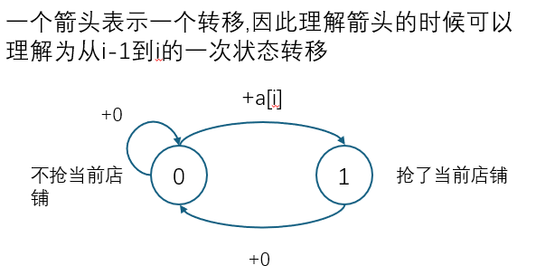

## 状态机模型

状态机模型对应的dp为题目给定了一些状态转移的限制条件,我们直接手写状态转移会显得很复杂,这时我们发现状态的转移可以抽象成为一个状态机,这样我们就对状态的转移显得比较有把握，所以我们就可以直接根据状态机来写状态转移方程即可

**例题**

[大盗阿福](https://www.acwing.com/problem/content/description/1051/)

 
```cpp
// 不采用状态机模型进行分析
#include<iostream>
#include<cstring>

using namespace std;

const int N = 1e5 + 10;
int t,n;
int a[N];

// f[i]表示只偷盗前i家店铺可以获得的最大价值
// f[i] = max(f[i-2] + a[i], f[i-1])
// init f[0] = a[0]; f[1] = max(a[0],a[1])
int f[N];
int main() {
    cin >> t;
    while(t--) {
        cin >> n;
        for (int i = 0; i < n; i ++) cin >> a[i];
        memset(f,0,sizeof 0);
        f[0] = a[0];
        f[1] = max(a[0],a[1]);
        for (int i = 2; i < n; i++) f[i] = max(f[i-2] + a[i], f[i-1]);
        cout << f[n-1] << endl;
    }
}
```



```cpp
// 使用状态机模型分析的代码,状态机模型如下
#include<iostream>
#include<cstring>
using namespace std;

const int N = 1e5+10;
int t,n;
int a[N];

// 0 不抢第i家店铺
// 1 抢第i家店铺

// f[i][0] 表示只抢劫前i家商铺,而且不抢劫第i家商铺的max价值
// f[i][1] 表示只抢劫前i家商铺,而且抢劫第i家商铺的max价值
// f[i][0] = max(f[i-1][0],f[i-1][1])
// f[i][1] = f[i-1][0] + a[i]
// init
// f[1][0] = 0, f[1][1] = a[1];
int f[N][2];

int main() {
    cin >> t;
    while(t--) {
        cin >> n;
        for (int i = 1; i <= n; i++) cin >> a[i];
        memset(f,0,sizeof f);
        f[1][0] = 0,
        f[1][1] = a[1];
        for (int i = 2; i <= n; i++) {
            f[i][0] = max(f[i-1][0],f[i-1][1]);
            f[i][1] = f[i-1][0]+a[i];
        }
        cout << max(f[n][0],f[n][1]) << endl;
    }
}
```


[股票买卖 IV](https://www.acwing.com/problem/content/1059/)

```cpp
```

[股票买卖 V](https://www.acwing.com/problem/content/1060/)

```cpp
#include<iostream>
#include<cstring>

using namespace std;

const int N = 1e5+10;
int a[N];
int n;

// f[i] 表示前i天内可以获得的最大利润
// f[i][0] 表示未持有股票的状态,且不处于冷冻期的状态
// f[i][1] 表示持有股票的状态
// f[i][2] 表示未持有股票的状态,且处于冷冻期的状态

// f[i][0] = max(f[i-1][0],f[i-1][2])
// f[i][1] = max(f[i-1][1],f[i-1][0] - a[i])
// f[i][2] = f[i-1][1] + a[i];
int f[N][3];
// init -inf
// f[0][0] = 0 f[0][1] = -inf f[0][2] = -inf
int main() {
    cin >> n;
    for (int i = 1; i <= n; i++) cin >> a[i];
    memset(f, -0x3f, sizeof f);
    
    f[0][0] = 0;
    for (int i=1; i <= n; i++) {
        f[i][0] = max(f[i-1][0], f[i-1][2]);
        f[i][1] = max(f[i-1][1], f[i-1][0] - a[i]);
        f[i][2] = f[i-1][1] + a[i];
    }
    int res = max(f[n][0],f[n][2]);
    cout << res << endl;
}
```