# 数学知识

# 数论

## 质数的判定

——试除法,时间复杂度$O(\sqrt{n})$，妥妥是这个

根据

代码

```cpp
#include<iostream>

using namespace std;

int m;

bool is_prime(int n)
{
    if (n < 2) return false;
    for (int i=2;i <= n / i ; i ++) // 这里不采用sqrt(n)计算时间长，也不采用 i*i<=n 到边界有溢出风险
        if (n % i == 0 ) return false;
    return true;
}
int main()
{
    scanf("%d",&m);
    while(m--)
    {
        int n;
        scanf("%d",&n);
        if (is_prime(n)) puts("Yes");
        else puts("No");
    }
    return 0;
}
```

## 分解质因数

**关于算术基本定理**

正因数个数

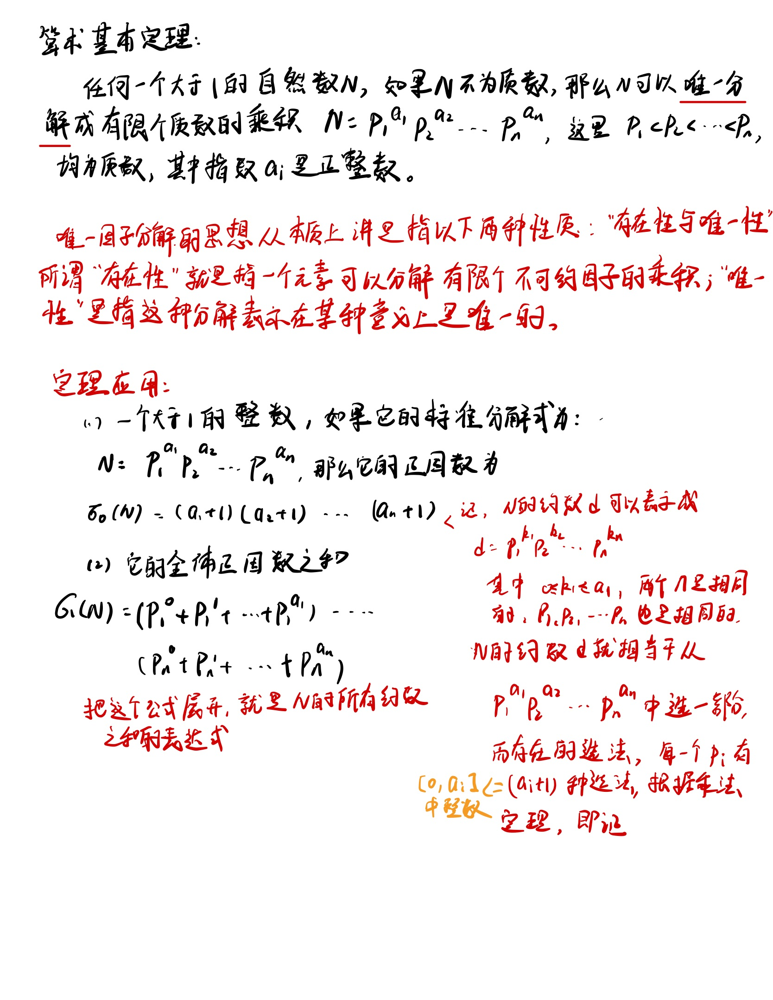

——**试除法**

思路：从小到大尝试n的所有的数，如果n%i==0，i就是一个质因子。

i是质因子的原因：当我们枚举到i的时候，n当中已经不含2~i-1之间的质因子，又因为n%i==0，所以i也不包括2~i-1之间的质因子，所以i是一个质数。这个思路时间复杂度是O(n)的。

优化：根据代数基本定理可知，n中最多只包括一个大于$\sqrt{n}$的质因子，所以枚举的之后就先将小于$\sqrt{n}$的质因子枚举出来，然后如果n仍旧>1的话，就是最后一个质因子。

时间复杂度介于O(logn)和$O(\sqrt{n})$之间，最坏$\sqrt{n}$。

代码

```cpp
#include<iostream>
#include<algorithm>

using namespace std;

void divide(int n)
{
    for (int i = 2 ; i <= n / i ; i++ )
    {//注意这个循环中n会越除越小，并且把确定的质因子完全除掉
        if (n % i == 0)
        {
            int s = 0;
            while (n % i == 0)
            {
                n /= i;
                s++;
            }
            printf("%d %d\n",i,s);
        }
    }
    if ( n > 1 ) printf("%d %d\n",n,1);
}

int main()
{
    int n;
    cin >> n;
    while (n--)
    {
        int x;
        cin>>x;
        divide(x);
        puts("");
    }
    return 0;
}
```

## 筛质数

筛质数介绍了两种筛法

**朴素筛法**

基本思想

先将所有的数写到数表中，然后把每一个数所有倍数删掉，筛完之后所有剩下的数就是质数。

原因，如果数p没有没删掉，那么说明p不是2到p-1中任何一个数的倍数，那么p就是一个质数

时间复杂度$O(nlogn)$

分析

第一次遍历n/2个数，第二次遍历n/3个数,依次类推，遍历的总的数的量是
$$
n/2+n/3+.....+n/n \ = n(1/2+1/3+.....+1/n)
$$
后面是调和级数，算出来的和是$lnn+c$，而且$lnn<log_2n$，所以时间复杂度可以判定为$O(nlogn)$

**代码**

```cpp
#include<iostream>
#include<algorithm>

using namespace std;

const int N =1000010;

int primes[N],cnt; //primes 保存获取的质数,cnt是数量
bool st[N]; //st[i]=true 表示这个数是合数

void get_primes(int n)
{
    for (int i = 2; i <= n ; i++)
    {
        if (!st[i])
        {
            primes[cnt++] =i;
        }
        for (int j = i + i ; j<=n ; j +=i) st[j] = true;
    }
}

int main()
{
    int n;
    cin>>n;
    get_primes(n);
    cout<<cnt<<endl;
    return 0;
}
```

优化，并不需要把所有数都遍历一遍，只需要删除质数的倍数就可以了。

原因，根据算术基本定理，合数都可以表示成质数的倍数，所以只需要删除质数的倍数就可以了。

**时间复杂度**$O(nloglogn)$和$O(n)$基本差不多

质数定理:1~n中有$n/lnn$个质数。

优化的筛法，优化完的筛法被称为**埃氏筛法**

```cpp
void get_primes(int n)
{
    for (int i = 2; i <= n ; i++)
    {
        if (!st[i])
        {
            primes[cnt++] =i;
            for (int j = i + i ; j<=n ; j +=i) st[j] = true;
        }
    }
}
```

**线性筛法**

代码

```cpp
void get_primes(int n)
{
    for (int i = 2; i <= n ; i++)
    {
        if (!st[i]) primes[cnt++] = i;
        for (int j = 0 ; primes[j] <= n/i ; j++)  //枚举当前找到的所有质数，并且保证 i*primes[j]<=n
        //primes[j] * i <= n 保证st[primes[j]*i] =true;不会越界,
        //不需要写 j<cnt的原因,如果i是合数,那么枚举到i的最小质因子就会break,如果i是质数,当primes[j] =i的时候也会停下来,
        //都会在j=cnt之前停下来
        {
            st[primes[j]*i] =true;
            if (i % primes[j] == 0) break;
        }

    }
}
```

证明

核心思路：每一个数只会被他的最小质因子筛掉

分情况讨论

pj是从从小到大枚举所有的质数

1. i % pj (pj =primes[j]) == 0

   那么pj一定是i的最小质因子，那么pj一定就是 pj\*i的最小质因子

2. i % pj !=0，那么pj一定比i的最小质因子小，所以pj一定就是pj\*i的最小质因子

任何一个合数都会被筛掉的原因

假定一个合数i，他的最小质因子是pj,那么在枚举到i之前，一定会枚举到i/pj,然后在这个枚举过程中，就会将 pj* i/pj筛掉。

由于每一个合数都只有一个最小质因子，每个数都只会被筛一次，所以是线性的。时间复杂度$O(n)$

## 求约数

试除法求约数，也是从小到大试除，求出所有的约数，优化，因为约数总是成对出现的，可以只枚举较小的那个。时间复杂度$O(\sqrt{n})$

代码

```cpp
#include<iostream>
#include<algorithm>
#include<vector>

using namespace std;

vector<int> get_divides(int n)
{
    vector<int> res;
    for ( int i = 1 ; i <= n / i ; i++)
    {
        if (n % i == 0)
        {
            res.push_back(i);
            if (i != n/i) res.push_back(n/i);
        }
    }
    sort(res.begin(),res.end());
    return res;
}

int main()
{
    int m;
    cin>>m;
    while(m--)
    {
        int n;
        cin>>n;
        auto res =get_divides(n);
        for (auto  t : res) cout<< t <<' ';
        cout<<endl;
    }

}
```

## 约数个数

根据公式计算

根据算术基本定理，如果一个数可以用分解质因数表示成$N = P_1^{a_1}*P_2^{a_2}*P_3^{a_3}*...*P_k^{a_k}$,那么这个数的约数个数有$(a_1+1)(a_2+1)...(a_k+1)$个

代码

```cpp
#include<iostream>
#include<unordered_map>

using namespace std;

const int mod = 1e9 + 7;

typedef long long LL;

int main()
{
    int m;
    cin>>m;
    unordered_map<int,int> primes;
    
    while(m--)
    {
        int n;
        cin>>n;
        for (int i = 2 ; i <= n/i ; i++)
        {
            while( n % i == 0)
            {
                    n /= i;
                    primes[i] ++;
            }
        }
        if( n > 1 ) primes[n] ++; 
    }
    LL res = 1;
    for (auto t : primes) res = res * (t.second + 1) % mod;


    cout<<res<<endl;
}
```


## 约数之和

根据算术基本定理，如果一个数可以用分解质因数表示成$N = P_1^{a_1}*P_2^{a_2}*P_3^{a_3}*...*P_k^{a_k}$,约数之和就是$(p_1^0+P_1^1+...+p_1^{a_1})(p_2^0+P_2^1+...+p_2^{a_2})......(p_k^0+P_1k^1+...+p_k^{a_k})$

将这个乘积展开，其中每一项都是N的一个约数，可以根据约数个数来理解，类似于二项展开式的写法

代码

```cpp
#include<iostream>
#include<unordered_map>

using namespace std;

const int mod = 1e9 + 7;

typedef long long LL;

int main()
{
    int m;
    cin>>m;
    unordered_map<int,int> primes;
    
    while(m--)
    {
        int n;
        cin>>n;
        for (int i = 2 ; i <= n/i ; i++)
        {
            while( n % i == 0)
            {
                    n /= i;
                    primes[i] ++;
            }
        }
        if( n > 1 ) primes[n] ++; 
    }
    LL res = 1;
    for (auto prime : primes) 
    {
        //公式求解
        LL t = 1;
        int p =prime.first,a =prime.second;
        while(a--) t = (t * p  + 1) % mod;
        res =res * t % mod;
    }
    cout<<res<<endl;
}
```

## 取模运算的基本性质

如果 a ≡ b (mod m)，c ≡ d (mod m)，那么

(1)a ± c ≡ b ± d (mod m)；
(2)a * c ≡ b * d (mod m);

a ≡ b (mod m) 的意思是a和b同余，在mod m的情况下。

(1)和(2)说明对于四则运算先取余还是后取余结果都是一样的。


整数 ![[公式]](https://www.zhihu.com/equation?tex=a) 和 ![[公式]](https://www.zhihu.com/equation?tex=b) 除以 ![[公式]](https://www.zhihu.com/equation?tex=n) 的余数相同，则称 ![[公式]](https://www.zhihu.com/equation?tex=a%2Cb) 模 ![[公式]](https://www.zhihu.com/equation?tex=n) 同余，计作

![[公式]](https://www.zhihu.com/equation?tex=a+%5Cequiv+b+%5Cpmod%7Bn%7D%5C%5C)

如果对于整数 ![[公式]](https://www.zhihu.com/equation?tex=a_1%2C+a_2%2C+b_1%2C+b_2) 有

![[公式]](https://www.zhihu.com/equation?tex=a_1+%5Cequiv+b_1+%5Cpmod%7Bn%7D%5C%5Ca_2+%5Cequiv+b_2+%5Cpmod%7Bn%7D)

那么可以把他们相加或相减

![[公式]](https://www.zhihu.com/equation?tex=a_1+%5Cpm+a_2+%5Cequiv+b_1+%5Cpm+b_2%5Cpmod%7Bn%7D%5C%5C)

也可以把他们相乘

![[公式]](https://www.zhihu.com/equation?tex=a_1a_2+%5Cequiv+b_1b_2%5Cpmod%7Bn%7D%5C%5C)

通过这两条性质，我们容易知道，如果 ![[公式]](https://www.zhihu.com/equation?tex=a%5Cequiv+b+%5Cpmod%7Bn%7D) 那么

![[公式]](https://www.zhihu.com/equation?tex=%5Cmathrm+P%28a%29%5Cequiv+%5Cmathrm+P%28b%29+%5Cpmod%7Bn%7D%5C%5C+)

对于任意整系数多项式 ![[公式]](https://www.zhihu.com/equation?tex=%5Cmathrm+P%28x%29) 都成立，这个结论很重要哦，经常会用

这里需要注意的一点是，如果整数 ![[公式]](https://www.zhihu.com/equation?tex=a%2C+b%2C+c) 满足

![[公式]](https://www.zhihu.com/equation?tex=ac%5Cequiv+bc+%5Cpmod%7Bn%7D%5C%5C)

那么只有当 ![[公式]](https://www.zhihu.com/equation?tex=n%2C+c) 互质时才可以把两边的 ![[公式]](https://www.zhihu.com/equation?tex=c) 直接约掉，得到 ![[公式]](https://www.zhihu.com/equation?tex=a%5Cequiv+b+%5Cpmod%7Bn%7D) ，更一般的

![[公式]](https://www.zhihu.com/equation?tex=a%5Cequiv+b+%5Cpmod%7B%5Cfrac%7Bn%7D%7B%5Cgcd%28n%2C+c%29%7D%7D%5C%5C)

## 最大公约数

辗转相除法 采用公式(a,b) =(b, a mod b)迭代即可

(a,b)的意思是a,b的最大公约数

证明
$$
设t为a,b的任意一个公约数，则有 a =xt,b =yt,\\
a \, / \, b = xt / yt = kyt +rt,\\
所以t也是(b, a \,mod\, b)的公约数\\
 \quad\\
设t是b 和 a \, mod \, b 的任意一个公约数,则有 b=xt, a\, mod\, b =yt, \\
因为a =kb + a \,mod\,b，
\\所以t也是 a,b的一个公约数
$$
所以a，b和 b a mod b的所有公约数都相同，因此最大公约数也相同

最小公倍数 $\cfrac{a \cdot b}{gcd(a,b)}$


代码

```cpp
int gcd(int a,int b)
{
	return b ? gcd(b,a % b):a;
}
int gcd(int a,int b)
{
    if (b>0)
        return gcd(b,a % b)
   	else
        return a
}

int gcd(int a, int b) {
    return b ? gcd(b, a % b): a;
}

```

##  欧拉函数

设N的分解质因数结果为$N = P_1^{a_1}*P_2^{a_2}*P_3^{a_3}*...*P_k^{a_k}$，欧拉函数求解的是1~N中与N互质的数的个数

$\phi(N) = N(1-1/p_1)(1-1/p2)...(1-1/p_k)$

$ϕ(N) = N×\frac{p_1−1}{p_1}×\frac{p_2−1}{p_2}×…×\frac{p_k−1}{pk}$

```
res = res*(1-1/p)  等价于 res = res / p *(p-1)
```

基于定义，采用分解质因数的方法求解欧拉函数

```cpp
#include<iostream>

using namespace std;

int main()
{
    int n;
    cin>>n;
    while(n--)
    {
        int a;
        cin>>a;
        int res = a;
        for (int i = 2 ; i <= a / i ; i++)
        {
            if (a % i == 0)
            {
                res = res / i * (i-1); //保证整数，不直接使用 (1-1/i);变成了 (i-1)/i
                while( a % i == 0)
                    a /= i;
            }
        }
        if (a > 1) res =res / a * (a-1);
        cout<<res<<endl;
    }
    return 0;
}

```

**筛法求解欧拉函数**

代码在线性筛的基础上顺便求解了1~N所有数的欧拉函数

```cpp
#include<iostream>
#include<algorithm>

using namespace std;

const int N = 1000010;

typedef long long LL;

int phi[N];
int primes[N],cnt;
int st[N];

LL get_eulers(int n)
{
    phi[1] =1;
    for (int i = 2 ; i<= n ;i++)
    {
        if (!st[i])
        {
            primes[cnt++] = i;
            phi[i] = i-1; //当i是质数的时候，phi[i] = i-1，1~i-1均和i互质
        }
        for (int j = 0 ; primes[j] <= n/i; j ++ )
        {
            st[primes[j]*i] =true;
            if (i % primes[j]==0)
            {
                phi[primes[j]*i] =phi[i] * primes[j];  
                //当pj是i的最小质因子的时候 pj*i和i的质因子相同，所以 phi[pj*i] =phi[i] * pj;
                break;
            }
            //当pj不是i的质因子的时候,pj*i 的质因子相比于i的质因子多了一个pj,
            //因此phi[pj*i] =pj * phi[i] *(1-1/pj) =phi[i]*(1-pj)
            phi[primes[j]*i] =phi[i] * (primes[j]-1);
        }
    }
    LL res=0;
    for (int i = 1 ; i<=n;i++) res += phi[i];
    return res;
}
int main()
{
    int n;
    cin>>n;
    cout<<get_eulers(n)<<endl; //求解phi[1]到phi[N]的加和
    return 0;
}
```

## 欧拉定理

如果a与n互质，则$a^{\phi(n)}\equiv 1 \,(mod \,n) $

定理证明


欧拉定理的推论:**费马小定理**

如果n是质数，用p表示，a,p互质，那么$\phi(p) =p-1$

$a^{p-1}\equiv 1 \,(mod \,p) $


## 快速幂

快速幂可以在$O(logk)$的时间内计算出$a^k \,mod\, p$的结果。

具体的计算方法就是依次计算出以下的的值 mod p 的结果
$$
a^{2^0},a^{2^1},a^{2^2},...,a^{2^{logk}}
$$
然后用这些值组合出$a^k$即可。

组合的方式是将k转换为二进制的形式，根据二进制上的数位来决定要将数加上。

例如，求解 $2^5 \, mod \,6$,先求出$2^{2^0}\, mod \, 6 =2,\quad 2^{2^1} \, mod \, 6 =4,\quad 2^{2^2} \, mod \, 6 = 4$,

5的二进制表示是$5_{(10)} = 101_{(2)}$,因此
$$
\begin{align}
2^5 \mod 6 & = (2^{2^2+2^0}) \mod 6  \\
& = 
\end{align}
$$
 $2^5 \mod  6 = (2^{2^2}* 2^{2^0}) \mod 6 =2= 2^{2^2+2^0}\, mod \, 6 = 2^5 \, mod \, 6 = 32 \, mod\, 6 = 2$

快速幂代码

```cpp
#include<iostream>
#include<algorithm>

using namespace std;

typedef long long LL; //防溢出

LL qmi(int a,int k,int p)
{
    LL res = 1;
    while(k)
    {
        if (k & 1) res = res * a % p;
        a = (LL)a * a % p;
        k >>= 1;
    }
    return res;
}

int main()
{
    int n;
    scanf("%d",&n);
    while(n--)
    {
        int a,k,p;
        scanf("%d%d%d",&a,&k,&p);
        printf("%d\n",qmi(a,k,p));
    }
    return 0;
}
```

## 快速幂求逆元

(快速幂应用)

$若整数 b，m 互质，并且对于任意的整数 a，\\如果满足 b|a，则存在一个整数 x，使得 a/b \equiv a × x(\,mod\,m)，则称 x 为 b 的模 m 乘法逆元，记为 b^{-1}(\,mod\,m)。\\b 存在乘法逆元的充要条件是 b 与模数 m 互质。\\当模数 m 为质数时，b^{m-2} 即为 b 的乘法逆元$

代码

```cpp
#include<iostream>
#include<algorithm>

using namespace std;

typedef long long LL;

LL qmi(int a,int k,int p)
{
    LL res = 1 % p;
    while(k)
    {
        if (k & 1) res =res * a % p;
        a = (LL)a * a % p;
        k >>= 1;
    }
    return res;
}
int main()
{
    int n;
    scanf("%d",&n);
    while(n--)
    {
        int a,p;
        scanf("%d%d",&a,&p);
        int res = qmi(a,p-2,p); //返回在1~p-1之内的逆元
        if (a % p) printf("%d\n",res); //因为p是质数，所以当a不是p的倍数的时候，p就与a互质,就存在乘法逆元
        else puts("impossible");
    }
}
```

## 扩展欧几里得算法

先介绍一下裴蜀定理
$$
对于任意一对正整数a,b,一定存在非零整数x,y,使得ax+by =gcd(a,b)
$$
gcd(a,b)是a和b能凑出来的最小的正整数。

假设有 ax+by =d,那么d一定是a和b最大公约数的倍数，虽然d也满足是a，b其他公约数的倍数，但是因为d必须是a和b所有公约数的倍数，所以a和b能凑出来的最小的正整数是它们的最大公约数。当d比最大公约数小时，ax+by就不是最大公约数的倍数了。

求解裴蜀定理中的x，y就是使用的扩展欧几里得算法

代码

```cpp
#include<iostream>

using namespace std;

int exgcd(int a,int b,int &x,int &y)
{
    if (!b)
    {
        //b=0 (a,0) =a ,所以 x = 1,y=0，可得 a*1+ 0*0 = a;
        x=1,y=0;
        return a;    
    }
    int d= exgcd(b, a % b, y , x);
    //已知 by + (a % b)x = gcd(a,b);
    //展开 by + (a-tb)x = gcd(a,b); t=a/b取下整
    //所以 ax + b(y-tx) = gcd(a,b);
    y -= a/b * x;
    return d;
}

int main()
{
    int n;
    scanf("%d",&n);
    while(n--)
    {
        int a,b,x,y;
        scanf("%d%d",&a,&b);
        exgcd(a,b,x,y);
        printf("%d %d\n",x,y);
    }
    return 0;
}
```

## 线性同余方程

线性同余方程形式如下

$ax\equiv b (\, mod \, m)$

求解x使得上式成立。
$$
\because \,ax \equiv b (\, mod \, m),\\
\therefore\, ax =my+b\\
移项，得 ax -my = b,\\
令 y'=-y,得 ax+my' =b,\\
该式只有在 gcd(a,m)|b的时候有解，采用扩展欧几里得算法即可求一组解x_0,y_0。\\
有解时，该式的解有无数个，存在以下关系\\
x = x_0 - \frac{m}{d}*k, k\in Z\\
y'= y'_0 + \frac{a}{d}*k,k\in Z\\
$$
代码

```cpp
#include<iostream>
#include<algorithm>

using namespace std;

typedef long long LL;

int exgcd(int a, int b,int &x,int &y)
{
    if (b==0)
    {
        x=1,y=0;
        return a;
    }
    int d = exgcd(b, a % b, y, x);
    y -= (a/b) * x;
    return d;
}

int main()
{
    int n;
    scanf("%d",&n);
    while(n--)
    {
        int a,b,m;
        int x,y;
        scanf("%d%d%d",&a,&b,&m);
        int d = exgcd(a,m,x,y);
        //不加LL会溢出
        if (b % d == 0) printf("%d\n",(LL)x*(b/d) % m);
        else puts("impossible");
    }
    return 0;
}
```

## 中国剩余定理

$m_1,m_2,...,m_k$两两互质，那么以下线性同余方程组
$$
\begin{cases}
x\equiv a_1 (\, mod\, m_1)\\
x\equiv a_2 (\, mod\, m_2)\\
...\\
x\equiv a_k (\, mod\, m_k)\\
\end{cases}
$$
存在通解

$x=a_1M_1M_1^{-1}+a_2M_2M_2^{-1}+...+a_kM_kM_k^{-1}$

其中$M=m_1m_2..m_k,\,M_i = \frac{M}{m_i},M_i^{-1}$是$M_i$模$m_i$的逆元，因为$M_i$和$m_i$互质，所以逆元存在。

逆元求解使用扩展欧几里得算法，相当于求解线性同余方程$M_iM_i^{-1}\equiv 1 (\mod m_i)$的解

和中国剩余定理相似的数论题的推导过程

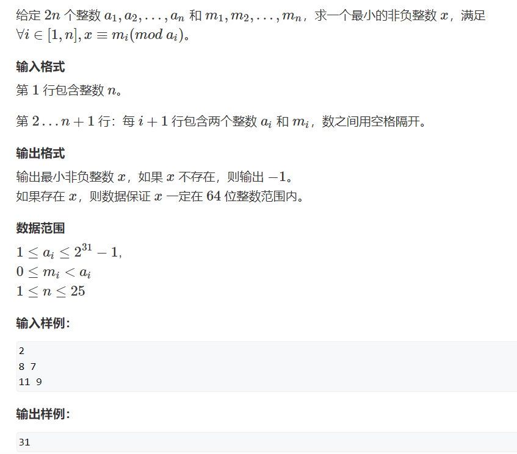

推导过程

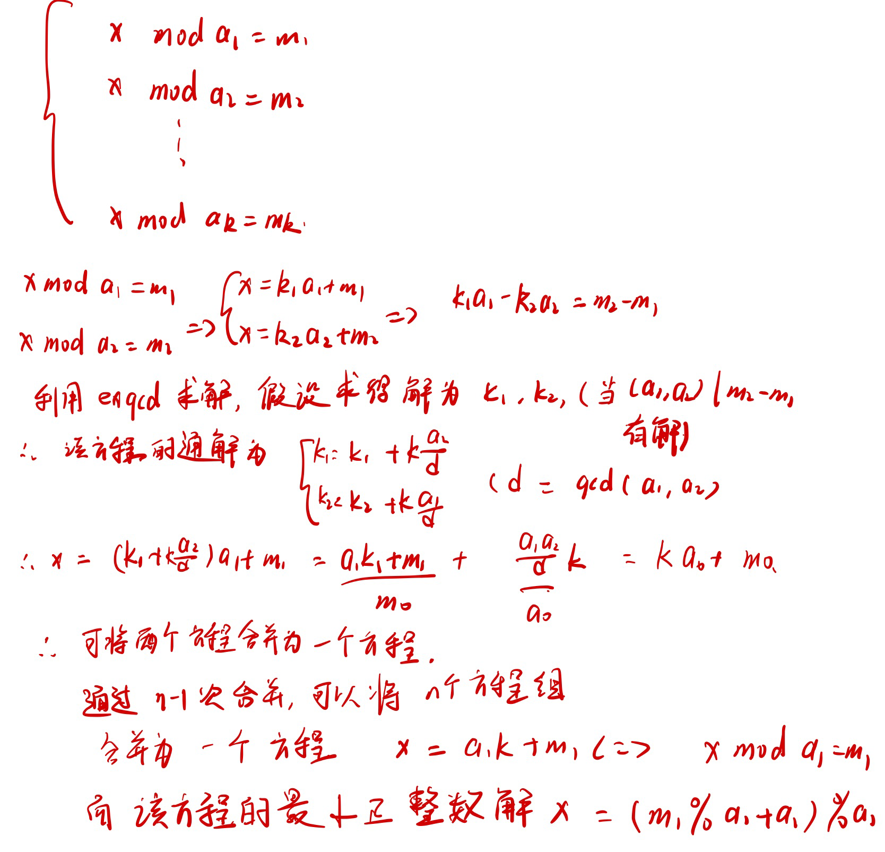

代码

```cpp
#include<iostream>

using namespace std;

typedef long long LL;

LL exgcd(LL a, LL b,LL &x,LL &y)
{
    if (b==0)
    {
        x = 1,y = 0;
        return a;
    }
    int d = exgcd(b, a % b, y , x);
    y -= a/b*x;
    return d;
}

int main()
{
    int n;
    scanf("%d",&n);
    LL a1,m1;
    scanf("%lld%lld",&a1,&m1);
    bool flag = true;
    for (int i=0;i<n-1;i++)
    {
        LL a2,m2;
        scanf("%lld%lld",&a2,&m2);
        LL k1,k2;
        LL d = exgcd(a1,a2,k1,k2); //求解方程 k1a1-k2a2 = m2-m1
        if ((m2-m1) % d!=0) //方程无解
        {
            flag =false;
            break;
        }
        k1 = k1 * (m2-m1) /d; //扩欧得到的是gcd(a1,a2),要扩展(m2-m1) /gcd(a1,a2)才是解
        //采用最小的非负的k1;
        LL tmp = a2/d; //通解形式是 k1’ = k1 + k * (a2/d) k取任意整数
        k1 = (k1 % tmp +tmp) % tmp;
        
        m1 = a1 * k1 + m1;
        a1 = a1 / d * a2; //最小公倍数
    }
    // x mod a1 = m1; x = (m1 % a1 +a1) %a1;
    LL res = (m1 % a1 +a1) %a1;
    if (flag) printf("%lld",res);
    else puts("-1");
}
```

高斯消元解线性方程组

```
枚举每一列c
	(1)找到绝对值最大的一行,(r以下的方程组中)
	(2)将该行换到最上面(和r行交换)
	(3)将该行的第一个数变成1
	(4)将下面的所有行的第c列变成0(r行以下的方程)
	这样就确定了一行方程的样子,让r++
    
    这样就变成了下三角阶梯形，然后从后往前依次求出每个解就可以了。
```

# 求组合数

## (1)打表

数据范围$1<=n<=1e4,1<=b<=a<=2000$,

1w次询问，每次询问的a,b范围小于2k

如果采用定义进行计算，一个组合数需要计算a*(b-a)次乘法，按4000次算，全部的时间大概是4000\*1e4=4\* 1e7，同时计算逆元的时间复杂度n\*log(b!)，直接算会超时

不同的a，b一共有2k*2k =4\* 1e6，400w对,采用打表的方式，预处理出来所有的结果，然后直接查表就可以了。

预处理递推的公式$\mathrm{C}_a^b =\mathrm{C}_{a-1}^{b}+\mathrm{C}_{a-1}^{b-1}$，非常常用的组合数的递推公式

公式推导，从a中选b个数，选定1个数拿出来，还剩a-1个数，那么从a中拿b个数的结果就是(从a-1中拿b个数+从a-1中拿b-1个数(另一个数选出来的那个数))

打表代码$O(N^2)$

```cpp
#include<iostream>
#include<algorithm>

using namespace std;

const int N =2010, mod =1e9+7;
int c[N][N];
void init()
{
    for ( int i = 0 ;i<N;i++)
        for (int j = 0 ;j<=i;j++)
            if (!j) c[i][j] = 1;
            else
                c[i][j] =(c[i-1][j]+c[i-1][j-1]) % mod;
}
int main()
{
    init();
    int n;
    cin>>n;
    while(n--)
    {
        int a,b;
        cin>>a>>b;
        cout<<c[a][b]<<endl;
    }
    return 0;
}
```


## (2)从定义出发，预处理阶乘结果

数据范围$1<=n<=1e4,1<=b<=a<=10^5$,打表的表大小$10^{10}$过大。

直接采用计算也会超时。

预处理阶乘和阶乘的逆元结果。需要计算10^5个阶乘，时间复杂度10^5,逆元采用快速幂计算，时间复杂度10^5*log(mod-2)约等于9,所以时间复杂度在10^6级别。

模板代码时间复杂度$O(N\log n)$

```cpp
#include<iostream>
#include<algorithm>

using namespace std;

const int N = 100010,mod =1e9+7;

typedef long long LL;
int fact[N],infact[N]; //阶乘,阶乘的逆元
int qmi(int a,int k,int p)
{
    int res =1;
    while(k)
    {
        if (k&1) res =(LL)res*a % p;
        a =(LL)a*a % p;
        k>>=1;
    }
    return res;
}
int main()
{
    fact[0] = 1,infact[0]= 1;
    for (int i=1;i<N;i++) fact[i] =(LL)fact[i-1]*i % mod;
    for (int i=1;i<N;i++) infact[i] = qmi(fact[i],mod-2,mod);
    int n;
    cin>>n;
    while(n--)
    {
        int a,b;
        cin>>a>>b;
        int res = (LL)fact[a] * infact[b] % mod * infact[a-b] % mod;
        cout<<res<<endl;
    }
    return 0;
}
```


## (3)卢卡斯定理

每一个询问的数据范围非常大，询问个数很少，然后要求取模

卢卡斯定理的证明

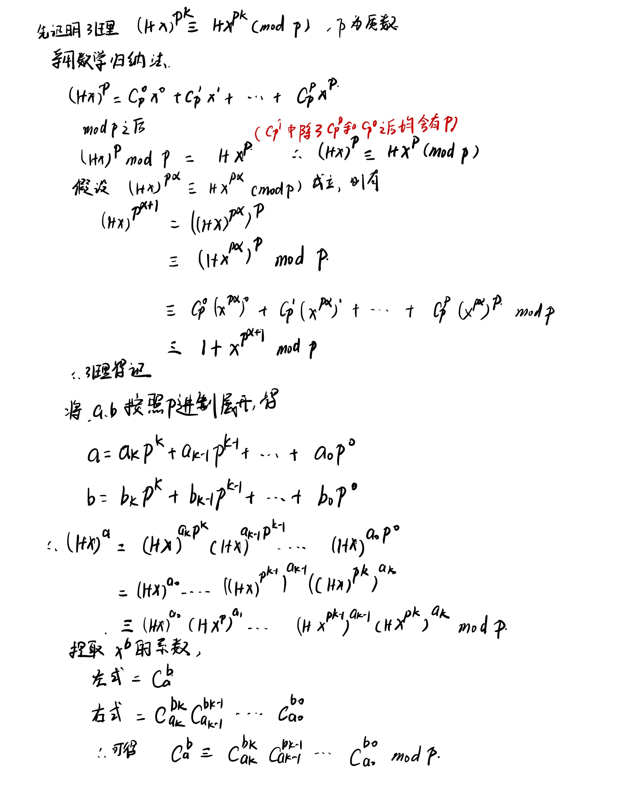

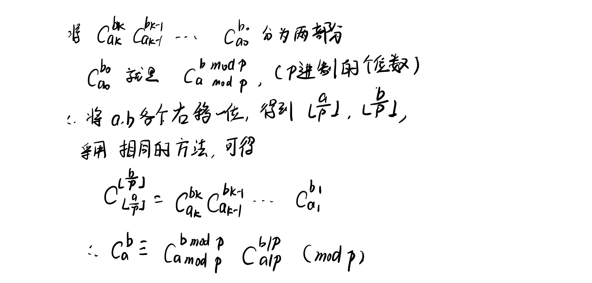

$\mathrm{C}_a^b \equiv \mathrm{C}_{a\mod p}^{b\mod p}*\mathrm{C}_{a/p}^{b/p} (\mod p)$

时间复杂度 $\log_pN*p*\log p，\log_pN是迭代次数，p*\log p 是计算C_{a\mod p}^{b\mod p}的时间复杂度$

```cpp
#include<iostream>
#include<algorithm>

using namespace std;

typedef long long LL;
int p;

int qmi(int a,int k)
{
    int res = 1;
    while(k)
    {
        if (k&1) res =(LL)res*a % p;
        a =(LL)a*a % p;
        k>>=1;
    }
    return res;
}

int C(int a,int b)
{
    int res=1;
    for (int i = 1,j = a;i<=b;i++,j--)
    {
        res =(LL)res * j % p;
        res = (LL)res * qmi(i,p-2) % p;
    }
    return res;
    
}

int lucas(LL a,LL b)
{
    if (a<p && b<p) return C(a,b);
    else return (LL)C(a % p,b % p) * lucas(a/p,b/p) % p;
}

int main()
{
    int n;
    cin>>n;
    while(n--)
    {
        LL a,b;
        cin>>a>>b>>p;
        cout<<lucas(a,b)<<endl;
    }
    return 0;
}
```


## (4)高精度

数据范围非常大，但是要求出精确的结果,当取模的p比a，b小的时候就要用卢卡斯定理了，印着这个时候逆元不知道是否存在，a,b可能是p的倍数。

**方法论**

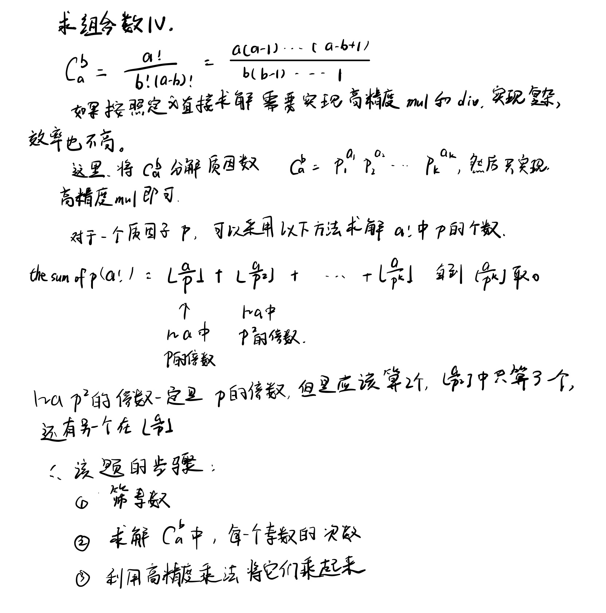

**代码**

```cpp
#include<iostream>
#include<vector>
using namespace std;

const int N = 5010;
int primes[N],cnt;
int st[N];

int sum[N];

void get_primes(int n) //线性筛 素数模板
{
    for (int i=2;i<=n;i++)
    {
        if (!st[i]) primes[cnt++] = i;
        for (int j =0;primes[j]<= n / i; j++)
        {
            st[primes[j]*i] = true;
            if ( i % primes[j] == 0) break;
        }
    }
}

int get(int n, int p) //求解n!中分解质因子中p的次数模板,时间复杂度O(logn)
{
    int res = 0;
    while(n)
    {
        res += n/p;
        n /= p;
    }
    return res;
}
//求解n!中质数p的个数的另一种写法，直接写，但是这样可能会报溢出
int get2(int n,int p) 
 {
    int res = 0;
    int t =p;
    while(n/t)
    {
        res += n/t;
        t*=p;
    }
    return res;
}

vector<int> mul(vector<int> a,int b) //高精度模板
{
    vector<int> c;
    int t = 0;
    for (int i=0;i<a.size();i++)
    {
        t+= a[i]*b;
        c.push_back(t%10);
        t=t/10;
    }
    while(t)
    {
        c.push_back(t%10);
        t=t/10;
    }
    while(c.size()>1 && c.back()==0) c.pop_back();
    return c;
}

int main()
{
    
    int a,b;
    cin>>a>>b;
    get_primes(a);
    
    for (int i=0;i<cnt;i++)
    {
        int p =primes[i];
        sum[i] = get(a,p) -get(b,p) -get(a-b,p);
    }
    
    vector<int> res;
    res.push_back(1);
    
    for (int i=0;i<cnt;i++)
        for (int j =0;j<sum[i];j++)
            res =mul(res,primes[i]);
    
    for (int i=res.size()-1;i>=0;i--) printf("%d",res[i]);
    return 0;
}
```

## 卡特兰数

卡特兰数求解的问题大概类似这样,有很多方案数的结果都是卡特兰数

```
给定 n 个 0 和 n 个 1，它们将按照某种顺序排成长度为 2n 的序列，求它们能排列成的所有序列中，能够满足任意前缀序列中 0 的个数都不少于 1 的个数的序列有多少个。
```

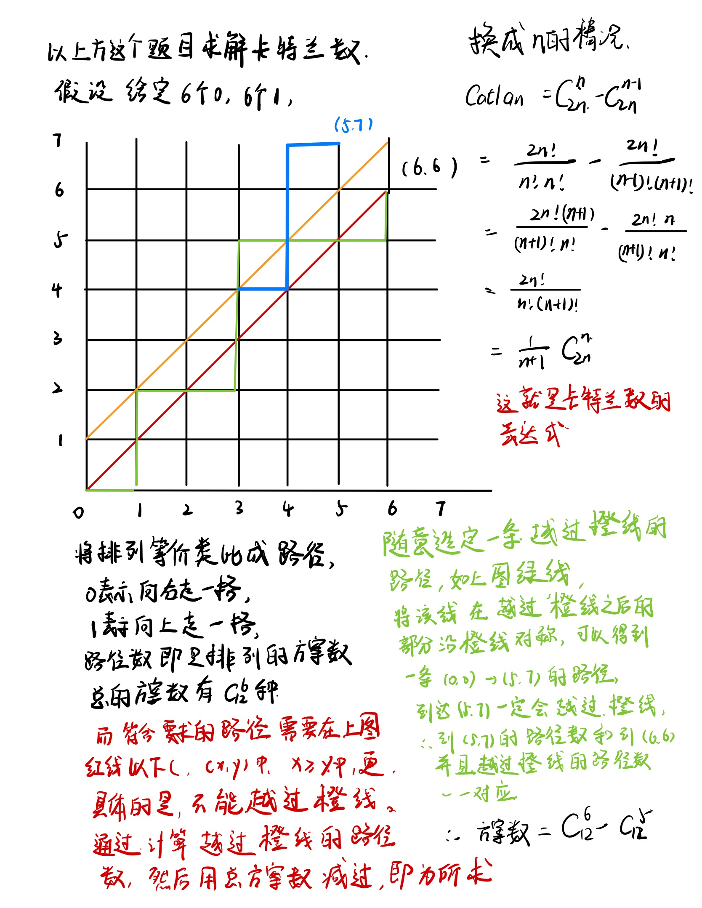

求解上面该题的代码

```cpp
#include<iostream>
#include<algorithm>

using namespace std;

typedef long long LL;

const int mod =1e9+7;

int qmi(int a,int k,int p)
{
    int res = 1;
    while(k)
    {
        if (k&1) res=(LL)res*a % p;
        a =(LL)a * a % p;
        k>>=1;
    }
    return res;
}

int main()
{
    int n;
    cin>>n;
    //从定义出发，求解 1/(n+1)*C(2n,n);
    //C(2n,n) = 2n*(2n-1)*...*(2n-n+1)/(n!)
    //由于mod计算不对除法就有分配律，所以需要把除法换成乘法逆元
    //又因为mod =1e9+7是一个质数，所以可使用快速幂求解逆元
    // 注意数据溢出问题，两个1e9级别的数相乘会溢出int,三个1e9级别的数相乘会爆LL
    
    int a =2*n,b=n;
    int res = 1;
    for (int i =a;i>=a-b+1;i--) res = (LL)res * i % mod;
    int t = 1;
    for (int i=1;i<=b;i++) t = (LL)t * i % mod;
    res = (LL)res * qmi(t,mod-2,mod) % mod * qmi(n+1,mod-2,mod) % mod; 
    cout<<res<<endl;
}
```

## 容斥原理

证明

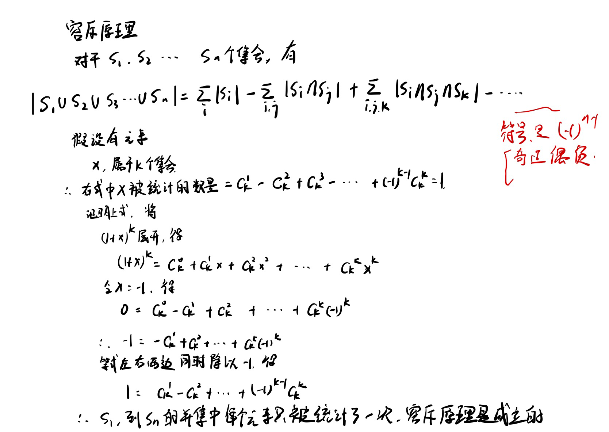

容斥原理的时间复杂度是$O(2^m)$，如果集合个数是m个的话。如果要使用容斥原理，那么就必须要枚举每一种集合的组合情况。即模拟出$\sum_i |S_i|-\sum_{i,j} |S_i \cap S_j| + \sum_{i,j,k} |S_i \cap S_j \cap S_k|...$

要想枚举出每一种组合情况，可以使用dfs完成。不过在这里可以介绍一中更简单的枚举方法。

```cpp
for (int i=1 ; i< 1<<m(2的m次方)；i++)
{
	利用i的二进制表示即可表示出每一种情况。
        int cnt =0; //cnt用来统计选中了几个集合，用于后面确定加减号
	for (int j = 0 ;j<m;j++) //查看i的后m位
	{//当前位是j
		if (i>>j & 1) //查看第j位是否为1,为1表示选中集合j，为0表示不选中集合j
            //一般的操作就是把选中的集合元素个数加起来。
	}
	if (cnt % 2!=0) //奇数个,加到总结果中
        else //偶数个，从总结过中减去
}
```

利用容斥原理完成的题目示例

https://www.acwing.com/problem/content/892/

实践一下实例，求解1~10中能被2，3至少一个数整除，可以用容斥原理来做，被2整除 + 被3整除 - 被2*3整除。求解1~n中被k整除的数字的个数，采用n/k取下正即可求出。

代码

```cpp
#include<iostream>
#include<algorithm>

using namespace std;

typedef long long LL;

const int N = 20;

int p[N];

int main()
{
    int n,m;
    cin>>n>>m;
    for (int i=0;i<m;i++) cin>>p[i];
    
    int res = 0;
    for (int i = 1;i<1<<m;i++)
    {
        int t=1,cnt=0;
        for (int j = 0;j<m;j++)
        {
            if (i>>j & 1)
            {
                cnt++;
                if ((LL)t*p[j]>n)
                {
                    t=-1;
                    break;
                }
                
                t *= p[j];
            }
        }
        if (t!=-1)
        {
            if (cnt & 1) res += n/t;
            else res -= n/t;
        }
    }    
    cout<<res<<endl;
    return 0;
}
```

# 简单博弈论

首先介绍一下关于异或的一些基本操作

1.A XOR A = 0

2.A XOR 0 = A

3.A XOR B = B XOR A (交换律)

4.A XOR B  XOR C = A XOR (B XOR C) =  (A XOR B) XOR C

5.D = A XOR B XOR C 可以推出 A = D XOR B XOR C 

**公平组合游戏ICG**

​	如果一个游戏满足

​	1.由两名玩家交替行动

​	2.在游戏进程的任意时刻，可以执行的合法行动与哪名玩家无关

​	3.不能行动的玩家判负

​	则称该游戏为一个公平组合游戏。

Nim博弈就是一个公平组合游戏，但城建的棋类游戏，比如围棋，就不是公平组合游戏。因为围棋交战双方分别只能落黑子和白子，胜负判定也比较复杂，不满足公平组合游戏的条件。

**有向图游戏**

给定一个有向无环图，图中由唯一的起点，在起点上放一枚棋子，两名玩家交替地把这枚棋子沿着有向边进行移动，每次可以移动一步，无法移动者判负。该游戏被称为有向图游戏。任何一个公平组合游戏都可以转化成有向图游戏，具体方法是把每个局面看成图中的一个节点，并且每个局面  向   沿着合法行动能够到达的下一个局面   连  有向边。

## Nim-游戏

给定 n 堆石子，两位玩家轮流操作，每次操作可以从任意一堆石子中拿走任意数量的石子（可以拿完，但不能不拿），最后无法进行操作的人视为失败。

问如果两人都采用最优策略，先手是否必胜。

就是将n堆的石子的数量异或起来，结果为0先手必败，结果不为0先手必胜

术语介绍

**(先手)必胜状态**：通过某个操作，可以把当前状态变成必败状态，就是必胜状态。

**(先手)必败状态**：无论通过什么操作，走到的状态都是必胜状态，那么我必败。

 Nim游戏的结论和证明

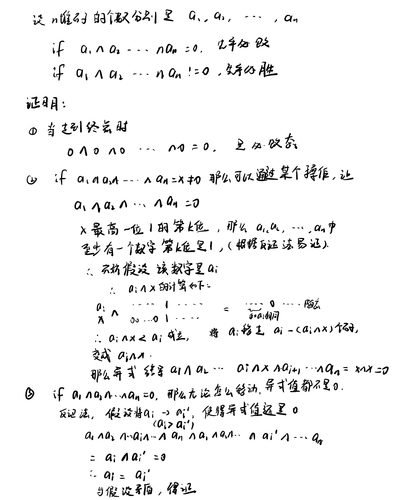

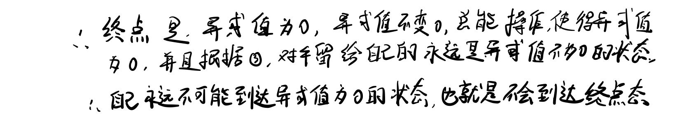


## SG函数

Mex运算 Mex(x) = 不在集合x中的最小的自然数

SG函数的定义:

在有向图游戏中，假设状态x可以到达y1,y2,y3,.....,yk种状态，那么

SG(x) = Mex{SG(y1),SG(y2),SG(y3),......SG(yk)}

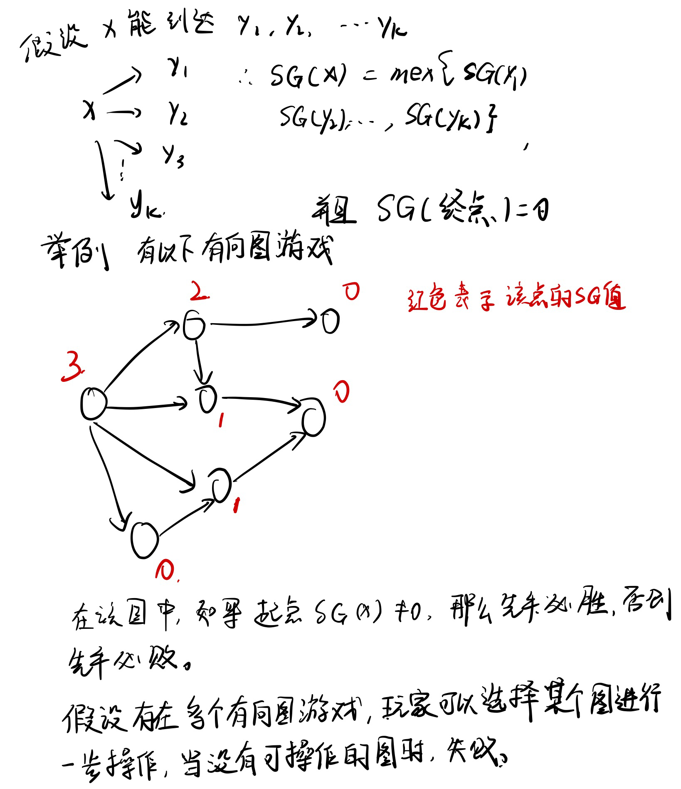

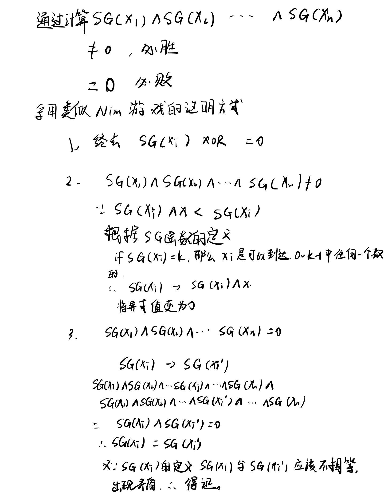

当求解出多个有向图游戏的当前状态(节点)的SG值，将他们异或起来，就可以得知是必胜状态还是必败状态。证明的方法和Nim-游戏相同。

所以在具体利用SG函数的代码中，就需要求解每个有向图游戏的当前状态的SG值。

下面举了一个实例，求解SG值，采用了记忆化搜索的方法

题目链接：https://www.acwing.com/problem/content/895/

实现代码

```cpp
#include<iostream>
#include<cstring>
#include<unordered_set>
using namespace std;

const int N = 110,M =10010;
int n,m; // n集合中数字个数，m石子数

int s[N],f[M]; //s:集合， f,保存每一个状态的sg值

int sg(int x)
{
    if (f[x]!=-1) return f[x]; //记忆化搜索保证了时间复杂度
    unordered_set<int> S;
    for (int i=0;i<n;i++)
    {
        int sum = s[i];
        if (x>=sum) S.insert(sg(x-sum));
    }
    for (int i=0; ;i++)
        if (!S.count(i))
        {
            f[x] = i;
            return f[x];
        }
}
int main()
{
    cin >>n;    
    for (int i=0;i<n;i++) cin>>s[i];
    cin>>m;
    memset(f,-1,sizeof f);
    int res =0;
    while(m--)
    {
        int x;
        cin>>x;
        res ^= sg(x);
    }
    if (res) puts("Yes");
    else puts("No");
}
```