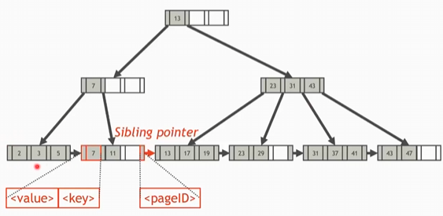
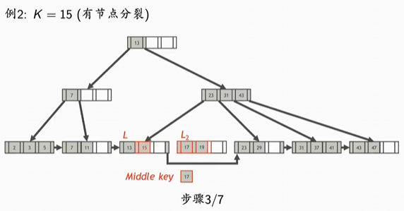

# 索引

索引能够帮助DBMS快速找到关系中满足搜索条件的元组
因此索引对于提高查询处理效率至关重要

索引分类：按照索引的实现方式,可以分为有序索引和哈希索引
- 有序索引：通过按索引键有序排列索引项来实现索引
- 哈希索引：通过按索引键哈希值分桶来实现索引

**哈希索引**

哈希索引由若干桶构成
- `h` 哈希函数
- 键为`K`的索引项属于编号为`h(K)`的桶
- 哈希索引只支持键上的等值查找

**有序索引**

*分类1*,根据数据文件中的元组是否按照索引键排序,可以将有序索引分为两类
- 聚簇索引
- 非聚簇索引

如果数据文件中的元组是按照该索引键排序的，则该索引是聚簇索引
- 聚簇索引的索引键通常是关系的主键
- 一个关系上通常只有一个聚簇索引(因为关系中元组的排序只能有一种)

如果数据文件中的元组不是按照该索引键排序的，则该索引是非聚簇索引
- 一个关系上可以有多个非聚簇索引

**索引组织表**
索引组织表 = 聚簇索引文件+数据文件

在聚簇索引中的索引项不在存储元组的地址，而是直接存储元组本身，这样就可以减少一次按元组地址读元组的I/O操作


*分类2*: 根据关系中每个元组在索引中是否都有一个对应的索引项,可将有序索引分为两类
- 稠密索引,指关系中每个元组都在索引中有一个对应的索引项
- 稀疏索引,关系中只有部分元组在该索引中有对应的索引项

**聚簇索引通常是稀疏索引**
- 可以只对数据文件中每页的第一个元组建立索引项
- 可以只对数据文件中每个不同的索引键值的第一个元组建立索引项

*分类3*: 根据索引键是否为关系的主键,可以将有序索引分为两类
- 主索引(primary index),该索引的索引键是关系的主键,一个关系只能有一个主索引
- 二级索引(secondary index)

二级索引通缩是非聚簇索引,一个关系可以有多个二级索引

```sql
-- 创建主索引
CREATE TABLE Student (
  Sno CHAR(6).
  Sname VARCHAR(10),
  Ssex CHAR,
  Sage INT,
  Sdept VARCHAR(20),
  PRIMARY KEY(Sno)
);

-- 创建二级索引
-- 用ASC表示升序,用DESC表示降序
CREATE INDEX idx_sname_sage ON Student(Sname,Sage,DESC);
```

**MySQL中的索引**

1. 主索引是索引组织表
2. 耳机索引的索引项中存储的不是元组地址,而是元组的主键值

**唯一索引**
唯一索引的索引键值不能重复
- 主索引一定是唯一索引
- 二级索引不一定是唯一索引

创建唯一所以有两种方式 
1. 在`CREATE TABLE` or `ALTER TABLE`语句中使用`UNIQUE`声明唯一约束时,自动创建唯一索引
2. 使用语句`CREATE UNIQUE INDEX 索引名 ON 关系名(索引键)`创建唯一索引

**外键索引**
外键索引的索引键时关系的外键

# 索引结构
1. 平衡树
2. 跳表(多用于内存数据库系统)
3. 字典树(多用于内存数据库系统)
4. 日志结构合并树(LSM-Tree)，多用于NoSQL数据库的存储引擎

# 哈希索引

## 可扩展哈希表

## 线性哈希表

# 平衡树索引

## B+树

B+树

一个B+树是一个M路平衡搜索树

B+树分为根节点,内节点以及叶子节点
其中只有叶子节点存储数据,内节点和根节点中的值仅仅用来导航

B+树和BST的有序是类似的,节点中key左侧子树都小于key,右侧子树都大于等于key

有以下特征 
1. B+树是完全平衡的,叶子节点均在同一层,不会出现叶子节点高度差1的情况
2. 除了根节点以外,每个节点至少是半满的
即每个节点中的key的数量为$M/2 - 1 <#key < M-1$

说明:一个节点最多M路,也就是M个子树,因此key的数量最多M-1

3. B+树一种常见的外存数据结构,每个节点的大小和页(数据块)的大小相等

**B+树的叶节点**

每个叶节点包含一个索引项数组和一个指向右侧兄弟叶节点的指针(右侧兄弟节点的页号)
- 索引项数组通常按索引键排序

B+树的叶子节点是有序的,并且会通过sibling pointer前后相连,因此找前驱和后继很方便,时间复杂度是$O(1)$,虽然使用sibling pointer描述,不过在实现上,这个next指针和previous指针保存的内容是pageId,而不是内存指针(因此在B+树这一章节,看到的指针的字样,都可以用pageId来替换,只不过指针比较好理解)



**B+树的内节点**

每个内节点包含一个键数组Key和一个指向儿子节点的指针数组Ptr
- Key中有k个键时,Ptr中有k+1个指针
- Key中的键值有序
- Ptr[0] 指向的子树中的键值 < Key[0]
- Ptr[k+1]指向的子树的键值 >= Key[k]
- Ptr[k]指向的子树的键值 < Key[k]
- Key[i-1]<= Ptr[i]指向的子树中的键值 < Key[i]
  


**B+树的根节点**

根节点和内节点的内部结构相同,但是不要求"半满"

**B+树的查找**

B+树的查找很简单,采用和BST类型的查找方式即可

**B+树的区间查找**

B+树的区间查找也很简单,先找到开始位置,但是沿着叶子节点上的指针挨个遍历,直到找到终点即可

**B+树的插入**
1. 找到$K$应在的叶节点$L$
2. 将索引项插入$L$
3. 如果$L$不溢出,则插入完成,否则分裂$L$

分裂叶节点$L$
1. 创建一个新的叶节点$L_2$
2. 将$L$中的索引项平分,前一半留在$L$中,后一半移入$L_2$中
3. 将$L_2$中最小的键(即最左侧的键)存入"中间键(middle key)"变量中(增加了一颗子树,因此相应的父节点需要增加一个指向这个子树的指针,因此父节点需要增加一个key)
4. 在叶节点链表中,将$L_2$插入到$L$的右侧
5. 在L的父节点$N$中插入middle key以及指向$L_2$的指针
6. 如果N不溢出,则完成分裂,否则,继续分裂N,直到根节点发生分裂,B+树的高度增加1,这个操作一定是可以终止的

在向父节点加key的时候,假设我们确定了new_key加在k1和k2之间,那么说明k1和k2之间的key发生了分裂Ptr[k1+1]和Ptr[k2+1]之间多了一个叶节点
如果说k2不存在,那么就是插入在最右侧的情况

在父节点也发生分裂的情况下,将父节点(M个节点)均分,但是实际上分裂的两个节点使用M-1个节点就可以保证所有指针均有所指,因此会多出来一个节点(我们选择多出来本来分给右侧节点中的第一个key作为多余),这个key作为middle key,继续向父节点插入

原本溢出的情况:M个节点,M+1个P
分裂后:
左侧节点: M/2个节点,M/2+1个P,这里M/2表示取下整
右侧节点：M-M/2, M-M/2+1个P
加一下我们就发现了多了一个P,因此可以将右侧节点少拿一个
实际的右侧节点：M-M/2-1个节点,M-M/2个P




**B+树的删除**
1. 找到K所在的叶节点L
2. 从L中删除键为K的索引项
3. 如果L在删除之后仍然半满,则完成删除,否则处理L,使得L至少半满

使叶节点L至少半满的处理方法
1. 尝试从L的兄弟节点(有相同的父节点)借一个索引项,使两者均至少半满
2. 如果借不到,则将L与其兄弟节点合并

- 如果L与左侧兄弟节点$L_1$合并,则从L的父节点中删除指向L的指针以及相应的键
- 如果L与右侧兄弟节点$L_2$合并,则从$L_2$的父节点中删除指向$L_2$的指针以及相应的键
- 如果L的父节点在合并之后(删除了一个指针和一个键)至少半满,则完成合并,否则处理N,使得N至少半满
  - 如果N是根节点,且N中只有一个指针,则删除N,并将其唯一的子节点作为新的根节点
  - 如果N是内节点,则处理N(借或者合并),使得N至少半满
