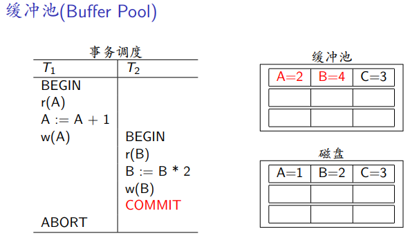
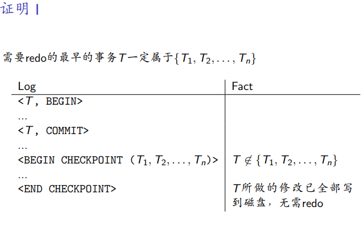
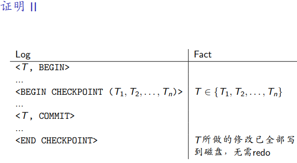
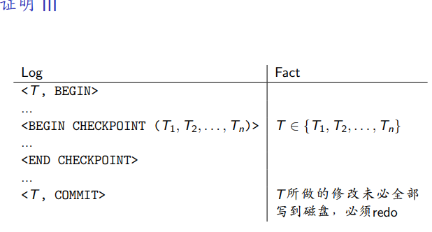
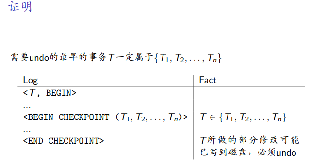

- 已提交的事务对数据库的修改为全部持久化到磁盘上 => 破坏一致性
  
- 已中止的事务对数据库的修改已经部分持久化到磁盘上 => 破坏原子性

DBMS在进行故障恢复时会执行两种操作
1. 撤销(undo),撤销未完成事务对数据库的修改
2. 重做(redo),重做已提交事务对数据库的修改

DBMS如何运用undo和redo取决于DBMS如何管理缓冲池(buffer pool)
例子


- 是否强制(force)在T_2提交时将B写回磁盘 (FORCE策略)
- 是否允许在T_1提交前覆写磁盘上A的值 (STEAL策略)

STEAL/NO-STEAL策略

DBMS是否允许将未提交的事务所作的修改写到磁盘并覆盖现有数据
- STEAL 允许
- NO-STEAL 不允许

FORCE/NO-FORCE策略
DBMS是否强制将已提交的事务所作的修改写到磁盘
- FORCE 强制
- NO-FORCE 不强制

## 缓冲池策略

| | | |
|---|---|---|
| 缓冲池效率高 | STEAL + FORCE | STEAL + NO-FORCE |
| 缓冲池效率低 | NO-STEAL + FORCE| NO-STEAL + NO-FORCE |
| | I/O 效率低 | I/O 效率高 |

NO-STEAL + FORCE策略

优点: 实现简单,故障恢复时什么都不用干

缺点：I/O效率低 + 缓冲池效率低

NO-STEAL => 未提交事务不可能将其修改写回磁盘 => 不需要undo
FORCE => 已提交事务必须将其修改写回磁盘 => 不需要redo

## WAL Protocol

DBMS用于故障恢复，需要记日志
Write-Ahead Logging(WAL) - 预写式日志

DBMS在数据文件之外维护一个日志文件(log file),用于记录事务对数据库的恢复
- 假定日志文件存储在稳定存储器中
- 日志记录包含undo或者redo时所需的信息

DBMS在将修改过的对象写到磁盘之前，必须先将修改此对象的日志记录刷写到磁盘


1. 事务启动,向日志写入记录 `<tid,BEGIN>`
   其中 是事务的唯一标识符(`txn ID`)
2. 事务提交,向日志写入记录 `<tid,COMMIT>`
    在DBMS向应用程序返回确认消息之前,必须保证T_i的所有日志记录都已刷写到磁盘
    `<tid,COMMIT>`写入磁盘才代表事务提交
3. 当T_i修改对象A时,向日志写入记录`<tid, oid,before,after>`
   - `oid`：被修改对象的标识符(object ID)
   - `before`：修改前的值(undo时使用)
   - `after`：修改后的值(redo时使用)

## 基于WAL的故障恢复

Part 1： 事务正常执行时的行为
- 记录日志
- 按照缓冲池策略将修改过的对象写到磁盘

Part 2: 故障恢复时的行为
- 根据日志和缓冲池策略,对事务进行undo和redo

事务分类

根据日志将事务分为3类

**已提交事务** 既有`<T, BEGIN>`,也有 `<T COMMIT>` (有可能redo)

**不完整事务** 有`<T, BEGIN>`,但没有 `<T COMMIT>` (有可能undo)

**已终止事务** 有`<T, BEGIN>`,和有 `<T ABORT>`
在事务正常执行和故障恢复过程中,如果T所作的修改已经全部撤销,则将日记记录`<T, ABORT>`写入日志

已中止的事务相当于从未执行过,故不需要undo和redo

对于已提交的事务,如果其修改已经全部写到磁盘上了,则无需redo,否则需要redo

对于不完整事务，如果不完整事务的任何修改都未写到磁盘上,则无需undo,否则需要undo

缓冲池的策略决定了上述行为

根据缓冲池的策略不同,可以实现三类WAL协议

- *Undo Logging* : WAL + STEAL + FORCE
- *Redo Logging* : WAL + NO-STEAL + NO-FORCE
- *Redo + Undo Logging* : WAL + STEAL + NO-FORCE

## Undo Logging

STEAL + FORCE

对于已提交事务 => 不需要恢复
对于不完整事务 => 需要undo

从后向前扫描日志

根据每条日志记录的类型执行相应的动作
- `<T, COMMIT>` 将T记录为已提交事务(无需redo)
- `<T ABORT>` 将T记录为已中止事务(无需undo)
- `<T, oid, before, after>` 如果T是不完整事务(没见过对应的`<T COMMIT>`),则将磁盘上A的值恢复为`before`
- `<T BEGIN>` T恢复完毕,如果T是不完整事务,则向日志中写入`<T ABORT>`,今后故障恢复无需在undo

## Redo Logging

NO-STEAL + NO-FORCE

已提交事务 => 全部redo，因为NO-FORCE
不完整事务 => 不需要恢复，因为NO-STEAL

从前向后扫描日志两遍

第一遍扫描：记录已提交事务和已中止事务
- `<T, COMMIT>` 将T记录为已提交事务
- `<T, ABORT>` 将T记录为已中止事务

第二遍扫描，根据每条日志记录的类型执行相应的操作
- `<T, oid, before, after>` 如果T是已提交事务,则将磁盘上A的值恢复为`after`
- `<T BEGIN>` 如果T是不完整事务,则向日志中写入`<T ABORT>`

## undo + redo Logging

STEAL + NO-FORCE策略

已提交事务：全部redo,因为NO-FORCE
不完整事务：全部undo,因为STEAL

Redo阶段: redo已提交事务
Undo阶段: undo不完整事务

可以扫两遍

第一遍从后向前,做undo

第二遍从前向后,做redo

几乎所有的DBMS都采用STEAL+NO-FORCE策略

**组提交(Group Commit)**

每条日志单独刷写到磁盘I/O的开销太大

在内存中设置日志缓冲区,将多条日志一起刷写到磁盘

## 检查点(Checkpoint)

日志永远在变大，故障恢复时需要扫描日志,会导致恢复时间越来越长

DBMS定期设置检查点(checkpoint)
- 将日志刷写到磁盘
- 根据缓冲池策略,将脏页写到磁盘
- 故障恢复时只需要扫描到最新的检查点

**模糊检查点(Fuzzy Checkpoint)**

检查点开始,向日志中写入`<BEGIN CHECKPOINT (T1,T2,...,T_n)>`
- T1,T2,...,T_n是当前活跃的事务(未提交也未中止的事务)
- 检查点中间,根据缓冲池策略,将脏页写到磁盘,如果采用STEAL，则将脏页全部写到磁盘
否则,只将已提交事务所作的修改写到磁盘

- 检查点结束,向日志中写入`<END CHECKPOINT>`,并将日志刷写到磁盘
  如果采用NO-FORCE策略,则写完全部脏页即可结束检查点。
  
  否则需要等待T1,T2,...,T_n全部提交之后才能结束检查点


涉及检查点的故障恢复
缓冲池策略 STEAL + NO-FORCE

假设日志中最新的完整检查点
```
<BEGIN CHECKPONT (T_1,T_2,...,T_n)>
...
<END CHECKPOINT>
```

需要redo的最早事务一定属于`T_1,T_2,...,T_n`中的一个
从日志记录`<BEGIN CHECKPOINT (T_1,T_2,...,T_n)>`开始向后扫描日志，不需要从最早的`<T_i,BEGIN>`开始扫描

证明1

对于T不属于`T_1,T_2,...,T_n`,其修改一定已经checkpoint上写到磁盘上了,不需要redo

证明2


证明3


undo阶段

假设日志中最新的完整检查点
```
<BEGIN CHECKPONT (T_1,T_2,...,T_n)>
...
<END CHECKPOINT>
```
需要undo的最早事务T一定属于`T_1,T_2,...,T_n`中的一个

证明

