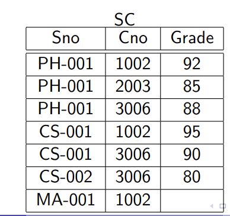
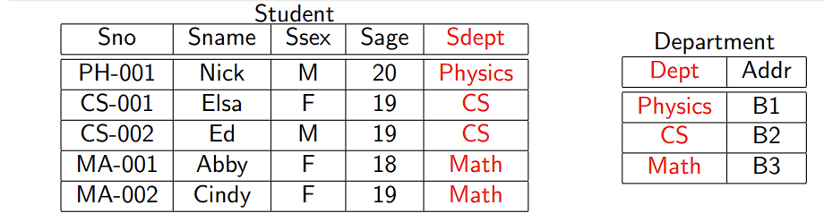
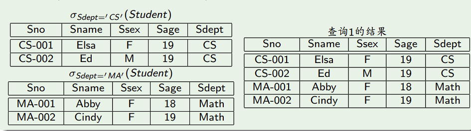
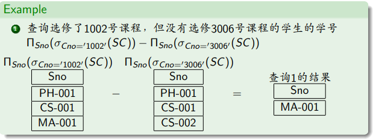
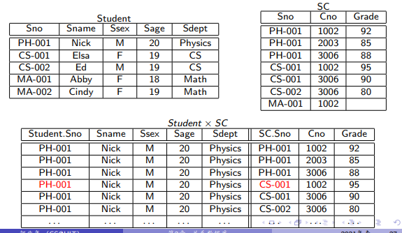
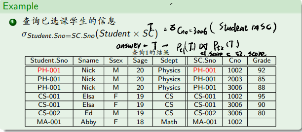
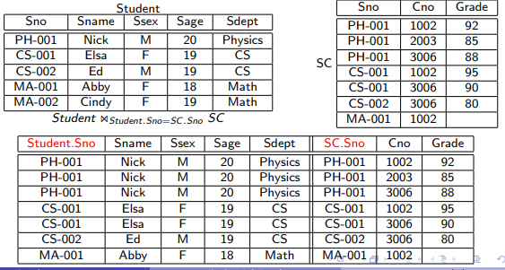
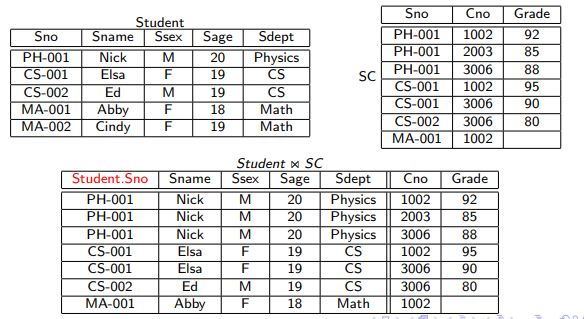
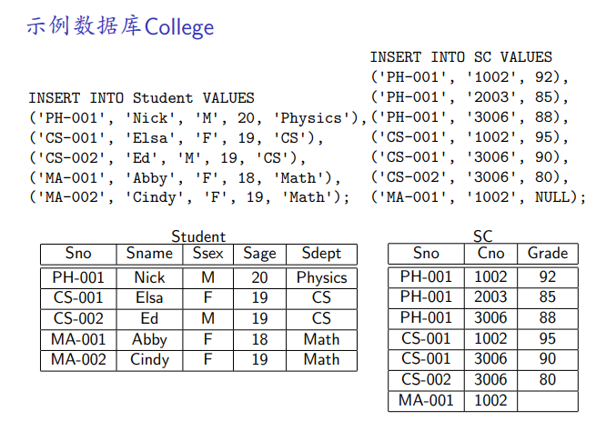

# 关系数据模型

三要素
- 关系数据结构
- 关系操作
- 关系完整性约束

**关系数据结构**

不严格地讲,关系就是一张二维表(table)
- 行(row) —— 元组(tuple)/记录(record),一行表示一个对象
- 列(column) —— 属性(attribute)/域(field),一列表示一个属性

关系的键

关系种某些属性集合具有区分不同元组的作用,称为键(key)

- 超键

如果关系种某一组属性的值能唯一标识每个元组,则称改组属性为超键(super key)

例如,在关系SC(Sno,Cno,Grade)中,属性组{Sno,Cno},和{Sno,Cno,Grade}都是超键



- 候选键
如果一个超键的任意真子集都不是超键,则称该超键为候选键
候选键 = 极小的超键

例如上面那个表中,Sno和Cno都不是关系SC的超键,候选键为{Sno,Cno}

- 主键

每个关系都有至少一个候选键,人为指定其中一个作为主键(primary key)

- 外键
不同的关系中的元组可以存在联系,这种联系是通过外键建立起来的

设$F$是关系$R$的属性子集,若$F$与关系$S$的主键相对应,则称F是R的外键(foreign key)
- R 参照关系(外键位于R中)
- S 被参照关系
- R与S可以是同一关系

例子



{Sdept}是Student的外键,这个外键参照了{Department}的主键{Dept}

**关系操作**

增删改查

**关系完整性约束**
实体完整性约束
- 主键唯一
- 主键不能为空

参照完整性约束

设F是关系R的外键,F参照关系S的主键,则F中的任意元组的F属性值必须满足以下两个条件之一
- F的值为空
- 若F的值不为空,则F的值必须在S的主键中存在
  
总结:*外键的值要么为空,要么一定出现在参照的主键中*

**用户定义完整性约束**
用户定义的对数据的约束条件,例如
- 考试成绩在0-100之间
- 性别必须为'M' or 'F'
  
# 关系代数

**关系代数基本操作**

1. 选择 $\sigma$
2. 投影 $\pi$
3. 并 $\cup$
4. 差 $-$
5. 笛卡尔积 $\times$
6. 重命名 $\rho$

## 选择操作
- 功能:从一个关系中选出满足给定条件的元组
- 语法:$\sigma_{条件}(关系)$

例子
- 找出计算机系的全体学生

  $\sigma_{Sdept='CS'}(Student)$
- 找出计算机系的全体男学生
  
  $\sigma_{Sdept='CS' \wedge Ssex='M'}(Student)$

## 投影操作
- 功能:从一个关系中选出满足给定条件的属性
- 语法:$\pi_{属性}(关系)$

例子:
- 找出全体学生的学号和姓名
$\pi_{Sno,Sname}(Student)$
- 找出全部的系 
  $\pi_{Sdept}(Student)$

## 并操作
- 功能: 计算关系R和S的并集
- 语法: $R \cup S$

要求:
1. R和S必须具有相同个数的属性
2. R和S的对应属性的值必须相容

例子:
- 找出计算机系和电子系的全体学生

$\sigma_{Sdept='CS'}(Student) \cup \sigma_{Sdept='MA'}(Student)$



## 差操作
- 功能: 计算关系R和S的差集
- 语法: $R - S$

要求:
1. R和S必须具有相同个数的属性
2. R和S的对应属性的值必须相容

例子: 查询选修了1002号课程,但是没有选修3006号课程的学生的学号

$\pi_{Sno}(\sigma_{Cno='1002'(SC)}) - \pi_{Sno}(\sigma_{Cno='3006'(SC)})$



## 笛卡尔积
- 功能：计算两个关系的笛卡尔积
- 语法：$R \times S$



- 笛卡尔积的作用是将R和S中的元组无条件的连接起来
- 笛卡尔积操作通常和选择操作一起使用，即连接(join)

example： 查询已选课的学生的信息

$\sigma_{Student.Sno=SC.Sno}(Student \times SC)$

（不用看黑字，这个其实就是自然连接）



## 重命名

- 功能：修改关系名和(或)属性名
- 语法：
  - $\rho_{B \leftarrow A}(R)$ 将关系R的A属性重命名为B属性
  - $\rho_{S}(R)$ 将关系R重命名为关系S
  - $\rho_{S(A_1,...,A_n)}(R)$ 将关系R重命名为关系S,并将S的属性重命名为$A_1,...,A_n$

- 当把一个关系和它自身进行自链接(self-join)时。需要区分同一个关系的两个副本，此时需要使用重命名操作

找出3006号课程的最高分，S1.Grade > S2. Grade,用这个条件筛选，最高分一定不在这里面，然后用差操作找到最高分

**派生关系代数操作**

1. 交 $\cap$
2. $\theta$连接 $\bowtie_{\theta}$
3. 自然连接 $\bowtie$
4. 外连接：左外连接 ⟕，右外连接 ⟖，全外连接 ⟗
5. 除 $\div$

## 交操作
- 功能：计算关系R和S的交集
- 语法：$R \cap S$
- 要求：
  1. R和S必须具有相同个数的属性
  2. R和S的对应属性的值必须相容

- 等价变换 $R \cap S = R - (R - S)$

## $\theta$连接
- 功能：将关系R和S中满足给定连接条件$\theta$的元组进行连接
- 语法：$R \bowtie_{\theta} S$
  -  $\bowtie$内连接操作符
  - $\theta$是连接条件，条件表达式语法与选择操作条件相同

- $R \bowtie_{\theta} S$的结果包含R和S的全部属性，同名属性加关系名前缀

example

$Student \bowtie_{Student.Sno=SC.Sno} SC$



- 等价于 $R \bowtie_{\theta} S = \sigma_{\theta}(R \times S)$

## 自然连接
- 功能：设$\{A_1,A_2,...,A_k\}$是关系R和S的同名属性集合，自然连接是在$R \times S$的基础上，将$R \times S$中满足$R.A_1=S.A_1 \wedge R.A_2=S.A_2 \wedge ... \wedge R.A_k=S.A_k$的元组进行连接
- 语法 $R \bowtie S$
- 从连接结果中去掉重复的同名属性
  


## 外连接
- 目的：$R \bowtie_{\theta} S$的结果只包含R和S中满足连接条件$\theta$的元组，有些情况下我们需要在连接结果中保留R或(和)S中的全部元组，这时就需要使用外连接

- 左外连接,保留R中的全部元组,对于R中不满足连接条件$\theta$的元组，R中属性保留，S属性设空
- 右外连接，保留S中的全部元组，对于S中不满足连接条件$\theta$的元组，S中属性保留，R属性设空
- 全外连接，同时做左外连接的保留和右外连接的保留

## 除操作


**扩展关系代数操作**
- 分组操作 $\gamma$
- 复制操作 $=$
##

# SQL语句

## 数据类型

**整型**

- `INTEGER`或者`INT`:4字节
- `SMALLINT`:2字节
- `BIGINT`:8字节
- `TINYINT`:1字节
- `MEDIUMINT`: 3字节
  
**定点型**

- `DECIMAL(p,s)` 有效数字共p位,小数点后s位
- `NUMERIC(p,s)` 同`DECIMAL(p,s)`

**浮点型**
- `FLOAT` 单精度,4字节
- `DOUBLE` 双精度,8字节

**二进制数型**

- `BIT(b)` b位二进制数(1 <= b <= 64), 占位 (b+7)/8字节(整除),输入时用`b'101'`代表`5`

**日期时间型**
- `YEAR` 年类型： 存储：1字节，显示和输入格式:`YYYY`
- `DATE` 日期型：存储：3字节，整数`YYYY*16*32+MM*32+DD` `显示和输入格式:`YYYY-MM-DD`
- `TIME` 时间型 存储：三字节，整数`DD*24*3600+HH*3600+MM*60+SS` 显示和输入格式:`HH:MM:SS`
- `DATETIME` 日期时间型，与时区无关，8字节
- `TIMESTAMP` 时间戳型，和UNIX时间戳相同，与时区有关，保存从`1970-01-01 00:00:00 UTC`以来的描述，4字节，显示和输入格式:`YYYY-MM-DD HH:MM:SS`

具体时间戳使用

存储：本地时间->UTC时间-> 秒数

使用：秒数->UTC时间->本地时间

**字符串型**
- `CHAR(n)` 定长字符串，最多存储n个字符，不足n个字符用空格填充，n<=255，存储空间固定
- `VARCHAR(n)` 变长字符串，最多存储n个字符，n<=65535，存储空间根据字符串的实际长度L变化
- `TEXT` 文本型
  - `TINYTEXT` $L < 2^8$
  - `TEXT` $L < 2^{16}$
  - `MEDIUMTEXT` $L < 2^{24}$
  - `LONGTEXT` $L < 2^{32}$

**二进制串型**

- `BINARY(n)`:定长二进制串，最多存储n个字节，不足n个字节用`\0`填充，n<=255，存储空间固定
- `VARVBINARY(n)`: 变长二进制串，最多存储n个字节，n<=65535，存储空间根据二进制串的实际长度L变化
- `BLOB` 二进制对象(Binary Large OBject)
  - `TINYBLOB` $L < 2^8$
  - `BLOB` $L < 2^{16}$
  - `MEDIUMBLOB` $L < 2^{24}$
  - `LONGBLOB` $L < 2^{32}$

**枚举型**
- `ENUM(值列表)`：枚举型
  
  例子`ENUM('Mercury','Venus','Earth','Mars')`
  
  枚举型的值只能取自值列表
  
  值列表中最多包含65535个不同的值

  如果值列表中包含之多255个值，则占1字节，如果值列表中包含超过255个值，则占2字节

**集合型**

- `SET(值列表)`

  例子`SET('Mercury','Venus','Earth','Mars')`

  集合型的值只能是值集合的子集，例如`'Mercury,Earth'`

  值列表中最多包含64个不同的值

  存储位二进制位，有位1，无为0

  占用空间大小取决于集合中元素的个数

  ## 创建关系模式

  `CREATE TABLE`

  Example:
  ```sql
  CREATE TABLE Student(
    Sno CHAR(6),
    Sname VARCHAR(10),
    Ssex ENUM('M','F'),
    Sage INT,
    Sdept VARCHAR(20)
  );
  ```

## 声明主键

`PRIMARY KEY`


Example:
  
方法1
```sql
CREATE TABLE Student(
  Sno CHAR(6) PRIMARY KEY,
  Sname VARCHAR(10),
  Ssex ENUM('M','F'),
  Sage INT,
  Sdept VARCHAR(20)
);
```
方法2,当声明多个属性构成的主键时，只能用第二个方法
```sql
CREATE TABLE Student(
  Sno CHAR(6),
  Sname VARCHAR(10),
  Ssex ENUM('M','F'),
  Sage INT,
  Sdept VARCHAR(20),
  PRIMARY KEY(Sno)
);
```

## 声明外键

`FOREIGN KEY`

Example
```sql
CREATE TABLE SC (
  Sno CHAR(6),
  Cno CHAR(4),
  Grade INT,
  PRIMARY KEY (Sno,Cno),
  FOREIGN KEY(Sno) REFERENCES Student(Sno)
);
```

## 声明用户定义完整性约束

- `NOT NULL` 非空
- `UNIQUE` 不可重复
- `AUTO_INCREMENT` 自增
- `DEFAULT` 默认值
- `CHECK(表达式)` 检查约束

Example
```sql
CREATE TABLE Student (
Sno CHAR(6),
Sname VARCHAR(10) NOT NULL,
Snex ENUM('M','F') NOT NULL CHECK (Ssex IN ('M','F')),
Sage INT DEFAULT 0 CHECK (Sage >= 0),
Sdept VARCHAR(20),
PRIMARY KEY (Sno)
);
```

## 删除关系

`DROP TABLE 关系名1, 关系名2, ..., 关系名n`

删除关系时会连同关系中的数据一起删除!

## 修改关系

`ALTER TABLE`

**增加属性**

向Student关系中增加属性Mno,记录学生的班长的学号
```sql
ALTER TABLE Student ADD Mno CHAR(6);
```

**增加约束**

将属性Mno声明为Student关系的外键，参照Student的主键Sno

其中fk_mno是约束的名字
```sql
ALTER TABLE Student 
ADD CONSTRAINT fk_mno
FOREIGN KEY (Mno) REFERENCES Student(Sno);
```

**删除属性**

删除Student关系的Mno属性
```sql
ALTER TABLE Student DROP Mno;
```

**删除约束**
删除Student关系中Mno属性上的外键约束fk_mno
```sql
ALTER TABLE Student DROP CONSTRAINT fk_mno;
```

**修改属性定义**

将Student关系中Sname属性的类型修改为VARCHAR(20)且不可重复
```sql
ALTER TABLE Student ALTER Sname VARCHAR(20) UNIQUE;
```
> mysql使用 `ALTER TABLE Student MODIFY Sname VARCHAR(20) UNIQUE;`

## 定义视图

创建，修改，删除
`CREATE VIEW`, `ALTER VIEW`, `DROP VIEW`

**创建**

```sql
CREATE VIEW 视图名 [(属性名列表)] AS 子查询;
```
mysql对其中的子查询有很多限制条件

例子：为选秀了3006好课程的计算机系(CS)的学生建立视图，列出学号，姓名，成绩

```sql
CREATE VIEW CS_Student_on_DB AS 
SELECT Sno, Sname, Grade
FROM Student NATURAL JOIN SC 
WHERE Sdept = 'CS' AND Cno = '3006';
```

**修改**
```sql
ALTER VIEW 视图名 [(属性名列表)] AS 子查询;
```

example 修改视图`CS_Student_on_DB`,增加性别属性

```sql
ALTER VIEW CS_Student_on_DB AS
SELECT Sno, Sname, Ssex, Grade
FROM Student NATURAL JOIN SC
WHERE Sdept = 'CS' AND Cno = '3006';
```

**删除视图**
```sql
DROP VIEW 视图名;
```

视图查询和sql查询的语法相同

## SQL数据更新

**插入数据**

插入元组
```sql
INSERT INTO 关系名 [(属性名1, 属性名2, ..., 属性名n)] VALUES (表达式1, 表达式2, ..., 表达式n);
```

example:
```sql
INSERT INTO Student
VALUES ('MA-002','Cindy','F',19,'Math');
```
```sql
INSERT INTO Student (Sno, Sname, Sage, Ssex)
VALUES ('MA-002','Cindy','F',19,'Math');
```

**基于本关系的数据修改**

```sql
UPDATE 关系名 SET 属性名1=表达式1, 属性名2=表达式2, ..., 属性名n=表达式n [WHERE 条件];
```
example
将学号为MA-002的学生的年龄修改为20岁
```sql
UPDATE Student SET Sage = 20 WHERE Sno='MA-002';
```
将所有学生的年龄增加1岁
```sql
UPDATE Student SET Sage = Sage + 1;
```

**基于本关系的数据删除**
```sql
DELETE FROM 关系名 [WHERE 删除条件]
```

example：将学号为MA-002的学生元组删除
```sql
DELETE FROM Student WHERE Sno='MA-002';
```

## 数据完整性检查

- 实体完整性检查
  - 主键唯一
  - 主键不可空
- 参照完整性检查
  - 外键值要么为空,要么一定出现在参照的主键中，有4种情况
  1. 参照关系插入，但是该外键在被参照关系种找不到(悬空)，拒绝插入
  2. 参照关系修改，但是该外键在被参照关系种找不到，拒绝插入
  3. 被参照关系删除，导致参照关系中对应元组悬空，有三种处理方法(1拒绝删除, 2.级联删除 3. 将参照关系中的外键设置为NULL)
  4. 被参照关系修改，导致参照关系中对应元组悬空，有三种处理方法(1拒绝修改, 2.级联修改 3. 将参照关系中的外键设置为NULL)
- 用户定义完整性检查
  - 非空约束
  - 唯一约束
  - 默认值约束
  - 检查约束

**参照完整性检查**
在FOREIGN KEY子句中声明，在FOREIGN KEY子句的末尾加上
```sql
ON DELETE RESTRICT | CASCADE | SET NULL | NO ACTION
ON UPDATE RESTRICT | CASCADE | SET NULL | NO ACTION
```
- `RESTRICT` or `NO ACTION`: 拒绝修改或删除，缺省模式
- `CASCADE`: 级联修改或删除
- `SET NULL`: 将外键设置为NULL
  
```sql
FOEEIGN KEY (Sno) REFERENCES Student(Sno) 
ON DELETE RESTRICT
ON UPDATE RESTRICT
```

**插入查询结果**
```sql
INSERT INTO 关系名 (子查询);
```
将计算机系学生的学号，姓名，选课数，平均分插入到关系CS_Grade(Sno,Sname,Amt,AvgGrade)中
```sql
INSERT INTO CS_Grade
(SELECT Sno, Sname, COUNT(*), AVG(Grade) FROM Student NATURAL JOIN SC WHERE Sdept = 'CS' GROUP BY Sno, Sname);
```

**基于外部关系的数据修改** 

待修改的元组在一个关系中，而修改关系涉及其他关系

将计算机系(CS)全体学生的成绩置零
SC: Sno Cno Grade
Student: Sno Sname Ssex Sage Sdept
```sql
UPDATE SC SET Grade = 0 WHERE 'CS' = (SELECT Sdept FROM Student WHERE Student.Sno = SC.Sno);
UPDATE SC SET Grade = 0 WHERE Sno IN (SELECT Sno FROM Student WHERE Sdept = 'CS');
UPDATE SC SET Grade = 0 WHERE EXISTS (SELECT * FROM Student WHERE Student.Sno = SC.Sno AND Sdept = 'CS');
```

**基于外部关系的数据删除**

...

## SQL数据查询

### 单关系查询

示例数据库



**投影查询**

从一个关系中选出指定的列
```sql
SELECT [DISTINCT] 属性名列表 FROM 关系名;
```
DISINCT关键字，可选，用于消除重复元组，返回全部列使用`*`

example:

查询学生的学号和姓名
```sql
SELECT Sno, Sname FROM Student;
```
查询所有系名
```sql
SELCT DISTINCT Sdept FROM Student;
```
查询全部学生信息
```sql
SELECT * RROM Student;
```

**选择查询**

从一个关系中选择满足给定条件的元组
```sql
SELECT [DISTINCT] 表达式列表 FROM 关系名 WHERE 选择条件;
```

example

查询计算机系(CS)全体学生的学号和姓名
```sql
SELECT Sno, Sname FROM Student WHERE Sdept = 'CS';
```

查询计算机系的全体男同学的学号和姓名
```sql
SELECT Sno, Sname FROM Student WHERE Sdept ='CS' AND Ssex = 'M';
```

查询计算机系(CS)和数学系的全体学生的学号和姓名
```sql
SELECT Sno, Sname FROM Student WHERE Sdept = 'CS' OR Sdept = 'Math';
```

选择查询条件

*表达式比较* 
- 语法 `表达式1 比较运算符 表达式2`
- 比较运算符：`=, <>, >, <, >=, <=`,`<>`是不等于

*范围比较* 
- 语法 `表达式1 [NOT] BETWEEN 表达式2 AND 表达式3`
- 功能 判断表达式1的值是否(不)在表达式2和表达式3之间

*集合元素判断*
- 语法：`表达式1 [NOT] IN (表达式2,...,表达式n)`
- 功能：判断表达式1的值是否(不)在表达式2,...表达式n的值构成的集合中

*字符串匹配*
- 语法 `字符串表达式 [NOT] LIKE 模式 [ESCAPE 转义字符]`
- 功能 判断字符串表达式的值是否匹配给定的含有通配符的模式
  - 通配符`_`匹配任意单个字符
  - 通配符`%`匹配任意个数(包括0个)的任意字符
  - 可以通过ESCAPE子句指定转义字符，默认的转义字符是`\`

example

查询姓名首字符为E的学生的学号和姓名
```sql
SELECT Sno,Sname FROM Student WHERE Sname LIKE 'E%';
```

查询姓名为4个字符且首字母为E的学生的学号和姓名
```sql
SELECT Sno,Sname FROM Student WHERE Sname LIKE 'E___';
```

*字符串正则表达式匹配*
- 语法 `字符串表达式 [NOT] REGEXP|RLIKE 模式`
  - Mysql使用REGEXP或RLIKE
  - Oracle使用REGEXP_LIKE
  - MS SQL Server使用LIKE
- 功能： 判断字符串表达式的值是否匹配给定的正则表达式

example

查询姓名首字母为为E或者F的学生的学号和姓名
```sql
SELECT Sno, Sname FROM Student WHERE Sname REGEXP '^[EF].*';
```

*空值判断*
- 语法 `属性值 IS [NOT] NULL`
- 功能：判断属性值是否(不)为空值
- 错误写法 `属性值 = NULL, 属性值 <> NULL, 属性值 != NULL`,这些错误写法的结果均为UNKNOWN

example

查询选了课但是还未取得成绩的学生
```sql
SELECT Sno FROM SC WHERE Grade IS NULL;
```

*逻辑运算*

`AND, OR,NOT`

**集合操作**

功能：求两个查询语句结果的并，交，差

语法：求两个查询语句结果的并，交，差

语法

求并

```sql
查询语句1 UNION [ALL] 查询语句2
````

求交

```sql
查询语句1 INTERSECT 查询语句2
```

求差
```sql
  查询语句1 MINUS/EXCEPT 查询语句2
```

说明：
- 查询语句1的结果的属性名将作为集合操作
- 使用关键字ALL,则并集结果不去重
- 即使两个查询语句的结果都是有序的，集合操作的结果未必有序

Oracle和MS SQL Server 支持INTERSECT, MySQL不支持
Oracle使用MINUS,MS SQL Server使用EXCEPT,MySQL两者都不支持

example

查询选修了1002号或者3006号课的学生的选课信息
```sql
SELECT * FROM SC WHERE Cno = '1002' UNION ALL 
SELECT * FROM SC WHERE Cno '3006'
```

查询了选修了1002号或者3006护送课的学生的学号
```sql
SELECT * FROM SC WHERE Cno = '1002' UNION 
SELECT * FROM SC WHERE Cno = '3006'
```

**查询结果排序**

- 功能：对查询结果按照指定的属性排序
- 语法：在查询语句的后面加上`ORDER BY 属性名1 [ASC|DESC], 属性名2 [ASC|DESC], ...`
- 说明：ASC表示升序，DESC表示降序，缺省为升序
- 按照(属性1,...,属性n)的字典序进行排序
- 若排序属性含空值，ASC:空值排在最前面，DESC:空值排在最后面
- 通常用ORDER BY子句对**最终查询结果**进行排序，而不对中间结果排序

example
查询计算机系(CS)的全体学生的学号和姓名，按照学号升序排序
```sql
SELECT Sno,Sname FROM Student WHERE Sdept = 'CS' ORDER BY Sno;
```

查询全体学生的信息，结果按所在系升序排序，同一个系的学生按年龄降序排序
```sql
SELECT * FROM Student ORDER BY Sdept ASC, Sage DESC;
```

**限制查询结果数量**
- 功能：限制查询结果中元组的数据
- 语法 在查询语句后面加上`LIMIT [偏移量,] 结果数量` 或者 `LIMIT 结果数量 [OFFSET 偏移量]`
- 从偏移量(默认是0)的位置的元组开始，返回指定数量的元组

查询3006号得分最高前两名学生的学号和成绩
```sql
SELECT Sno,Grade FROM SC WHERE Cno = '3006'
ORDER BY Grade DESC LIMIT 2;
```

**聚集操作**

- 功能：计算一个关系上某表达式所有值的聚集值（值得个数COUNT，最大值MAX，最小值MIN，总和SUM，平均值AVG）
- 语法：`SELECT 聚集函数([DISTINCT 表达式]) FROM ... WHERE ...`

|  表达式   | 含义  |
|  ----  | ----  |
| COUNT(*)  | 所有元组的数量 |
| COUNT(表达式)  | 非空表达式值的数量 |
| COUNT(DISTINCT 表达式) | 不同的非空表达式的数量 |
| MAX([DISTINCT] 表达式) | 表达式的最大值 |
| MIN([DISTINCT] 表达式) | 表达式的最小值 |
| SUM(表达式) | 表达式的和 |
| SUM(DISTINCT 表达式) | 不同表达式的和 |
| AVG(表达式) | 表达式的平均值 |
| AVG(DISTINCT 表达式) | 不同表达式的平均值 |

MySQL还支持其他聚集函数，例如:GROUP_CONCAT(拼接),VARIANCE(方差),STD(标准差)

example

查询计算机系全体学生的人数
```sql
SELECT COUNT(*) FROM Student WHERE Sdept='CS';
```
查询计算机系学生的最大年龄
```sql
SELECT MAX(Sage) FROM Student WHERE Sdept='CS';
```

>**NOTICE: 聚集函数不能出现在WHERE子句中**

例子:查询年龄最大的学生的学号,下面是错误写法，正确的写法是使用嵌套查询
```sql
SELECT Sno FROM Student WHERE Sage = MAX(Sage); // 错误写法
SELECT Sno FROM Student WHERE IN (SELECT Max(Sage) FROM Student); // 正确写法
```

**分组(Group By)查询**
- 功能：关系代数的分组操作
- 语法：`SELECT 分组属性列表，聚集函数表达式列表 FROM 关系名 WHERE 选择条件 GROUP BY 分组属性列表`
- 说明：
  - 根据指定的分组属性，对一个关系中的元组进行分组，分组属性值相同的元组被分为一组。
  - 对每个组中元组的非分组属性的值进行聚集
  - 分组查询语句中不能包含分组属性以及聚集函数表达式以外的其他表达式(Why?)

example

统计每门课的选课人数和平均成绩
```sql
SELECT Cno, COUNT(*),AVG(Grade) FROM SC GROUP BY Cno;
```
统计每个系的男生和女生人数
```sql
SELECT Sdept, Ssex, COUNT(*) FROM Student GROUP BY Sdept, Ssex;
```

- 分组完成后，经常需要按照组内元组的统计信息对分组进行筛选
- 语法：`SELECT 分组属性列表，聚集函数表达式列表 FROM 关系名 WHERE 选择条件 GROUP BY 分组属性列表 HAVING 筛选条件(可以使用聚集函数)`

example
查询选修了2门以上课程的学生的学号和选课数量
```sql
SELECT Sno, COUNT(*) FROM SC GROUP BY Sno HAVING COUNT(*) >= 2;
```

查询2门以上课程得分超过80的学生以及这些课程的平均分
```sql
SELECT Sno, AVG(Grade) FROM SC WHERE Grade > 80 GROUP BY Sno HAVING COUNT(*) >= 2;
```

分组查询注意事项
- SELECT子句的目标列只能包含分组属性和聚集函数
- WHERE子句的查询条件中不能出现聚集函数
- HAVING子句的查询条件中可以出现聚集函数
- WHERE，GROUP BY和HAVING的执行顺序
  - WHERE 按照WHERE子句给出的条件，从关系中选出满足条件的元组
  - GROUP BY 按照GROUP BY子句给出的分组属性，将元组分组
  - HAVING 按照HAVING子句给出的条件，从分组中筛选出满足条件的分组

### 连接查询


#### 内连接

- 功能：按照给定的连接条件，对两个关系做内连接($\theta$连接操作)
- 语法：`SELECT 属性名列表 FROM 关系1 [INNER] JOIN 关系2 ON 连接条件`

example 

查询学生机器及其选课情况，列出学号，姓名，课号，得分
```sql
SELECT Student.Sno, Sname, Cno, Grade FROM Student JOIN SC ON Student.Sno = SC.Sno;
```

当内连接是等值连接，且连接属性同名时，可使用如下语法
```sql
关系名1 [INNER] JOIN 关系名2 USING (连接属性列表)
```

```sql
SELECT Student.Sno, Sname, Cno, Grade FROM Student JOIN SC USING (Sno);
```

#### 自然连接
- 功能：两个关系做自然连接
- 语法 `关系1 NATURAL JOIN 关系2`

查询学生机器及其选课情况，列出学号，姓名，课号，得分
```sql
SELECT Student.Sno, Sname, Cno, Grade FROM Student NATURAL JOIN SC;
```

#### 子链接
- 功能：一个关系与其自身进行连接
- 语法：与其他连接操作相同
- 注意：
  - 参与连接的关系必须使用AS重命名
  - 当重命名之后，只能使用新名字，不能使用就名字
  - 属性名前必须加别名做前缀

example
查询和Elsa在同一个系学习的学生的学号和姓名
```sql
SELECT S2.Sno S2.Sname FROM Student AS S1 JOIN Student AS S2 
ON S1.Sname='Elsa' AND S1.Sdept = S2.S2.Sdept AND S1.Sno != S2.Sno;
```

#### 外连接

- 左外连接 `关系名1 LEFT [OUTER] JOIN 关系名2 ON 连接条件`
- 右外连接 `关系名1 RIGHT [OUTER] JOIN 关系名2 ON 连接条件`
- 全外连接 `关系名1 FULL [OUTER] JOIN 关系名2 ON 连接条件`
- 自然外连接 `关系名1 NATURAL LEFT|RIGHT [OUTER] JOIN 关系名2`
- 当外连接是等值连接，且连接属性同名时，可以使用`USING(连接属性列表)`

Oracle和MS SQL Server支持FULL OUTER JOIN,MySQL不支持

### 嵌套查询
- 查询块：一个SELECT-FROM-WHERE语句称为一个查询块(block)
- 嵌套查询，将一个查询块嵌套在另一个查询块中得到的查询称为嵌套查询(nested query)，内层查询块称为子查询(subquery)
- 子查询类型：
  - 不相关子查询：子查询不依赖于外层查询
  - 相关子查询：子查询依赖于外层查询

example
查询和Elsa在同一个系学习的学生的学号和姓名(含Elsa),使用不相关子查询

```sql
SELECT Sno, Sname FROM Student WHERE Sdept = 
(SELECT Sdept FROM Student WHERE Sname = 'Elsa')
```

查询和Elsa在同一个系学习的学生的学号和姓名(含Elsa),使用相关子查询

```sql
SELECT Sno, Sname FROM Student AS S WHERE EXISTS 
(SELECT * FROM Student AS T 
WHERE T.Sname = 'Elsa' AND T.Sdept = S.Sdept);
```

嵌套查询写法
- 在集合判断条件中使用子查询： `[NOT] IN`
- 在比较条件中使用子查询：使用 `比较运算符`
- 在存在性测试条件中使用子查询：`[NOT] EXISTS`
- 子查询结果作为派生关系

嵌套查询写法1：在集合判断条件中使用子查询
- 功能：判断表达式的值是否属性子查询的结果
- 语法：`[NOT] IN`
- 先执行子查询，后执行父查询

example

查询选修了"Database Systems"的学生的学号和姓名
```sql
SELECT Sno, Sname FROM Student WHERE Sno IN
(SELECT Sno FROM SC WHERE Cno IN 
(SELECT Cno FROM Course WHERE Cname = 'Database Systems'));
```

嵌套查询写法2：在比较条件中使用子查询
- 功能：将表达式的值与子查询的结果进行比较
- 语法: `表达式 比较运算符 [ALL|ANY|SOME] (子查询)`
- ALL: 当表达式的值与子查询中任意的值都满足比较条件时，return true;
- ANY or SOME: 当表达式的值与子查询中某个值满足比较条件时，return true;
- 如果子查询结果只有一个值，则不需要ALL,ANY,SOME

example

查询比计算机系(CS)全体学生年龄都大的学生的学号
```sql
SELECT Sno FROM Student WHERE Sage > ALL (SELECT Sage FROM Student WHERE Sdept = 'CS');
```

查询学生平均年龄比全校学生平均年龄大的系
```sql
SELECT Sdept FROM Student GROUP BY Sdept HAVING AVG(Sage) > (SELECT AVG(Sage) FROM Student);
```

嵌套查询写法3：在存在性测试条件中使用子查询
- 功能判断子查询结果是否未空
- 语法 `[NOT] EXISTS (子查询)`
- 子查询的SELECT后无需列出目标列，只需要使用`SELECT *`，因为我们只判断子查询结果是否未空，不使用子查询结果

example

查询和Elsa在同一个系学习的学生的学号和姓名(含Elsa)

```sql
SELECT Sno, Sname FROM Student AS S WHERE EXISTS (SELECT * FROM Student AS T
WHERE T.Sname = 'Elsa' AND T.Sdept = S.Sdept);
```
执行逻辑：将父查询中每一个元组带入子查询，执行子查询，如果子查询结果部位空，则将该元组投影出来，并输出投影后的元组

嵌套查询写法4：子查询作为作为派生关系.
- 派生表：将子查询的结果当作关系放在外层查询中的FROM子句中使用
- 语法：`SELECT 属性名列表 FROM (子查询) AS 派生表名`
- 子查询必须是独立查询
- 派生表必须重命名

example

查询选修了2门以上课程的学生的学号和选课数
```sql
SELECT Sno. T.Amt FROM 
(SELECT Sno, COUNT(*) As Amt FROM SC GROUP BY Sno) AS T 
WHERE T.Amt >= 2
```