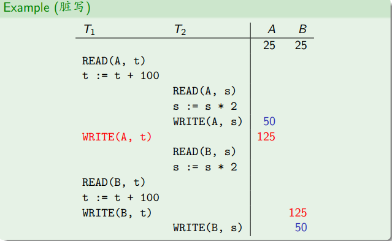

# 事务

**事务的ACID属性**

- **A 原子性**，事务是一个不可分割的工作单位，事务中的操作要么都发生，要么都不发生
- **C 一致性**，事务必须使数据库从一个一致性状态变换到另一个一致性状态
- **I 隔离性**，一个事务的执行不能被其他事务干扰，即一个事务内部的操作及使用的数据对并发的其他事务是隔离的，并发执行的各个事务之间不能互相干扰
- **D 持久性**，事务一旦提交，它对数据库中的数据的改变就是永久性的，接下来的其他操作和数据库故障不应该对其有任何影响

原子性,持久性,隔离性由DBMS保证,一致性由事务编写者保证

**SQL事务语句**
- 事务启动: `BEGIN`
- 事务提交 `COMMIT`
- 事务回滚 `ROLLBACK`

# 并发控制

为了简化问题考虑，在并发时，先不考虑数据的增删,只考虑数据的读写

## 调度

调度是一个或多个事务的重要操作的序列

串行调度:不同事务的操作没有交叉

非串行调度:不同事务的操作有交叉

**异常**

非串行调度可能会导致事务的异常行为,从而破坏数据库的一致性

- 脏写(dirty write)
- 脏读(dirty read)
- 不可重复读(unrepeatable read)
- 幻读(phantom read)

脏写:在事务T2提交前,T2写的A值被事务T1修改

下图的示例即为事务2在修改了A的值之后(25->50),T1的写操作覆盖了T2的写操作(->125)

脏读:在事务T1提交前,T1写的值被事务T2读取到

不可重复读

事务T2修改了事务T1读取的对象A的值,且T2提交
如果T1再次读取A的值,那么它将得到一个不同于前一次读到的A值,即使T1在此期间没有修改A的值

幻读

在一个事务中相同的查询得到了不同的元组数量，存在insert和delete操作时,才可能出现幻读

可以通过谓词锁来解决幻读问题(但是代价很高)，Mysql中使用next-key lock

对应4种异常,分别存在4种并发事务的隔离级别
- 读未提交(read uncommitted)
- 读提交(read committed)
- 可重复读(repeatable read)
- 可串行化(serializable)

在不同的隔离级别下，一个事务修改过的对象的值对其他并发事务的可见程度不同

读未提交：一个未提交事务所作的修改对其他事务可见(没有脏写问题,存在脏读,不可重复读,幻读问题)

读提交：只有已提交的事务所作的修改对其他事务可见(没有脏写,脏读问题,存在不可重复读,幻读问题)

可重复读:如果一个事务不修改对象X的值,则该事务在任何时刻读到的X值等于事务启动时读到的X值(没有脏写,脏读,不可重复读问题,存在幻读问题) (MySQL的默认隔离级别是可重复读)

可串行化:并发度最低(没有脏写,脏读,不可重复读,幻读问题)

## 可串行化

冲突可串行化

冲突：如果两个操作满足以下三个条件，则者两个操作冲突
1. 这两个操作属于不同的事务
2. 这两个操作涉及相同的对象
3. 这两个操作中至少有一个操作是写

写-写冲突:可能导致脏写

写-读冲突：可能导致脏读(写操作在前，读操作在后)

读-写冲突：可能导致不可重复读(读操作在前,写操作在后)

冲突等价：两个调度冲突等价，如果
- 这两个调度涉及相同事务的相同操作
- 每一对冲突的操作在两个调度中的顺序相同

如果一个调度冲突等价于一个串行调度，该该调度是冲突可串行化调度

如果通过将调度S中不同事务中的非冲突操作交换顺序可以将S转换为一个串行调度,则称S是冲突可串行化调度

## 并发控制协议

悲观并发控制
- 假定冲突很多，不允许任何冲突发生

乐观并发控制
- 假定冲突很少，允许冲突发生

### 方法1:基于锁的并发控制

锁的类型
- 共享锁(S-lock)
事务T_i只有获得对象A的共享锁,才能读A
- 互斥锁(X-lock)
事务T_i只有获得对象A的互斥锁,可以读写A

锁的相容性

| 已经加锁的类型⬇ | 共享锁 | 互斥锁 |
| --- | --- | --- |
| 共享锁 | Yes | No |
| 互斥锁 | No | No |

两阶段锁协议(Two-Phase Locking Protocol, 2PL)

每个事务的执行分为两个阶段

- 增长阶段:事务可以获取锁,解锁

- 萎缩阶段:事务只能解锁,不能获取锁

2PL的缺点
优点：2PL可以保证冲突可串行化
1. 存在级联中止的问题，当一个事务A写数据之后终止，他其他读写了该数据的事务均要终止
2. 2PL可能导致死锁

强两阶段锁(SS2PL)
- 增长阶段:事务可以获取锁,解锁
- 萎缩阶段：只有当事务结束时，释放它获的全部锁

SS2PL保证生成严格的冲突可串行化调度，不会产生级联终止的问题

**死锁**

方法1:死锁检测
1. 超时检测:如果在给定的时间内没有任何事务执行，则认为死锁发生
2. 等待图检测,等待图中有环则存在死锁
   选环中一个事务终止来解除死锁，但是选择牺牲品的时候需要考虑多种因素
   - 事务的年龄/启动时间
   - 事务的进度
   - 事务获得的锁的数量
   - 需要级联终止的事务的数量
  还需要考虑事务被牺牲的次数，防止事务被饿死

方法2:死锁预防
当事务启动时，DBMS为事务分配一个唯一且固定的优先级(priority)
- 开始的越早，优先级越高

当事务T_i请求事务T_j拥有的锁而无法获得时,DBMS根据T_i和T_j的优先级来决定如何处理T_i和T_j,可采用下面两条规则之一来预防死锁
- Wait-Die规则(尊老爱幼)
  事务T_i 请求T_j拥有的锁
    
    priority(T_i) > priority(T_j),则T_i等待
    
    priority(T_i) <= priority(T_j),则T_i终止(T_i重启之后,其优先级不变)

- Wound-Wait规则
  事务T_i 请求T_j拥有的锁
    
    priority(T_i) > priority(T_j),则T_j等待(T_j重启之后,其优先级不变)
    
    priority(T_i) <= priority(T_j),则T_i等待

**多粒度锁**

锁的粒度(属性,元组,表,数据库)

意向锁

- 意向共享锁(IS-Locks)
  准备对一个对象的某个(些)后裔加S锁
- 意向互斥锁(IX-Locks)
  准备对一个对象的某个(些)后裔加X锁
- 共享意向互斥锁(SIX-Locks)
  表示对该对象及其所有后裔加S锁,并且对该对象的某个(些)后裔加X锁

相容矩阵

任何事务都要服从以下加锁规则
1. 从最高级别的对象开始加锁，加锁过程自顶向下
2. 对一个对象加IS或者S之前,必须先获得其父亲的IS锁
3. 事务对一个对象加IX，SIX或者X锁之前，必须先获得其父亲的IX锁
4. 解锁过程自底向上

锁升级
如果一个事务已经请求了大量低级别对象上的锁，那么DBMS可以将这些锁升级为更高级别的锁

### 方法2:时间戳定序的并发控制

DBMS为每个事务T_i分配一个唯一的时间戳TS(T_i),时间戳单调递增

不同方法分配时间戳的时机不同
- 事务启动时分配，如Basic Timestamp Ordering 
- 事务的验证阶段开始时分配,如果乐观并发控制(Optimistic Concurrency Control,OCC)

根据时间戳来确定事务的可串行化调度

如果 TS(T_i) < TS(T_j),则DBMS必须保证事务的调度所等价的串行调度中,T_i在T_j之前执行

**Basic Timestamp Ordering(BTO)**

每个对象X关联着两个时间戳
- RTS(X): 成功读X的最晚的事务的时间戳
- WTS(X): 成功写X的最晚的事务的时间戳

对事务的每个读写操作进行时间戳检查
如果一个事务准备访问一个"来自未来"的对象，则该事务中止，并重启为一个新事务

事务T_i准备读对象X，如果TS(T_i) < WTS(X),则T_i中止并重启(分配一个新的时间戳)

否则，允许T_i读X,并且更新RTS(X),并且在事务的工作区中创建X的局部副本,以保证可重复度

事务T_i准备写对象X，如果TS(T_i) < RTS(X) 或者 TS(T_i) < WTS(X)则T_i中止并重启(分配一个新的时间戳)

否则，允许T_i写X,并且更新WTS(X),并且创建X的局部副本

Thomas Write Rule 针对写的情况

如果 TS(T_i) < RTS(X),则中止T_i并重启(分配一个新的时间戳)

如果TS(T_i) < WTS(X) 则
忽略这个写操作并允许T_i继续执行

否则，允许T_i写X,并且更新WTS(X)

Baisc TO缺点：
1. 可能形成不可恢复的调度
2. 长事务可能饿死

### 方法3:多版本并发控制(MVCC)

现在的DBMS中大多数都是采用MVCC

DBMS为数据库中每个(逻辑)对象维护多个(物理)版本
- 当事务写一个对象时,DBMS为该对象创建一个新的版本
- 当事务读一个对象时,它读的是该事务启动时已经存在的由已提交事务写入的最新版本

MVCC的特点
- 写操作不阻塞读
- 读操作不阻塞写

只有写-写操作阻塞

只读的事务直接在一致性快照上读，无需加锁

在MVCC中的读可以分为当前读和快照读

#### 当前读 
在MySQL

