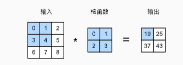
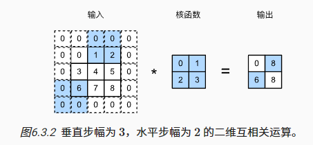
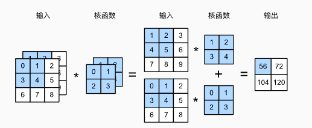
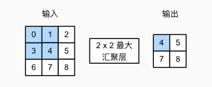

**本文的内容大部分来自于Dive into DeepLearning,有一部分是自己的理解**

详情请参考 [动手学深度学习](https://zh-v2.d2l.ai/)

# 从全连接层到卷积

卷积神经网络是机器学习利用自然图像中一些已知结构的创造性方法

图像的特点:
1.  spatial invariance 空间不变性,即图像中的某个物体在图像中的任何位置都是同一个物体，应该得到类似的特征
2.  locality 局部性，神经网络的前面几层应该只探索输入图像中的局部区域，而不过度在意图像中相隔较远区域的关系，这就是“局部性”原则。最终，可以聚合这些局部特征，以在整个图像级别进行预测。

# 互相关运算

卷积神经网络执行的操作是互相关运算,具体来说,使用一个二维数组代表图像(忽略通道),然后在使用一个小的二维数组代表卷积核



这个及一个计算的例子图像大小$3 \times 3$,卷积核大小$2 \times 2$,在左上角$2 \times 2$的位置重叠图像窗口和卷积核,按元素相乘最后相加,得到第一个计算结果，然后接下来，卷积窗口向右移动一格，重复上述操作，直到卷积窗口移动到图像的最右边，然后卷积窗口向下移动一格，重复上述操作，直到卷积窗口移动到图像的最下边，这样就完成了一次完整互相关运算

$$
0 \times 0 + 1 \times 1 + 3 \times 2 + 4 \times 3 = 19 \\
1 \times 0 + 2 \times 1 + 4 \times 2 + 5 \times 3 = 25 \\
3 \times 0 + 4 \times 1 + 6 \times 2 + 7 \times 3 = 37 \\
4 \times 0 + 5 \times 1 + 7 \times 2 + 8 \times 3 = 43 \\
$$

图像大小$n_h \times n_w$,卷积核大小$k_h \times k_w$
按照这种计算方法，最后得到的二维数组大小为$(n_h -k_h + 1) \times (n_w - k_w + 1)$

代码实现
```python
import torch
from torch import nn 

def corr2d(X,K):
    """
        计算二维互相关操作
        X: n_h x n_w
        K: k_h x k_w
    """
    h,w = K.size()
    Y = torch.zeros((X.shape[0]-h+1,X.shape[1]-w+1))
    for i in range(Y.shape[0]):
        for j in range(Y.shape[1]):
            Y[i,j] = (X[i:i+h,j:j+w] * K).sum()
    return Y

class Conv2D(nn.Module):
    def __init__(self, kernel_size:int):
        super().__init__()
        self.weight = nn.Parameter(torch.randn(kernel_size,kernel_size))
        self.bias = nn.Parameter(torch.zeros(1))

    def forward(self,x):
        return corr2d(x,self.weight) + self.bias
```


# 特征映射和感受野

卷积层的输出有时会被称为特征映射(feature maps)

在卷积神经网络中,对于某一层的任意输出元素$x$,其感受野(receptive field)是指在前向传播期间可能影响$x$计算的所有元素(可以来自于所有的前置层)

可以想象的到，当卷积层越堆越深的时候，每个元素的感受野在逐渐的扩大

# 填充和步幅

## 填充

填充(padding),步幅(stride)
假设输入形状为$n_h \times n_w$，卷积核形状为$k_h \times k_w$,那么输出形状为$(n_h - k_h+1) \times (n_w - k_w +1)$

在上面描述的过程中，我们常常丢失边缘元素，解决问题的方法是padding,在图像的边界填充元素(通常是0)

例如上面$3 \times 3$的图像的例子,我们可以将图像填充到$5 \times 5$,然后我们重新计算卷积，可以得到输出大小是$(5-2+1) \times (5-2+1) = 4 \times 4$

一般我们的padding操作,添加$p_h$行填充,（大约一半在顶部，一半在底部）和 $p_w$列填充（左侧大约一半，右侧一半）

因此在padding之后,输出的形状大小变成了

$$
    (n_h + p_h - k_h + 1) \times (n_w + p_w - k_w + 1)
$$

这意味着输出的高度和宽度将分别增加$p_h$和$p_w$。

当我们设置$p_h = k_h - 1,p_w = k_w+1$时，我们得到输出形状与输入形状相同，假设$k_h$是奇数，我们将在高度的两侧填充$p_h / 2$行。 如果$k_h$是偶数，则一种可能性是在输入顶部填充$\lceil  p_h/2 \rceil$行，在底部填充$\lfloor p_h/2 \rfloor$行。同理，我们填充宽度的两侧。

卷积神经网络中卷积核的高度和宽度通常都是奇数,例如,1,3,5,7等,使用奇数核的好处是,在填充的时候,可以在两侧填充相同的行数或者列数

使用奇数卷积核也提供了书写上的便利，当满足以下三个条件时
1. 卷积核大小时奇数
2. 所有边的填充行核列数相同
3. 输出核输入具有相同的高度核宽度

则可以得出输出`Y[i,j]`是通过以输入`X[i,j]`为中心，与卷积核进行互相关计算得到的。

```python
import torch
from torch import nn

def comp_conv2d_shape(conv2d,X):
    # (batch_size,channel,height,width)
    X = X.reshape((1,1)+X.shape)
    Y = conv2d(X)
    return Y.reshape(Y.shape[2:])

# padding=1,是上下左右均padding一行或一列,因此一共添加了2行或2列
conv2d = nn.Conv2d(in_channels=1,out_channels=1,kernel_size=3,padding=1)
X = torch.rand(8,8)
comp_conv2d_shape(conv2d,X).shape
# torch.Size([8,8])
```

当卷积核的高度核宽度不同时,我们可以填充不同的高度和宽度，使输入和输出具有相同的高度和宽度

```python
conv2d = nn.Conv2d(1,1,kernerl_size=(5,3),padding=(2,1))
comp_conv2d_shape(conv2d,X).shape
# h: p_h + k_h -1 = 8, k_h = 5 => p_h = 4
# w: p_w + k_w -1 = 8, k_w = 3 => p_w = 2
# => padding = (2,1)
# torch.Size([8, 8])
```

## 步幅

在之前的例子中，均是默认一个滑动一个元素，但是有时候为了高效计算或是缩减采样次数，卷积窗口可以跳过中间位置，每次滑动多个元素。

我们将每次滑动元素的数量称为步幅(stride)

当我们按照stride进行滑动时，有可能出现剩余的行数/列数无法覆盖整个卷积核，此时我们只能放弃这部分元素，无法进行计算。

下图为一个垂直stride是3,水平stride是2的二维互相关计算



通常,当垂直步幅为$s_h$，水平步幅为$s_w$时,输出的形状为
$$
     \lfloor (n_h + p_h - k_h) / s_h + 1 \rfloor \times \lfloor (n_w + p_w - k_w) / s_w + 1 \rfloor
$$

以w为例,总的长度为$n_w + p_w$,除以$s_w$,取上整可以得到所有可以定位卷积窗口的左边界数量,但是最后一个位置有可能因为长度不够$k_w$而不是一个合法位置,因此使用$\lceil(n_w + p_w - k_w) / s_w \rceil$得到的一定是合法位置(提供空出来了k_w的距离),设$(n_w + p_w - k_w) / s_w = a$,

如果a是小数,说明在$n_w + p_w - k_w$这片区域内的最后一个合法位置的窗口占用了一部分最后剩下来的$k_w$这片区域，而下一个窗口的位置左边界是 $\lfloor a \rfloor*s_w + s_w = \lceil a \rceil * s_w > n_w + p_w -k_w$,但是这个窗口位置因为长度不够$k_w$是不合法的,所以最后的窗口个数就是$\lceil a \rceil$

则$\lceil a \rceil = \lfloor a \rfloor + 1 = \lfloor a + 1 \rfloor$

如果a是整数,那么在$n_w+p+w-k_w$这段区域内，可以有a个窗口，下一个窗口的左边界是$n_w+p_w-k_w$,还可以完整的构成一个窗口

综上，携带stride的卷积输出大小的计算公式为
$$
    \lfloor (n_h + p_h - k_h) / s_h + 1 \rfloor \times \lfloor (n_w + p_w - k_w) / s_w + 1 \rfloor
$$

## 多输入多输出通道

### 多输入通道

当输入包含多个通道时,需要构造一个与输入数据具有相同输入通道数的卷积核,以便与输入数据进行互相关运算,假设输入通道数是$c_i$,则卷积核的通道数也是$c_i$

当$c_i > 1$时,卷积核的每个通道里面都包含一个$k_h \times k_w$的二维张量,将这些张量叠在一起就是形状为$c_i \times k_h \times k_w$的卷积核

对于每一个通道,都有一个输入$n_h \times n_w$,一个卷积核$k_h \times k_w$,因此每一个通道上我们都可以执行互相关操作,最后将所有通道的结果相加,得到最终的输出(因为输出只有一个通道)



```python
import torch
from d2l import torch as d2l

def corr2d_multi_in(X,K):
    """
        X: c_i x n_h x n_w
        K: c_i x k_h x k_w
        corr2d完整单通道的互相关操作
    """
    return sum(d2l.corr2d(x,k) for x,k in zip(X,K))
```

### 多输出通道
直观地说，我们可以将每个通道看作对不同特征的响应。而现实可能更为复杂一些，因为每个通道不是独立学习的，而是为了共同使用而优化的。

用$c_i$和$c_o$分别表示输入和输出通道的数量,$k_h \times k_w$为卷积核的大小,为了获得多个通道的输出,针对每一个输出通道,都创建一个形状$c_i \times k_h \times k_w$的卷积核张量,这样所有的卷积核大小为$c_o \times c_i \times k_h \times k_w$

```python
def corr2d_multi_in_out(X,K):
    """
        X: c_i x n_h x n_w
        K: c_o x c_i x k_h x k_w
        corr2d完整多通道的互相关操作
    """
    return torch.stack([corr2d_multi_in(X,k) for k in K],0)
```

### 1x1卷积层

1x1卷积:
- padding = 0 
- stride = 1
- output size = n_h x n_w

$1 \times 1$卷积没有有效提取相邻像素之间的相关特征,但是$1 \times 1$卷积也是有用的,通过上面的说明我们可以看出,1x1卷积的计算发生在输入通道上,如果只考虑1个输出通道,那么实际上输出就是该像素位置上不同通道元素之间的线性组合。我们可以将1x1卷积看作在每个像素位置上应用全连接层,以c_i个输入转换得到c_o个输出,跨像素的卷积核参数是一样的,bias也是一样的,因此1x1卷积层的参数数量为$c_i \times c_o$,bias的个数也为$c_i \times c_o$

bias是跨像素和输入通道共享的,但是不是跨输出通道共享的

举例

输出通道0,输入通道R,G,B三个
- 像素位置(0,0):R通道1x1卷积计算,得到 $w_1 * R[0,0] $
- 像素位置(0,0):G通道1x1卷积计算,得到 $w_2 * G[0,0] $
- 像素位置(0,0):B通道1x1卷积计算,得到 $w_3 * B[0,0] $

最后加入偏置得到
输出像素位置(0.0)的值为 
$$

\begin{align}
& w_1 * R[0,0]  + w_2 * G[0,0]  + w_3 * B[0,0] + b\\
& =
\begin{bmatrix}
w_1 & w_2 & w_3 \\
\end{bmatrix}

\begin{bmatrix}
R(0,0)  \\
G(0,0)  \\
B(0,0)  \\
\end{bmatrix}
+ b \\
\end{align}
 
$$

然后依次类推,W矩阵最终可以扩展到$c_o \times c_i$, X矩阵最终可以扩展到$c_i \times (h*w)$,
偏置b最终可以扩展到$c_o \times 1$个。(针对不同的输出通道的)

将1x1卷积变为全连接层,就是以下的线性变换
$$
    H = XW^T + b
$$

$$
\begin{align}
H = (n,h*w,c_o) \\
X = (n,h*w,c_i) \\ 
W = (c_o,c_i) \\ 
W^T = (c_i,c_o) \\ 
b = (c_o) \\
\end{align}
$$

验证1x1卷积和全连接层的等价性

```python
import torch
from torch import nn

weight = torch.arange(12, dtype=torch.float32).reshape((4, 3))


def init_linear(m):
    if type(m) == nn.Linear:
        m.weight.data = weight
        m.bias.data = torch.ones(4) * 3


def init_conv2d(m):
    if type(m) == nn.Conv2d:
        m.weight.data = weight.reshape(4,3,1,1)
        m.bias.data = torch.ones(4) * 3


X = torch.arange(12, dtype=torch.float32).reshape((1, 3, 2, 2))

conv2d = nn.Conv2d(3, 4, kernel_size=1, bias=True)
linear = nn.Linear(3, 4, bias=True)
linear.apply(init_linear)
conv2d.apply(init_conv2d)


cond2d_Y = conv2d(X)  # (1,4,2,2)

linear_X = X.reshape(1, 3, 2 * 2)
linear_X = linear_X.transpose(1, 2)

linear_Y = linear(linear_X)  # (1,4,4)
linear_Y = linear_Y.transpose(1, 2)
linear_Y = linear_Y.reshape(1, 4, 2, 2)

print(cond2d_Y)
print(linear_Y)
print(cond2d_Y == linear_Y)
# tensor([[[[True, True],
#           [True, True]],

#          [[True, True],
#           [True, True]],

#          [[True, True],
#           [True, True]],

#          [[True, True],
#           [True, True]]]])
# 经过实际验证,torch内的conv2d的bias参数是跨像素+跨输入通道共享的
```

## conv1d,conv2d,conv3d之间的区别

主要区别如下:

- conv1d主要用在时序数据上，卷积核只在左右方向上移动，因此他的互相关操作是1d的
- conv2d主要用在图像数据上，卷积核在左右和上下方向移动，因此他的互相关操作是2d的
- conv3d可以用来3d数据或者视频数据上，卷积核在(x,y,z)三个方向上移动，因此他的互相关操作是3d的

## 总结 Conv2d

- 输入 $X => c_i \times n_h \times n_w$
- 卷积核 $W => c_o \times c_i \times k_h \times k_w$
- bias $B => c_o \times 1$
- 输出 $Y => c_o \times m_h \times m_w$

## 池化层

pooling的目的:
1. 降低卷积层对位置的敏感性
2. 奖励对空间降采样表示的敏感性
Pooling,常见的有MaxPooling和AvgPooling

MaxPooling计算最大值,AvgPooling计算平均值

与卷积类似,pooling层的运算也在一个窗口内进行。并且根据步幅大小在输入的区域上移动。



$$
    max(0,1,3,4) = 4 \\
    max(1,2,4,5) = 5 \\
    max(3,4,6,7) = 7 \\
    max(4,5,7,8) = 8
$$

实现上和互相关操作是类似的，不过这个实际上是可以并行的，采用for训练一个一个算很慢的
```python
import torch

def pool2d(X, pool_size, model ="max"):
    p_h,p_w = pool_size
    Y = torch.zeros((X.shape[0]-p_h+1,X.shape[1]-p_w+1))
    for i in range(Y.shape[0]):
        for j in range(Y.shape[1]):
            if model == "max":
                Y[i,j] = X[i:i+p_h,j:j+p_w].max()
            elif model == "avg":
                Y[i,j] = X[i:i+p_h,j:j+p_w].mean()
    return Y
X = torch.tensor([
        [0.0, 1.0, 2.0], 
        [3.0, 4.0, 5.0], 
        [6.0, 7.0, 8.0]
    ])
pool2d(X, (2, 2))
# tensor([[4., 5.],
#        [7., 8.]])
```
**填充和步幅**

```python
import torch
from torch import nn
X = torch.arange(16, dtype=torch.float32).reshape((1, 1, 4, 4))
print(X)
pool2d = nn.MaxPool2d(3)
pool2d(X)
# tensor([[[[ 0.,  1.,  2.,  3.],
#           [ 4.,  5.,  6.,  7.],
#           [ 8.,  9., 10., 11.],
#           [12., 13., 14., 15.]]]])
# tensor([[[[10.]]]])
```
在默认情况下,深度学习框架的stride和pooling的窗口大小是一致，因此，如果我们使用形状为(3, 3)的汇聚窗口，那么默认情况下，我们得到的步幅形状为(3, 3)。

我们也是自己手动设定
```python
import torch
from torch import nn
X = torch.arange(16, dtype=torch.float32).reshape((1, 1, 4, 4))
print(X)
pool2d = nn.MaxPool2d(3, padding=1, stride=2)
pool2d(X)
# tensor([[[[ 0.,  1.,  2.,  3.],
#           [ 4.,  5.,  6.,  7.],
#           [ 8.,  9., 10., 11.],
#           [12., 13., 14., 15.]]]])
# tensor([[[[ 5.,  7.],
#           [13., 15.]]]])
```

**多通道**

在处理多通道的输入数据时,pooling针对每一个通道单独计算,而不同像卷积一样把每个通道上的结果求和加起来。因此在经过pooling操作以后，输出通道的数量和输入通道的数量时一致的

```python
import torch
from torch import nn
X = torch.arange(16, dtype=torch.float32).reshape((1, 1, 4, 4))
X = torch.cat((X, X + 1), 1)
pool2d = nn.MaxPool2d(3, padding=1, stride=2)
pool2d(X)
# tensor([[[[ 5.,  7.],
#           [13., 15.]],

#          [[ 6.,  8.],
#           [14., 16.]]]])
```

## 线性层

H = XW + b

$(out \times d) =( out \times in) (in \times d) + (out \times 1)$
- 输入 $X => in \times d$
- 权重 $W => out \times in$
- 输出 $H => out \times d$
- 偏置b $b => out \times 1$