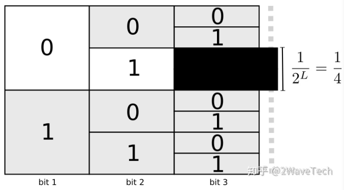
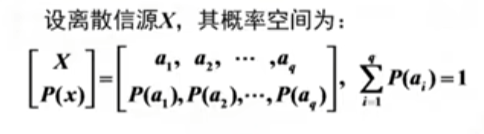
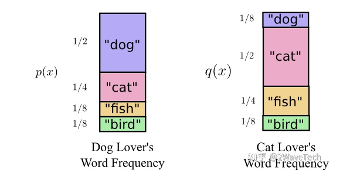

Cross-Entropy-Loss

[损失函数：交叉熵详解](https://zhuanlan.zhihu.com/p/115277553)

上面的文章给出了一种根据编码长度来定义熵和交叉熵的定义

# 最佳编码及编码成本

话说某君鲍勃非常喜欢动物，他也经常和外地的朋友谈论动物。 假设他只说四个字：“狗”，“猫”，“鱼”和“鸟”,为了降低通信费用，因此我们需要想出一种编码方式来表示他们

直接的，我们可以选择等长编码取做

| 取值 | 编码 |
| ---- | ---- |
| dog  | 00   |
| cat  | 01   |
| fish | 10   |
| bird | 11   |

只有4个值，因此我们可以长度为2的二进制编码就可以完全表示，每一个代码称为一个码字(codeword),它和动物名一一对应。**显然，在这种编码方式下，平均每个码字长为2bit**

但是如果鲍勃谈论每个词的概率不同，“狗”谈论的多，其次是“猫”，再次是“鱼”和“鸟”，概率如下
| 取值 | p(x) |
| ---- | ---- |
| dog  | 1/2   |
| cat  | 1/4  |
| fish | 1/8   |
| bird | 1/8   |

那么我们是否可以利用这个信息继续压缩平均每个码字的bit数呢？一个很显然的想法是，我们可以使用更短的编码来表示出现概率更大的动物名，因而可以减低平均编码长度。

比如下面这种编码方式
| 取值 | p(x) | 码字 |
| ---- | ---- | ---- |
| dog  | 1/2   | 0|
| cat  | 1/4  |10|
| fish | 1/8   |110|
| bird | 1/8   |111|

平均码字长度=`1/2 * 1 + 1/4 * 2 + 1/8 * 3 + 1/8 * 3 = 1.75 bit`，这个方案明显是比等长编码要好的。

注意的是，我们不能随机进行不等长编码，我们需要的是前缀编码，和哈夫曼编码一样，如果我们使用了0来作为码字，那么我么不能使用任何以0开头的其他码字，比如01，011这些，因此我们无法得知这些码字怎么划分。

这件事描述的就是前缀属性，即：任何码字都不应该是另一个码字的前缀，这成为前缀属性，满足前缀属性的编码是前缀编码

# 熵

根据第一小节的表述，在不等长编码中，每当我们选择一个码字时，就会损失相应的编码空间。，比如下面的例子

我们选择了01作为码字，那么其他以01开头的码字就都无法使用了，损失的码字空间占总码字空间的`1/4`,从这个例子扩展，假设我们选择了一个码字长度为`L`的码字，那么我们会损失$1 / 2^L$的码字空间。

假设我们愿意为长度为$L$的码字付出的代价是$cost$,那么我们付出的代价就是$cost = \frac{1}{2^L}$,换算得到

$$
L = \log_2(\frac{1}{cost}) = - \log_2(cost) \tag{1}
$$

接下的我们就是我们如何为出现概率不同的码字分配代价不同的编码长度，从而得到最短平均编码长度呢？有一个特别自然的方法可以做到，根据出现概率来分配我们的预算(这里我们设定总预算为1，可以统一起来)，如果一个事件出现概率为0.5,那么我们因该使用0.5的预算，如果一个事件出现的概率为0.01，那么我们应该使用0.01的预算。

因此为一个码字x分配的成为预算$cost$和该代码出现的概率$p(x)$成正比，我们就让$cost = p(x)$。这样我们根据出现概率就可以得到最短平均编码长度了。

带入公式$(1)$,我们可以得到这种做法的平均长度
$$
L(x) = \log_2 (\frac{1}{p(x)}) = - \log_2p(x)
$$
可以证明，这种编码方式不仅是自然而且是最佳的（证明跳过，悲）

这样，当每个码字出现的概率是$p(x)$,那么最短的平均编码长度,期望值
$$
\begin{aligned}
H(p) & = \sum_x p(x) \times L(x) \\
 	& = \sum_x p(x) \times \log_2 (\frac{1}{p(x)}) \\
 	& = - \sum p(x) \times log_2 p(x)
\end{aligned}
$$
$H(p)$就是熵。

代码$H(p)$，放到第一小节我们给定的第二个编码方案，可以得到第二个编码方式的熵即为1.75 bit.

# 一些信息论的内容

看了[国防科技大学-信息论与编码基础（国家级精品课）](https://www.bilibili.com/video/BV1pJ411U7G8?p)

统计信息(香农的定义)定义和概念，在通信模型中的信息

**消息，信息和信号的区别**

**消息**：用文字，符号，数据，语言，音符，图片，图像等**能够被人们感觉器官所感知**的形式，把客观物质运动和主管思维活动的状态表达出来就称为消息，消息是信息的有形载体

**信息**:信息是事物运动状态或存在方式的不确定性描述。

**信号**：信号是消息的物理体现。

比如老师讲话，老师传达**课堂内容(消息)**时，通过**声音信号**来物理传输，消除了学生对课堂内容的不可知性，不确定性，获得了**信息**

从不确定到确定，不确定性，我们就获得了信息

**自信息**
$$
I(a_i) = \log_r \frac{1}{P(a_i)}
$$
单位 r=2,bit r=e nat,r=10 hart

物理含义

(1)当$a_i$发生以前，表示事件$a_i$出现的不确定性

(2)当$a_i$发生以后，表示$a_i$所提供的信息量

信源：随机出现的一个消息的集合。所有消息的出现概率之和为1。每一个消息X出现的概率为p(x)。因此就可以使用一种概率分布来表示信源，比如正态分布。

离散信源，样本(消息)数量可数，比如抛硬币。使用概率分布函数$\sum_xP(x) = 1$

连续信源，样本数量没法一个数出来，比如说声音信源。使用概率密度函数，$\int_R p(x)dx = 1$

否可以使用概率空间表示，先研究离散信源，连续信源可以通过奈奎斯特采样定理转换为离散信源。而熵就可以用来表示信源包含的信息量的。

下图就是简单离散信源，取值是1维的，我们也可以做扩展，让取值变成多维的，从而变成复杂信源，从简单信源到复杂信源，我们可以使用联合概率分布，如果他们之间各自独立，则联合概率分布等于各维概率分布的乘积，不独立的话就要用条件概率来算。

因此信源是一个随机变量，我们使用该随机变量的熵=期望来表示信源输出的信息量，即熵
$$
H(X) = E(I(a_i)) = - \sum_{i=1}^q p(a_i) \log P(a_i)
$$

# 交叉熵

有某女爱丽丝不是爱狗而是个爱猫的人。她和鲍勃说相同的词，只是词的频率不同。 鲍勃一直在谈论狗，而爱丽丝一直在谈论猫。其实就是两个不同的信源，也就是两个不同的概率分布

最初，爱丽丝(q)使用鲍勃的码字发送消息，不幸的是，使用鲍勃的码字(p)发消息需要的长度很长,平均长度就是爱丽丝分布q和鲍勃分布p的交叉熵。
$$
H_p(q) = \sum_x q(x) \log(\frac{1}{p(x)}) = - \sum_x q(x) \log p(x)
$$
计算得到结果
$$
H_p(q) = 1/8 * \log(1/2) + 1/2 * log(1/4) + 1/4 * log(1/8) + 1/8 * log(1/8) = 2.25
$$
注意，交叉熵不是对称的，根据定义来说我们就可以得知。

交叉熵为我们提供了一种表达两中概率分布的差异的方式。p和q的分布越不相同，p相对于q的交叉熵将越大于p的熵，也就是下文的KL散度。

# KL散度

真正有趣的是熵和交叉熵之间的差。 这个差可以告诉我们，由于我们使用了针对另一个分布而优化的代码使得我们的消息变长了多少。 如果两个分布相同，则该差异将为零。 差增加，则消息的长度也增加。

我们称这种差异为Kullback-Leibler散度，或简称为**KL散度**。

p相对于q（即使用针对p优化的码字传输q）的KL散度可定义为
$$
D_q(p) = H_q(p) - H(p)
$$
KL散度的真正妙处在于它就像两个分布之间的距离，即KL散度可以衡量它们有多不同！

# 用交叉熵作为损失函数

交叉熵常作为分类器的损失函数，不过，其它类型的模型也可能用它做损失函数，比如生成式模型。

设定我们有数据集$D = (x_1,y_1),(x_2,y_2),...,(x_N,y_N)$,其中$x = \{x_i\}_{i=1}^{N} \in X$是特征值，结合信源的概念，数据集D就是我们针对一个信源所做的采样，一共有N份。$y= \{y_i\} \in Y$是观察值，也就是我们期待模型的输出。最简单的情况，我们用二分类举例，

$y_i \in \{-1,1\}$或者$y_i \in \{0,1\}$或者$y_i \in \{negitive,positive\}$

实际上，我们可以使用交叉熵作为分类器的损失函数的原因在于我们在数据集上使用了**最大似然法则(MLE)**，从而得到了于交叉熵一致的目标函数(损失函数)。我们观察原始数据是没有概率的，即使$y \in \{0,1\}$,它的取值0或者1只是客观的观察值而已，其概率意义是我们后来人为地加给它的。

## 似然函数

**假设X是连续随机变量**，X的[概率密度函数(PDF)](https://en.wikipedia.org/wiki/Probability_density_function)为$f(x,\theta)$,其中$\theta$是不确定的参数。x是输入。

对于连续随机变量，当$f(x,\theta)$在x附近处的值越大时，总体X在x附近的取值的概率就越大。**连续随机变量使用PDF的原因是连续随机变量在某一个点出现的概率为0。**

那么针对一组采样样本，即一个数据集（或者一个batch），我们可以得到给定$\theta$的情况下，这写数据点同时出现的概率。(因为各个数据点之间相互独立，因此可以用连乘表示)
$$
L(\theta) = f(x_1,\theta) * f(x_2,\theta) ...f(x_n,\theta) = \prod_{i=1}^N f(x_i,\theta)
$$
$L(\theta)$即为似然函数，在统计学中，通过取ln然后求解倒数为0的点确定$\theta$，从得到最大的似然估计，使得采样的样本出现的概率最大。

**假设X是离散随机变量**，具有[概率质量函数(PMF)](https://en.wikipedia.org/wiki/Probability_mass_function)$p(x_i,\theta)$,即X的某个具体取值$x_i$的概率为$P(X=x_i) =p(x_i,\theta)$

那么我们想要使用采样得到的数据寻找一组优化的$\theta$,根据似然函数的定义，我们可以得到
$$
L(\theta) = \prod_{i=1}^{N}p(x_i,\theta)
$$

## 二元分类器的损失函数

对于二元函数来说，观察值y的取值是二选一，无论实际值是什么我们都使用$\{0,1\}$代替，y是符合伯努利分布的，而伯努利分布只有一个参数，即$P_{\theta}(y=1) = \theta$,并且$P_{\theta}(y=0) = 1- \theta$.

合并上面两个式子，可以得到
$$
p_\theta(y) = \theta^y (1-\theta)^{(1-y)}
$$
带入离散随机变量的似然函数，并求解对数值，我们可以得到
$$
\begin{aligned}
l(\theta) & = - \log L(\theta) \\
& = - \log \prod_{i=1}^{N}p(y_i,\theta) \\
& = - \log \prod_{i=1}^{N} \theta^{y_i} (1-\theta)^{(1-y_i)} \\
& = - \sum_{i=1}^N \log(\theta^{y_i} (1-\theta)^{(1-y_i)}) \\
& = - \sum_{i=1}^N (\log \theta^{y_i} + \log (1-\theta)^{(1-y_i)}) \\
& = - \sum_{i=1}^N [y_i  \log \theta + (1 -y_i) \log (1- \theta) ]
\end{aligned}
$$
似然函数$l(\theta)$就是我们的优化目标，加上负号就是损失函数，观察上式，结合交叉熵的公式，损失函数就是$y$与$\theta$的交叉熵

其中$y$是真实的标签分布，而$\theta$就是我们想要求解的伯努利分布。

这个公式只有当观察值$y \in \{0,1\}$的时候才可以得到。

假设存在两个数据点，我们采用one-hot编码

y1 = [1,0] 正例    y2 = [0,1] 负例。而给定一个数据点的输入x，被训练的模型会帮助我们得到估计的伯努利分布$[\theta,1-\theta]$,比如模型得到的估计分布为$[0.7,0.3]$,我们分别计算这个估计值和两个数据之间的差距
$$
- l(y_1,\theta) = -(1*\log 0.7 + 0 * log(1-0.7)) = 0.36 \\
-l(y_2,\theta) = -(0* \log 0.7 + 1 * \log (1-0.7)) = 1.20
$$
显然这个输出结果更偏好正例。损失更小

这里需要注意的是模型$f(x)$因为做二分类，因此输出的是$P(y= 1) $的概率，即$\theta$

无论输入的特征x是一维还是多维，输出都是不变的。

## 多元分类器

如果我们观察到的数据有$K$类，这时，我们假设

$y \in \{ 1,2,...,K\}$,即相当于给每一类一个$1 - K$的编号，这时，我们观察到y的分布是[多项分布](https://en.wikipedia.org/wiki/Multinomial_distribution)，多项分布是二项分布的一个扩展。

多项分布是每次实验有多余2个的结果，然后进行n次得到的分布

假设进行了n次实验，1出现了x1次，2出现了x2次，...k出现了x_k次.

那么多项分布的PMF就是
$$
\begin{aligned}
P(X_1 = x_1,X_2=x_2,..,X_K =x_K) = \frac{n!}{x_1!x_2!...x_K!}p_1^{x_1}p_2^{x_2}...p_k^{x_K}
\end{aligned}
$$
其中$p_1,p_2,...,p_K$是每一类对应的分布参数

那么只进行一次实验，出现结果i的概率就是

$P(X_i = 1) = p_i$

为了统一形式，我们先定义Indicator function I

$I(True)= 1,I(False) = 0$.

那么多项分布只进行一次实验,得到结果$y_i$的PMF就可以统一表示
$$
P(y_i) = p_{i,1}^{I(y_i=1)}p_{i,2}^{I(y_i=2)}...p_{i,K}^{I(y_i=k)} = \prod_{k=1}^K p_{i,k}^{I(y_i = k)}
$$
继续使用MLE，得到似然函数,这里只用一次实验的PMF的原因是因此各个数据点之间是独立的，这也是MLE的一个假设

我们使用$\theta_i = p_{i,1},p_{i,2},...,p_{i,K}$来代表模型为我们估计多项分布参数，来把公式简化（注意这里实际是模型的输出，而不是模型的参数）
$$
\begin{aligned}
l( \theta ) & = \log \prod_{i=1}^N P(y_i, \theta _i) \\
& = \log \prod_{i=1}^N \prod_{k=1}^K p_{i,k}^{I(y_i = k)} \\
& = \sum_{i=1}^N \log [ \prod_{k=1}^K p_{i,k}^{I(y_i = k)}] \\
& = \sum_{i=1}^{N} (\sum_{k=1}^{K}I(y_i =k) \log p_{i,k})
\end{aligned}
$$
其中$I(y_i = k)$ 在K中只有一项等于1，其他都等于0。

我们将$I(y_i=k)$放到一个向量里，
$$
[I(y_i=1),I(y_i=2),...,I(y_i=k)] = [0,0,..,1,.,0]
$$
如果我们这里把$I(y_i = k)$记作$y_{i,k}$，那么似然函数就  是
$$
\begin{aligned}
l(\theta) 
& = \sum_{i=1}^{N} \sum_{k=1}^{K} y_{i,k} \log p_{i,k} \\
& = \sum_{i=1}^N \log (\prod_{i=k}^K p_{i,k} ^{y_{i,k}} )\\
\end{aligned}
$$
上式变换只是为了和交叉熵做对比。

在前面加上负号之后，就是损失函数了，它与交叉熵的形式相同。

$H_p(q) = -\sum_x q(x) \log p(x)$

交叉熵的计算的时候，里面的求和号去其实只有一个地方有值，其他均是0，因此我们的真实标签只能从K中选1。

# 后续

在得到损失函数之后，模型通过梯度下降法来带代替对似然函数求导的过程，从而寻找模型的优化参数。

这里一交叉熵举例说明
$$
f(x_i,\theta) 是模型，x_i是输入，\theta是模型参数 \\
f(x_i,\theta) = [p_{i,1},p_{i,2},...p_{i,K}]^T 这就是一个多分类模型 \\
\begin{aligned}
loss 
& = - \sum_{i=1}^{N} \sum_{k=1}^{K} y_{i,k} \log p_{i,k} \\
& = - \sum_{i=1}^N  Y_i^T * \log f(x_i,\theta)
\end {aligned} \\
其中 \\
Y_i = [I(y_i=1),I(y_i=2),...,I(y_i=k)]^T =[0,0..1.,0,0]^T \\
f(x_i,\theta) = [p_{i,1},p_{i,2},...p_{i,K}]^T
$$
因此针对损失做梯度下降，就可以优化模型的参数。

