[参考视频](https://www.bilibili.com/video/BV1iT4y1d7zP)

[对应的博客内容](https://distill.pub/2021/gnn-intro/)

# 什么是图

一张图代表了一个集合实体(node)之间的关系(edge)

由以下三个要素组成

- 点 ：**(V)**  Vertex (or node) 属性
- 边 ：**(E)**  Edge (or link) 属性
- 全局信息：**(U)**  global (or master node) 属性，例如点的数量，最长路等等全局信息

表示图的三个要素

- 一个顶点可以使用一个向量来表示
- 一条边也可以使用一个向量来表示
- 全局信息可以都放到一个向量中表示

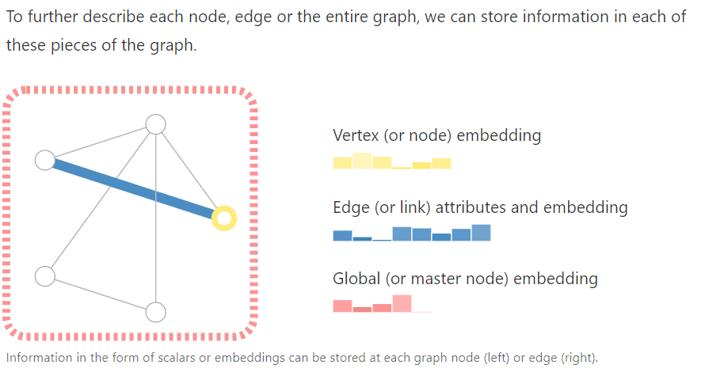

图分为**有向图**和**无向图**，有向图边有向，是单向联通的。

# 将数据表示成图

## Image as graph

假设有一张图片，大小为`[244，244，3]`的三通道高宽均为244的图片。我可以将其表示成一个三维的`tensor`输入进神经网络。也可以将它表示成一个图。在这张图中，每一个`pixel`都是一个顶点，每一个`pixel`与和它相连的所有`pixel`均有一条无向边。然后就可以形成图对应的邻接矩阵。下图是一个例子。这里选择的8个方向的邻近像素均连边。如果是多通道可以360度连边

因为是无向图，所以邻接矩阵对称。

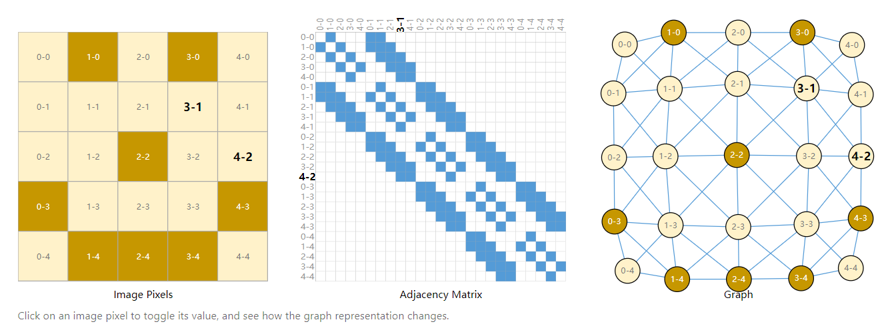

我们认为肯定还是其他的建图方式的

## Text as graph

文本是一个序列，我们可以通过分词，然后按照序列顺序依次连接有向边，从而获取到该文本的序列表示

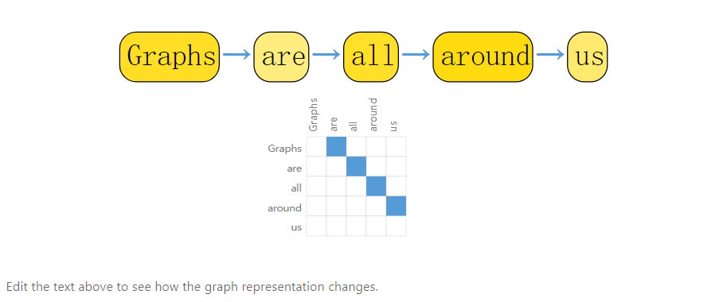

但是按照这样表示的图片和文本得到的图结构都是类似的，图像的邻接矩阵都是带状结构，文本的邻接矩阵都是对角线。对比与不使用图的表示而言，这种表示有些多余。

## 天然适合图结构的数据

#### 分子结构

各个原子之间，有边就可以连，非常的直接

例子，香料分子结构图

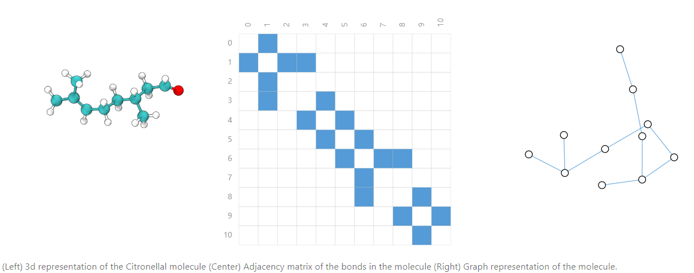

#### 社交网络

人作为顶点，两人之间有关系就可以连边，很直接

例子，奥赛德剧中人物关系图

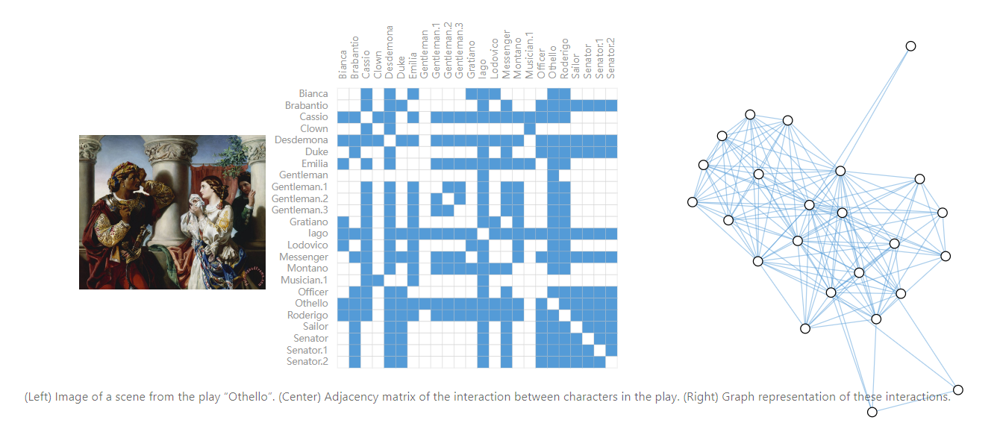

#### 引用网络

各个论文作为顶点，如果该论文引用了其他某篇论文，则可以连一条指向引用论文的有向边，也可以按照很直接的思想形成图。

作者给出了真实世界中一些图的大小规模数据

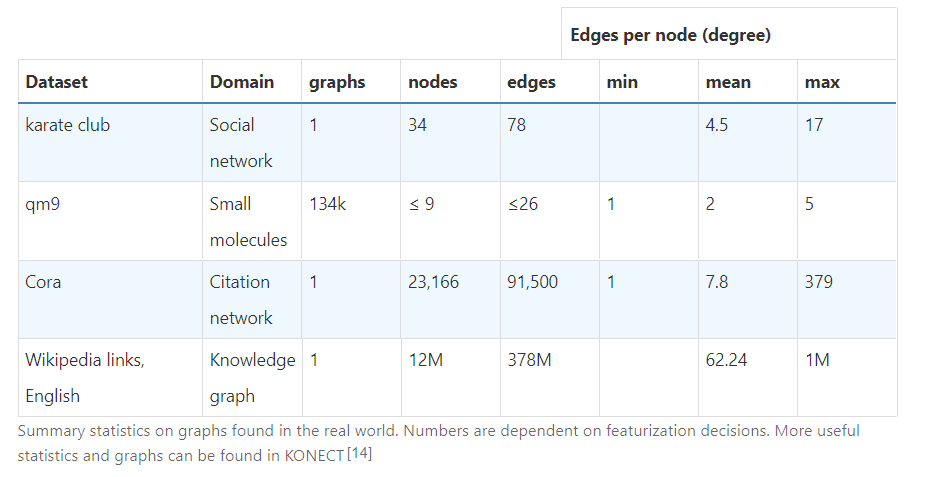

karate club 空手道俱乐部里面的社交关系

qm9 分子结构图

Cora 论文引用网络

Wikipedia links,English 英文位置百科不同条目之间的引用关系，可以看到这张图超级大。

# 图上求解的问题

图上求解的问题分为三大类，分别是`graph-level`,`edge-level`,`node-level`

## graph-level task

图层面的任务是把给定图做一个分类，或者说预测一些该图具有的属性。

例如下面的例子是预测给定的图是否存在两个环，输入是图，输出是图的label

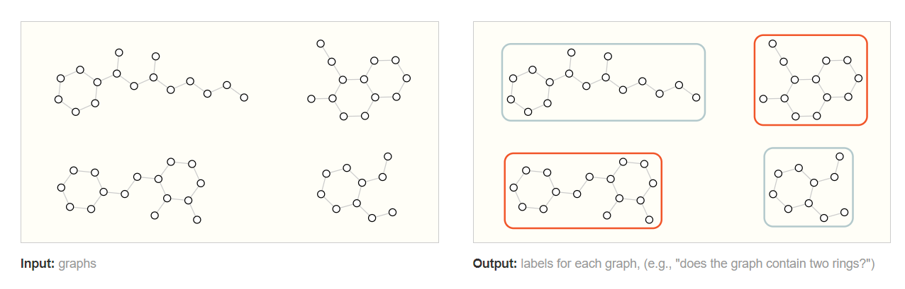

## node-level task

点层面的任务则关心图上点的类别，或者说是点的属性。

下图是空手道俱乐部原来的社交关系网络，两个老师，分别带了一些学生。然后再某一天两个老师关系决裂，你需要预测其他的学员到底是会站那个老师的队。这就是是一个点层面任务的简单例子。

## edge-level task

这张图片的例子是，我先通过语义分割，把当前图片中的这种要素均划分出来作为点，但是点与点之间的关系我们无从得知，我们的任务是预测点与点之间的关系，或者是预测哪些点之间有边。

如果我们不知道哪些点之间右边，我们可以先将其假定为全连接图，然后通过裁剪从而得到正确的稀疏图。

例如 穿白衣服的人正在`fighting`黑衣服的人，裁判`wataching`着场上的两名选手，这样的关系。

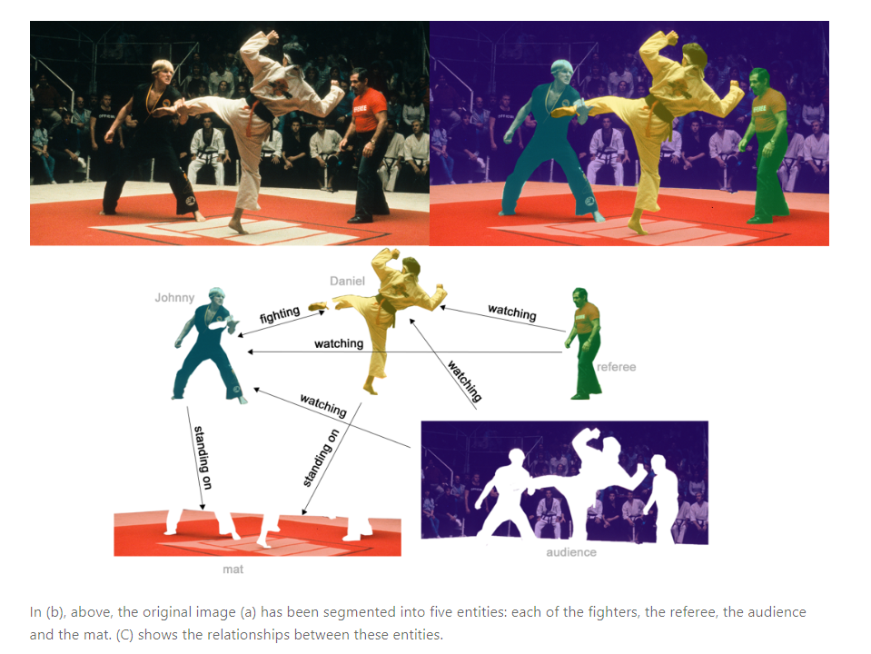

# 表示图兼容神经网络

图中包含4种我们需要使用的信息

- node，点
- edge，边
- global-context，全局上下文
- 连接性

前三种表示都是直接了当的，例如，所有的nodes可以形成node的向量表示矩阵$N$,$node_i$的表示就是$N$中索引为$i$的向量。

并且边和全局上下文信息都可以采用类似的方式进行表示。

连接性的表示不太容易，直接的想法是使用邻接矩阵，但是邻接矩阵带来的问题一是矩阵非常稀疏，难以存储和计算。二是对于同一张图，它存在多种邻接矩阵表示，例如交换一下某两个点的位置，图相同，但是邻接矩阵就会不同，无法保证不同的图在经过神经网络之后会得到相同的结果。

在图神经网络中，采用邻接表的方式表示图，下图是一个示例，示例没有采用类似多个链表的方式表示，而是用一个数组直接存了谁和谁相连，邻接表第`i`项表示边`i`是将点`a`和点`b`连接了起来。这里的Nodes，Edges和Global均是用标量表示的，但是实际上完全可以替换成向量，邻接表也不用变。

采用邻接表表示还可以保证顺序无关，边的顺序可以任意打乱，对应邻接表的顺序也会随之变化。点的顺序也可以任意打乱，对应邻接表的顺序也会随之变化。

注:设图`G`有`n`个点，`m`条边，当`m < n^2`时，判定`G`是稀疏图，采用邻接表存储，当`m >= n^2`时，`G`是稠密图，采用邻接矩阵存储。

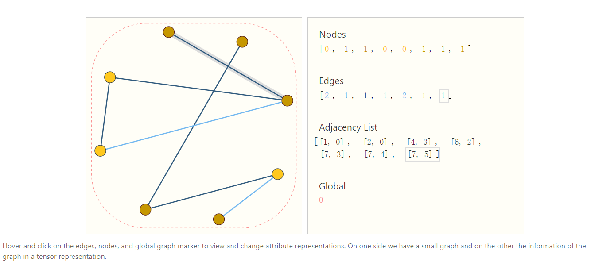

# 构建GNN

**GNN是一个对于图上所有属性(包括顶点，边，全局上下文)的优化变化，同时还保证了图的对称性(顺序无关性)**

参考博客采用了**消息传递框架**构建GNN，GNN是`graph-in,graph-out`的，即输入一张图，然后再输出一张图，模型会逐步的变换Nodes，Edges，和Global context的embedding向量，但是不会改变图的连接性。

## 最简单的GNN

 MLP/Linear: y = xW + b  ,W =   x=[node_size,input_dim] * W=[input_dim ，output_dim] + b  = y=[node_size, output_dim]

对于图的每一部分独立的使用多个MLP,MLP的输入维度和输出维度是一样的。我们称其为`GNN Layer`。

使用MLP更新Nodes向量，类似的，也使用MLP更新边向量和全局上下文向量。保证了不改变图的连接性。

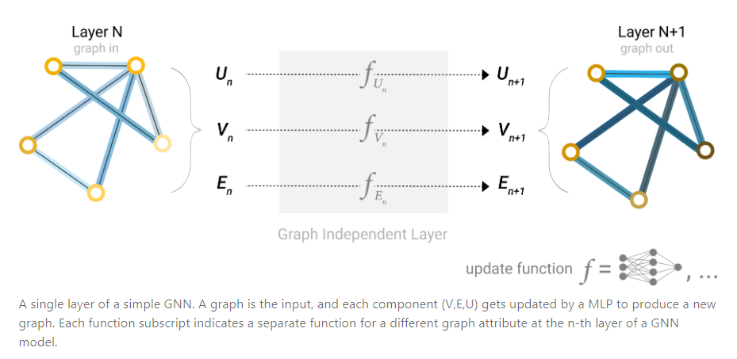

然后和其他网络类似，我们可以堆叠`GNN Layer`

## 通过GNN得到预测值

**对顶点做预测**

在得到了最后一层图的输出以后，考虑一个对顶点做二分类的问题，那么我们只需要在后面添加了输出维度是2的FC和Softmax即可。

对于多分类和回归，也是类似的方法。

**Pooling**

假设一种情况，我们想对顶点做预测，但是我们并没有顶点的向量。我们可以通过一种方式收集边的信息将其整合成点的信息，然后拿这个信息做预测，这种方式就是`pooling`(汇聚)。

Pooling分为两步

1.对于每一个要pooled的物品，收集它周围的embedding，然后拼成一个矩阵

2.聚合矩阵内的向量，通常采用sum的方式，但是也有求平均或者是求最大值的方法。

下图这个例子就是将**和该点相连的边的向量**和**全局向量**都加起来，形成当前点的向量

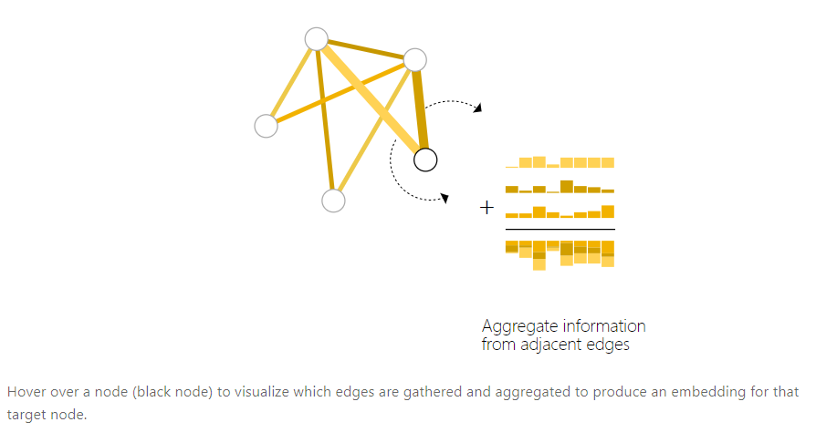

所以如果我们只有边的向量，没有点的向量，但是最终仍旧需要预测点的信息，就可以采用`pooling`的方式得到结果，如下图

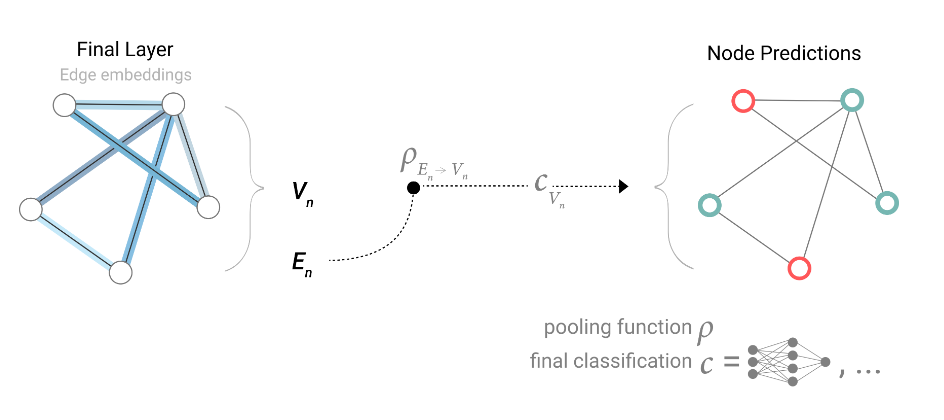

这里$\rho_{E_n \rightarrow V_n}$是指通过边汇聚到点的pooling操作，$C_{V_n}$是线性分类器

下图反了过来，使用顶点的信息来预测边，即用和该边相连的顶点信息来`pooling`

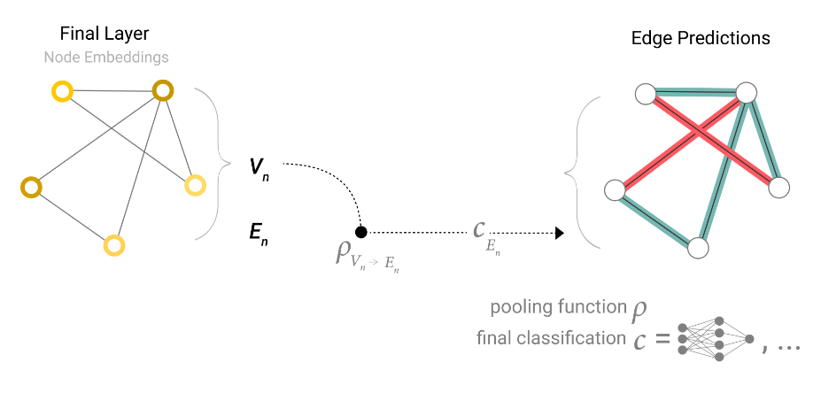

下图使用点的信息来预测全局信息，我们需要收集全局所有点的信息，然后对其做`pooling`

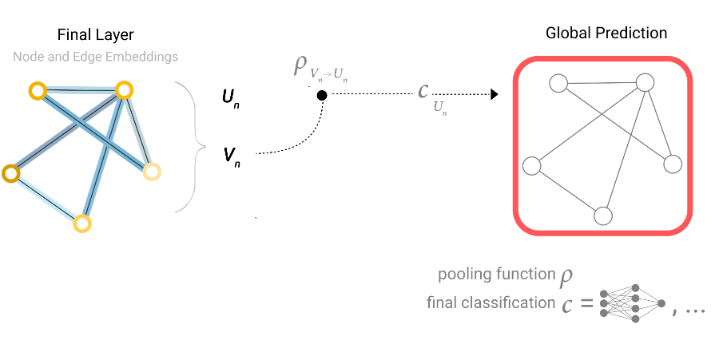

结合上面两个部分，我们就可以得到一个最简单的GNN

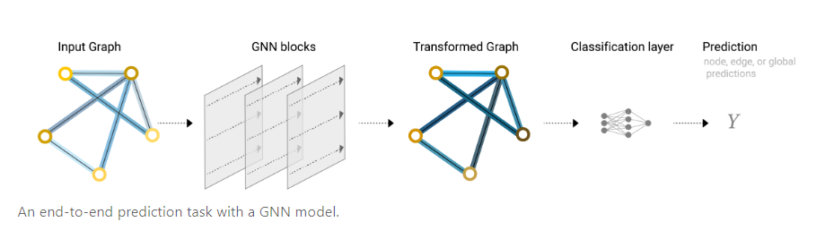

这个GNN存在的问题是我们除了在做预测的时候通过pooling来汇聚缺失的信息之外，我们根本有没有在内部的`GNN Layer`中使用图的连接性信息(邻接表)，边，节点，全局上下文均是独立计算的。

## 在图的不同部分之间传递信息

我们可以在`GNN Layer`中使用`pooling`操作，借助信息传递框架，让图的不同部分之间意识到连接性的存在，从而获得更复杂的GNN模型

以点举例，我们拿出所有该点邻居节点和当前节点的embedding，通过聚合函数(例如sum)进行聚合，然后再输入进入MLP得到该点更新的向量。下图为示意图，这种方式是一种最简单的信息传递方式

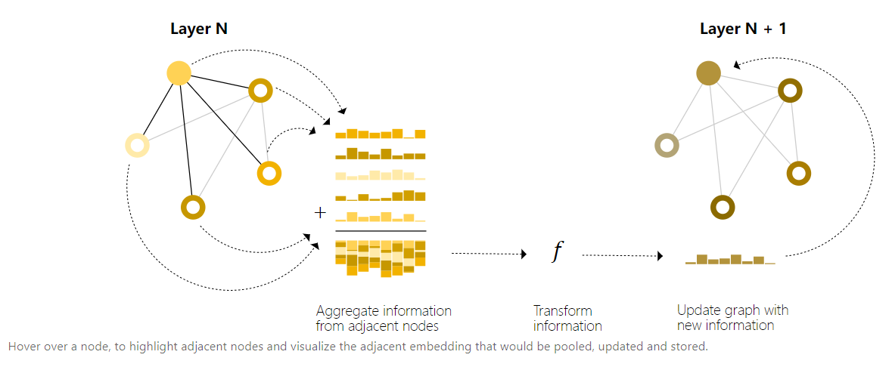

通过堆叠包含信息传递的`GNN Layer`,我们可以让节点的邻居的邻居的邻居...全部汇聚过来。

同时，我们可以在很早的时候就采用`pooling`操作，而不必等到最终预测的时候。

下图就是一个示例，我们可以通过$\rho_{V_n \rightarrow E_n}$函数把点的信息通过`pooling`操作汇聚到边上，然后当我们需要去更新点的向量的时候，我们使用这些汇聚了点信息的相连边，通过$\rho_{V_n \rightarrow E_n}$在把这些边的信息汇聚到点上，之后再经过MLP去更新点的向量。

(看图示是这个意思，具体未知)

我觉得这里做了点到边的汇聚，就会用汇聚之后的边输入进入MLP

而输入进入点的MLP的向量是用汇聚过点的边再去汇聚点得到的结果

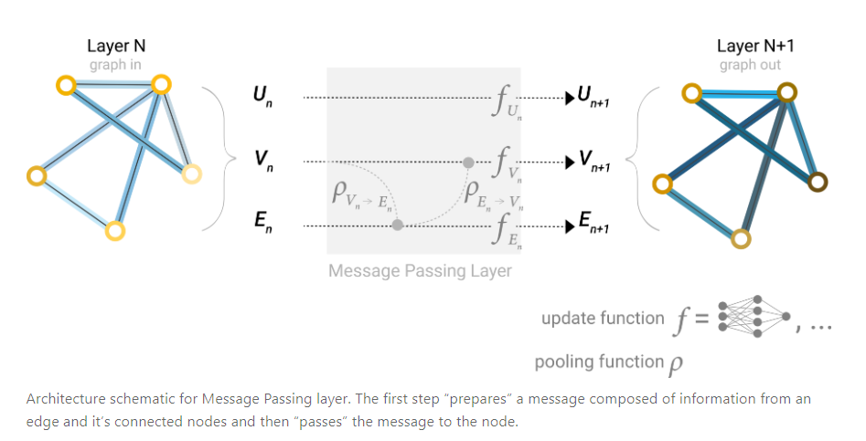

如果我们返回过来，我们会得到不一样的结果，下图就是一个对比结果。

第一个是先做边到点的汇聚，然后在做点到边的汇聚，用汇聚后的结果输入进入MLP。

第二个是先做点到边的汇聚，然后做边到点的汇聚，用汇聚后的结果输入进入MLP。

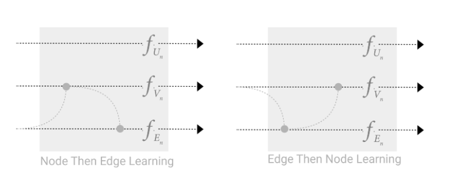

我们还可以进行交替更新，同时使用上面两种方式。

按照下图的方式，设原来的点为$V_1$，经过边$E_1$汇聚之后为$V_2$,经过边$E_2$汇聚之后为$V_3$

按照下图的方式，设原来的边为$E_1$，经过点$V_1$汇聚之后为$E_2$,经过点$V_2$汇聚之后为$E_3$

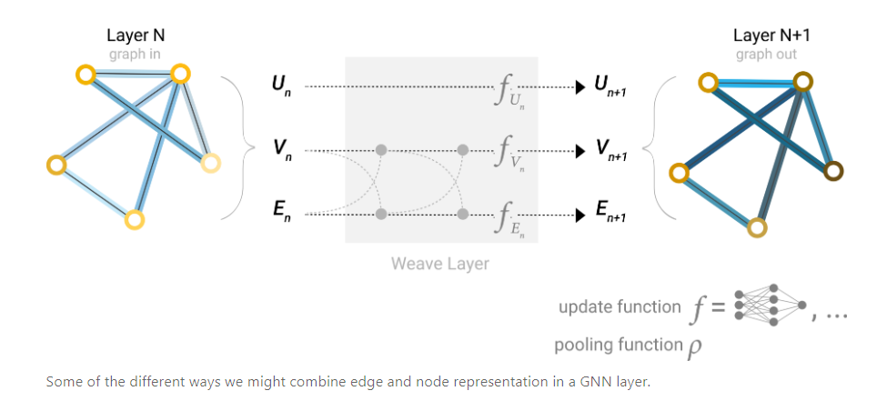

## 添加全局信息

对于一个k层的GNN网络来说，消息最多传递k步，如果我们的预测需要使用很远的点的信息时，这将成为一个问题。而对于一个点来说传递图中所有点是计算难以接受的，这时，我们通过创建`master node`这样的全局信息来做整体图的一个表征。`master node`是与图上所有点和边相连的。

因此在做`pooling`操作的时候，

我们从点汇聚到边时，不仅使用与该边相连的点的信息，还会汇聚`master node`信息。

同理，我们从边汇聚到点的时候，不仅使用与该点相连的边的信息，还会汇聚`master node`的信息上去。

在对`master node`做更新时，我们也需要汇聚整个图上所有的边和点

如下图所示

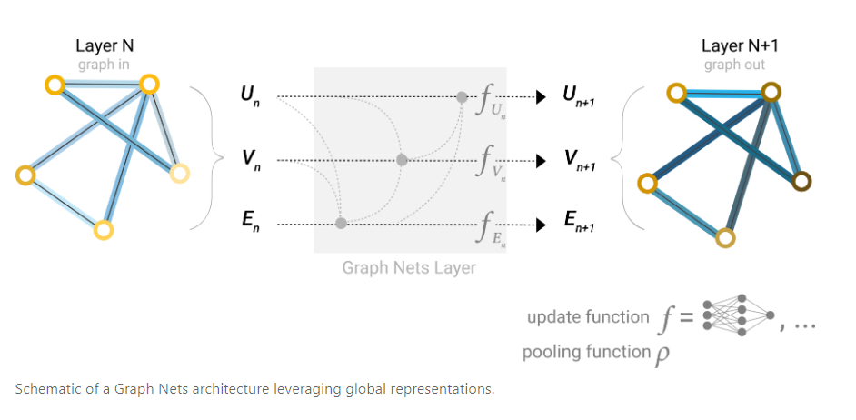

这样对于图中每一个属性来说，我们都有了多个消息源，我们可以自由进行选择。

例如，对一个点来说，我们可以利用邻居点信息，还可以利用相连边的信息，还可以可以全局信息，可以总和这些信息对该点的向量做更新。