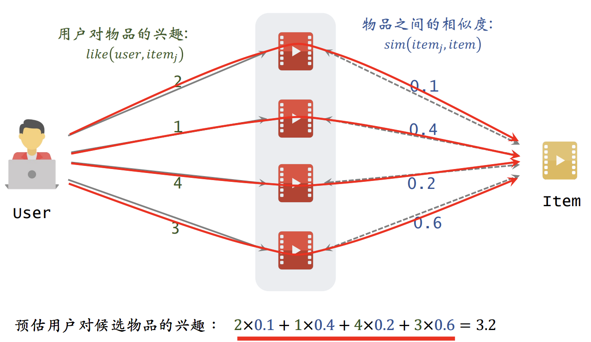

# 深度学习基础内容

## BN和LN

BatchNorm2D

Applies Batch Normalization over a 4D input (a mini-batch of 2D inputs with additional channel dimension) as described in the paper Batch Normalization: Accelerating Deep Network Training by Reducing Internal Covariate Shift .

input: (N, C, H, W)

$$
    y = \frac{x - E[x]}{\sqrt{Var[X] + \epsilon}} * \gamma + \beta
$$

The mean and standard-deviation are calculated per-dimension over the mini-batches, and  γ and  β are learnable parameter vectors of size C (where C is the input size).

减均值,除标准差

output: (N, C, H, W)

手写BN
```python
class BN(nn.Module):
    def __init__(self, num_features, eps=1e-5, momentum=0.1):
        super(BN, self).__init__()
        self.num_features = num_features
        self.eps = eps
        self.momentum = momentum
        self.gamma = nn.Parameter(torch.Tensor(num_features))
        self.beta = nn.Parameter(torch.Tensor(num_features))
        self.register_buffer('running_mean', torch.zeros(num_features))
        self.register_buffer('running_var', torch.ones(num_features))
        self.reset_parameters()
    
    def forward(self, x):
        if self.training:
            mean = x.mean(dim=0, keepdim=True)
            var = x.var(dim=0, unbiased=False, keepdim=True)
            self.running_mean = (1 - self.momentum) * self.running_mean + self.momentum * mean
            self.running_var = (1 - self.momentum) * self.running_var + self.momentum * var
        else:
            mean = self.running_mean
            var = self.running_var
        x = (x - mean) / (var + self.eps).sqrt()
        x = x * self.gamma + self.beta
        return x
```

LayerNorm

input: (N, *)
output: (N,*)

$$
    y = \frac{x - E[x]}{\sqrt{Var[X] + \epsilon}} * \gamma + \beta
$$

The mean and standard-deviation are calculated over the last D dimensions, where D is the dimension of `normalized_shape`.

For example, if `normalized_shape` is `(3, 5)` (a 2-dimensional shape), the mean and standard-deviation are computed over the last **2** dimensions of the input 

$\gamma$ and $\beta$ are learnable parameter vectors of size `normalized_shape`. if `if elementwise_affine is True` 

手写LN
```python
class LN(nn.Module):
    def __init__(self, normalized_shape, eps=1e-5, elementwise_affine=True):
        """
            这个实现仅仅只是对最后一个维度做归一化,这也是一般transformer最常用的LN
        """
        super(LN, self).__init__()
        self.normalized_shape = normalized_shape
        self.eps = eps
        self.elementwise_affine = elementwise_affine
        if self.elementwise_affine:
            self.gamma = nn.Parameter(torch.Tensor(*normalized_shape))
            self.beta = nn.Parameter(torch.Tensor(*normalized_shape))
        else:
            self.register_parameter('gamma', None)
            self.register_parameter('beta', None)
        self.reset_parameters()
    
    def forward(self, x):
        mean = x.mean(dim=-1, keepdim=True)
        var = x.var(dim=-1, unbiased=False, keepdim=True)
        x = (x - mean) / (var + self.eps).sqrt()
        if self.elementwise_affine:
            x = x * self.gamma + self.beta
        return x
```

NORM的好处
1. 做norm把数据分布往均值为0,方差为的高斯分布上靠,消除不同数据量纲的影响
2. 有的激活函数,对于输入敏感,比如 sigmoid,使用norm可以缓解梯度消失的问题
3. 
对于一般的神经网络，由于每层的输入数据分布不同，导致每层的参数更新策略也不同，这样会导致三个问题：
1. 其一，上层参数需要不断适应新的输入数据分布，降低学习速度。
2. 其二，下层输入的变化可能趋向于变大或者变小，导致上层落入饱和区，使得学习过早停止。
3. 其三，每层的更新都会影响到其它层，因此每层的参数更新策略需要尽可能的谨慎。

4. 标准化这个操作，可以消除不同数据之间由于量纲/数量级带来的差异，而且它是一种线性变换，并不会改变原始数据的数值排序关系。

BN和LN的区别以及适用场景
1. BN适合在CNN中使用，LN适合在序列数据(文本)中
   因为不同的图像在同一个像素点上的值是有规律的,比如大量的图像,
    而不同句子相同位置的文本往往没有规律

## torch 实现矩阵间L2距离计算
```python
import torch
def get_euclidean_dist(x,y):
    """
        x: [n,d]
        y: [m,d]
        sqrt(xx + yy - 2xy)
    """
    n = A.size(0)
    m = B.size(0)
    # (n,1) -> (n,m)
    xx = torch.pow(x,2).sum(dim=-1,keepdim=True).expand(n,m)
    # (m,1) -> (m,n) -> (n,m)
    yy = torch.pow(y,2).sum(dim=-1,keepdim=True).expand(m,n).t()
    dist = xx + yy - 2 * torch.matmul(x,y.t())
    return dist.clamp(min=1e-12).sqrt()
```

二次型

设$x \in (1 \times n), A \in (n \times m), y \in (m \times 1)$, 则有
$$
    \begin{aligned}
    z 
    & = x^T A y \\
    & =\sum_{i=1}^n \sum_{j=1}^m x_i A_{ij} y_j \\
    \end{aligned}
$$

## 反向传播及其推导

[参考博客](https://zhuanlan.zhihu.com/p/32819991)

这里我使用博客给出的例子,来构造完整的计算图,并且根据计算图来推导参数的梯度

输入 `[i1,i2]`

隐藏层矩阵 `[[w1,w2],[w3,w4]]` ,隐藏层偏置 `[b1,b2]`

输出层矩阵 `[[w5,w6],[w7,w8]]` ,输出层偏置 `[b3,b4]`

激活函数 `sigmoid`

损失函数 `MSE`

前向过程


计算图


计算示例


## 过拟合的解决办法

1. Early stopping
2. Regularization
3. Dropout
4. 降低模型复杂度
5. Norm

## softmax以及实现

Applies the Softmax function to an n-dimensional input Tensor rescaling them so that the elements of the n-dimensional output Tensor lie in the range [0,1] and sum to 1.

$$
    softmax(x_i) = \frac{e^{x_i}}{\sum_{j=1}^{n}e^{x_j}}
$$

代码实现

```python
def softmax(x,dim):
    return torch.exp(x) / torch.sum(torch.exp(x), dim=dim, keepdim=True)
```

## 交叉熵损失函数以及实现
$$
    H(p,q) = - \sum_{x} p(x) \log q(x)
$$

```python
def cross_entropy(a,y):
    """
        a: [n,c]
        y: [n] 0 <= y_i <= c
        n为样本数,c为类别数
    """
    loss = -torch.log(a[range(a.size(0)),y])
    return loss
```

## 二元交叉熵损失函数以及实现
$$
    H(p,q) = - (p(x) \log q(x) + (1 - p(x)) \log (1 - q(x)))
$$
    
```python
def binary_cross_entropy(a,y):
    """
        a: [n]
        y: [n] y_i \in {0,1}
    """
    loss = -y * torch.log(a) - (1 - y) * torch.log(1 - a)
    return loss
```

## KL散度

信息论中熵的概念首次被香农提出，目的是寻找一种高效/无损地编码信息的方法：以编码后数据的平均长度来衡量高效性，平均长度越小越高效；同时还需满足“无损”的条件，即编码后不能有原始信息的丢失。这样，香农提出了熵的定义：**无损编码事件信息的最小平均编码长度。**

如果熵比较大(即平均编码长度较长)，意味着这一信息有较多的可能状态，相应的每个状态的可能性比较低；因此每当来了一个新的信息，我们很难对其作出准确预测，即有着比较大的混乱程度/不确定性/不可预测性。

KL散度衡量了我们使用分布q来拟合真实分布p的误差,也就是两个分布之间的相似度

KL散度不能当作距离,因为KL散度是不对称的，也就是说$D_{KL}(p||q) \neq D_{KL}(q||p)$

KL散度是非负的,当且仅当两个分布相等时,KL散度为0,可以理解为使用任何一个分布p去拟合真实分布q,(p,q)之间的交叉熵都是大于q自身的信息熵的。

D_KL(p||q) = 交叉熵 - 熵

$$
    D_{KL}(p||q) = \sum_{x} p(x) \log \frac{p(x)}{q(x)}
$$

## sigmoid以及实现

$$
    sigmoid(x) = \frac{1}{1 + e^{-x}}
$$

```python
def sigmoid(x):
    return 1 / (1 + torch.exp(-x))
```


## 计算卷积的输出

$$
    \begin{aligned}
    Height & = \frac{Height + 2Padding - Kernel\_Size}{Stride} + 1 \\
    Width & = \frac{Width + 2Padding - Kernel\_Size}{Stride} + 1
    \end{aligned}
$$

## 常见的优化器

**SGD**

每次选择一个或者一组(mini-batch)数据来更新神经网络的参数

$$
    \theta_{t+1} = \theta_t - \gamma g_t
$$
$\theta, \gamma, g_t$分别是参数,学习率,梯度

**momentum**

在使用SGD时,有时会遇到震荡的问题,这是因为每次迭代后梯度变化过大导致的,为了解决这个问题,提出了momentum

引入动量来抵消梯度中那些剧烈变化的分量

加入动量后的SGD,第一个是指数加权平均,通常$\beta$取0.9
$$
    v_{t+1} = \beta v_t + (1 - \beta) g_t \\
    \theta_{t+1} = \theta_t - \gamma v_{t+1}
$$

AdaGrad: 

不同的参数对应不懂的学习率

$$
    \theta_{t+1} = \theta_t - \frac{\gamma}{\sqrt{s_t + \epsilon}} \odot g_t \\
    s_{t+1} = s_t + g_t \odot g_t \\
$$

这样做的好处是可以减小之前震荡过大的参数的学习率，增大更新速率较慢的参数的学习率，从而让模型可以更快收敛。

RMSProp

AdaGrad算法得缺点时需要考虑全部得历史数据,这样就会导致$s_t$越大越大

采用指数加权移动平均来解决，就是RMSProp

$$
    \theta_{t+1} = \theta_t - \frac{\gamma}{\sqrt{s_t + \epsilon}} \odot g_t \\
    s_{t+1} = \alpha s_{t-1} + (1-\alpha) g_t^2 \\
$$

Adam

SGD算法主要在优化梯度问题，RMSProp方法在优化学习率问题，那么可以不可以把这两种方法结合起来呢？

SGD + 动量 + RMSProp

$$
    \theta_{t+1} = \theta_{t} - \frac{\gamma}{\sqrt{s_t + \epsilon}} v_t

$$

其中
$$
s_t = \beta_2 s_{t-1} + (1-\beta)g_t^2 \\
 v_t = \beta_1 v_{t-1} + (1-\beta_1) g_t
$$

adamW

但是AdamW的作者证明，Adam算法弱化了L2范数的作用，所以导致了用Adam算法训练出来的模型泛化能力较弱。具体来说，在Adam中（上图的算法），权重衰减的梯度是直接加在$g_t$上的，这就导致权重衰减的梯度$g_t$也会随着去除以分母

如果不使用动量和RMSProp,那么L2正则化与权重衰减是等价的,但是使用了动量和RMSProp之后,就不等价了,在深度学习框架中的权重衰减一般是第二种形式,而不是传统意义上的L2正则化
```python
# L2 正则化
loss = loss + wd * all_weights.pow(2).sum / 2

# 权重衰减
# 在实际使用中,我们直接直接按照下面的方式更新参数的权重(1/2 * wd * w^2 的导数是 wd*w)
w = w - lr * (w.grad + wd * w)
w = w - lr * w.grad - lr * wd * w
```
在正常更新参数的过程中,权重衰减是累加在梯度上的,而当梯度的平方和累积过大时,权重衰减的作用就会被减弱

$$
    x_t \leftarrow x_{t-1} - \frac{\gamma}{\sqrt{s_t} + \epsilon} \odot (\beta_1 m_t + (1-\beta_1)(g_t + \omega x_{t-1}))
$$

AdamW针对这个问题的改进就是把权重衰减单独列出来,加在动量和梯度平方和之外


## warmup

## attention

```python

def attn():
    """
        注意力实现,带有attention_mask,不带多头
        query : [bs,seq,head_size]
        key : [bs,seq,head_size]
        value : [bs,seq,head_size]
    """
	d_k = key.size()[-1]
	attention_scores = torch.matmul(query, key.transpose(-1,-2)) / math.sqrt(d_k)
	if attention_mask is not None:
		attention_scores += attention_mask
	attention_probs = nn.Softmax(dim=-1)(attention_scores)
	outputs = torch.matmul(attention_probs, value) 
    return outputs

class SelfAttn(nn.Module):
    def __init__(self, config):
        super(SelfAttn, self).__init__()
        self.num_attention_heads = config.num_attention_heads
        self.attention_head_size = int(config.hidden_size / config.num_attention_heads)
        self.all_head_size = config.num_attention_heads * config.attention_head_size
        self.query = nn.Linear(config.hidden_size,self.all_head_size)  
        self.key = nn.Linear(config.hidden_size,self.all_head_size)
        self.value = nn.Linear(config.hidden_size,self.all_head_size)
        self.dropout = nn.Dropout(config.attention_probs_dropout_prob)
    
    def transpose_for_scores(self, x):
        """
            x = [bs, seq, all_head_size]
            return [bs,attn_heads, seq, attn_head_size]
        """
        bs, seq, _ = x.size()
        new_x_shape = (bs, seq, self.num_attention_heads, self.attention_head_size)
        x = x.view(*new_x_shape)
        return x.premute(0,2,1,3)
    
    def forward(self, x, attention_mask=None,head_mask=None):
        """
            x : [bs,seq,hidden_size]
        """
        mixed_query_layer = self.query(x)
        mixed_key_layer = self.key(x)
        mixed_value_layer = self.value(x)

        query_layer = self.transpose_for_scores(mixed_query_layer)
        key_layer = self.transpose_for_scores(mixed_key_layer)
        value_layer = self.transpose_for_scores(mixed_value_layer)

        attn_scores = torch.matmul(query_layer, key_layer.transpose(-1,-2)) / math.sqrt(self.attention_head_size)
        if attention_mask is not None:
            attn_scores += attention_mask
        attn_probs = nn.Softmax(dim=-1)(attn_scores)
        attn_probs = self.dropout(attn_probs)
        if head_mask is not None:
            attn_probs = attn_probs * head_mask
        context_layer = torch.matmul(attn_probs, value_layer) # (batch_size,num_heads,seq_length,head_size)
        context_layer = context_layer.permute(0,2,1,3).contiguous() 
        new_context_layer_shape = context_layer.size()[:-2] + (self.all_head_size,)
        context_layer = context_layer.view(*new_context_layer_shape)

        outputs = (context_layer, attention_probs) if self.output_attentions else (context_layer,)
        return outputs
```

问题:

attention为什么需要除以$\sqrt{d_k}$

softamx的导数$f = softmax(x), x \in (n \times 1)$ 为jacobin Matrix(雅可比矩阵) 

$$
    \begin{bmatrix}
    \cfrac{\partial f_1}{\partial x_1} & \cfrac{\partial f_1}{\partial x_2} & \cdots & \cfrac{\partial f_1}{\partial x_n} \\
    \vdots & \vdots & \ddots & \vdots  \\
    \cfrac{\partial f_n}{\partial x_1} & \cfrac{\partial f_n}{\partial x_2} & \cdots & \cfrac{\partial f_n}{\partial x_n} \\
    \end{bmatrix} \\
    \\
    f_i = \cfrac{e^{x_i}}{\sum_{j=1}^{n}e^{x_j}} \\
    \\
    \text{求解得} \\
    \begin{bmatrix}
    f_1(1-f_1) & -f_1f_2 & \cdots & -f_1f_n \\
    \vdots & \vdots & \ddots & \vdots  \\
    -f_n f_1 & -f_n f_2 & \cdots & f_n(1-f_n) \\
    \end{bmatrix}
$$

假定原来的,q,k每一个维度均相互独立,服从标准正态分布,那么在计算完点积之后,每一个相似度得分均是$q_1 k_1 + q_2 k_2 + \cdots + q_d k_d$,该值也服从正态分布,但是方差波动很大$N(0, d)$,较大的方差也就意味着数值波动大,这个波动也会随着softmax函数过去,根据softmax的函数的导数可知,较大的数值波动(一方趋近1,另一方趋近0)会导致softmax函数的梯度很小,从而导致梯度消失的问题,因此除以$\sqrt{d_k}$来降低方差,来避免梯度消失问题

attention操作的时间复杂度$O(n^2*d)$，n指序列的长度,d指隐藏层的维度

attention为什么使用点乘注意力而不是用加性注意力机制?
additive attention vs. dot-product attention

While the two are similar in theoretical complexity, dot-product attention is much faster and more space-efficient in practice, since it can be implemented using highly optimized matrix multiplication code.

两者的理论时间复杂度是相同的,但是dot-product attention在实践中更快,更节省空间,因为它可以使用高度优化的矩阵乘法代码来实现。
$$
q = W^q * a_i \\
k = W^k * a_j \\
\alpha = W \cdot tanh(cat(q,k)) \quad \text{或者是别的activate函数}
$$

**交叉注意力**
```python
# Q : [bs,num_head,query_length,head_size]
# K : [bs,num_head,kv_length,head_size]
# V : [bs,num_head,kv_length,head_size]
 attn_scores = torch,mattul(Q,K.transpose(-1,-2)) / math.sqrt(d_k) # [bs,num_head,query_length,kv_length]
attn_probs = nn.Softmax(dim=-1)(attn_scores) # [bs,num_head,query_length,kv_length]
outputs = torch.matmul(attn_probs, V) # [bs,num_head,query_length,head_size] 
```
## 激活函数

[一文搞懂激活函数(Sigmoid/ReLU/LeakyReLU/PReLU/ELU)](https://zhuanlan.zhihu.com/p/172254089)

1. sigmoid

$$
    sigmoid(x) = \frac{1}{1 + e^{-x}} \\
    \frac{d}{dx} sigmoid(x) = sigmoid(x)(1 - sigmoid(x))
$$

sigmoid函数的导数是一个很小的数,在深度神经网络中,会导致梯度消失的问题，在 (0,0.5)位置的导数最大

2. relu
$$
        relu(x) = max(0,x) \\
$$


3. leaky relu

torch的 negative_slope 默认值为1e-2

$$
    leakyReLU(x) = x \quad if \quad x > 0 \\
    leakyReLU(x) = \text{negative\_slope} \times  x \quad \text{otherwise} \\
$$


## LORA

lora微调是一种高效参数微调的方式

针对全连接层$h = W_0 x$,通过在$W_0$旁边添加一个低秩分解矩阵$\Delta W = BA$,只更新$\Delta W$的参数,固定原始参数做法,来实现参数高效微调，$\Delta W \in \mathbb{R}^{d \times k}$

$$
    W_0 + \Delta W = W_0 + BA , B \in \mathbb{R}^{d \times r}, A \in \mathbb{R}^{r \times d}
$$

其中 $r \ll \min (d,k)$

前向过程
$$
     h = (W_0 + \Delta W)x = W_0 x + BAx
$$

$A,B$矩阵初始化 
$A$ 随机高斯分布, $B$ 初始化为0,
可以保证初始时, h导B的梯度不为0,此时h导A的梯度为0,第一次迭代,更新了B的参数之后,那么h导A的梯度也不为0了,
此时A也可以正常更新。至于梯度计算,建议自己写一个$(2 \times 1) \times (1 \times 2) = (2 \times 2)$的$\Delta W$矩阵

## 位置编码

为什么transformer中使用的position embedding使用的是加法，而不是拼接？

因为拼接postion one-hot向量等价于在原始embed中加入一个经过变换的位置编码信息

[Transformer 修炼之道（一）、Input Embedding](https://zhuanlan.zhihu.com/p/372279569)

### Sinusoidal Positional Encoding

$$
    PE_{(pos,2i)} = sin(\frac{pos}  {10000^{2i/d_{model}}}) \\
    PE_{(pos,2i+1)} = cos(\frac{pos}  {10000^{2i/d_{model}}})
$$

### 为什么现在LLM都是Decoder-Only的

1. 注意力下三角阵，满秩
2. 支持kv cache复用
3. decoder-only没有引入bias，因此也就意味着需要更强大的算力和更多的数据能够训练出来上限更高的模型

### RoPE(旋转位置编码)

通过绝对位置编码的方式实现相对位置编码
m指绝对位置
$$
    f(\textbf{q},m) = \textbf{q} e ^ {im\theta} \\
$$

在二维复平面情况下,上面的公式对应了一个矩阵的旋转
$$

\begin{aligned}
a + ib  & = f(\textbf{q},m) \\
& = (q_0 + i q_1) (\cos{m\theta} + i\sin{m\theta} ) \\
& = 
\begin{pmatrix}
\cos{m\theta} & -\sin{m\theta} \\
\sin{m\theta} & \cos{m\theta}
\end{pmatrix}
\begin{pmatrix}
q_0 \\
q_1 \\
\end{pmatrix}
\end{aligned}
$$

由于内积满足线性叠加性，因此任意偶数维的RoPE，我们都可以表示为二维情形的拼接


实际计算实现


# 常见的评价指标

## Accuracy, Precision, Recall, F1

混淆矩阵

|           |预测为正例 | 预测为反例 |
| ---       | ---      |  ---     | 
| 真实为正例 | TP(真阳) | FN(假阴)   |
| 真实为反例 | FP(假阳) | TN(真阴)   |

理解混淆矩阵, Positive(P)表示预测正例,Negative表示预测负例,True表示预测正确,False表示预测错误

Accuracy(准确率) 表示分类正确的样本占总样本个数的比例 $A = \frac{TP + TN}{TP + TN + FP + FN}$

Precision(精确率) 表示预测为正例的样本中真正为正例的比例 $P = \frac{TP}{TP + FP}$

Recall 表示真正为正例的样本中被预测为正例的比例 $R = \frac{TP}{TP + FN}$

F1 是Precision和Recall的调和平均 $F1 = \frac{2 \times P \times R}{P + R}$

Macro Avg: 宏平均

宏平均是指在计算均值时使每个类别具有相同的权重，最后结果是每个类别的指标的算术平均值。

宏平均就是把每个类的结果算出来,然后按类求平均

Micro Avg: 微平均

微平均是指计算多分类指标时赋予所有类别的每个样本相同的权重，将所有样本合在一起计算各个指标。

微平均则是需要从每个样本出来,然后求平均

## ROC曲线和AUC

[看完这篇AUC文章，搞定任何有关AUC的面试不成问题~](https://zhuanlan.zhihu.com/p/360765777)

ROC曲线和TPR和FPR形成的曲线,AUC是ROC曲线和坐标轴围成的面积

横坐标是FPR,纵坐标是TPR

TPR = TP / (TP + FN)，就是召回率,是问你所有正例中有多少被检测出来了

FPR = FP / (FP + TN)，就是假正例率,问你所有真实负例中被检测为正例的水平

AUC的值在0.5到1之间，越接近1越好 

现在可以给一个比较常用的AUC的定义。

即：随机从正样本和负样本中各选一个，分类器对于该正样本打分大于该负样本打分的概率。

M:正样本集合,N:负样本集合
首先按照分类器的打分对所有样本进行从小到大排序(序号从1开始)，然后按照下面公式计算auc
$$
    AUC = \frac{\sum_{i \in M} rank(i) - \frac{M(1+M)}{2}}{|M| \times |N|}
$$

问题:当遇到两个样本的打分相同的时候，怎么处理？给出新的rank,rank为原来打分相同的样本的平均rank

AUC的好处
1. 不考虑阈值对于分类正确率的影响
2. 正负样本不平衡的情况下，AUC更能反映模型的性能(AUC对于正负样本的比例不敏感)

缺点:
1. 忽略了预测的概率值和模型的拟合程度；
2. AUC反映了太过笼统的信息。无法反映召回率、精确率等在实际业务中经常关心的指标；
3. 它没有给出模型误差的空间分布信息，AUC只关注正负样本之间的排序，并不关心正样本内部，或者负样本内部的排序，这样我们也无法衡量样本对于好坏客户的好坏程度的刻画能力；

AUC越大，说明分类器越可能把正样本排在前面，衡量的是一种排序的性能。
如果ROC面积越大，说明曲线越往左上角靠过去。那么对于任意截断点，(FPR，TPR)坐标点越往左上角（0,1）靠，说明FPR较小趋于0（根据定义得知，就是在所有真实负样本中，基本没有预测为正的样本），TRP较大趋于1（根据定义得知，也就是在所有真实正样本中，基本全都是预测为正的样本）。并且上述是对于任意截断点来说的，很明显，那就是分类器对正样本的打分基本要大于负样本的打分（一般预测值也叫打分），衡量的不就是排序能力嘛！


auc的代码实现
```python
import numpy as np
import pandas as pd

def calc_auc(y_true, y_pred):
    pair = list(zip(y_true, y_pred))
    pair = sorted(pair, key=lambda x: x[1])
    df = pd.DataFrame([[x[0],x[1],i+1]for i, x in enumerate(pair)]  columns=['y_true', 'y_pred'])

    # 将预测值相同的样本的rank取平均值
    for k,v in df.y_pred.value_counts().items():
        if v > 1:
            rank_mean = df[df.y_pred == k]["rank"].mean()
            df.loc[df.y_pred == k, "rank"] = rank_mean

    pos_df = df[df.y_true == 1]
    m = pos_df.shape[0] # 正样本数
    n = df.shape[0] - m # 负样本数
    return (pos_df["rank"].sum() - m * (m + 1) / 2) / (m * n)

```
## 宏平均和微平均

多分类的宏平均和微平均

宏平均是指先对每一个类型分别当作二分类任务(one-vs-rest)计算P,R,F1,然后再求平均值

微平均是指计算数据总体TP,FP,TN,FN,建立混淆矩阵然后计算P,R,F1


计算数据总体TP,FP,TN,FN是类型1,2,3 ... 对应的TP,FP,TN,FN相应样例的和

在采用微平均的时候,Precision,Recall,F1均等于Accuracy

推荐系统的AP和mAP

## top-k评价指标

设定 $pos_u$ 为用户u喜欢的物品集合,即正例,   $pred_u$为推荐给用户u的物品集合,

$pos_u \cap pred_u$是用户u喜欢的物品集合和推荐给用户u的物品集合的交集

$$
Precision@K = \frac{|pos_u \cap pred_u | }{|pred_u|}  \\
Recall@K = \frac{|pos_u \cap pred_u | }{|pos_u|}  \\
$$


**AP和mAP**

[详解评价指标MAP和NDCG（从推荐系统的角度）](https://zhuanlan.zhihu.com/p/485001411)

这两个均是top-k评价指标

设定 $pos_u$ 为用户u喜欢的物品集合,即正例,   $pred_u$为推荐给用户u的物品集合,

$$
AP@K = \frac{1}{\hat{R}} \sum_{k=1}^{K} Precision@k \cdot rel(k) \\  
$$
 $Precision@K$即为top-k的准确率,$\hat{R}$表示预测序列的长度

 $rel(k)$表示第K个推荐的物品的相关性分数，这里命中为1，未命中为0。

$$
AP@K = \frac{1}{|pos_u|} \sum_{k=1}^{K} \frac{p_k^{pred_u \cap  pos_u} }{p_k^{pred_u}} \\  
$$

$p_k^{pred_u}$是物品k在预测结果的位置(从1开始), $p_k^{pred_u \cap pos_u}$是物品k在预测结果和正例求交集的位置(保持原预测结果的顺序不变),如果有物品不存在与正例集合中,则分子为0


mAP是所有用户的AP的平均值

# CLIP模型

CLIP模型采用了对比学习的损失函数方式,我认为是可以将其理解为2n个 infoNCELoss,

```python
image_feat = image_encoder(image) # [n I_d]
text_feat = text_encoder(text) # [n T_d]

# to the same dim and norm
image_feat = image_linear(image_feat) # [n,d]
text_feat = text_linear(text_feat) # [n,d]
image_feat = image_feat / image_feat.norm(p=2,dim=-1, keepdim=True)
text_feat = text_feat / text_feat.norm(p=2,dim=-1, keepdim=True)

# 温度参数初始值
# self.logit_scale = nn.Parameter(torch.tensor(np.log(1 / 0.07)), requires_grad=True)
# calculate logits
logits = torch.matmul(image_feat, text_feat.t()) # [n,n]
logits_scale = self.logit_scale.exp()
logits = logits * logits_scale

labels = torch.arange(n).to(device)
loss_i = F.cross_entropy(logits, labels,axis = 0)
loss_t = F.cross_entropy(logits, labels,axis = 1)
loss =  (loss_i + loss_t) / 2
```

clip模型温度参数的初始值为 `self.logit_scale = np.log(1 / 0.07)` 

验证温度参数对分布的影响
```python
import torch
import matplotlib.pyplot as plt
import numpy as np
%matplotlib inline

def plot_data(data, softmax_data):
    # 绘制散点图
    plt.scatter(range(len(data)), data, color='red', label='data')
    plt.scatter(range(len(data)), softmax_data, color='blue', label='sfotmax data')

    # 标注每个点的值
    for i, txt in enumerate(data.tolist()):
        plt.annotate(f"{txt:.4f}", (i, data[i]), textcoords="offset points", xytext=(0,10), ha='center')

    for i, txt in enumerate(softmax_data.tolist()):
        plt.annotate(f"{txt:.4f}", (i, softmax_data[i]), textcoords="offset points", xytext=(0,10), ha='center')

    # 添加图例
    plt.legend()

    # 添加标题和标签
    plt.title('Scatter Plot of Two Lists')
    plt.xlabel('Index')
    plt.ylabel('Value')

    # 显示方格
    plt.grid(True)
    plt.show()

# t = 0.07
data = torch.tensor([4.3, 4.2, 4.7, 4.1, 4.7, 4, 4.5, 4.9, 4.76, 4.67],dtype=torch.float32)
softmax_data = torch.nn.Softmax(dim=0)(data / 0.07)

plot_data(data, softmax_data)

# t = 0.5
data = torch.tensor([4.3, 4.2, 4.7, 4.1, 4.7, 4, 4.5, 4.9, 4.76, 4.67],dtype=torch.float32)
softmax_data = torch.nn.Softmax(dim=0)(data / 0.5)

plot_data(data, softmax_data)

# t=1
data = torch.tensor([4.3, 4.2, 4.7, 4.1, 4.7, 4, 4.5, 4.9, 4.76, 4.67],dtype=torch.float32)
softmax_data = torch.nn.Softmax(dim=0)(data)

plot_data(data, softmax_data)

# t=2
data = torch.tensor([4.3, 4.2, 4.7, 4.1, 4.7, 4, 4.5, 4.9, 4.76, 4.67],dtype=torch.float32)
softmax_data = torch.nn.Softmax(dim=0)(data / 2)

plot_data(data, softmax_data)
```


从中可以看出,小的温度参数会导致分布更加尖锐,而温度参数越大,则会导致分布更加平滑,CLIP模型中的分布参数是可学的

小的温度系数会放大分布之间的差异,扩大突出优势,
那么如果这个突出是正确的,则会获得比较低的损失,
但是如果这个突出是错误的,相比与原分布会有更大的损失

所以小的温度参数是可以让模型更好的区分正例和负例,但是温度参数也不能过小,因为这么负样本是我们默认在batch中采集的。<br />
[from](https://zhuanlan.zhihu.com/p/544432496) <br />
举个不恰当的例子，同类别的狗狗，但是萨摩耶和吉娃娃这两种不同实例。那么很多困难负样本其实是潜在的正样本，所以我们不能过度地分开“困难样本”导致破坏潜在语义结构。所以说 
$\tau$不能太小。


# MutliLabelSoftMarginLoss 

多标签分类损失,一个样本可以同时属于多个类别
实际上计算的时候是把每个样本对应每个标签都转为二分类问题,问这个样本是不是属于这个类别,然后计算损失

# Triplet Loss

$$
L = max(d(a,p) - d(a,n) + margin, 0) 
$$

样本选择

easy triplets: 
$d(a,p) + margin  <  d(a,n)$ 
(a,p) 和(a,n)之间已经足够近了

semi-hard triplets: 
$d(a,p) < d(a,n) < d(a,p) + margin$
, (a,p) < (a,n), 但是还不够margin

hard triplets: 
$d(a,p) > a(a,n)$ 
(a,p)  > (a,n)

在batch内寻找负例

batch_all: 对于每个询问paper, 找到所有的三元组, (a,p,n)三元组,计算所有的三元组的loss

batch_hard,对于每个询问的paper,找出离它最远的正例和最近的负例,一个batch寻找找出batch_size对三元组

# 概率论基础知识

贝叶斯公式,全概率公式,条件概率公式
$$
    P(A|B) = \frac{P(B|A)P(A)}{P(B)} \\
    P(A) = \sum_{i=1}^{n} P(A|B_i)P(B_i) \\
    P(A|B) = \frac{P(AB)}{P(B)} \\
$$
在贝叶斯公式中, $P(A)$是先验概率, $P(A|B)$是后验概率, $P(B|A)$是似然度, $P(B)$是边缘概率

期望,方差怎么求
$$
    E(x) = \sum_{i=1}^{n} x_i P(x_i) \\
    Var(x) = E[(X - E(X))]^2
$$
期望,方差的性质

常见的分布(waiting for update)
1. 0-1分布 $E(x) = p, Var(x) = p(1-p)$
2. 二项式分布 $E(x) = np, Var(x) = np(1-p)$
3. 几何分布 $E(x) = \frac{1}{p}, Var(x) = \frac{1-p}{p^2}$
4. 超几何分布

随机变量,独立,互斥,和相关的概率是指什么?

独立是指$P(AB) = P(A)P(B)$

互斥是指事件A和事件B不可能同时发生

不相关是指随机变量X和Y的协方差是0或者说相关系数为0,
X和Y不相关和X和Y独立是两个不同的概念,X与Y不相关是指X与Y不存在线性关系,但是并不是说X和Y就不存在其他关系

# 推荐系统

## 召回

### 加速向量检索的方式

向量数据库

模型存储 

key-value 对, 
key是向量(user)的id, value是向量本身


向量最近邻查找

场景：
已知用户向量a,需要找到和a最相似的k个物品向量,但是物品数量很多,$O(n)$的时间不可接受

近似最近邻查找(Approximate Nearest Neighbor Search)
系统: Milvus, Faiss, HnswLib

在做线上服务之前,先把物品向量划分成很多区域(cos相似度划分结果为扇形),每个区域都选择一个代表向量,划分之后建立索引,key是这个代表向量,values是区域内点的列表

用了这个索引,就可以快速做召回了,我们只需要现在代表向量中找和a最相似的向量,然后在那个对应的区域内挨个计算相似度,返回top-k的结果

### 协同过滤 

基于物品的协同过滤

#### ItemCF

给用用户u推荐和用户u喜欢的物品x 相似的物品

$$
    \sum_j like(user,item_j) \times sim(item_j, item)
$$

例子:



根据上面的公式评估用户`user`对物品`item`的喜好程度

计算物品相似度: 两个物品的受从重合度越高,两个物品越相似

计算两个物品的相似度
- 喜欢物品$i_1$的用户记作$W_1$
- 喜欢物品$i_2$的用户记作$W_2$
- 定义交集用户数为$V = W_1 \cap W_2$


则两个物品的相似度为,这其实就是余弦相似度,
把一个物品表示为一个向量,向量的每个值就是用户对该物品的喜爱程度，
喜欢为1,不喜欢为0,计算两个物品的余弦相似度,
$$
    sim(i_1, i_2) = \frac{|V|}{\sqrt{|W_1| \times |W_2|}}
$$

考虑用户喜欢的程度,例如点击(1),点赞(2)，收藏(3)，转发还是余弦相似度
$$
    sim(i_1, i_2) = \frac{\sum_{u \in V} like(u,i_1) \times like(u,i_2)}{\sqrt{\sum_{u \in W_1} like^2(u,i_1)} \times \sqrt{\sum_{u \in W_2} like^2(u,i_2)}}
$$

ItemCF用户召回的流程

1. 事先做离线计算

- 建立"用户-物品"的索引
  
  记录用户最近点击,交互过的物品

  给定任意用户ID, 可以找到他最近喜欢的物品列表

- 建立"物品-物品"的索引
    
      计算物品两两之间的相似度

      对于每个物品, 索引它最相似的k个物品
      
      给定任意物品ID, 可以找到快速找到它最相似的k个物品

设定最近用户感兴趣的物品有$n$个,每个物品可以索引出$k$个最相似的物品,
那么这个召回通道就可以最多返回$n \times k$个物品,可以自行确定返回top-k的结果


#### UserCF

给用户u推荐和用户u相似的用户喜欢的物品


$$
    \sum_j sim(user,user_j) \times like(user_j, item)
$$

例子


计算两个用户的相似度(用物品表示用户)
- 用户$u_1$喜欢的物品集合记作$J_1$
- 用户$u_2$喜欢的物品集合记作$J_2$
- 定义交集$I = J_1 \cap J_2$

则两个用户的相似度为,这个公式仅仅是用户喜欢则为1,不是则为0

$$
    sim(u_1, u_2) = \frac{|I|}{\sqrt{|J_1| \times |J_2|}}
$$

避免热门物品

在上述的计算中,热门物品和冷门物品贡献的权重都是1
热门物品多数用户都喜欢
因此热门物品不具备区分用户之间不同的兴趣的能力,我们需要降低热门物品的权重


$$
    sim(u_1, u_2) = \frac{\sum_{l \in I} \frac{1}{\log(1+n_l)}}{\sqrt{|J_1| \times |J_2|}}
$$

$n_l$是喜欢物品$l$的用户数量,反映物品的热门程度

UserCF用户召回的流程

1. 事先做离线计算

- 建立"用户-物品"的索引
  
  记录用户最近点击,交互过的物品

  给定任意用户ID, 可以找到他最近喜欢的物品列表

- 建立"用户-用户"的索引
    
      计算用户两两之间的相似度

      对于每个用户, 索引它最相似的k个用户
      
      给定任意用户ID, 可以找到快速找到它最相似的k个用户

设定用户可以索引出$k$个最相似的用户,每个用户有最近喜欢的物品有$n$个,
那么这个召回通道就可以最多返回$n \times k$个物品,
可以自行确定返回top-k的结果

### 双塔模型

## 粗排

## 精排

## 重排


# 简历项目

## seHGNN

obgn-mag是异构图,
节点有Paper,Author,Field,Institution等,
边有Paper-Author, Paper-Field, Author-Institution,Paper-Paper等

ogbn-mag，包含论文、作者、机构、研究领域 4个实体，以及 隶属于、写作、引用、包含主题 4种关系的异构网络，原任务为预测每篇论文的发表会议/期刊。

349-class classification problem

baseline 是一个异构图神经网络,是基于metapath的做法 + attention融合metapath的做法
单层的图神经网络

我们取baseline拿到的Paper节点的embedding作为特征,用这个特征去做召回任务

top-k = 2000

主要的修改为增加损失函数

1. CLIP -LIKE LOSS

在一个batch(20000)内,针对每一个paper,和它属于同一类的就是正例,不和她属于同一类的就是负例

首先先用和clip相同的方式计算相似度矩阵,然后我们可以根据具体标签生成对应label矩阵。
此时对于每一个paper,同一行的内容,可能会存在多个正例存在的情况。因此我也对损失函数进行了修改,CLIP用的是交叉熵损失函数,我使用的是MultiSoftMarginLoss,这个损失函数具体来说就是把每一个类别当成一个二分类任务,属于或者不属于,使用这种方式来计算模型损失,并且和原baseline的分类的ce_loss 加权

2. TRIPLET LOSS 

L = max(d(a,p) - d(a,n) + margin, 0)
在使用Triplet loss的时候,我在挑选负例上使用了hard negative的方式,即对于每一个paper,

batch_all : (a,p,n)
batch_hard : 针对每一个a,对于每个询问paper，找出离它最远的正例以及最近的负例作为三元组，即找batch_size对三元组. (a,p,n)


1. 项目中的亮点,难点在哪里?
2. 怎么一步步做出来提升的?
3. 做法的动机在哪里?
   
## CLIP模型项目

提升了编码器(ResNet -> ViT, Bert -> mBert)

从ResNet 升级到ViT

1. ViT可以从浅层就获取到全局的图像表示,而ResNet需要通过多层卷积才能把感受野扩展到全图
2. ViT比起ResNet可以保留更多的空间信息,而对齐多样的文本和图像是需要图像的位置信息的

从Bert升级到m-Bert的考虑

因为mBert是采用了多语言预料预训练的模型,因此在处理中文任务上的表现可以更好


## Qwen-VL内容

1024->256

baseline: qwen-vl + int4量化 + qlora

动机:减少输入模型的图像数量,降低模型需要同时查看的图像数量

CLIP模型:计算文本和图像相似度

使用三元组损失的动机:

1. 因为存在现有的负例,而使用CLIP没有利用这些负例
2. 训练CLIP模型,batch_size因为资源问题开的比较小
   
单图With-OCR:

只通过把图像传入ViT模型,对于文档数据,因为patch 14*14比较大, ViT可以比较好的获取全局信息,但是面对patch内部的信息,ViT就难以感知

因此这里考虑的就是引入额外的ocr信息来弥补ViT模型的不足

我认为需要引入layout布局信息
如何引入? 通过prompt的方式引入, 因此做法就是把给定的ocr布局信息转化为文字版的文档布局引入prompt中

针对prompt做改良?

第一版测试在eval上的结果, 观察了模型的输出,发现模型有很多问题实际上回答是正确的,但是因为模型的输出带有其他额外的内容,从而导致了指标低
因此做了prompt的优化

1. 加入few-shot
2. 告诉模型不要出现"*"
3. 告诉模型extract answer

做模型的Lora微调来控制模型的输出

0.74

评价指标:**ANLS**

输入: 

1. n个问题的预测答案：pred: `List[str]`
2. n个问题的真实答案：gold: `List[List[str]]`,每个问题有多个候选答案,都是正确的

$$
\text{ANLS} = 
    \frac{1}{n} \sum_{i=1}^{n} \left( max_j s(a_{ij},o_i)) \right) \\

    s(a_{ij}, o_i) = \left\{
        \begin{array}{ll}
            1 - NL(a_{ij},o_i) & \text{if } NL(a_{ij},o_i)  < \tau \\
            0 & \text{if } NL(a_{ij},o_i)  \geq \tau
        \end{array}
    \right.
    \\
    NL(a_ij, o_i) = \text{edit distance}(a_{ij}, o_i) / \text{max}(len(a_{ij}), len(o_i)) \\
        NL(a_ij, o_i) = \frac{\text{edit distance}(a_{ij}, o_i)} {\text{max}(len(a_{ij}), len(o_i))}
$$

## byteCamp内容

引入适用于扩招回任务的损失

1. CLIP-LIKE LOSS
2. triplet loss,需要采样负样本, 使用这个损失,负样本采样是关键
    在采样负样本上做文章
    1. batch-all : 找到batch内所有的三元组
    2. batch-hard: 进行难例挖掘


# CV基础内容

## ResNet

ResNet18,ResNet50, ResNet101, ResNet152后面的数字指的是resnet的层数


ResNet是一个多阶段的模型,一共分为5个stage

在源码实现上,50以下(18,34)使用的类为BasicBlock,50以上(50,101,152)使用的类为Bottleneck

Stage1:

input: (3,244,244)

model:
1. Conv2d(in_channels=3,out_channels=64,kersize=7,stride=2,padding=3)
2. BN(BatchNorm2d)
3. ReLU 
output: (64,112,112)
   
Stage 2:

input: (64,112,112)
model:MaxPool2d(kernel_size=3,stride=2,padding=1)

output: (64,56,56)

Stage 1.
input: (64,56,56)
model:

BasicBlock(in_channels=64,out_channels=64,stride=1)

1. conv1x1

```python
# 1x1卷积,一般不改变feature map的大小,当作全连接层
# 当 stride = 2, padding = None, 输出的feature map的大小是输入的一半,这种用法在downsample中用到了
def conv1x1(in_planes: int, out_planes: int, stride: int = 1) -> nn.Conv2d:
    """1x1 convolution"""
    return nn.Conv2d(in_planes, out_planes, kernel_size=1, stride=stride, bias=False)

# 3x3卷积,
# 当 stride = 1, padding = 1, 输出的feature map的大小和输入的feature map的大小是一样的
# 当 stride = 2, padding = 1, 输出的feature map的大小是输入的feature map的大小的一半
# 这个可能会改变feature map的大小
def conv3x3(in_planes: int, out_planes: int, stride: int = 1, groups: int = 1, dilation: int = 1) -> nn.Conv2d:
    """3x3 convolution with padding"""
    return nn.Conv2d(
        in_planes,
        out_planes,
        kernel_size=3,
        stride=stride,
        padding=dilation,
        groups=groups,
        bias=False,
        dilation=dilation,
    )
```

```python
### BasicBlock
### 两个3x3conv,在通过残差连接
### 第一个(inplanes,planes),第二个(planes,planes),最终的输出通道数就是planes
### 当第一个conv3x3的stride传2时,会把特征图减半
class BasicBlock(nn.Module):
    expansion: int = 1

    def __init__(
        self,
        inplanes: int,
        planes: int,
        stride: int = 1,
        downsample: Optional[nn.Module] = None,
        groups: int = 1,
        base_width: int = 64,
        dilation: int = 1,
        norm_layer: Optional[Callable[..., nn.Module]] = None,
    ) -> None:
        super().__init__()
        if norm_layer is None:
            norm_layer = nn.BatchNorm2d
        if groups != 1 or base_width != 64:
            raise ValueError("BasicBlock only supports groups=1 and base_width=64")
        if dilation > 1:
            raise NotImplementedError("Dilation > 1 not supported in BasicBlock")
        # Both self.conv1 and self.downsample layers downsample the input when stride != 1
        self.conv1 = conv3x3(inplanes, planes, stride)
        self.bn1 = norm_layer(planes)
        self.relu = nn.ReLU(inplace=True)
        self.conv2 = conv3x3(planes, planes)
        self.bn2 = norm_layer(planes)
        self.downsample = downsample
        self.stride = stride

    def forward(self, x: Tensor) -> Tensor:
        identity = x

        out = self.conv1(x)
        out = self.bn1(out)
        out = self.relu(out)

        out = self.conv2(out)
        out = self.bn2(out)

        if self.downsample is not None:
            identity = self.downsample(x)

        out += identity
        out = self.relu(out)

        return out
```

数据在BasicBlock中,整体上就是`conv3x3,bn,relu,conv3x3,bn,relu`的结构
第一个conv3x3的stride是可变的,当取2时,会导致feature map的h,w变为一半
第二个conv3x3的stride是1,只改变通道数


```python
### BottleNeck
### 3个卷积层,分别是conv1x1,con3x3, conv1x1
### 通道数变化是 inplanes -> width -> planes * self.expansion
### 在conv3x3中,如果stride传2,则会将特征图大小减半
### 当input的shape和output的形状不同时,是没法直接相加求残差的,这里会通过一个downsample模块(conv1x1,stride=2,bn)
### 来改变input的shape和output相同
### stride != 1 or self.inplanes != planes * block.expansion 会导致形状不同，此时就需要downsample模块了
### conv1x1 改变通道数
### conv3x3 stride=2,改变特征图大小
### conv1x1 变为最终通道数
class Bottleneck(nn.Module):
    expansion = 4 
 
    def __init__(self, inplanes, planes, stride=1, downsample=None, groups=1,
                 base_width=64, dilation=1, norm_layer=None):
        super(Bottleneck, self).__init__()
        if norm_layer is None:
            norm_layer = nn.BatchNorm2d
        width = int(planes * (base_width / 64.)) * groups
        # Both self.conv2 and self.downsample layers downsample the input when stride != 1
        self.conv1 = conv1x1(inplanes, width)
        self.bn1 = norm_layer(width)
        self.conv2 = conv3x3(width, width, stride, groups, dilation)
        self.bn2 = norm_layer(width)
        self.conv3 = conv1x1(width, planes * self.expansion)
        self.bn3 = norm_layer(planes * self.expansion)
        self.relu = nn.ReLU(inplace=True)
        self.downsample = downsample
        self.stride = stride
 
    def forward(self, x):
        identity = x
 
        out = self.conv1(x)
        out = self.bn1(out)
        out = self.relu(out)
 
        out = self.conv2(out)
        out = self.bn2(out)
        out = self.relu(out)
 
        out = self.conv3(out)
        out = self.bn3(out)
 
        if self.downsample is not None:
            identity = self.downsample(x)
 
        out += identity
        out = self.relu(out)
 
        return out
```

ResNet网络在代码中怎么实现?

```python
# 这部分有前面layer0的逻辑
# layer0: conv2d(in=3,out=64, kernel=7, stride=2, padding=3) -> bn1 -> relu1 -> maxpool
# 形状变化 (3,224) ->(conv1) (64,112,112) -> (maxpool) (64,56,56)
# layer1~4: self._make_layer(使用basicblock和Bottleblock构成)(block即传入的block类)
# 例如resnet18的构造函数为
# return _resnet(BasicBlock, [2, 2, 2, 2], weights, progress, **kwargs)

def _resnet(
    block: Type[Union[BasicBlock, Bottleneck]],
    layers: List[int],
    weights: Optional[WeightsEnum],
    progress: bool,
    **kwargs: Any,
) -> ResNet:
    if weights is not None:
        _ovewrite_named_param(kwargs, "num_classes", len(weights.meta["categories"]))

    model = ResNet(block, layers, **kwargs)

    if weights is not None:
        model.load_state_dict(weights.get_state_dict(progress=progress, check_hash=True))

    return model

class ResNet(nn.Module):
 
    def __init__(self, block, layers, num_classes=1000, zero_init_residual=False,
                 groups=1, width_per_group=64, replace_stride_with_dilation=None,
                 norm_layer=None):
        super(ResNet, self).__init__()
        if norm_layer is None:
            norm_layer = nn.BatchNorm2d
        self._norm_layer = norm_layer
 
        self.inplanes = 64
        self.dilation = 1
        if replace_stride_with_dilation is None:
            # each element in the tuple indicates if we should replace
            # the 2x2 stride with a dilated convolution instead
            replace_stride_with_dilation = [False, False, False]
        if len(replace_stride_with_dilation) != 3:
            raise ValueError("replace_stride_with_dilation should be None "
                             "or a 3-element tuple, got {}".format(replace_stride_with_dilation))
        self.groups = groups
        self.base_width = width_per_group
        self.conv1 = nn.Conv2d(3, self.inplanes, kernel_size=7, stride=2, padding=3,
                               bias=False)
        self.bn1 = norm_layer(self.inplanes)
        self.relu = nn.ReLU(inplace=True)
        self.maxpool = nn.MaxPool2d(kernel_size=3, stride=2, padding=1)
        self.layer1 = self._make_layer(block, 64, layers[0])
        self.layer2 = self._make_layer(block, 128, layers[1], stride=2,
                                       dilate=replace_stride_with_dilation[0])
        self.layer3 = self._make_layer(block, 256, layers[2], stride=2,
                                       dilate=replace_stride_with_dilation[1])
        self.layer4 = self._make_layer(block, 512, layers[3], stride=2,
                                       dilate=replace_stride_with_dilation[2])
        self.avgpool = nn.AdaptiveAvgPool2d((1, 1))
        self.fc = nn.Linear(512 * block.expansion, num_classes)
 
        for m in self.modules():
            if isinstance(m, nn.Conv2d):
                nn.init.kaiming_normal_(m.weight, mode='fan_out', nonlinearity='relu')
            elif isinstance(m, (nn.BatchNorm2d, nn.GroupNorm)):
                nn.init.constant_(m.weight, 1)
                nn.init.constant_(m.bias, 0)
 
        if zero_init_residual:
            for m in self.modules():
                if isinstance(m, Bottleneck):
                    nn.init.constant_(m.bn3.weight, 0)
                elif isinstance(m, BasicBlock):
                    nn.init.constant_(m.bn2.weight, 0)
 
    def _make_layer(self, block, planes, blocks, stride=1, dilate=False):
        norm_layer = self._norm_layer
        downsample = None
        previous_dilation = self.dilation
        if dilate:
            self.dilation *= stride
            stride = 1
        if stride != 1 or self.inplanes != planes * block.expansion:
            downsample = nn.Sequential(
                conv1x1(self.inplanes, planes * block.expansion, stride),
                norm_layer(planes * block.expansion),
            )
 
        layers = []
        layers.append(block(self.inplanes, planes, stride, downsample, self.groups,
                            self.base_width, previous_dilation, norm_layer))
        self.inplanes = planes * block.expansion
        for _ in range(1, blocks):
            layers.append(block(self.inplanes, planes, groups=self.groups,
                                base_width=self.base_width, dilation=self.dilation,
                                norm_layer=norm_layer))
 
        return nn.Sequential(*layers)
 
    def forward(self, x):
        x = self.conv1(x)
        x = self.bn1(x)
        x = self.relu(x)
        x = self.maxpool(x)
 
        x = self.layer1(x)
        x = self.layer2(x)
        x = self.layer3(x)
        x = self.layer4(x)
 
        x = self.avgpool(x)
        x = x.reshape(x.size(0), -1)
        x = self.fc(x)
 
        return x
```

**特征图变化和通道数变化**

```python
(3,224,224) -> (64,56,56) ->(layer1)-> (64*block.expansion,56,56) -> (layer2)->(128*block.expansion,28,28) ->(layer3)->(256*block.expansion,14,14) ->(layer4)->(512*block.expansion,7,7)

self.layer1 = self._make_layer(block, 64, layers[0])
self.layer2 = self._make_layer(block, 128, layers[1], stride=2,dilate=replace_stride_with_dilation[0])
self.layer3 = self._make_layer(block, 256, layers[2], stride=2,dilate=replace_stride_with_dilation[1])
self.layer4 = self._make_layer(block, 512, layers[3], stride=2,dilate=replace_stride_with_dilation[2])

# _make_layer function
layers.append(block(self.inplanes, planes, stride, downsample, self.groups,self.base_width, previous_dilation, norm_layer))
self.inplanes = planes * block.expansion
for _ in range(1, blocks):
    layers.append(block(self.inplanes, planes, groups=self.groups,base_width=self.base_width, dilation=self.dilation,norm_layer=norm_layer))
```
在构建层时,layer1的stride是1,不会改变feature map的大小,layer2,layer3,layer4的stride是2,都会导致feature map的大小减半
在减半feature_map时,都是当前layer的第一个block传stride=2实现的,该layer的后续的block即不改变通道数也不改变特征图的大小

在构造layer时,第一个block的stride可以传2,来完成通道数增加

改变通道数是在这层中第一个block中改变的,该层的其他block既不改变通道数,也不改变feature map的大小
其中在改变大小的block中是通过第一个conv3x3的stride=2来实现的

`BasicBlock`和`BottleNeck`的区别在于`BasicBlock`的`expansion`是1,`BottleNeck`的`expansion`是4

downsmaple的作用是当stride不为1或者输入的通道数和输出的通道数不一样的时候,需要对输入进行调整,以便进行残差学习

```python
restnet18: (BasicBlock,[2, 2, 2, 2])
restnet34: (BasicBlock,[3, 4, 6, 3])
restnet50: (BottleNeck,[3, 4, 6, 3])
restnet101: (BottleNeck,[3, 4, 23, 3])
restnet152: (BottleNeck,[3, 8, 36, 3])
```

ResNet18的18层代表的是带有权重的18层，包括卷积层和全连接层，不包括池化层和BN层。
其他的同理,用来表示网络的深度

## 池化层

**Global Average Pooling**

[【机器学习】一文带你深入全局平均池化](https://zhuanlan.zhihu.com/p/345183296)

Global Average Pooling, GAP

之前我们得到了特征图之后,我们之前是通过将特征图展平,然后接一个线形层来进行分类,或者回归的

GAP可以用来充当这个展平的作用

对于卷积得到的feature map,`[C,H,W]`,在每一个通道上,在整个`[H,W]`上求均值,最后得到`[C,1]`格式的输出

GAP的好处
1. 抑制过拟合,因为这样后面的全连接层的参数会减少
2. 可解释的雏形
3. 输入尺寸更加灵活

缺点:
1. 收敛会变慢

**attentionpooling2d**

[【Attentionpool2d】](https://blog.csdn.net/qq_41174671/article/details/131617114)

```python

class AttentionPool2d(nn.Module):
    def __init__(self, spacial_dim: int, embed_dim: int, num_heads: int, output_dim: int = None):
        """
            spacial_dim: 输入特征图的空间维度(H,W)
            embed_dim: 输入特征图的通道数
            num_heads: 多头注意力的头数
            output_dim: 输出特征图的通道数,默认为embed_dim
        """
        super().__init__()
        # 位置编码 (h*w+1) x embed_dim
        self.positional_embedding = nn.Parameter(torch.randn(spacial_dim ** 2 + 1, embed_dim) / embed_dim ** 0.5)
        self.k_proj = nn.Linear(embed_dim, embed_dim)
        self.q_proj = nn.Linear(embed_dim, embed_dim)
        self.v_proj = nn.Linear(embed_dim, embed_dim)
        self.c_proj = nn.Linear(embed_dim, output_dim or embed_dim)
        self.num_heads = num_heads

    def forward(self, x):
        x = x.flatten(start_dim=2).permute(2, 0, 1)  # NCHW -> (HW)NC
        # 拼接每一个通道的mean作为该通道的全局表示
        x = torch.cat([x.mean(dim=0, keepdim=True), x], dim=0)  # (HW+1)NC
        # 添加位置编码
        x = x + self.positional_embedding[:, None, :].to(x.dtype)  # (HW+1)NC
        # 多头注意力机制
        # q = x[:1], k = x, v = x, ouput = [1,N,C]
        x, _ = F.multi_head_attention_forward(
            query=x[:1], key=x, value=x,
            embed_dim_to_check=x.shape[-1],
            num_heads=self.num_heads,
            q_proj_weight=self.q_proj.weight,
            k_proj_weight=self.k_proj.weight,
            v_proj_weight=self.v_proj.weight,
            in_proj_weight=None,
            in_proj_bias=torch.cat([self.q_proj.bias, self.k_proj.bias, self.v_proj.bias]),
            bias_k=None,
            bias_v=None,
            add_zero_attn=False,
            dropout_p=0,
            out_proj_weight=self.c_proj.weight,
            out_proj_bias=self.c_proj.bias,
            use_separate_proj_weight=True,
            training=self.training,
            need_weights=False
        )
        return x.squeeze(0)
```

## 多模态模型介绍

VisualBert

ViLT

CLIP

ALBEF


对于图像端，采用12层transformer。但是在文本端，只有前6层作为text encoder，将后6层做多模态交互。 符合第一张图中的(c)，但是也没有增加计算量。
(c) 图像编码器复杂,文本编码器简单,然后会有比较复杂的多模态交互部分(cross-attn)

训练损失:

1. ITC loss(图像文本一致性损失)

2. ITM loss,使用最后模态交互层的`[CLS]` token作为图像和文本的联合表示，来做图文是否匹配的二分类任务。得到损失$L_{itm}$
​
3. MLM loss

同时利用图像特征和文本上下文特征来重建被mask的词，得到损失$L_{mlm}$

VLMo

[自己当时的总结](https://www.guiququ.com/paper/vlmo/)

VLMo把MoE模型架构引入了多模态模型


分为三个FFN
1. V-FFN (单独编码图像)
2. L-FFN (单独编码文本)
3. VL-FFN (提供模态融合)

多阶段训练:

Stage1. 只利用Vision数据训练MHSA和V-FFN，作为BEiT模型(这个团队之前的工作)

Stage2. 固定V-FFN和MHSA，使用text data来训练L-FFN

Stage3. 解除所有参数冻结，使用图文对数据来训练

BEiTv3

BEiTv3的模型结构和VLMo相似,都是MoE的架构,只不过这里换了一个名字,叫做MultiWay-Transformer

Pretraining Task:只有一个，就是Masked data modeling，Masked 图片或者文本，然后进行恢复

BLIP

BLIP是ALBEF的同团队的工作，结合了ALBEF和VLMo的思想


BLIP-2


Image Encoder + Q-Former + LLM的结构了

Q-Former(基于bert的结构)

偶数层添加cross-attn

CoCa

CoCa的模型结构和ALBEF比较相似


唯一的区别是CoCa在文本端使用decoder而ALBEF使用encoder

不过CoCa对于文本端前面的`Unimodal Text Decoder`实际上是用来编码文本的

## 多模态LLM介绍

instructBLIP

LLaVA

visual encoder + mlp + llm  = llava

训练使用了gpt-4生成的多模态指令数据集

llava的指令微调数据来源
利用chatgpt/gpt-4等纯语言模型来生成指令微调数据,图片的信息是通过caption,bbox等标注信息转换为文字信息的

- Response type 1: conversation
- Response type 2: detailed description
- Response type 3: complex reasoning


llava-1.5采用的改进
1. 更加规范的Prompt格式(克服模型输出长短不当的问题,因为一些学术数据集的答案往往比较短)
2. 加入LLM的微调
3. 加大模型和数据规模
   - mlp (从`nn.Linear`变为了两层的mlp)
   - 添加了一些面向学术的数据集,例如(vqav2,ocr-vqa等)
   - 使用336px分辨率的 clip vit (224px -> 336px)
   - LLM from 7B -> 13B
   - 面向更高的图像分辨率,图像切分+独立送入vit然后拼接(LLaVA-1.5-HD)

mini-GPT4

vit + q-former + mlp + llm = mini-gpt4

Qwen-VL
- vit 分辨率 448px, patch_size = 14, patch_cnt = 32 * 32 = 1024
- resampler: 做256个可学习的query和出来的image feature做cross-attention
- vit + resampler + llm(qwen) = qwen-vl


Mini-Gemini

1. 存在两个视觉编码器,一个处理高分辨率的图像,一个处理Resize之后的低分辨率的图像

对于低分辨率图像,采用传统的pipeline,使用 clip-pretrained vit得到visual token $N \times C$

对于高分辨率图像,采用 CNN-base的encoder(ConvNext-L),得到对应的特征图$N^{\prime} \times N^{\prime} \times C$

2. patch info mining
    低分辨率图像做query,高分辨率特征做value和key,做cross-attention


# 为什么现在的LLM都是decoder-only架构的


1. 有三种架构，encoder-only, encoder-decoder, decoder-only的
   其中encoder-only使用的预训练任务是MLM，是不擅长做生产任务的。
   decoder-only的模型使用的预训练任务是预测next token,兼顾理解和生成，zero-shot和few-shot的泛化性能也更好
   encoder-decoder 看上去也能兼顾理解和生成
2. 在causal attention mask作用下的注意力矩阵是满秩的，建模能力更强
3. decoder-only架构下的预测next token任务可用信息更少，建模难度更大，因此在数据足够多的情况下，效果更好
4. causal mask 可以起到隐式位置编码的作用
5. 效率问题，decoder-only支持复用kv-cache，对多轮对话更友好，而且decoder-only类的模型的训练更好做，效率更高

# 介绍目前常见的mllm model

## LLaVA  
 
## LLaVA 1.0

### 模型架构
    clip ViT-L/14(427.9M) + mlp(Linear) + llm(Vicuna)

### 数据
    引入 language-only gpt4,基于已经存在caption的数据(COCO数据集)来生成150k指令微调数据
    有三个任务
    1. 对话
    2. 细节caption
    3. 复杂推理

### 训练
 stage 1.  预训练对齐，使用数据cc3m过滤到595k，数据被转换为指令微调的形式，被视为单论对话，预测原始的caption
 stage 2.  端到端微调，保持vit frozen,继续更新mlp和llm的参数权重，面对multimodal chatbot的目标，使用上面收集到的数据 

## LLaVA 1.5 

1. 增加数据集，增加了较多的学术向的数据集，like VQA-v2等
2. mlp 从liear 变成了 2层的mlp
3. 规范了响应的格式
4. 增大模型， ViT -> ViT-336px, LLM 7B -> 13B

## LLaVA NeXT
1. 增加了动态分辨率，适应高分辨率，基于裁切然后拼接展平过mlp的方式
2. 高质量微调数据， 从现有的GPT-V和LAION，GPT-V中进行过滤收集，真实用户反馈，多样应用场景
3. 多模态文档和表格数据，增强文档，OCR和表格理解能力
4. 扩大LLM backbone，7B -> 34B
   
## BLIP-2

### 模型结构    
    vit + q-former(bert model init + cross attn(偶数层+cross attn,奇数层不加)) + llm
    q-fromer 提取 image feature, 现在用q-former的都表少了，q-former提取出来的更像一个某些image pattern,而且也不好观察，可能存在重复，同时，有些多模态问题不是说你有了image pattern就可以解的，例如密集信息问题，细粒度问题(方向类,颜色类等)


**Question: Q-fromer 如何处理数据**
1. Q-former中存在一个Learning Query,这个是transformer model的输入，可学习。最终这部分的输出用来代表image信息进入到llm中

### 数据

### 模型训练

阶段一预训练:

frozen image encoder + q-former(image transformer + text transformer(用于预训练)),基于以下三个任务进行图文预训练

1. Image-Text Contrastive Learning(对比学习) Text emb: cls token, image,多个query,选择了和text emb具有最高相似度的那个，mask部分 image和text之间不能互相看

2. Image-grounded Text Generation， text生成任务，image变成query在通过self-attn和text交互，text可以看query，query看不到text,text之间是逐渐掩码的

3. Image-Text Matching(二分类)，text和image可以互相直接看，做是否匹配的二分类

阶段二预训练: frozen image encoder + q-former(image transformer) + fully connected layer + frozen llm decoder
1. 利用BLIP模型使用CapFilt method 来为web image生成合成caption
2. 预测next token

## InstructBLIP

结构继承自BLIP2，在获取image feature时，同时输入了query和instruction,来生成和指令有关的image pattern


数据方面，采用了大量的学术数据集，并将其修改为了指令格式，除此之外还使用了LLaVA生产出来的那部分数据

## qwenvl

### 模型结构   
    
    ViT + Resampler + LLM
    
    ViT获取图像特征,Resampler : query和image做cross-attn转到llm语义空间中去
### 数据和训练

    stage-1 图文预训练,freeze llm,only optimize vision encoder and VL adapter,训练目标是最小化text token的交叉熵
    
    stage-2 多任务预训练，VQA，Captioning，Grouding， OCR，Text Generation等7个
    
    stage-3 sft 指令微调的方式训练

## qwen2vl

## internvl2

### 模型结构 

1. vit + mlp + llm,结构的LLaVA类似，在小尺寸上的vit都是300M参数量(2B,4B,8B), 在大尺寸上的ViT都是5.5B参数量的
    
2. 支持动态分辨率,最大可到4K,做法是设定了多个预测的尺寸，最大可到12个448px*448px,然后resize到最近的尺寸之后进行裁切，也可以附带原图的缩略图，用这些内容去代替原图，增强模型的高分辨率能力。

3. 使用了无参数的简单的pixel shuffle来降低image token的数量, 448px*448px -> 1024 -> 256
   

### 训练和数据
    stage-1 预训练,只训练mlp,使用横跨多个任务的数据进行训练，包括OCR


    stage-2 微调,训练ViT + MLP + LLM


    
无论是微调来时预训练，使用的任务都是预测 next token，都是相同的。

internvl2 主要的贡献

1. 增加了动态分辨率能力，使得mllm对于高清图像的认知变得更好了
2. 数据工作非常细致，面对每一个任务都有相应的数据集来训练 

## MiniCPM-V

minicpm-v 2.5，minicpm-v 2.6
端侧小模型，结构方面没什么创新，常规配置
visual encoder + compression layer + llm

visual encoder : SigLIP SoVit-400m/14 as image encoder


The visual tokens are then compressed by the compression layer, which adopts a perceiver resampler structure with one layer cross-attention. (和qwenvl一样)

1. 支持动态分辨率
2. gpt4-v level 的mllm(作者宣称)
3. 使用了RLHF-V（同作者的前作），来对齐mllm和人类偏好之间的表现
4. 多语言支持
5. 支持端侧部署
[github address](https://github.com/OpenBMB/MiniCPM-V)

1. 动态分辨率整了一个公式来计算score
   W_I,H_I是输入图像，W_v,H_v是预训练预设的image大小
$$
    S(m,n) = - |\log{\frac{W_I / m}{H_I / n}} - \log{\frac{W_v}{H_v}}|
$$
2. token压缩的数量比较少，压缩到了64维
3. 针对每一个image sclice使用了特殊的token `<slice><\slice>`来标记，并且过了一行raw img，就给一个换行符

### 训练

pre-training 三个阶段
数据： image Caption + OCR+Knowledge
1. 图文对预训练，只训resampler， img size 224x224, 采集了200M的 Image Caption数据
2. 224x224 -> 448x448, 只训visual encoder 采集了200M的Image caption数据
3. 训练模型接受动态分辨率图像， 同时训visual encoder 和resampler，数据除了Image Caption数据之外，还额外训练了OCR+Knowledge来增强模型的OCR能力

Caption Rewriting

来自web的数据或者是科研的数据有的比较脏，或者是比较短

合成的caption比较流畅，但是没有世界知识
raw caption有世界知识，但是语法可能比较混乱

text-only: raw caption + synthetic caption to gpt4o 来生成新的caption

image + raw caption to gpt4o 来生成新的caption 


   
   


