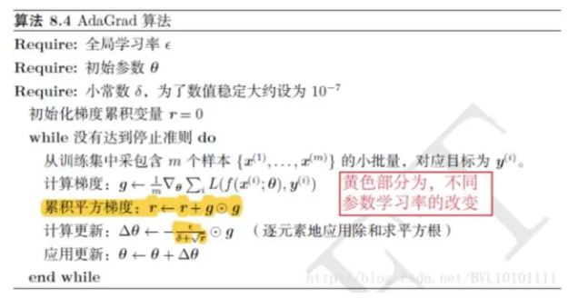
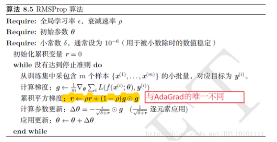
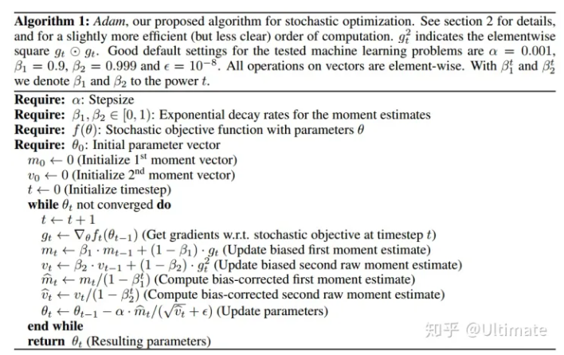

# 最速下降法

深度学习中的优化算法主要是通过梯度下降法改进而来的，由于网络复杂，因此对于二阶方法(牛顿法，拟-牛顿法等应用起来比较困难)，因此这里首先介绍最速下降法

最速下降法： 下降方向是梯度负方向+ 精确一维搜索$\lambda$

在神经网络的训练中，学习率$\lambda$是不可能通过精确一维搜索算出来的，因此这个我们自己给超参数，因此也带来了一些学习率的调整策略(即在整个训练期间，学习率应该如何变化)

**搞清数据和参数的含义**

在深度学习网络实际训练过程中，参数(parameter)对应是我们求解的最优化问题中的$x$，因此我们使用最优化的手段来帮我们找到最好的参数。那么对于数据而言，其实就是我们这个需要优化的函数里面的一个常量。

# 小批次梯度下降

mini-batch gradient descent

多数的损失函数实际上是通过对数似然推导出来的，如果使用在推导对数似然的时候，使用全部的训练集来写对数似然函数，这种方式就是全批次梯度下降，在一次参数的更新中使用了全部的数据，但是这种方式对资源消耗比较大。

如果我们只使用小部分数据，即(一个batch)的数据来写我们的似然函数(可以理解成每一次我们只能看到一个batch的数据，那么我的似然函数的目标就是让这个batch的数据出现的可能性更大)，采用这种方式对参数进行更新就是批次梯度下降。

# 随机梯度下降

stochastic gradient descent,SGD

随机梯度下降每次更新参数只使用一个样本。就是batch-size=1

[【Adam】优化算法浅析](https://zhuanlan.zhihu.com/p/90169812)

# 动量法

momentum

$$
g_t = \nabla J(\theta_{t-1}) \tag {1} \\
$$

$$
v_t = \gamma v_{t-1} + \eta g_t  \tag{2}
$$

$$
\theta_t = \theta_{t-1} -v_t \tag {3}
$$

其中$J$是损失函数，$\theta$是参数，$v_t$是动量，$\gamma \in [0,1)$是更新动量的超参数，$\eta$是学习率，动量$v_t$实际上是过去所有更新步计算得到梯度的指数加权平均，因此使用动量法更新参数，不仅取决于当前梯度，还取决于过去各个梯度在方向上是否一致。

$$
r_t = (1-\rho) r_{t-1} + \rho \theta_t
$$

# AdaGrad

注：Hadamard乘积，表示对应位置元素相乘。$C = A \odot B, \quad C_{i,j} = A_{i,j} \star B_{i,j}$

在优化算法中，每一个参数的更新使用同一个学习率，AdaGrad在这个地方做改善，让每一个参数使用不同的学习率更新。

具体来说，Adagrad算法为每个参数维护一个不同的学习率，而这个学习率是根据这个参数以前的梯度来更新的，在每个迭代过程中，Adagrad计算每个参数的梯度平方和和平方根，并将其用于缩放学习率。
$$
n_t = n_{t-1} + g_t^2 \tag{4}
$$

$$
\Delta \theta_t = - \cfrac{\eta}{\sqrt{n_t+\epsilon}} \cdot g_t \tag{5}
$$

$$
\theta_t = \theta_{t-1} + \Delta \theta_t \tag{6}
$$

算法流程

# RMSProp

RMsProp算法，是对AdaGrad算法的改进

相比于Adagrad,只有累积平方梯度的计算方法不同。增加了一个衰减系数$\rho$,也是用指数加权平均的方式来平滑累积的平方梯度
$$
r = \rho r + (1-\rho) g^2
$$

# Adam

Adam将RMSProp和Momentum结合起来

