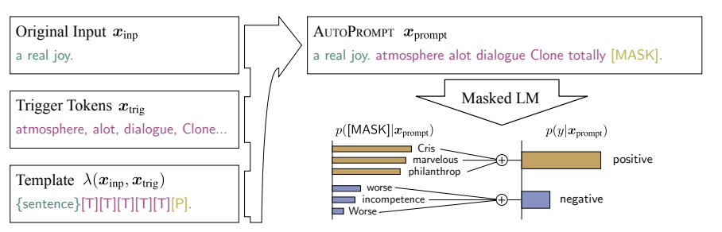
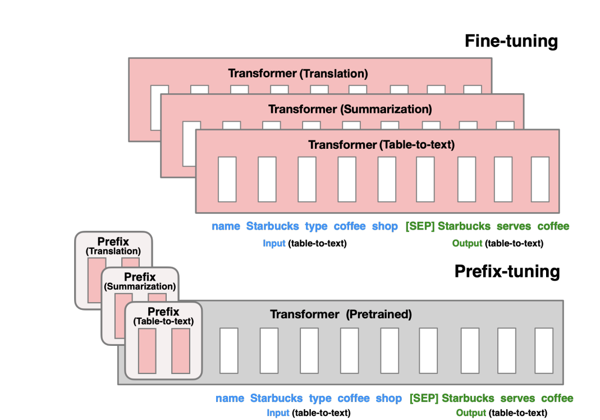
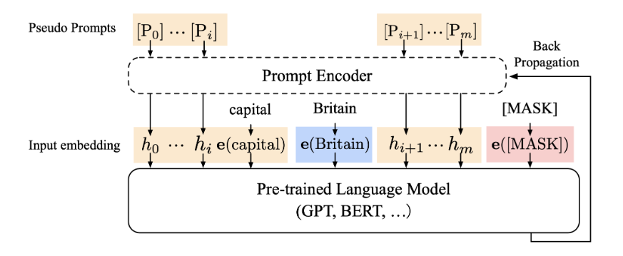
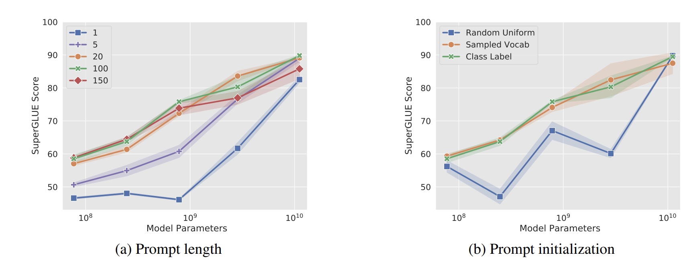
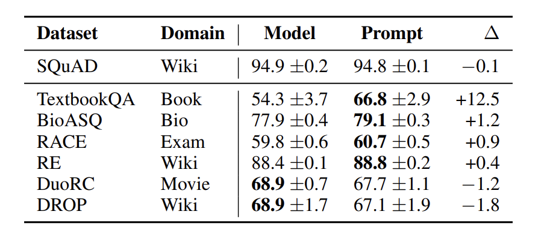

本文主要对[Lil' Log Prompt Engineering](https://lilianweng.github.io/posts/2023-03-15-prompt-engineering/)
做了一些翻译，然后结合提到几篇具体论文，加了一点东西。

# Prompt Engineering

## Zero-Shot

zero-shot是最简单的prompt的形式,将任务文本直接丢给LLM,让模型给出答案

例如如下情感分类任务
```
Text: I'll bet the video game is a lot more than a film.
Sentiment:
```

## Few-Shot

few-shot被zero-shot复杂一些,在给LLM任务文本，询问答案时，首先给出了任务相同的示例问题文本和答案，这样模型就能更好的理解人类的意图，往往可以给出更好的答案。

 > <font color="red">Text</font>:(lawrence bounces) all over the stage, dancing, running, sweating, mopping his face and generally displaying the wacky talent that brought him fame in the first place.<br>
 <font color="red">Sentiment</font>:positive <br>
 <font color="red">Text</font>:despite all evidence to the contrary, this clunker has somehow managed to pose as an actual feature movie, the kind that charges full admission and gets hyped on tv and purports to amuse small children and ostensible adults.<br>
<font color="red">Sentiment</font>: negative <br>
<font color="red">Text</font>: despite all evidence to the contrary, this clunker has somehow managed to pose as an actual feature movie, the kind that charges full admission and gets hyped on tv and purports to amuse small children and ostensible adults.<br>
<font color="red">Sentiment</font>: negative <br>
<font color="red">Text</font>: for the first time in years, de niro digs deep emotionally, perhaps because he's been stirred by the powerful work of his co-stars. <br>
<font color="red">Sentiment</font>: positive <br>
<font color="red">Text</font>: i'll bet the video game is a lot more fun than the film. <br>
<font color="red">Sentiment</font>:


Few-shot中例子构建是基于经验性的,当改变**prompt的格式**,**例子的内容**或者是**例子的顺序**时,得到性能会显著的不同
[Zhao等人](https://arxiv.org/abs/2102.09690)基于GPT-3发现了LLM对于Few-Shot存在一些偏置,主要有以下3个

- Majority label bias,如果给定的例子不均衡,则会存在多数标签偏置
- Recency bias, 模型有生成他最后看到的例子的标签的倾向
- Common token bias, LLM倾向于生成更常见的token,因此一些稀少的token就很难出现。

Zhao等人在文章中提出了这三个问题,给出的方式是利用`N/A`这种已知输出结果的输入来校准模型的输出

### 例子选择

- 利用kNN方法选择和给定任务文本语义最相似的例子([Liu等人,2021](https://arxiv.org/abs/2101.06804))
- 利用图的方法选择多样且具有代表性例子([Su等人,2022](https://arxiv.org/abs/2209.01975))
- 利用强化学习的方法来做采样选择([RL introduction](https://lilianweng.github.io/posts/2018-02-19-rl-overview/#q-learning-off-policy-td-control))

### 例子顺序的调整

> 待补充

## Instruction Prompting

Few-shot除了上述提到的不稳定因素外,Few-shot的最大问题还是占用了太多的token数量,因此可以输入的文本长度就会变短。

Instruct LM(e.g. [InstructGPT](https://openai.com/research/instruction-following))使用高质量的元组(task instruction,input,ground truth output)来微调预训练模型
来使预训练模型可以更好的理解用户指令并且follow instruction。RLHF是一种常见的方式,使用instruct微调模型的好处是让模型和人类倾向更加对齐,从而减少了沟通的代价。

### 使用Instruction

(1)当和instruct LM进行交互时,应该尽可能详细且准确和表示任务需求的细节,要详细的规定要做什么。

> Please label the sentiment towards the movie of the given movie review. The sentiment label should be "positive" or "negative".<br> 
<font color="red">Text</font>: i'll bet the video game is a lot more fun than the film.<br> 
<font color="red">Sentiment</font>:

(2) 向模型说明清楚目标观众

- 例如,为孩子生成教育材料
    >Describe what is quantum physics to a 6-year-old.
- 生成安全内容
    >... in language that is safe for work.

**In-context instruction learning**([Ye等人,2023](https://arxiv.org/abs/2302.14691))将few-shot和instruction prompt结合,简单来说,就是few-shot给的例子是instruction的形式

### Self-Consistency Sampling

**Self-Consistency Sampling**([Wang等人](https://arxiv.org/abs/2203.11171))是一种多次采样 **temperature > 0** 的输入然后从候选输出中选择最好的输出的方法。不同任务好的标准不同,一个通常的方案是选择得票数最多的那个。对于易于验证的任务,例如带有单元测试的编程问题,我们可以简单使用单元测试来验证正确性。

### Chain-of-Thought(CoT)

**Chain-of-Thought(CoT) prompting**([Wei et al. 2022](https://arxiv.org/abs/2201.11903))生成一系列的短句子来一步一步描述推理的逻辑(named as *resoning chains or rationales*),然后最终生成答案。CoT对于复杂推理任务的好处是更加显而易见的。当使用大模型 (param > 50B) 时,简单任务也能从CoT中轻微受益。

### Type of CoT prompts

主要有两种

- **Few-shot CoT** 在Few-shot给的例子中,每一个例子均包含了手写的或者是模型生成的推理链

(数学问题数据集)

><font color="red">Question</font>: Tom and Elizabeth have a competition to climb a hill. Elizabeth takes 30 minutes to climb the hill. Tom takes four times as long as Elizabeth does to climb the hill. How many hours does it take Tom to climb up the hill?<br>
<font color="red">Answer</font>: It takes Tom 30 * 4 = <<30 * 4 = 120>> 120 minutes to climb the hill.It takes Tom 120 / 60 = <<120 / 60 = 2>> 2 hours to climb the hill.So the answer is 2.<br>
===<br>
<font color="red">Question</font>: Jack is a soccer player. He needs to buy two pairs of socks and a pair of soccer shoes. Each pair of socks cost $9.50, and the shoes cost $92. Jack has $40. How much more money does Jack need?<br>
<font color="red">Answer</font>: The total cost of two pairs of socks is $9.50 x 2 = $<<9.5 * 2=19>>19.
The total cost of the socks and the shoes is $19 + $92 = $<<19+92=111>>111.
Jack need $111 - $40 = $<<111-40=71>>71 more.
So the answer is 71.<br>
===<br>
<font color="red">Question</font>: Marty has 100 centimeters of ribbon that he must cut into 4 equal parts. Each of the cut parts must be divided into 5 equal parts. How long will each final cut be?<br>
<font color="red">Answer</font>:


- **Zero-shot CoT**
  使用一些自然语句来鼓励模型多步思考,例如使用`Let's think step by step`来鼓励模型首先生成推理链,然后用`Therefore,the answer is`来生成答案(两个阶段)([Kojima et.al 2022](https://arxiv.org/abs/2205.11916))

   或者是类似的语句`Let's work this out a step by step to be sure we have the right answer`([Zhou et al.2022](https://arxiv.org/abs/2211.01910))

## Automatic Prompt Design

Prompt是一个前缀token的序列,用来提高得到我们想要的输入的可能性。因此我们也可以将其作为训练参数直接优化。
相关的工作：**AutoPrompt**([Shin et al.,2020](https://arxiv.org/abs/2010.15980))
**Prefix-Tuning**([Li & Liang,2021](https://arxiv.org/abs/2101.00190))
**P-tuning**([Liu et al.2021](https://arxiv.org/abs/2103.10385))
**Prompt-Tuning**([Lester et al.2021](https://arxiv.org/abs/2104.08691)),
这些方法的趋势是设置不断简化

**APE**(Automatic Prompt Engineer,[Zhou et al.2022](https://arxiv.org/abs/2211.01910))是一种自动选择prompt的方法，在模型生成的instruction候选池中搜索，然后根据一个选定的得分函数来过滤，最终选择得分最好的最好候选结果

自动构建CoT prompt
([Shum et al. 2023](https://arxiv.org/abs/2302.12822))

采用聚类的技巧构建CoT prompt
([Zhang et al. 2022](https://arxiv.org/abs/2210.03493))

## AutoPrompt

([Shin et al.,2020](https://arxiv.org/abs/2010.15980))

AutoPrompt是一种基于梯度搜索的自动构建prompt的方法。
AutoPrompt使用原始的任务输入$x$,还有触发词集合$x_{trig}$,根据模板$\lambda$来生成prompt,触发词在所有的输入之间共享



### Prefix Tuning

([Li & Liang,2021](https://arxiv.org/abs/2101.00190))

Prefix-Tuning,将输入序列的开始部分(prefix)做训练来引导LM生成结果。
设定 $P_{idx}$ 是一个前缀索引的集合,$dim(h_i)$是embedding size,那么实际上训练的参数$P_{\theta}$是一个大小为$|P_{idx}| \times dim(h_i)$的矩阵,并且在获取hidden state时按照下面这个方式

$$
h_i =
\begin{cases}
& P_{\theta}[i,:] \quad \text{if} \ i \in P_{idx}  \\
& LM_{\phi}(z_i,h_{ < i}) \quad \text{othersize}  \\
\end{cases}
$$

在训练过程中只有$P_{\theta}$做训练,LM的参数$\phi$是固定的。



这种方式得到的prefix不和某些具体的词汇相连,因此用来引导LM是更高效的。

但是直接在语言模型上优化$P_{\theta}$,没有带来更好的结果,并且导致了不稳定。(在作者的实验设置中,gpt-2和BART遇到这种问题,唯一的例外的gpt-3)

作者对于参数矩阵$P_{\theta}$做了重参数化。具体来说，按照下面的方式

$$
    P_{\theta}[i,:] = MLP_{\theta}(P^\prime[i,:])
$$

把参数维度变小为c维,然后使用MLP来做参数的映射。
使用这种方式,效果有所增长,但是也会在不同的任务上变化

#### 一些观察

- 只微调embedding层,不添加前缀没有足够的表现力
- 把可训练参数放在句子中，like $[x; INFIX; y]$,效果会slightly worse。
- $P_{\theta}$随机初始化会导致大的偏差,初始化称真实单词的embedding可以提升效果。

采用微调prompt的方式微可以实现更好的任务效果,但是在低数据模式下,AutoPrompt和Prefix-Tuning都不太行(data size is 100~1000)

P-tuning和Prompt-Tuning继续采用Prefix-Tuning的思路训练连续的prompt embeddings。但是不想Prefix-Tuning,在每一个transformer的input都拼接prompt token的做法,P-tuning和Prompt-Tuning只在整个模型的输入添加连续的prompt embedding,这种方式是非入侵的。

### P-tuning

([Liu et al.2021](https://arxiv.org/abs/2103.10385))

设 $[P_i]$ 是prompt模板中的第i个token。P-tuning的模板的样子是$T = \{[P_{0:i}],x,P[_{i+1:m}],y\}$

$$
    T^e = \{h_0,\dots,h_i,embed(x),h_{i+1},\dots,h_m,embed(y)\}
$$
P_i仍然不是真实来自词表的token。整体流程图如下


P-tuning的两个挑战

1. 离散性,如果prompt的embedding随机初始化,那么优化参数会变得很难。

2. 连续性,h_i应该是先后相互依赖的,因此作者提出了训练了轻量的LSTM来建模这种依赖性

$$
    h_i = MLP([LSTM(h_{0:i}):LSTM(h_{i:m})])
$$

### Prompt Tuning

([Li et al.2021](https://arxiv.org/abs/2104.08691))

Prompt Tuning大大简化了prefiex Tuning的的想法.
对于每个任务,Prompt Tuning只允许额外的k个tunable token作为前缀,生成为$p_{\{\theta,\theta_P\}}(Y | [P ; X] )$。P是伪prompt,$\theta_P$是prompt对应的参数,X的embedding vector。

- Prompt Tuning在模型变大(十亿参数或者更多)时可以取得competitive的结果。
- 在将模型迁移到一个新领域时,Prompt Tuning的效果比fine-tuning要好。
- 针对统一任务的多个prompt组合起来也可以取得更好的效果。

针对prompt初始化方式的实验结果

prompt的初始化方式有3种(分类任务)

1. 从[-0.5,0.5]中随机均匀采样
2. 从5000个最常见的token采样
3. 使用类标签的embedding来初始化,如果类标签长度不够,那么使用方法2



预训练模型的预训练目标对结果也有影响

>T5’s “span corruption” is not a good option here.

Prompt Tuning的训练方式可以克服一点在特定数据集上的过拟合。也就是说模型的鲁棒性更好。作者的评测是用一个领域的数据集训练,但是在新领域的测试集上做测试。结果如下图



Prompt Tuning 也对prompt  Ensembling进行了实验,证明训练多个prompt,然后采用投票的方式是可以取得Ensembling的效果的。

## 待拓展

Vision Prompt tuning([Jia et.al,2022](https://arxiv.org/abs/2203.12119))

## Augmented Language Models

A survey on augmented language model by [(Mialon et.al.2023)](https://arxiv.org/abs/2302.07842)

## Reference

1.[Lil' Log Prompt Engineering](https://lilianweng.github.io/posts/2023-03-15-prompt-engineering/)

2.[Lil' Log Controllable Text Generation](https://lilianweng.github.io/posts/2021-01-02-controllable-text-generation/)

3.[Prompt Tuning](https://arxiv.org/pdf/2104.08691.pdf)

4.[Prefix Tuning](https://arxiv.org/pdf/2101.00190.pdf)