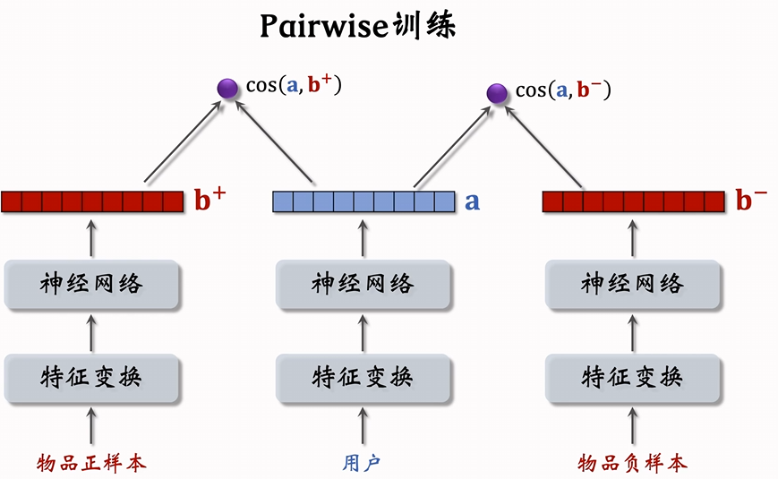
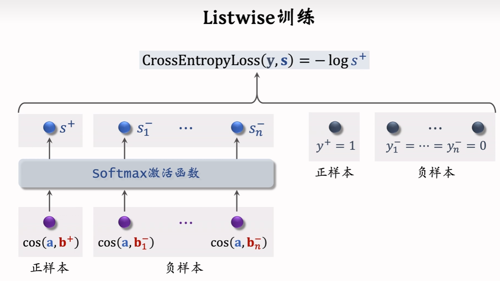

本文内容主要来自于[WangShuShen-RecommandSystem](https://space.bilibili.com/1369507485/channel/collectiondetail?sid=615109)的笔记

### 协同过滤 

基于物品的协同过滤

#### ItemCF

给用用户u推荐和用户u喜欢的物品x 相似的物品

$$
    \sum_j like(user,item_j) \times sim(item_j, item)
$$

例子:

根据上面的公式评估用户`user`对物品`item`的喜好程度

计算物品相似度: 两个物品的受从重合度越高,两个物品越相似

计算两个物品的相似度
- 喜欢物品$i_1$的用户记作$W_1$
- 喜欢物品$i_2$的用户记作$W_2$
- 定义交集用户数为$V = W_1 \cap W_2$

则两个物品的相似度为,这其实就是余弦相似度,
把一个物品表示为一个向量,向量的每个值就是用户对该物品的喜爱程度，
喜欢为1,不喜欢为0,计算两个物品的余弦相似度,
$$
    sim(i_1, i_2) = \frac{|V|}{\sqrt{|W_1| \times |W_2|}}
$$

考虑用户喜欢的程度,例如点击(1),点赞(2)，收藏(3)，转发还是余弦相似度
$$
    sim(i_1, i_2) = \frac{\sum_{u \in V} like(u,i_1) \times like(u,i_2)}{\sqrt{\sum_{u \in W_1} like^2(u,i_1)} \times \sqrt{\sum_{u \in W_2} like^2(u,i_2)}}
$$

ItemCF用户召回的流程

1. 事先做离线计算

- 建立"用户-物品"的索引
  
  记录用户最近点击,交互过的物品

  给定任意用户ID, 可以找到他最近喜欢的物品列表

- 建立"物品-物品"的索引
    
      计算物品两两之间的相似度

      对于每个物品, 索引它最相似的k个物品
      
      给定任意物品ID, 可以找到快速找到它最相似的k个物品

设定最近用户感兴趣的物品有$n$个,每个物品可以索引出$k$个最相似的物品,
那么这个召回通道就可以最多返回$n \times k$个物品,可以自行确定返回top-k的结果

#### UserCF

给用户u推荐和用户u相似的用户喜欢的物品

$$
    \sum_j sim(user,user_j) \times like(user_j, item)
$$

例子

计算两个用户的相似度(用物品表示用户)
- 用户$u_1$喜欢的物品集合记作$J_1$
- 用户$u_2$喜欢的物品集合记作$J_2$
- 定义交集$I = J_1 \cap J_2$

则两个用户的相似度为,这个公式仅仅是用户喜欢则为1,不是则为0

$$
    sim(u_1, u_2) = \frac{|I|}{\sqrt{|J_1| \times |J_2|}}
$$

避免热门物品

在上述的计算中,热门物品和冷门物品贡献的权重都是1
热门物品多数用户都喜欢
因此热门物品不具备区分用户之间不同的兴趣的能力,我们需要降低热门物品的权重

$$
    sim(u_1, u_2) = \frac{\sum_{l \in I} \frac{1}{\log(1+n_l)}}{\sqrt{|J_1| \times |J_2|}}
$$

$n_l$是喜欢物品$l$的用户数量,反映物品的热门程度

UserCF用户召回的流程

1. 事先做离线计算

- 建立"用户-物品"的索引
  
  记录用户最近点击,交互过的物品

  给定任意用户ID, 可以找到他最近喜欢的物品列表

- 建立"用户-用户"的索引
    
      计算用户两两之间的相似度

      对于每个用户, 索引它最相似的k个用户
      
      给定任意用户ID, 可以找到快速找到它最相似的k个用户

设定用户可以索引出$k$个最相似的用户,每个用户有最近喜欢的物品有$n$个,
那么这个召回通道就可以最多返回$n \times k$个物品,
可以自行确定返回top-k的结果

### 双塔模型

双塔模型指分别存在一个用户塔和物品塔,分别用来编码用户的特征和物品特征

用户ID,用户离散特征,用户连续特征 -> 特征变换 -> 神经网络 —> embedding

物品ID,物品离散特征,物品连续特征 -> 特征变换 -> 神经网络 —> embedding

然后两者计算内积相似度,从而判定两者的相关性

双塔模型训练有三种方式

1. Pointwise, 独立看待每个正样本和负样本,把正样本和负样本组成一个数据集,将该任务当作正负样本的二分类任务来做
2. Pairwise, 每次取一个正样本和负样本组成二元组,采用triple H loss 或者Triple log Loss来进行训练
3. Listwise 每次取一个正样本和多个负样本组成一个List,训练方式类似于多元分类

正负样本选择
- 正样本: 用户点击的物品
- 负样本
    - 没有被召回的
    - 召回但是被粗排淘汰的
    - 曝光但是未被点击的

Pointwise训练
- 把召回看作二元分类任务
- 对于正样本,鼓励$cos(a,b)$ 接近 +1
- 对于正样本,鼓励$cos(a,b)$ 接近 -1
- 控制正负样本数量控制在$1:2$ 或者 $1:3$

pairwise训练

pairwise鼓励$cos(a,b^+) > cos(a,b^-)$

损失函数和三元组损失类似
triplet hinge loss
$$ 
L(a,b^+,b^-) = max\{cos(a,b^-) - cos(a,b^+) + m,0\}
$$

triplet logistic loss

$$
L(a,b^+,b^-)  = \log (1 + exp[\sigma \cdot (cos(a,b^-) - cos(a,b^+))])
$$
其中$\sigma > 0$ 是超参数

Listwise
- 一条数据包括
  - 一个用户,特征向量记作$a$
  - 一个正样本,特征向量记作$b^+$
  - 多个负样本,特征向量记作$b^-_1,b^-_2,...,b_n^-$
- 鼓励$cos(a,b^+)$尽量大
- 鼓励$cos(a,b^-_1),...,cos(a,b^-_n)$尽量小

正负样本选择:
- 正样本: 曝光而且有点击的`用户-物品二元组`

- 问题: 根据二八法则，少部分的样本占据了大部分的点击,导致正样本大多是热门物品
- 解决方案； 过采样冷门物品,或者将采样热门物品
  - 过采样(up-sampling):一个样本出现多次
  - 降采样(down-sampling): 以一定的概率抛弃样本

负样本选择
1. 没有被召回的
2. 被召回的,但是没有被选中的
3. 被曝光，但是用户没有点击的

简单负样本:全体物品

- 未被召回的物品,大概率是用户不感兴趣的
- 未被召回的物品 $\approx$ 全体物品
- 从全体物品中做抽样,组为负样本
- 均匀抽样 or 非均有抽样

采用均匀抽样：对冷门物品不公平
如果均匀抽样产生负样本,负样本大多是冷门物品

非均匀抽样：目的是打压热门物品
- 负样本抽样概率与热么程度(点击次数)正相关
- 抽样概率 正比于 (点击次数)的0.75次方 0.75是经验值

简单负样本:batch内负样本(把batch内的其他用户点击的样本作为负样本)

问题
- 一个物体出现在batch内的概率 正比于 点击次数

困难负样本
- 被粗排淘汰的物品(比较苦难)
- 精排中分数靠后的物品(非常困难)

训练召回模型不能用曝光但是未点击的样本作为负样本

有曝光但是未点击的样本适用于排序模型训练

**双胎模型做线上服务和模型更新**

1. 把物品计算得到的向量存入向量数据库中
2. 用户请求推荐时,实时计算用户特征向量,然后在向量数据库中查找
   
用户特征实时计算的原因:因为用户兴趣改变很快,而物品特征相对比较稳定,而且用户特征向量的计算量比较小,可以允许实时计算用户向量

模型更新

全量更新:
- 今天凌晨,用昨天的全天的数据训练模型
- 在昨天模型参数的基础上做训练
- 用昨天的数据训练1epoch,即每天数据只用一次(数据需要打乱)
- 发布新的用户塔和物品向量,供线上召回使用
- 全量更新对数据流,系统的要求比较低

增量更新：做online learning更新模型参数
- 用户兴趣会随时发生变化
- 实时收集线上数据,做流式处理,生成TFRecord文件
- 对模型做online learing,增量更新ID Embedding参数(不更新神经网络其他的参数)
- 发布用户ID Embedding参数,供用户塔在线计算用户向量

增量更新的参数不会被带到今天凌晨的全量更新中

是否可以只做增量更新,而不做全量更新? 不行
1. 小时数据有偏
2. 全量更新时random shuffle一天的数据做 1 epoch训练
,而增量更新是按照数据从早到晚的顺序，做 1 epoch训练

## 粗排

## 精排

## 重排
