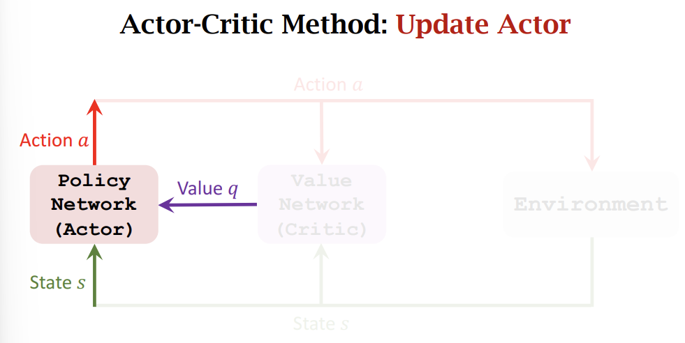
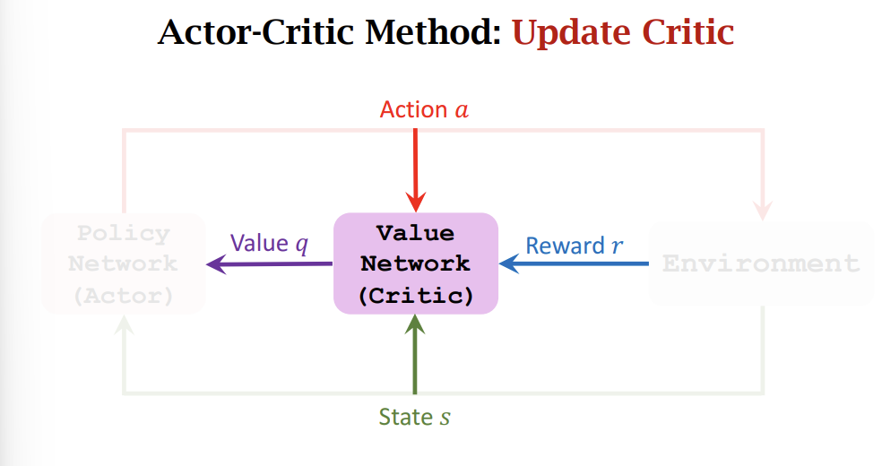

# Actor Critic
Actor Critic方法有两个神经网络，一个是Actor，一个是Critic。Actor的作用是输出动作，Critic的作用是评估Actor的输出。

Actor 是policy network，
Actor使用[policy gradient](/rl/policy-based-rl/)来更新参数。
Critic 是value network。
Critc使用TD算法来更新参数。

Actor近似$\pi(\cdot|s,\boldsymbol{\theta})$
以离散动作为例,Actor网络的输入状态$s$，输出动作$a$的概率分布。

Critic近似$Q_\pi(s,a)$
以离散动作为例,Critic网络的输入状态$s$，输出各个动作的价值$Q_\pi(s,a)$。(参考[Sarsa算法](/rl/sarsa))

Actor Critic示意图

Update Actor

Update Critic

# Reference

1. [DRL](https://github.com/wangshusen/DRL)
