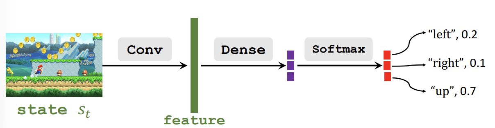

目前强化学习相关的内容全部来自于[DRL](https://github.com/wangshusen/DRL)
我也只是把一些基本的概念写下来，防止自己忘记了

# Policy Based Reinforcement Learning

## 近似Policy Function

Policy函数 $\pi(a|s)$ 是一个概率分布，它表示在状态 $s$ 下，采取动作 $a$ 的概率。如果我们直接学习得到Policy函数,那么我们直接从这个概率密度函数中采样,就可以确定Agent的动作。

因为State和Action的组合太多了，因此我们无法直接学习Policy函数，因此我们使用神经网络 $\pi(a|s;\boldsymbol{\theta})$ 来近似Policy函数。

- 使用policy network $\pi(a|s;\boldsymbol{\theta})$ 来近似 $\pi(a|s)$ 
- 可训练参数是 $\boldsymbol{\theta}$ 

## 搭建Policy Network

网络的输入是State，输出是Action的概率分布。以马里奥游戏为例子,我们可以这样构建网络

## Policy Gradient

评测policy的好坏我们使用状态价值函数，在状态$s_t$下,如果 $\pi$ 越好,那么状态价值函数 $V_\pi(s_t)$ 就越大。

状态价值函数的定义(离散情况)
$$
V_\pi(s_t) = \mathbb{E}_{A}[Q_\pi(s_t,A)] = \sum_a \pi(a|s_t) \cdot Q_\pi(s_t,a)
$$
将$\pi(a|s_t;\boldsymbol{\theta})$代入,得到

$$
V_\pi(s;\boldsymbol{\theta}) = \sum_a \pi(a|s_t;\boldsymbol{\theta}) \cdot Q_\pi(s_t,a)
$$

Policy-based learning通过最大化$J(\boldsymbol{\theta}) = \mathbb{E}_S [V(S;\boldsymbol{\theta})]$来学习参数$\boldsymbol{\theta}$。

更新$\boldsymbol{\theta}$的的方式就是通过策略梯度
- 观察到状态$s_t$
- Update policy network by $\boldsymbol{\theta} \leftarrow \boldsymbol{\theta} + \beta \cdot \frac{\partial{V(s;\boldsymbol{\theta})}}{\partial \boldsymbol{\theta} }$
  
其中 $\beta$ 是学习率, $\frac{\partial{V(s;\boldsymbol{\theta})}}{\partial \boldsymbol{\theta} }$ 就是策略梯度

对策略梯度做一些变换
$$
\begin{aligned}
\frac{\partial{V(s;\boldsymbol{\theta})}}{\partial \boldsymbol{\theta} } 
&= \frac{\partial \sum_a \pi(a|s;\boldsymbol{\theta}) \cdot Q_\pi(s,a)}{\partial \boldsymbol{\theta}} \\
&= \sum_a \frac{\partial \pi(a|s;\boldsymbol{\theta})}{\partial \boldsymbol{\theta}} \cdot Q_\pi(s,a) \\
&= \sum_a \pi(a|s;\boldsymbol{\theta}) \cdot \frac{\partial \log \pi(a|s;\boldsymbol{\theta})}{\partial \boldsymbol{\theta}} \cdot Q_\pi(s,a) \\
&= \mathbb{E}_{A \sim \pi(\cdot |s;\boldsymbol{\theta})} [\frac{\partial \log \pi(A|s;\boldsymbol{\theta})}{\partial \boldsymbol{\theta}} \cdot Q_\pi(s,A)]
\end{aligned} 
$$
变换的第二步我们假定了 $Q_\pi(s,a)$ 和 $\theta$ 无关,来简化推导,但是实际上不是这样的,但是结论是一样的。 

变换第三步,将偏导分子变为 $e^{\log \pi(a|s;\boldsymbol{\theta})}$ 然后求导展开即可。

因此我们得到策略梯度
$$
\frac{\partial{V(s;\boldsymbol{\theta})}}{\partial \boldsymbol{\theta} } = \mathbb{E}_{A \sim \pi(\cdot |s;\boldsymbol{\theta})} [\frac{\partial \log \pi(A|s;\boldsymbol{\theta})}{\partial \boldsymbol{\theta}} \cdot Q_\pi(s,A)]
$$

在使用策略梯度时,期望仍然不容易求,我们采用Monte Carlo方法来估计期望。

1. 在 $\pi(\cdot|s;\boldsymbol{\theta})$ 中随机采样动作 $\hat{a}$
2. 计算 $g(\hat{a},\boldsymbol{\theta})=\frac{\partial \log \pi(\hat{a}|s;\boldsymbol{\theta})}{\partial \boldsymbol{\theta}} \cdot Q_\pi(s,\hat{a})$

$g(\hat{a},\boldsymbol{\theta})$ 是 $\frac{\partial{V(s;\boldsymbol{\theta})}}{\partial \boldsymbol{\theta} }$ 的无偏估计,因此我们将其作为策略梯度的近似值

## 使用策略梯度更新policy network 

1. 观察到状态 $s_t$
2. 采样动作 $a_t \sim \pi(\cdot|s_t;\boldsymbol{\theta})$
3. 计算 $q_t \approx Q_\pi(s_t,a_t)$(需要估计)
4. 计算导数 $\boldsymbol{d}_{\theta,t} = \frac{\partial \log \pi(a_t|s_t;\boldsymbol{\theta})}{\partial \boldsymbol{\theta}}|_{\boldsymbol{\theta}=\boldsymbol{\theta_t}}$
5. 得到近似的策略梯度 $\boldsymbol{g}(a_t,\boldsymbol{\theta_t}) = q_t \cdot \boldsymbol{d}_{\theta,t}$
6. Update policy network by $\boldsymbol{\theta} \leftarrow \boldsymbol{\theta} + \beta \cdot \boldsymbol{g}(a_t,\boldsymbol{\theta_t})$

在上面的过程中只有第三步的 $q_t$ 我们并不知道,需要估计,下面介绍两种估计$q_t$的方式

- **REINFORCE**
 
玩一局完整的游戏,得到游戏如下的游戏轨迹
$$
\tau = (s_1,a_1,r_1,\cdots,s_T,a_T,r_T)
$$

计算discounted return $u_t=\sum_{k=t}^T \gamma^{k-t} r_k \ \text{for all} \ t$
因为$Q_\pi(s_t,a_t) = \mathbb{E}[U_t]$，因此我们使用$u_t$来近似$Q_\pi(s_t,a_t)$

从而得到 $q_t = u_t$

- **使用神经网络近似$Q_\pi(s_t,a_t)$**

    这种方式对应[actor-critic](/rl/actor-critic/)方法

# Reference

1. [DRL](https://github.com/wangshusen/DRL)