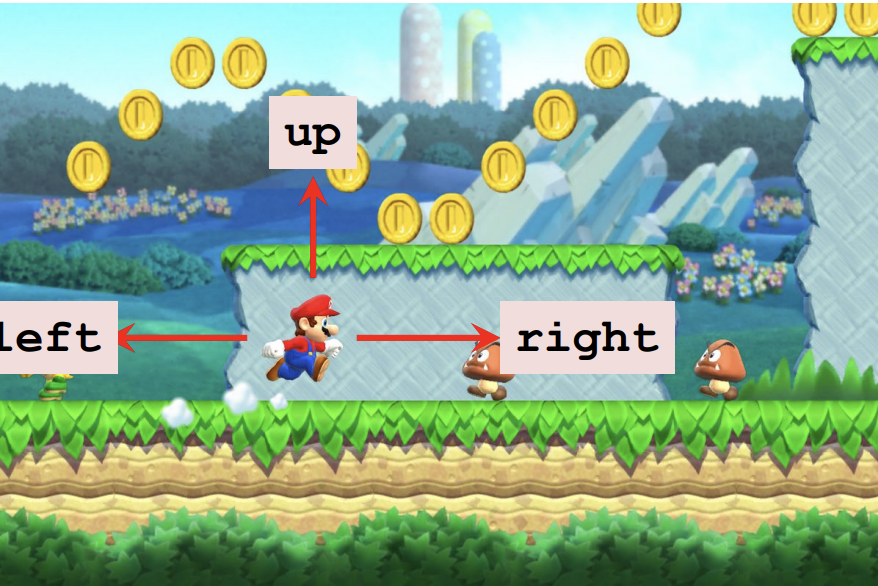
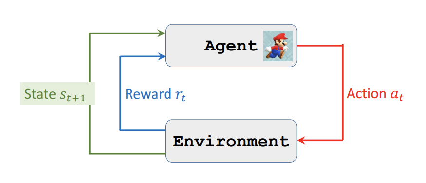
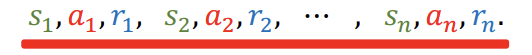

目前强化学习相关的内容全部来自于[DRL](https://github.com/wangshusen/DRL)
我也只是把一些基本的概念写下来，防止自己忘记了

这里使用大写字母对应随机变量,使用小写字母对应随机变量的一个采样

# state and action
- **Agent**(代理)：强化学习中的主体，可以是机器人、人、动物等。
- **Action**(动作)：代理在某一时刻可以采取的行为。
- **State**(状态)：代理在某一时刻的状态。

以超级马里奥游戏为例子，某一帧的游戏画面可以看成是一个状态state。马里奥是Agent,马里奥可以采取的Action是离散的。
Action $a \in \{ left,right,up \}$,也存在action连续的场景,比如自动驾驶方向盘移动的角度。

state `s` 可以是这帧游戏图像

Action $a \in \{ left,right,up \}$

- **Policy** $\pi$

策略

Policy function $\pi$是一个PDF,它描述了在某一状态下,Agent采取某一action的概率。

$$
 \pi(a | s) = P(A=a|S=s)
$$

$\pi(A=a|S=s)$表示在$S=s$，动作采取$A=a$的概率,即在某一个状态s下,采用某一个action a的概率。

仍然使用超级马里奥举例,
这里$\pi$是一个离散的概率分布,可以是如下的样子
- $\pi(left | s) = 0.2$
- $\pi(right | s) = 0.1$
- $\pi(up | s) = 0.7$

在给定了satate $S=s$之后,Agent可以依据Policy,从中采样一个动作a。

# Reward 

readward $R$

- 代理在某一时刻采取某一动作后,环境给予的反馈。

  这里仍然以超级马里奥举例,在马里奥做出如下的动作之后,环境可以按照下面的方式给予反馈。
  - Collect a coin: R = +1
  - Win the game: R = + 10000
  - Touch a enemy: R = -10000
  - Nothing happens: R = 0

# state transition

状态转移

从一个旧的状态,Agent采取了某一种动作,然后转移到了新的状态。

state transition 可能是随机的,这个随机性来自于环境。

例如在马里奥游戏中,我们也不知道下一时刻敌人会怎么移动。

$$
 p (s^\prime |s,a) = P(S=s^\prime | S=s,A=a)
$$
表示$S=s,A=a$下,状态S转移到$s^\prime$的概率。
## 随机性的来源

- Action的随机性,因为Action是从Policy采样的。
  
$$
 A \sim \pi(\cdot | s)
$$

- 状态转移的随机性

$$
 S^\prime \sim p(\cdot | s,a)
$$

## Agent-Environment Interaction

## Play game using AI(Model Interface)

- 当前的状态$s_t$,选择动作$a_t \sim \pi(\cdot | s_t)$，然后执行动作$a_t$。
- 环境给予新的状态$s_{t+1}$和奖励$r_{t}$。

从而形成`{state, action, reward, ... }`轨迹,直到游戏结束,如下

一个好的策略$\pi$应该是能够最大化累计reward(也就是Return)的策略。

## Rewards and Returns

- **Retrun**：累计将来的所有时候的reward之和,使用$U_t$表示,还有常见的表示方式为$G_t$

$$
U_t = R_t + R_{t+1} + R_{t+2} + \cdots + R_n
$$

由于时间的不同,越靠后的奖励是越不确定的,因此需要打一定的折扣,所以就有下面的定义

- **Disconted Return**: 累计将来的所有时候的带有折扣的reward之和

$$
U_t = R_t + \gamma R_{t+1} + \gamma^2 R_{t+2} + \cdots + \gamma^{n-t} R_n
$$

$U_t$是一个随机变量,因为我们必须直到游戏结束才能观察到一个$U_t$的确定值。这个随意变量依赖于$R_t,...,R_n$,而$R_t,...,R_n$又依赖于$S_t,...,S_n$和$A_t,...,A_n$。

因此$U_t$是依赖于$S_t,...,S_n$和$A_t,...,A_n$的随机变量。

## Value Function

价值函数,分为两种,分别是State Value Function和Action Value Function。

- **Action-Value Function** $Q_\pi (s,a)$,定义如下

$$
Q_\pi (s_t,a_t) = E_\pi [U_t | S_t = s_t, A_t = a_t]
$$

根据$U_t$的定义,$U_t$是依赖于$S_t,...，S_n$和$A_t,...,A_n$的随机变量。

我们将$S_{t+1},...S_n$和$A_{t+1},...，A_n$全部求期望积掉，并且将$S_t = s_t,A_t = a_t$作为已知的观测量,就会得到Action-Value Function $Q_\pi (s_t,a_t)$。

$Q_\pi (s_t,a_t)$衡量了当前状态$s_t$下,采取动作$a_t$的价值。

$Q_\pi (s_t,a_t)$依赖于$s_t,a_t,\pi,p$
。
- **State-Value Function** $V_\pi (s)$,定义如下

$$
V_\pi (s) = E_{A_t} [Q_\pi (s_t,A_t)]
$$
将$Q_\pi (s_t,A_t)$对$A_t$求期望积掉,就会得到State-Value Function $V_\pi (s_t)$。因为$Q_\pi(s_t)$反映了当前状态的好坏,对于游戏来说,可以反映当前是快要赢了还是快要输了。

如果动作是离散的，则有

$$
V_\pi (s) = E_{A_t} [Q_\pi (s_t,A_t)] = \sum_{a} \pi(a|s_t) Q_\pi (s_t,a)
$$

如果动作是连续的，则将求和换成积分
$$
V_\pi (s) = E_{A_t} [Q_\pi (s_t,A_t)] = \int \pi(a|s_t) Q_\pi (s_t,a) da
$$

## 评测强化学习算法

利用OpenAI Gym的环境,评测强化学习算法。里面会提供一些标准场景。

# Reference

1. [DRL](https://github.com/wangshusen/DRL)

 
