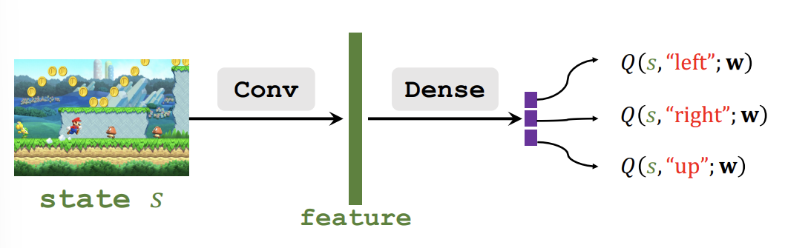

目前强化学习相关的内容全部来自于[DRL](https://github.com/wangshusen/DRL)
我也只是把一些基本的概念写下来，防止自己忘记了

需要先确认好动作价值函数$Q_\pi(s_t,a_t)$和状态价值哈数$V_\pi(s_t)$的概念。

## Optimal action-value function

最优动作价值函数$Q^*(s_t,a_t)$定义如下
$$
Q^*(s_t,a_t) = \max_\pi Q_\pi(s_t,a_t)
$$
最优动作价值函数固定$\pi$为最好的策略$\pi$，因为在当前状态$s_t$下，采取动作$a_t$的最好结果也就是$Q^*(s_t,a_t)$

## DQN(deep Q-Network)

DQN通过寻找最优动作价值函数$Q^*(s_t,a_t)$来确定动作。

如果我们已经知道了$Q^*(s_t,a_t)$,那么我们的最好动作$a^*_t$也就确定了
$$
a^* = \arg\max_{a_t} Q^*(s_t,a_t)
$$

但是我们实际上不知道$Q^*(s_t,a_t)$，因此我们使用神经网络来近似$Q^*(s_t,a_t)$

使用神经网络$Q(s,a;\bold{w})$来近似$Q^*(s_t,a_t)$，其中$\bold{w}$是神经网络的参数。

我们仍然使用马里奥游戏来举例神经网络应该如何设计(离散情况)

我们将游戏画面($s_t$)作为state,通过Conv提取特征,然后使用Dense转为固定的维度(动作的个数),最后经过Softmax转为概率,代表了每个动作的概率。

在使用DQN时,每次选择概率最大的动作作为当前时刻$t$选择的动作。然后环境根据$s_t$和$a_t$,给出奖励$r_t$和下一个状态$s_{t+1}$

在训练DQN时,采用[Q-learning算法](/rl/q-learning/)

# Reference

1. [DRL](https://github.com/wangshusen/DRL)

