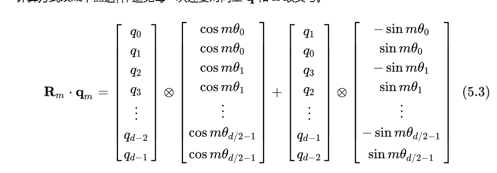

写的一拖四,权当我自己一个人看了

Reference:

1. [一文看懂 LLaMA 中的旋转式位置编码（Rotary Position Embedding）](https://zhuanlan.zhihu.com/p/642884818)

# 基本概念

1. 一个长度为n的序列
   
$$
    S_N = \{w_i \}_{i=1}^N
$$

其中$w_i$表示输入序列中第`i`个token,而输入序列$S_N$对应的embedding表示为:

$$
    E_N = \{x_i \}_{i=1}^N
$$

其中$x_i$表示第`i`个token对应的`d`维词向量

在计算self-attention之前,会用embedding向量计算q,k,v三组向量,并且在其中加入位置信息。
使用函数公式表达如下:

$$
    q_m = f_q(x_m,m) \\
    k_n = f_k(x_n,n) \\
    v_n = f_v(x_n,n) \\
$$

其中

`q_m`表示第`m`个token对应的query向量,通过`x_m`向量,加入位置信息`m`,使用函数`f_q`计算得到

`k_n`表示第`n`个token对应的key向量,通过`x_n`向量,加入位置信息`n`,使用函数`f_k`计算得到

`v_n`表示第`n`个token对应的value向量,通过`x_n`向量,加入位置信息`n`,使用函数`f_v`计算得到

第m个embedding向量`x_m`对应的self-attention输出计算方式,是将`q_m`和所有的`k_n`做点积,然后再做softmax,最后再和所有的`v_n`做加权求和,公式表达如下:

$$
    a_{m,n} = \cfrac{\exp(\frac{q_m^T k_n}{\sqrt{d}})}{\sum_{j=1}^N \exp(\frac{q_m^T k_j}{\sqrt{d}})} \\
    o_m = \sum_{n=1}^N a_{m,n} v_n
$$

# 绝对位置编码

绝对位置编码是常规的做法,即将位置信息直接加入到embedding向量中,公式表达如下:

$$
    f_{\{q,k,v\}} (x_i,i) = W_{\{q,k,v\}} (x_i + p_i)
$$

最暴力的方式是直接使用`nn.Embedding`保存对应的位置编码,然后是这个模块可训,BERT模型就是这么做的

在`Attention is all you need`中提出了一种正余弦相对位置编码,表达相对位置关系信息,计算方式如下:

$$
    p_{\{pos,2i\}} = sin(\cfrac{pos}{10000^{\frac{2i}{d}}}) \\
    p_{\{pos,2i+1\}} = cos(\cfrac{pos}{10000^{\frac{2i}{d}}})
$$
其中,`p_{i,2t}`表示在位置`i`上的位置向量(`d`维向量)中的第`2t`个元素,`p_{i,2t+1}`表示在位置`i`上的位置向量(`d`维向量)中的第`2t+1`个元素

因此公式1表示`d`维向量中偶数维度的元素值,,公式2表示`d`维向量中奇数维度的元素值

python代码实现如下

```python

def _get_sincos_position_embedding(seq_len:int):
    """
        d_model:embedding向量的维度
        seq_len:序列的长度
    """
    def get_position_angle_vec(pos:int):
        return [ pos / np.power(10000, 2 * (i // 2) / d_model) for i in range(d_model)]
    
    # position_angle_vecs.shape = (seq_len, d_model)
    position_angle_vecs = np.array([get_position_angle_vec(pos) for pos in range(seq_len)])

    # 计算sin值与cos值
    position_angle_vecs[:,0::2] = np.sin(position_angle_vecs[:,0::2]) # 偶数维度
    position_angle_vecs[:,1::2] = np.cos(position_angle_vecs[:,1::2]) # 奇数维度

    # position_angle_vecs.shape = (1, seq_len, d_model)
    position_embeddings = torch.FloatTensor(position_angle_vecs).unsqueeze(0)
    return position_embeddings

```

# 旋转位置编码

Reference 
1. [Transformer升级之路：2、博采众长的旋转式位置编码](https://zhuanlan.zhihu.com/p/359502624)
2. [旋转式位置编码 (RoPE) 知识总结](https://zhuanlan.zhihu.com/p/662790439)

假定query向量`q_m`和key向量`k_n`之间的内积操作可以被一个函数`g`表示,该函数输入是词嵌入向量`x_m`和`x_n`以及他们之间的相对位置`m-n`

添加绝对位置信息
$$
    q_m = f_q(x_m,m) \\
    k_n = f_k(x_n,n) \\
$$

假设做内积的结果可以使用$g(q,k,m-n)$来表示,m-n是相对位置

$$
    <f_q(x_m,m),f_k(x_n,n)> = g(x_m,x_n,m-n) 
$$

接下来的目标时找到一个等价的位置编码方式,使得上述关系成立,假定现在词嵌入向量维度`d=2`,RoPE的论文提出了一个满足上述关系的`f`和`g`函数,如下:
$$
    f_q(x_m,m) = (W_qx_m)e^{im\theta} \\
    f_k(x_n,n) = (W_kx_n)e^{in\theta} \\
    g(x_m,x_n,m-n) = Re[(W_q x_m)(W_k x_n)^* e^{i(m-n)\theta}]
$$

推导RoPE涉及复平面的知识,在这里进行补充

from [复数、复平面、旋转向量](https://zhuanlan.zhihu.com/p/55748761)

1. `Im`指复数的虚部,`Re`指复数的实部

[from wikipedia](https://zh.wikipedia.org/wiki/%E5%A4%8D%E5%B9%B3%E9%9D%A2):
数学中，复平面（英语：Complex plane）是用水平的实轴与垂直的虚轴建立起来的复数的几何表示。一个复数的实部用沿着 x-轴的位移表示，虚部用沿着 y-轴的位移表示。


2. 欧拉公式
   $$
         e^{i\theta} = cos(\theta) + isin(\theta)
   $$
结合欧拉公式,向量$e^{j\theta}$就是一个单位长度,旋转角度为$\theta$的复向量


3. 共轭复数
   中学数学中我们就学到了共轭复数的定义
    $$
          (a+bi)^* = a-bi
    $$
    因此这两个复数实部相同,虚部相反,因此放到复平面中,就是关于实轴(x轴)对称的两个点


4. 复数内积
    在复平面中,复数内积的定义和向量内积类似,比如两个复向量$(a,b) => a + bi, (c,d) => c + di$,内积即为$ac+bd$,因此我们可以验证得到
$$
    <q, k> = Re[q k*] \\
    <(a + bi), (c+di)> = Re[(a+bi) (c+di)^*] \\
    \begin{aligned}
            & = Re[ac+bd + (bc - ad)i] \\
            & = ac + bd
    \end{aligned}
$$

$R_m q_m$ 表示将向量q_m旋转角度m

$$
score(q_m,k_n) = (R_m q_m)^T (R_n k_n) \\
$$


实现公式:


变换,通过提前计算好sin和cos来避免对q和k取负号


基础方案
$$
    \theta = 10000^{-2i/d} \\
$$

i表示分组索引,取值范围为$[0, d/2)$,即$[0,2d-1]$,对应的\theta_i取值范围为$[1, 10^{-4}]$,是单调递减函数

线性内插
$$
    \theta_i = 10000^{-2i/d} \cdot k^{-1} \\
$$
k是 推理时的最大长度比训练时最大长度,且$k>1$

因此这种公式的想法是将推理时旋转的角度映射到推理时的角度范围,确保推理时向量旋转角度在预训练向量旋转角度范围之内

# NTK-aware Scaled RoPE

修改$\theta_i$取值公式为
$$
    \begin{aligned}
    \theta_i & = (10000 \cdot k) ^{-2i/d} \\
           & = 10000^{-2i/d} \cdot k^{-2i/d} \\
    \end{aligned}
$$

这种方式可以理解为灵活缩放,在维度靠前的位置直接外推,在维度靠后的位置线性内插,需要主义的是实际上i取不到d/2,最大取到$d/2-1$因此为了保证最后一组是线性内插,需要按如下修改

$$
    \begin{aligned}
    \theta_i & = (10000 \cdot k^{d/(d-2)}) ^{-2i/d} \\
           & = 10000^{-2i/d} \cdot k^{-2i/(d-2)} \\
    \end{aligned}
$$

更加一般的公式

$$
    \begin{aligned}
    \theta_i & = (10000 \cdot (\alpha k -\alpha + 1)^{d/(d-2)}) ^{-2i/d} \\
           & = 10000^{-2i/d} \cdot (\alpha k -\alpha + 1)^{-2i/(d-2)} \\
    \end{aligned}
$$

$$
 \alpha(k-1) + 1
$$
其中$\alpha$是一个超参数,且$\alpha > 1$,作者发现$\alpha = 2$ 效果不错


# past-key-values参数


past-key-values只在推理时使用

huggface文档给出的类型

(tuple(tuple(torch.FloatTensor)), optional, returned when use_cache=True is passed or when config.use_cache=True)

第一个tuple的元组长度为`config.n_layers`,第二个tuple的元组长度为2,第一个元素是key,第二个元素是value,每个元素的shape为`(batch_size, seq_len, num_heads, head_dim)`,不同的模型可能前后维度不一样,但是肯定是这四个参数

包含之前计算的self-attention模块和cross-attention模块的key和value

如果使用`past_key_values`,那么输入的`input_ids`可以只输入最后一个`input_ids`, shape是`(batch_size, 1)`,来代替所有的input_ids(shape is `(batch_size, seq_len)`)

在一开始模型开始计算的时候`past_key_values`一定等于`None`

在一次计算之后,`past_key_values`的值就是上一次attn计算中key和value的值,attn模块会记录key和value的值,并且做返回,外围包装函数来处理这些返回的key和value

如何在attn计算中使用这些key和value,首先了每一层就传每一层对应的key和value,然后将一个token的key和value与之前的`past_key`和`past_value`拼接即可


past-key-value结合旋转位置编码
