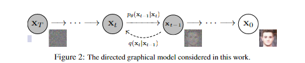
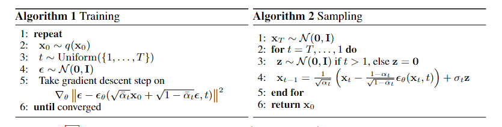

**高斯分布的概率密度函数(PDF)**
$$
p(x|\mu,\Sigma) = \frac{1}{(2 \pi) ^{\frac{d}{2}} |\Sigma|^{\frac{1}{2}}} exp(-\frac{1}{2}(x-\mu)^T\Sigma^{-1}(x-\mu))
$$
# 扩散概率模型(DDPM)

DDPM(2020)

**马尔可夫假设(一阶)**

当前时刻的概率至于上一时刻有关，与更前的时刻无关，使用马尔可夫假设可以简化联合分布全概率公式 

在一阶马尔可夫假设下(A->B->C) 
$$
\begin{align}
P(A,B,C) 
&  = P(A,B,C) \\ 
& = P(C|B,A)P(B,A) \\
& = P(C|B,A)P(B|A)P(A) \\
& = P(A)P(B|A)P(C|B) \\
\end{align} \tag 1
$$
**重参数技巧**

如果希望从高斯分布$N(\mu,\sigma^2)$中采样，可以先从标准分布N(0,1)采样出$z$,在得到$\sigma * z + \mu$。这样做的好处是将随机性转移到了z这个常量上，而$\sigma$和$\mu$则当作网络的一部分。对$\sigma$好$\mu$均是可导的

**Diffusion Model 图示**

整体图示都视为一阶马尔科夫链



$x_0$是初始分布,$x_T$是扩散之后分布

扩散过程=>我们在原始分布上加噪，一直加加加，到$x_T$时就已经是一个各项独立的噪声分布了

逆扩散过程=>基于一个噪声分布，将原始分布推导出来，然后从原始分布中采样新的样本，从而获得新的图像

## 扩散过程

- 给定初始数据分布$x_0 \sim q(x)$,可以不断地向分布中添加高斯噪声，该噪声的标准差是以固定值$\beta_t$确定的，均值是以固定值$\beta_t$和当前$t$时刻的数据$x_t$决定的，这个过程是一个一阶马尔科夫链
- 随着$t$的不断增大，最终数据分布$x_T$变成了一个各向独立的高斯分布

我们每次加噪是一个不含参的过程，噪声服从（6）式的高斯分布，均值是$\sqrt{1-\beta_t} x_{t-1}$,协方差是$\beta_t I$
$$
q(x_t|x_{t-1}) = N(x_t;\sqrt{1-\beta_t} x_{t-1},\beta_t I) \tag 2
$$
联合概率分布，一阶马尔可夫假设下全概率公式
$$
q(1:T|x_0) =  \prod_{t=1}^{T}q(x_t|x_{t-1})  \tag 3
$$
如何从$q(x_t|x_{t-1})$，中采样得到$x_t$，我们采用上面描述的重参数技巧，先从$ \mathcal{N}(0,\bold{I}) $获得一个采样值$z$，然后 $x_{t} = \sqrt{\beta_t} z + \sqrt{1-\beta_t}x_{t-1}$ $\beta_t \in (0,1)$是自己设置，并且随着t增大，$\beta_t$越来越大

因为整体过程是不含参数，对于任意时刻的$x_t$，我们都可以直接求解

$$
\begin{aligned}
& 令 \alpha_t = 1 -\beta_t, \overline a_t = \prod_{i=1}^T \alpha_i \\\
x_t & = \sqrt{\alpha_t}x_{t-1} + \sqrt{1-\alpha_t}  z_{i-1} \\\
& = \sqrt{\alpha_t \alpha_{t-1}}x_{t-2} +\sqrt{a_t (1-\alpha_{t-1})}z_{t-2} + \sqrt{1-\alpha_t}  z_{i-1} \\\
& = \sqrt{\alpha_t \alpha_{t-1}}x_{t-2} + \sqrt{1-\alpha_t \alpha_{t-1}} \overline z_{t-2}\\\
& = ... \\\
& = \sqrt{\overline \alpha_t} x_0 + \sqrt{1-\overline \alpha_t} z\\\
\end{aligned}
$$
这里 $\sqrt{a_t (1-\alpha_{t-1})}z_{t-2} + \sqrt{1-\alpha_t}  z_{i-1}$ 仍然可以重整化

对于两个高斯分布，$X \sim \mathcal{N}(\mu_1,\sigma_1^2)$和$Y \sim \mathcal{N}(\mu_2,\sigma_2^2)$

叠加之后的分布$aX + bY$的均值是$a \mu_1 + b \mu_2$,方差是$a^2 \sigma_1^2 + b^2 \sigma_2^2$，我们套用式子，可以知道后面两项的和服从$N(0,1-\alpha_t \alpha_{t-1})$,因此可以替换

所以$q(x_t|x_0) \sim N(x_t;\sqrt{\overline \alpha_t}x_0,1-\overline \alpha_t I)$

因此我们可以自己算出大概需要多少步迭代，$q(x_t|x_0)$接近一个标准的高斯分布,DDPM论文里面取1000步

**总结，前向扩散过程,下面两个式子是最重要的**

$\epsilon$表示t时候从标准高斯分布中得到的采样值

从$x_{t-1}$到$x_t$ 
$$
x_{t} = \sqrt{\beta_t} \epsilon_t + \sqrt{1-\beta_t} x_{t-1} \tag 4
$$
从$x_0$到$x_t$，$\epsilon$表示上面推导过程中的$z$,表示我们从$x_0$到$x_t$，只需要做一次标准高斯分布采样
$$
x_t = \sqrt{\overline \alpha_t} x_0 + \sqrt{1- \overline \alpha_t} \epsilon \tag 5
$$


## 逆扩散过程

从$x_T$逐渐恢复到$x_0$

假设$P(x_{t-1}|x_t)$也是一个高斯分布(实际上当我们确定一部扩散加的噪音足够小的时候,可以推理出它是一个高斯分布,但是涉及了微分方程,不会喵 :sob: )

但是我们没法逐步地去拟合分布，计算量过大，我们这里希望构建一个网络$\theta$来完成这件事

$$
\begin{aligned}
& P_{\theta}(x_{0:T}) = p(x_T) \prod_{t=1}^T p_{\theta}(x_{t-1}|x_t) \\\
& p_{\theta}(x_{t-1}|x_t) = N(x_{t-1};\mu_\theta(x_t,t),\Sigma_\theta(x_t,t)) \\\
\end{aligned} \tag 6
$$

最基础的假设，我们假定了$p_{\theta}(x_{t-1}|x_t)$是高斯分布，参数只存在于这个高斯分布的均值和方差中。

后验的扩散条件概率$q(x_{t-1}|x_t,x_0)$的计算，即给定$x_t,x_0$，我们可以计算得到$x_{t-1}$
$$
\begin{align}
q(x_{t-1}|x_t,x_0) 
& = \frac{q(x_{t-1},q_t,x_0)}{q(x_t,x_0)} \\\
 & = \frac{q(x_{t}|x_{t-1},x_0)* q(x_{t-1},x_0)} {q(x_t,x_0)}\\\
 & = q(x_{t}|x_{t-1},x_0) \frac{q(x_{t-1}|x_0)}{q(x_t|x_0)} \\\
 & = q(x_t|x_{t-1}) *\frac{q(x_{t-1}|x_0)}{q(x_t|x_0)} \\\
\end{align} \tag 7
$$

（7）式的最后结果，三个概率值，均是高斯分布，并且我们知道其均值和方差，带入高斯分布的PDF，我们可以得到(8) 式
$$
q(x_t|x_0) \sim N(x_t;\sqrt{\overline \alpha_t}x_0,1-\overline \alpha_t I) \\\
q(x_t|x_{t-1}) = N(x_t;\sqrt{1-\beta_t} x_{t-1},\beta_t I) \\\
$$
因为上面两个分布的方差都是$I \cdotp c$,带入计算，$I^{-1}$可以直接求解，同时我们可以忽略前面的系数，因为前面的系数是常数

下面的平方实际是求点积，不过没差
$$
\begin{align}
 q(x_{t-1}|x_t,x_0)
& \propto \exp( - \frac{1}{2} (\frac{(x_t - \sqrt{\alpha_t}x_{t-1})^2}{\beta_t} + \frac{(x_{t-1} - \sqrt{\overline \alpha_{t-1}}x_0)^2}{1-\overline \alpha_{t-1}} - \frac{(x_{t} - \sqrt{\overline \alpha_{t}}x_0)^2}{1-\overline \alpha_{t}}))  \\\
& = exp( -\frac{1}{2}[(\frac{\alpha_t}{\beta_t}+ \frac{1}{1-\overline \alpha_{t-1}})x_{t-1}^2 - (\frac{2\sqrt{\alpha_t}}{\beta_t}x_t + \frac{2\sqrt{\overline \alpha_{t-1}}}{1-\overline \alpha_{t-1}}x_0)x_{t-1} + C(x_t,x_0))] \\\
\end{align} \tag 8
$$
根据配方法(下式)，我们也可以知道$q(x_{t-1}|x_t,x_0)$也是一个高斯分布
$$
ax^2 + bx = a(x+ \frac{b}{2a})^2 + C
$$
我们可以写出

均值 
$$
\widetilde{\sigma}_t^2 = \widetilde{\beta}_t = 1 / (\cfrac{\alpha_t}{\beta_t} + \frac{1}{1- \bar{\alpha} _{t-1}}) = \frac{1- \bar{\alpha} _{t-1}}{1- \bar{\alpha} _t} \cdot \beta _t \tag 9
$$
方差
$$
\widetilde \mu _t(x_t,x_0) = (\frac{\sqrt{\alpha _t}}{\beta _t}x_t + \frac{\sqrt{\bar{\alpha} _{t-1}}}{1-\bar{\alpha} _{t-1}}x_0)/ (\frac{\alpha_t}{\beta_t} + \frac{1}{1-\bar \alpha _{t-1}}) = \frac{\sqrt{\alpha _t}(1-\bar \alpha _{t-1})}{1-\bar \alpha _{t}}x_t + \frac{\sqrt{\bar \alpha _{t-1}} \beta_t}{1-\bar \alpha _{t}}x_0 \tag{10}
$$


根据前面$x_0和x_t$之间的关系，可以得到
$$
x_0 = \frac{1}{\sqrt{\bar \alpha_t}}(x_t - \sqrt{1- \bar \alpha_t} \epsilon) \tag{11}
$$
带入$x_0$计算，可以得到下式,此时我们只用$x_t$和$\epsilon$就表示了这个均值
$$
\begin{aligned}
\widetilde \mu_t(x_t,x_0) & = \frac{\sqrt{\alpha_t}(1-\bar \alpha_{t-1})}{1-\bar \alpha_{t}}x_t + \frac{\sqrt{\bar \alpha_{t-1}} \beta_t}{1-\bar \alpha_{t}} \frac{1}{\sqrt{\bar \alpha_t}}(x_t - \sqrt{1- \bar \alpha_t} \epsilon) \\\
& = \frac{1}{\sqrt{\alpha_t}}(x_t - \frac{\beta_t}{\sqrt{1-\bar \alpha_t}} \epsilon)
\end{aligned} \tag{12}
$$

### 目标数据分布的似然函数

DDPM的训练是优化对数似然的**常见变分下界**来进行的(ELBO)

$x_0$ -> 可见数据

$x_{1:T}$ -> 隐变量 

对于变分法来说，我们需要寻找的$z$是一个后验，即让$q(z|X)$和$p_\theta(z|X)$尽可能相近。

因此目标函数为
$$
\mathbb{E} \_q [- \log p_{\theta}(x_0)]
$$

$$
\mathbb{E}[ -\log p_{\theta(x_0)}] \le \mathbb{E}_{q(x_{1:T|x_0})}[- \log \frac{p_{\theta}(x_0,x_{1:T})}{q(x_{1:T}|x_0)}] := L
$$

先列出求解需要知道的上面推导的公式

逆扩散过程(一阶马尔可夫链)
$$
p_{\theta}(x_{0:T}) = p_{\theta}(x_T) \prod_{t=1}^T p_{\theta}(x_{t-1}|x_t) \tag{[1]}
$$
扩散过程(一阶马尔可夫链)
$$
q(x_{1:T}|x_0) = \frac{q(x_{0:T})}{q(x_0)} = \prod_{t=1}^T q(x_t|x_{t-1}) \tag{[2]}
$$

$$
\begin{align}
\frac{q(x_t|x_{t-1})}{q_\theta(x_{t-1}|x_t)} &  = \frac{q(x_t|x_{t-1},x_0)}{q_\theta(x_{t-1}|x_t)} \\
& = \frac{q(x_{t-1}|x_{},x_0)}{q_\theta(x_{t-1}|x_t)} \cdot \frac{q(x_t|x_0)}{q(x_{t-1}|x_0)}
\end{align} \tag{[4]}
$$

[5]式有[4]式的详细推导有一步详推导
$$
\begin{align}
q(x_t|x_{t-1},x_0) & = \frac{q(x_t,x_{t-1},x_0)}{q(x_{t-1},x_0)} \\
& = \frac{q(x_{t-1}|x_t,x_0)q(x_t|x_0)q(x_0)}{q(x_{t-1}|x_0)q(x_0)} \\
& = \frac{q(x_{t-1}|x_t,x_0)q(x_t|x_0)}{q(x_{t-1}|x_0)}
\end{align} \tag{[5]}
$$


L求解
$$
\begin{align}
L & = \mathbb{E}_{q(x_{1:T|x_0})}[- \log \frac{p_{\theta}(x_0,x_{1:T})}{q(x_{1:T}|x_0)}] \\
& = \mathbb{E}_{q(x_{1:T|x_0})} [- \log \frac{p_{\theta}(x_T) \prod_{t=1}^T p_{\theta}(x_{t-1}|x_t)}{\prod_{t=1}^T q(x_t|x_{t-1})}] \\
& = \mathbb{E}_{q(x_{1:T|x_0})} [-\log p_{\theta}(x_T) + \sum_{t=1}^T \log \frac{ q(x_t|x_{t-1})}{p_{\theta}(x_{t-1}|x_t)}] \\
& = \mathbb{E}_{q(x_{1:T|x_0})} [-\log p_{\theta}(x_T) + \sum_{t=2}^T \log \frac{ q(x_t|x_{t-1})}{p_{\theta}(x_{t-1}|x_t)} + \log \frac{q(x_1|x_0)}{p_{\theta}(x_0|x_1)}] \\
& = \mathbb{E}_{q(x_{1:T|x_0})} [-\log p_{\theta}(x_T) + \sum_{t=2}^T \log \frac{ q(x_{t-1}|x_t,x_0)}{p_{\theta}(x_{t-1}|x_t)} \cdot \frac{q(x_t|x_0)}{q(x_{t-1}|x_0)} + \log \frac{q(x_1|x_0)}{p_{\theta}(x_0|x_1)}] \\
& = \mathbb{E}_{q(x_{1:T|x_0})} [-\log p_{\theta}(x_T) + \sum_{t=2}^T \log \frac{ q(x_{t-1}|x_t,x_0)}{p_{\theta}(x_{t-1}|x_t)} + \log \frac{q(x_T|x_0)}{q(x_1|x_0)} + \log \frac{q(x_1|x_0)}{p_{\theta}(x_0|x_1)}] \\
& = \mathbb{E}_{q(x_{1:T|x_0})} [- \log \frac{p_{\theta}(x_T)}{q(x_T|x_0)} - \sum_{t=2}^T \log \frac{p_{\theta}(x_{t-1}|x_t) }{q(x_{t-1}|x_t,x_0)} -p_{\theta}(x_0|x_1)] \\
& =-\{ \begin{matrix}\underbrace{KL(q(x_T|x_0)||p_\theta(x_T))} \\ L_T\end{matrix} + \begin{matrix} \underbrace{\sum_{t=2}^T \mathbb{E}_{q(x_t|x_0)}[D_{KL}(q(x_{t-1}|x_t,x_0)||p_\theta(x_{t-1}|x_t))]} \\ L_{t-1}\end{matrix} + \begin{matrix} \underbrace{\mathbb{E}_{q(x_1|x_0)} \log p_{\theta}(x_0|x_1)} \\ L_{0}\end{matrix}\begin{matrix}\end{matrix} \}
\end{align}
$$

$L_T$是一个常量，没有参数，$L_{t-1}$我们会计算，$L_0$在实现时不会计算


这里DDPM将$p_{\theta}(x_{t-1}|x_t)$分布的方差设置为一个与$\beta$相关的常数，因此可训练参数只存在于均值之中。

对于两个单一变量的高斯分布p和q而言，他们的KL散度可以写出解析式
$$
KL(p,q) = \log \frac{\sigma_2}{\sigma_1} + \frac{\sigma_1^2 + (\mu_1- \mu_2)^2}{2\sigma^2_2} - \frac{1}{2}
$$
因为
$$
q(x_{t-1}|x_t,x_0) \sim N(x_t;\widetilde \mu_t(x_t,x_0),\widetilde \sigma^2_t) \\
p_\theta(x_{t-1}|x_t) \sim N(x_{t-1};\mu_\theta(x_t,t),\Sigma_\theta(x_t,t))
$$
这里$p_{\theta}(x_{t-1}|x_t)$的方差设为常数
$$
L_{t-1} = \mathbb{E}_q [\frac{1}{2\sigma_t^2}||\widetilde \mu_t(x_t,x_0) - \mu_\theta(x_t,t)||^2] + C
$$

$\widetilde \mu_t(x_t,x_0)$，已知
$$
\widetilde \mu_t(x_t,x_0) =  \frac{1}{\sqrt{\alpha_t}}(x_t - \frac{\beta_t}{\sqrt{1-\overline \alpha_t}} \epsilon)
$$

$$
\begin{align}
\mu_\theta(x_t,t)
& = \frac{\sqrt{\alpha_t}(1-\overline \alpha_{t-1})}{1-\overline \alpha_{t}}x_t + \frac{\sqrt{\overline \alpha_{t-1}} \beta_t}{1-\overline \alpha_{t}}x_{\theta,0}\\
& = \frac{1}{\sqrt{\alpha_t}}(x_t - \frac{\beta_t}{\sqrt{1-\overline \alpha_t}}\epsilon_\theta (x_t,t))) \\
& = \frac{1}{\sqrt{\alpha_t}}(x_t - \frac{\beta_t}{\sqrt{1-\overline \alpha_t}}\epsilon_\theta  (\sqrt{\overline \alpha_t} x_0 + \sqrt{1-\overline \alpha_t} \epsilon,t)) \\
\end{align}
$$
这里我们的网络$\theta$可以直接预测 $\mu_\theta(x_t,t)$或者是根据$q(x_{t-1}|x_t,x_0)$的均值，做一步代换，预测 $x_0$，然后我们使用前向扩散过程中$x_0$和$x_t$之间的关系，让网络预测产生的噪声。使用预测噪声的方式最为细致。

我们将计算的结果带入，得到样本点从t时刻逆扩散到t-1时刻的损失。

训练的时候，我们只知道$x_0$，但是我们可以根据$\sqrt{\overline \alpha_t} x_0 + \sqrt{1-\overline \alpha_t} \epsilon$求得扩散到t步的结果,然后带入网络预测出噪声$\epsilon_\theta$
$$
\begin{align}
L_{t-1} -C & = \mathbb{E}_q [\frac{1}{2\sigma_t^2}||\widetilde \mu_t(x_t,x_0) - \mu_\theta(x_t,t)||^2]\\
& = \mathbb{E}_{x_0,\epsilon} [\frac{\beta_t^2}{2\sigma_t^2 \alpha_t (1 - \overline \alpha+t)} || \epsilon - \epsilon_\theta  (\sqrt{\overline \alpha_t} x_0 + \sqrt{1-\overline \alpha_t} \epsilon,t) ||^2]
\end{align}
$$
进一步，我们可以把前面的系数去掉，得到简化版本
$$
L_{simple} = \mathbb{E}_{x_0,\epsilon} || \epsilon - \epsilon_\theta  (\sqrt{\overline \alpha_t} x_0 + \sqrt{1-\overline \alpha_t} \epsilon,t) ||^2
$$


结合上述，我们可以得到下面的伪代码



训练时，训练集就是我们采样得到的$x_0$，然后我们从$1...T$中均匀分布的给batch中每一个数据采样一个t，根据上述公式计算损失，进行梯度下降


推理采样时，就是根据我们$p_\theta(x_{t-1}|x_t)$是高斯分布的方式，进行逐步采样，得到$p(x_0|x_1)$下采样得到的$x_0$,我们先随机采样一个高斯噪声$x_T$,是扩散的最终结果。然后我们根据公式(使用了重参数化技巧)
$$
\begin{align}
x_{t-1} & = \sigma_t z + \mu_\theta(x_t,t) \\
& =  \frac{1}{\sqrt{\alpha_t}}(x_t - \frac{\beta_t}{\sqrt{1-\overline \alpha_t}}\epsilon_\theta(x_t,t)) + \sigma_t z
\end{align}
$$
得到t-1时刻的逆扩散结果，$\sigma_t$我们已经规定了他是和$\beta$相关的常量

然后迭代T次得到$x_0$

## U-Net

U-Net网络属于encoder-decoder架构,因为整体网络很像U型结构，因此被称为U-Net。U-Net网络保证输入和输出的大小是一致的

encoder包含下采样模块，来降低特征的空间大小(H和W),然后decoder和encoder相反，将encoder压缩的特征逐渐恢复，U-Net在decoder模块中还引入了skip-connection(concat了encoder中间得到的同维度特征，有助于网络优化)

## timestepEmbedding

采用了`Attention Is All you Need`中所设计的**sinusoidal position embedding**，只不过用来编码timesstep.

这是一种相对位置编码方式，按照下面的公式计算

其中$pos$是位置，$i$是维度,得到的positional embedding和$d$维度是相同
$$
PE(pos,2i) =\sin (\frac{pos}{10000^{(\frac{2i}{d})}})  \tag{1}
$$

$$
PE(pos,2i+1) =\cos (\frac{pos}{10000^{(\frac{2i}{d})}})  \tag{2}
$$


```python
def timestep_embedding(timestpes,dim,max_period):
    """
    Create sinusoidal timestep embeddings
    :param timesteps: a 1-D Tensor of N indices, one per batch element.
                      These may be fractional. 
    :param dim:
    """
```


## DDIM