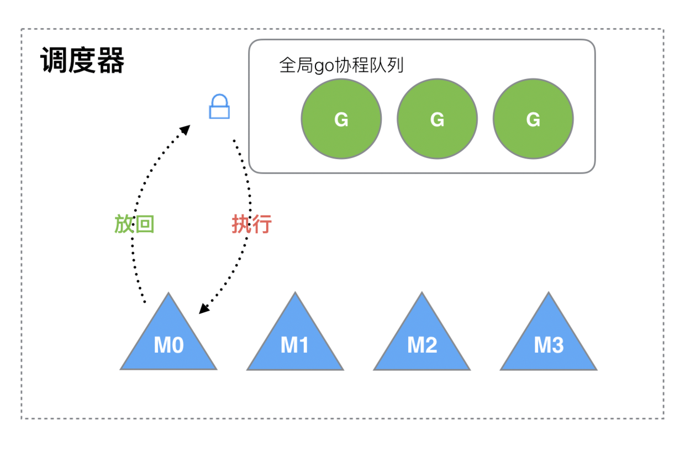
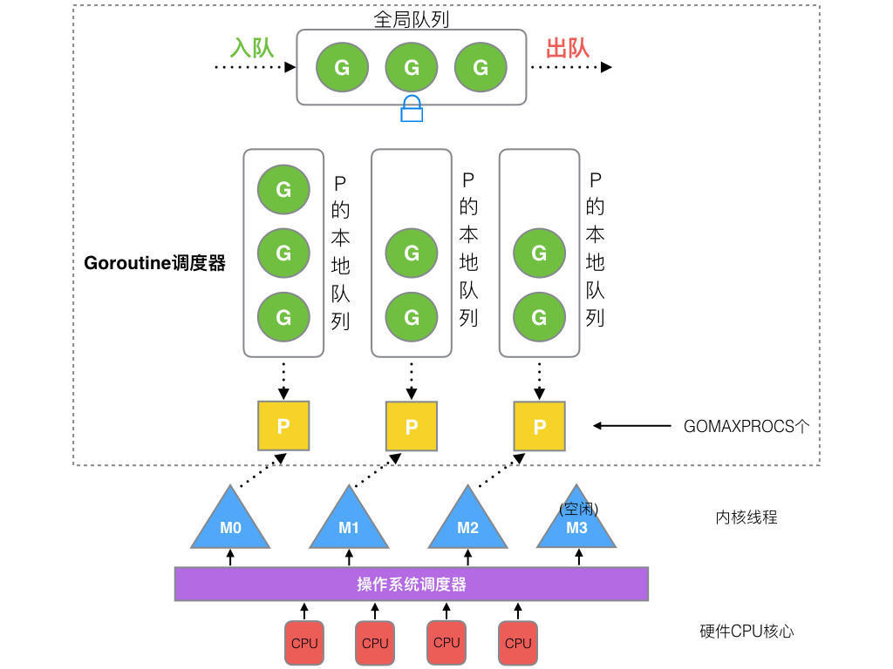
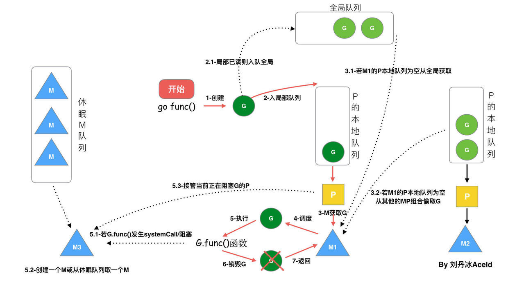
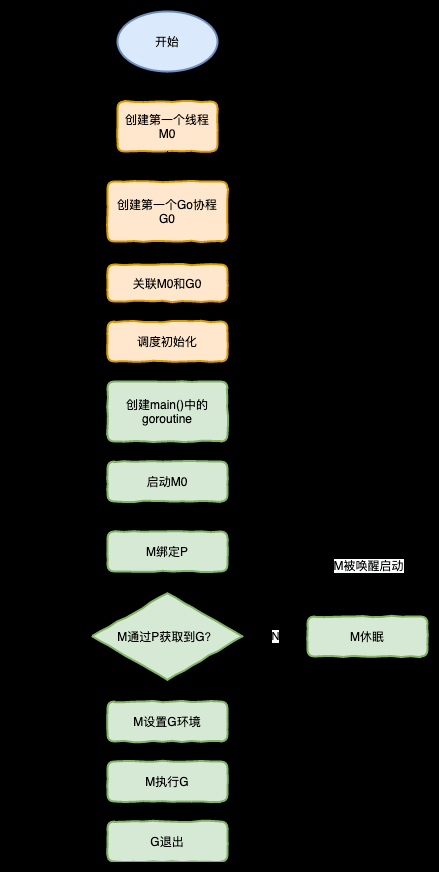

# go语言 GMP模型

给自己看的，到处搜罗，写出来的总结版

# 进程，线程，携程
[reference1](https://mp.weixin.qq.com/s?__biz=MzkwMDE1MzkwNQ==&mid=2247496008&idx=1&sn=b4c6bfc75abfa8a45843bc3c2221b6ad&source=41#wechat_redirect)

[reference2](https://imageslr.com/2020/07/07/process-thread.html#)

[reference3](https://learnku.com/articles/41728)

进程是对正在运行中的程序的一个抽象
进程拥有的资源包括:内存空间中的代码，数据等，I/O资源；文件，CPU等

线程是操作操作系统能够进行运算调度的最小单位。线程被包含在进程之中，是进程中的实际运作单位，一个进程内可以包含多个线程，线程是资源调度的最小单位。线程只拥有CPU,线程之间共享一个进程的资源，如内存,I/O等。

进程虚拟内存占用4GB，创建一个线程也大约需要4MB的内存空间

线程分为“内核态”线程和“用户态”线程
一个 “用户态线程” 必须要绑定一个 “内核态线程”，但是 CPU 并不知道有 “用户态线程” 的存在，它只知道它运行的是一个 “内核态线程”(Linux 的 PCB 进程控制块)。

因此继续细分,内核线程叫做“线程(thread)”,用户线程叫做“携程(co-routine)”

因此在这个基础上，我们可以突破线程和携程1对1的关系，将其变成多对多，从而提高线程的利用率，因为变成了多对多，因此还需要一个协程调度器来帮忙调度，这个就是GMP模型做的事。

# 基本概念

被废弃的 golang 调度器：简单版

当一个M要执行一个G的时候,从全局队列中取锁，取一个G，然后将锁放回去然后执行G

**这种模型的缺点**

(1). 创建、销毁、调度 G 都需要每个 M 获取锁，这就形成了激烈的锁竞争

(2). M转移G会造成延迟和额外的系统负载。比如当在G中创建一个新的G时，M创建G',但是M为了继续执行G，需要在G'交给其他人执行。比较好的情况时G和G'交给一个M执行,因为两者是相关的。

(3). 系统调度开销，这种方式会有比较频繁的线程阻塞和取消阻塞操作

因此新的调度器还引入了P
G: Goroutine，go协程
M: thread，线程
P: Processor，处理器

Processor，它包含了运行goroutine的资源，要想一个线程运行goroutine,必须先获取P，P中还包含了一个可运行的G队列

(1) 全局队列(Global Queue): 存放等待运行的G

(2) P的本地队列,存在的也是等待运行的G，但是数量有限，不超过 `256` 个，新建 `G'` 时，先放入P的本地队列，如果P的本地队列满了，则会把本地队列中一般的G移动到全局队列中，然后在放入P的本地队列

(3) P列表: 所有的 P 都在程序启动时创建，并保存在数组中，最多有 `GOMAXPROCS` (可配置) 个。

(4) M:线程想要运行任务就得获取P，从P的本地队列中获取G，P队列为空时，M也会尝试从全局队列中拿一批G放入P的本地队列，或者从其他P的本地队列偷一半放到自己的P的本地队列，M 运行 G，G 执行之后，M 会从 P 获取下一个 G，不断重复下去。

## 调度器的设计策略
1. 复用线程：避免频繁的创建、销毁线程，而是对线程的复用。
    
    (1) work stealing 机制
    当本线程无可运行的 G 时，尝试从其他线程绑定的 P 偷取一半的G，而不是销毁线程。

    (2) hand off 机制
    当本线程因为 G 进行系统调用阻塞时，线程释放绑定的 P，把 P 转移给其他空闲的线程执行。

2. .利用并行:最多有 `GOMAXPROCS` 个线程分布在多个CPU上执行
3. 抢占：在co-routine中要等待一个携程主动让出CPU才能执行下一个携程，在Go中，一个goroutine最多占用CPU 10ms,防止其他goroutine饿死。
4. 全局G队列：当M执行working stealing偷不到G的时候，它可以从全局G队列获取G

## go func() 调度流程

(1) start:代码执行到了`go func()` 创建一个G

(2) G放入P的本地队列中(如果P本地队列满，则将当前P本地队列的一半G放入全局队列中)

(3) 一个M获取到P，从P中获取G来执行

(4) 调度

(5) 执行G
    
    (5.1) 如果G中发生systemcall或者阻塞，M会阻塞。runtime会将这个M从P中摘除，然后利用空闲线程或者创建一个新线程(优先利用空闲线程)来服务于这个P

(6) 当M系统调用结束之后，这个G会尝试获取一个空闲的P执行，并放入这个P的本地队列中。如果获取不到P，则M变成休眠状态，加入到空闲线程中，将G放入全局队列中

## 调度器的生命周期

## 特殊的M0和G0

M0是启动程序后编号为0的主线程，这个M对应的示例在全局变量 `runtime.m0`中，不在堆上分配，M0负责初始化操作和启动第一个G，在这之后和其他的M相同

G0是每次启动一个M都会创建的goroutine，G0负责调度G，G0不指向任何可执行函数，每个M都有一个自己的G0。在调度或者系统调用时会使用G0的占空间，全局变量的G0是M0的G0。