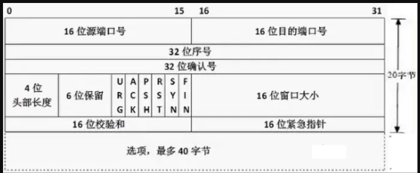
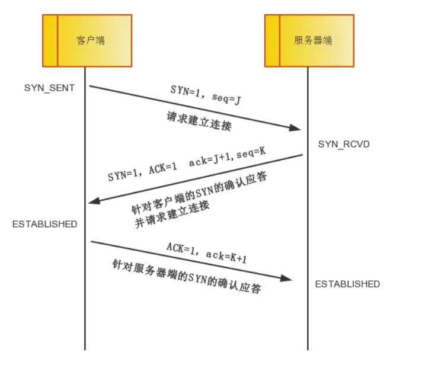
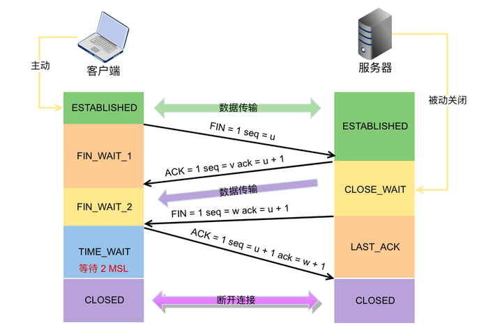

# OSI7层模型

- 应用层
- 表示层
- 会话层
- 传输层
- 网络层
- 数据链路层
- 物理层

**五层模型**

- 应用层
- 传输层
- 网络层
- 数据链路层
- 物理层

# TCP三次握手和四次挥手

看这个需要先看TCP的报文中的几个标志位：

- **ACK** 确认标志位，表明该报文是确认报文
- **SYN** 同步标志位，表明该报文时用来建立会话连接的
- **FIN** 结束标志位，表示我已经没有数据可以发送了了，即将关闭连接
- RST 重置标志位，用于连接复位，拒绝错误和非法的数据包

和连接建立有关的内容
- seq 序号
- ack 确认号

## 三次握手

- 第一次握手：客户端发送要求建立TCP连接的报文,并且客户端会自己确定一个seq=J (SYN=1,seq=J)。如果没有收到服务器端的回应，表示丢包，则需要重新发送
- 第二次握手：服务器端受到第一次握手的报文，然后表明同意建立连接，因此发送确认报文，同时也将自己端建立连接的报文合并，服务器也需要自己确认一个序号=K
(ACK=1,SYN=1,seq=K,ack=J+1)
如果服务器端没有收到回应，则需要重发该报文
- 第三次握手：客户端受到第二次握手的报文，向服务器端回应
(ACK=1,ack=K+1)

然后连接就可以建立了

在后续数据传输过程中
1. client自己定义了一个seq=J,确定了server的目前的ack=K+1
2. server自定定义了一个seq=K,确定了client目前的ack=J+1
  
然后在client发送数据的时候, 发送的报文
**常见问题**
1. 为什么需要三次握手，两次不行吗？
  
  答：根据上面的描述，在第二次握手之后，如果服务器端收不到回应，则服务器端无法确定连接是否建立。
  如果只用两次握手，那么第三次握手丢包的话，服务器端则会变成一直等待接受数据的状态，但是因此客户端没有收到第二次握手的报文，因此客户端不会发送任何数据。

## 四次挥手

- 第一次挥手：客户端发送一个FIN报文,表示不再发送数据(FIN=1,seq=u)
  FIN_WAIT_1:等待服务器端的ACK报文回应
- 第二次挥手：服务器端收到FIN之后，发送ACK报文(ACK=1,seq=v,ack=u+1),此时服务端进入CLOSE_WAIT状态，只可能发送数据，而不在接受数据。
- 第三次挥手：当服务器没有数据要发送之后，服务器端发送FIN报文(FIN=1,seq=w,ack=u+1),此时服务器端进入LAST_ACK状态,等待客户端的ACK报文回应
- 第四次挥手：客户端收到FIN报文之后，发送ACK报文(ACK=1,seq=u+1,ack=w+1),此时客户端进入TIME_WAIT状态，**等待2MSL之后**，如果没有异常情况，则可以关闭连接。
服务器端在收到客户端的ACK报文之后就可以关闭连接。

**常见问题**

为什么TIME_WAIT状态需要等待2MSL之后才能关闭连接？

2MSL是两倍的最大报文段生存时间，这是为了防止最后一个ACK报文丢失，导致服务器端无法关闭连接。客户端的ACK报文(第四次握手)和服务器端的FIN报文(第三次挥手)一来一回所需的最多的时间是2MSL。因此在2MSL之后，服务器端没有接受到消息，表明服务器端已经收到了ACK报文，因此客户端也可以安全关闭连接了。

# TCP粘包

如果客户端连续不断的向服务器端发送数据包时，服务器端接收的数据会出现两个数据包粘在一起的情况。

1. TCP 是基于字节流的，虽然应用层和 TCP 传输层之间的数据交互是大小不等的数据块，但是 TCP 把这些数据块仅仅看成一连串无结构的字节流，没有边界；

2. 从 TCP 的帧结构也可以看出，在 TCP 的首部没有表示数据长度的字段。

基于上面两点，在使用 TCP 传输数据时，才有粘包或者拆包现象发生的可能。一个数据包中包含了发送端发送的两个数据包的信息，这种现象即为粘包。

## 粘包是如何产生的

(1) 发送方粘包

一句话：要发送的数据小于 TCP 发送缓冲区的大小，TCP 将多次写入缓冲区的数据一次发送出去，将会发生粘包。

采用 TCP 协议传输数据的客户端与服务器经常是保持一个长连接的状态（一次连接发一次数据不存在粘包），双方在连接不断开的情况下，可以一直传输数据。但当发送的数据包过于的小时，那么 TCP 协议默认的会启用 Nagle 算法，将这些较小的数据包进行合并发送（缓冲区数据发送是一个堆压的过程）；这个合并过程就是在发送缓冲区中进行的，也就是说数据发送出来它已经是粘包的状态了。

(2) 接收方粘包
一句话：接收数据端的应用层没有及时读取接收缓冲区中的数据，将发生粘包。

## 如何避免粘包
- 在每个包的末尾加入特殊字符用于区分
- 在报文首部添加包的长度

## 什么是半连接

半连接队列：

客户端发送SYN包，服务端收到后回复SYN+ACK后，服务端进入SYN_RCVD状态，这个时候的socket会放到半连接队列。

全连接队列：
当服务端收到客户端的ACK后，socket会从半连接队列移出到全连接队列。当调用accpet函数的时候，会从全连接队列的头部返回可用socket给用户进程。全连接队列中存放的是已完成TCP三次握手的过程，等待被处理的连接，在客户端及服务端的状态均为 ESTABLISHED

