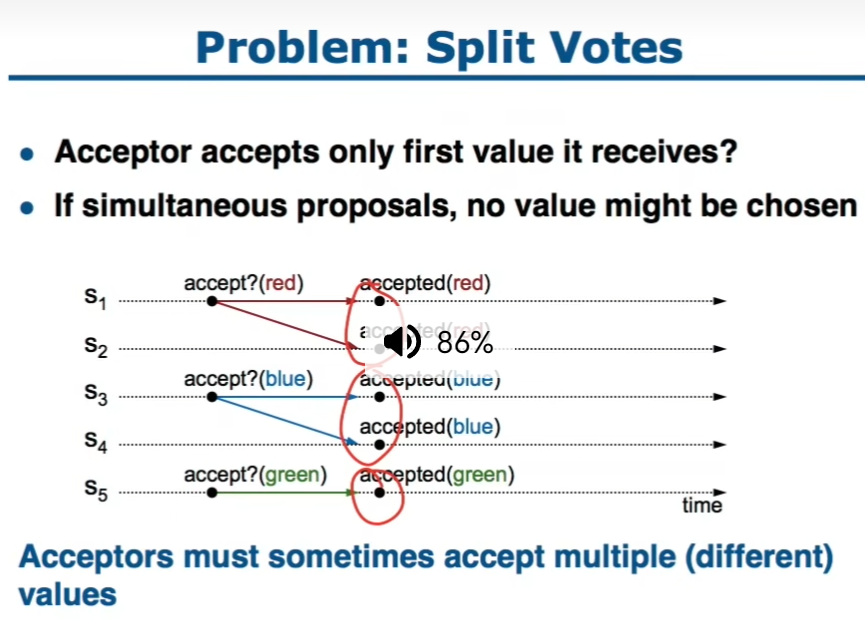
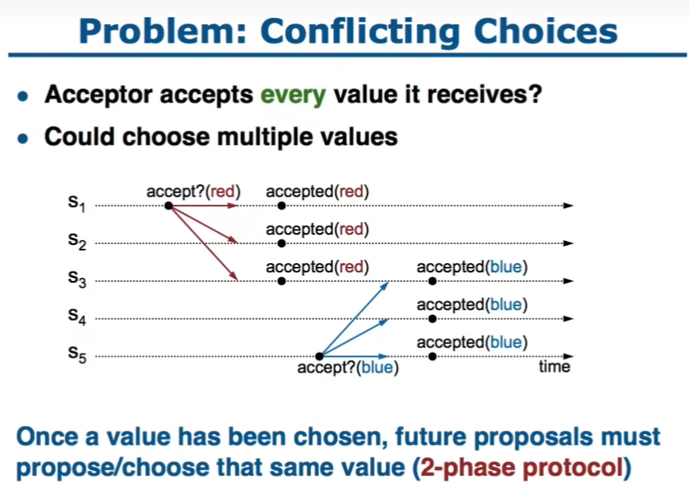
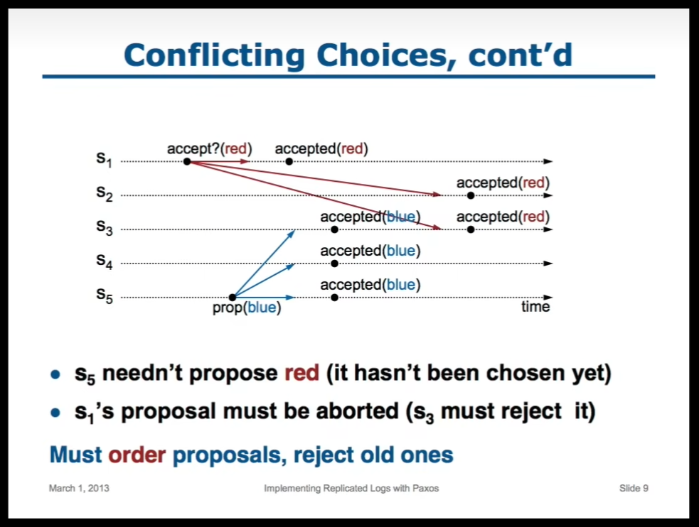
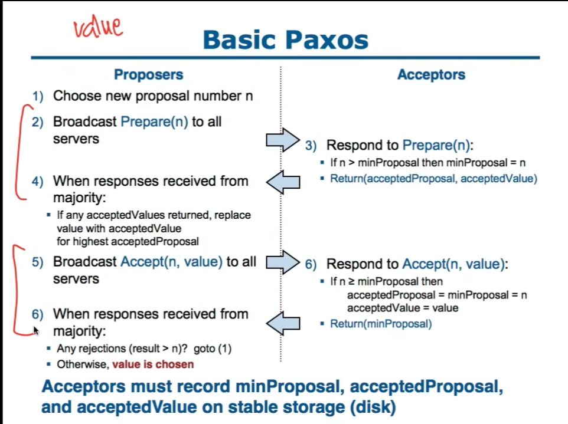

Basic Paxos

Paxos算法解决的问题正是分布式一致性问题，即一个分布式系统中的各个进程如何就某个值（决议）达成一致。

原则: 
1. 每次最多只有一个Propose被接受
2. 少数服从多数

术语
- Propose 提议,一个值
- is chosen 被选中,一个Propose被多数派接受
角色
- Proposer 提议者,主动提出一个Propose,当这个Propose被多数派接受之后,这个分布式系统就是确定了这个Propose被全体接受
- Acceptor 接受者,被动的,选择接受或者不接受一个Propose

一些简单的,但是会失败的例子

1. Acceptor只接受他们遇到的第一个Propose
   问题:可能无法形成多数派

2. Acceptors接受他们遇到的所有的Propose
   问题:可能会有多个Propose被接受,导致冲突(下图节点3)
    解决这个问题的方法
    
    在提出一个propose之前,先环顾四周,看看有没有人已经接受了别的propose,如果有,则更改自己的propose为那个propose

3. two-phase propose
    使用two-phase propose,还是不够的,S_5可能会在S_1提出的propose还没有被人接受之前提出propose,这样还是会导致冲突,如下图

    解决方法:一旦一个propose is chosen,那么任何和其冲突的propose都必须中止

    做法:将propose排序,当一个acceptor同意了一个propose之后,拒接old propose

如何order propose

定义propose number

每一个propsoe都有一个unique number,数据更大则优先级更高,这个number需要保证当一个propose提出时,他携带的number比之前所有已经在系统中使用的或者见过的number都要大

One simple approach

Proposal Number = Round Number + Server ID

Round Number随着时间的推移单调增大,并且在所有Server之间共享

- 每一个server都在本地存储一个maxRound,是他当前已经见过的最大的Round Number
- 当需要产生一个新的propose Number时
1. 本地maxRound+1
2. 拼接maxRound + Server ID

应当将maxRound保存在disk中,以保证在server重启或崩溃之后,不会重复使用之前已经用过的propose number

# Basic Paxos
当一个proposer需要提出一个propose时,Two-phase approach
1. 阶段1: Prepare Phase, 广播 Prepare RPCs
  目的: 1.寻找是否已经有其他value is chosen
        2. 中止比他更老的但是还没有完成的propose

2. Accept Phase,广播 Accept RPCs
    要求acceptors接受这个propose

Basic 基本流程

1. Proposer 选择一个 proposal number n
2. Proposer 广播Prepare(n) 到全部的server

3. Acceptors 对Prepare(n)做Response
   - if (n > minProposal) then minProposal = n (minProposal是acceptor当前见过的最大的proposal number)
   - return (acceptedProposal, acceptedValue) 返回自己当前接受的Proposal和Value

4. 当该Proposer收到多数派的响应时
   - 如果看到有任何已经被接受的值, 那么该次proposal改用该值

5. 广播Accept(n, value)到所有的server

6. Acceptors 对Accept(n, value)做Response
   - if (n >= minProposal) then acceptedProposal = minProposal = n, acceptedValue = value (acceptor只接受大于等于自己minProposal的proposal)
   - return (minProposal)

6. 当该Proposer收到多数派的响应时
   - Any rejections (result > n) => restart from step 1 (发现有比自己更大的proposal number,则重新开始)
   - 否则,可以确定 value is chosen

通过三种情况演示Basic Paxos

1. Proposer Prepare时,已经有一个value is chosen

S_5 Prepare(4.5) 到S_3,发现S_3已经接受了X,那么会改用X,放弃Y

2. Proposer Prepare时,发现有value被Accept,但还没有is chosen

S_5 Prepare(4.5) 到S_3,发现S_3已经接受了X,那么会改用X,放弃Y

3. Proposer Prepare时,没有发现有server accept value,但是实际情况是有value被一些server accept了

S_5 Prepare(4.5) 正常, Accept(4.5,Y), 在S_3处

如果S_3先Accept了(3.1,X),但是(4.5,Y)的proposal number更大,最后S_3会接受(4.5,Y)
least space approach

如果S_3先Accept了(4.5,Y),那么(3.1,X) 由于proposal number比4.5小,所以会被拒绝

最终Y is chosen, X返回,生成新的proposal number重来

Basic-Paxos的问题

**问题1**

极端情况下可能会导致livelock(活锁)问题,两个Proposer相互阻挠,始终没有一个propose is chosen

Prepare(3.1) 通过, Prepare(4.5)通过, lock了Accept(3.1,X), 在S_3处 Accept(3.1,X)会被拒绝

然后从S_1发出Prepare(4.1), block了Accept(4.5,Y) is chosen的机会

然后 从S_5发出 Prepare(5,5) 又block了Accept(4.1,X) is chosen的机会

注:图中我觉得 P 3.5的proposal number应该是从4开始,而不是3
就这样相互阻挠

Solution:
1. simple solution: 通过随机等待时间来解决
2. Multi-Paxos (Leader election),确保一次只有一个proposer在工作

**问题2**

只有proposer知道vlaue is chosen了,如果其他的server想要知道,就必须用他自己的proposal来执行Paxos

# Multi-Paxos

如何连续的确定多个值,而且希望有更高的效率

这里使用multi-paxos用于分布式系统完整的log复制作为例子

为log中的每一个entry使用一组basic paxos实例来保证共识(to do this,为log中的每一个entry add `index`)

Multi-Paxos Issues

1. 当一个client request到达时,使用使用哪一个log entry
2. 性能优化
   - 使用leader来避免proposer冲突
   - 忽略绝大多数Prepare request
3. 确保完整的log复制
4. client 如何运作(Client protocol)
5. 集群配置变更问题

## Selecting Log Entries

当一个client发送了一个request,选择哪一个log entry来存储这条log

1. 寻找第一条不确定是否已经chosen的entry
2. run basic Paxos to propse 将client cmd 放到这个index上
3. Prepare return acceptedValue?
   - Yse:  acceptedValue is chosen,restart from step 1
   - No: 选择这个idx 存放client cmd
  
机制好处
1. 可以并行
2. 绝大多数cmd到state machine的顺序都是对的

## Improving Performance

1. Pick a leader
    lease based approach
2. Eliminate most Prepare RPCs
   - Prepare once for the entire log(not once per entry)
   - Most log entries can be chosen in a single round of RPCs
  

Eliminate most Prepare RPCs

为什么需要Prepare
1. Block old proposals
   让proposal number指示整个log,而不是单单一个entry
   好处:一旦我们完成了一次Prepare,那么整个log就都已经被封锁了,不在需要为后续的log entry在Prepare

2. 寻找其他可能被chosen的值
   - Retrun hightest proposal accepted for current entry as before
   - Also return `noMoreAccepted` flag: 超过当前日志项的项还没有任何proposal

    leader会达到一个状态,此时他知道了所有的acceptor再次之后都没有接受任何的proposal

    If 一个acceptor响应了Prepare with
    noMoreAccepted,可以跳过对此acceptor的Prepare(until Accept rejected)

    一旦leader接收到了多数派的带有noMoreAccepted的Prepare的响应,那么他就不需要Prepare

    leader可以持续这种模式,直到出现了一个新的leader(until Accept rejected)

## Full Log Replication

Solution part(1/4): keep Accept RPCs,直到所有的acceptor响应(in background)
后台继续Accept RPCs

Solution part(2/4): track chosen entries
- 标记所有已知被选择的entry acceptedProposal[i] = inf
- 每一个server维护firstUnchosenIndx:最早的is not chosen entry

Solution part(3/4): proposer tells acceptors about chosen entries

1. proposer将firstUnchosenIndex包含在Accept RPCs中
2. Acceptor 将 all entries i 标记为 chosen if:
   - i < request.firstUnchosenIndex && acceptedProposal[i] == request.proposal
  
Solution part(4/4): entries from old leaders
- Acceptors 在Accept reply中返回 its firstUnchosenIndex
- 如果 proposer's firstUnchosenIndex > firstUnchosenIndex in reply,那么proposer send Success RPC(in background)

根据leader的chosen信息,向该acceptor指名chosen情况
Success(index,v): 指名acceptor of chosen entry
- acceptedValue[index] = v
- acceptedProposal[index] = inf
- return firstUnchosenIndex
- Proposer send additional Success RPCs, if needed