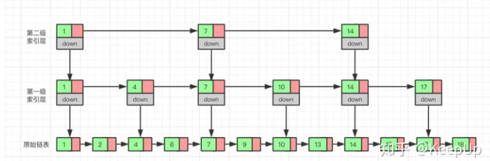

# Redis: Remote Dictionary Server

作为数据库的缓存,因为数据库因为磁盘I/O的限制,读写速度较慢,而Redis是基于内存的数据库,读写速度非常快,因此可以作为数据库的缓存

Redis的优势
1. 性能高
2. 数据类型丰富,单键值对最大支持512M大小的数据
3. 简单易用,支持所有主流编程语言
4. 支持数据持久化,主从复制,哨兵模式等高可用特性

Redis的使用方式(1) CLI (2) API (3) GUI

# Redis 数据结构

Redis的命令不区分大小写,但是key是区分大小写的

5种基本数据结构

1. String 字符串

Redis的String类型是二进制安全的,这意味着它能够存储任何类型的数据,比如图片或者序列化的对象,或者数字等等数据

和String有关的操作
```shell
SET key value # 设置一个key-value对
GET key # 获取一个key的value
EXISTS key # 判断一个key是否存在
DEL key # 删除一个key
KEYS pattern # 获取所有符合pattern的key,例如 KEYS * 查看所有的key
FLUSHALL # 删除所有的key
TTL key # 获取一个key的过期时间,-1表示永不过期,-2表示已经过期
EXPIRE key seconds # 设置一个key的过期时间
SETEX key seconds value # 设置一个带有过期时间的key-value对
SETNX key value # 只有当key不存在时,才设置key-value对
```

2. List 列表
和List有关的操作
List,拥有的操作,可以将其理解为一个双端队列
```shell
LPUSH key value1 value2 ... # 从左边插入一个或多个元素
RPUSH key value1 value2 ... # 从右边插入一个或多个元素
LPOP key [cnt]# 从左边弹出一个或多个元素
RPOP key [cnt]# 从右边弹出一个或多个元素
LRANGE key start stop # 获取指定范围的元素(从左到右看) 
# LRANGE list 0 -1 获取所有元素 -1可以代表最后一个元素
LLEN key # 获取列表的长度
LTRIM key start stop # 截取到剩余指定范围的元素(用于删除)
```

3. Set 集合
Set是无序集合，不允许重复的元素，是哈希实现的
和Set有关的操作
和Set有关的操作都是S开头的
```shell
SADD key member1 member2 ... # 添加一个或多个元素
SMEMBERS key # 获取Set种所有的元素
SISMEMBER key member # 判断一个元素是否在Set中
SREM key member1 member2 ... # 删除一个或多个元素
SUNION key1 key2 ... # 获取多个Set的并集
SINTER key1 key2 ... # 获取多个Set的交集
SDIFF key1 key2 ... # 获取多个Set的差集
```

4. SortedSet 有序集合
SortedSet也叫ZSet,底层数据结构是跳表,和SortedSet有关的操作相关命令都是以Z开头的
```shell
ZADD key score1 member1 score2 member2 ... # 添加一个或多个元素
ZRANGE key start stop [WITHSCORES] # 获取指定范围的元素 WITHSCORES指示同时输出分数
ZSCORE key member # 获取指定元素的分数
ZRANK key member # 获取指定元素的排名(按照从小到大的index)
ZREVRANK key member # 获取指定元素的排名(按照从大到小的index)
```
5. 哈希 Hash
哈希是一个字符类型的字段和值的映射表,适合存储对象(这里指的是value项是键值对)
Hash相关的命令均是以H开头的
```shell
HSET key field value # 设置一个字段的值
HGET key field # 获取一个字段的值
HGETALL key # 获取所有的字段和值
HDEL key field1 field2 ... # 删除一个或多个字段
HEXISTS key field # 判断一个字段是否存在
HKEYS key # 获取所有的字段
HLEN key # 获取字段的数量
```

# 发布-订阅功能

```shell
PUBLISH channel message # 向指定的频道发送消息
SUBSCRIBE channel [channel ...] # 订阅一个或多个频道
```
通过一个redis-cli向channel1发送消息,然后其他订阅了该频道的客户端都能收到消息
上述发布订阅功能只有最基本的功能,存在消息无法持久化,无法记录历史消息等等缺点

5种高级数据类型
1. Stream 消息队列
 
Stream是一个轻量级的消息队列
Stream相关的命令都是以X开头的
```shell
XADD key ID field1 value1 # 添加一个消息,ID可以用*表示,ID的形式为'时间戳+序列号',也可以自己指定,但是必须是递增的
XLEN key # 获取消息队列的长度
XRANGE key start stop [COUNT count] # 获取指定范围的消息
# XRANGE key - + 获取所有的消息
XDEL key ID1 ID2 ... # 删除一个或多个消息
XTRIM key MAXLEN count # 截取消息队列,只保留最新的count条消息
XRAED # 读取消息
XGROUP CREATE key group_name id # 创建消费者组 
XINFO GROUPS key # 获取消费者组的信息
XGROUP CREATECONSUMER key group_name consumer_name # 创建消费者
XREADGROUP GROUP group_name consumer_name [COUNT cnt] [BLOCK x-ms] STREAMS key ID # 读取消息
```

2. Geospatical 地理空间
地理位置相关的命令均以GEO开头
```shell
# key is city, 值 (经度,维度,城市名)
GEOADD city 116.405285 39.904989 beijing 121.472644 31.231706 shanghai
GEOPOS city beijing  # 获某个城市的经纬度
GEODIST city beijing shanghai [KM] # 计算两个城市的距离,默认返回m,加上KM返回km
GEOSEARCH city FROMMEBER shanghai1 BYRADIUS 1000 KM # 查找指定范围内的城市,支持radius和box
```

3. HyperLogLog 基数统计
基数:集合中非重复元素的个数,HyperLogLog是一种基数统计算法,用于统计大数据集合的基数,原理是使用随机算法来计算,内存消耗小,但是有一定的误差,适合对精度要求不高,但是数据量大的场景

HyperLogLog相关的命令均以PF开头
```shell
PFADD key element1 element2 ... # 添加一个或多个元素
PFCOUNT key # 获取基数
PFMERGE destkey sourcekey1 sourcekey2 ... # 合并多个HyperLogLog
```

3. Bitmap 位图

是String数据结构的扩展,可以用于记录用户的行为,比如用户的签到,用户在线装态等等
下标是字符串下标,只不过对应内容只保存0or1,也可以支持做与或非操作


```shell
SETBIT key offset value # 设置一个key的对应offset位的值
GETBIT key offset # 获取一个key的对应offset位的值
# 利用字符串的命令同时设置多位
SET key value 
#  e.g. SET dianzhan "\xf0" 同时设置8位,使用16进制表示
BITCOUNT key [start end] # 统计指定范围内的1的个数
BITPOS key bit [start end] # 获取指定范围内的第一个1或0的位置
```

4. Bitfield 位域

位域可以将很多小的整数存储在一个较大的位图中,这样可以更高效的利用内存
```shell
BITFIELD key SET encoding offset value
# e.g. BITFIELD player:1 SET u8 #0 100
# #0表示第一个位置, u8表示8位的无符号整数,100表示值
BITFIELD key GET encoding offset
# 获取对应位置的值
BITFIELD key INCRBY encoding offset increment # 对指定位置的值进行增加
# e.g. BITFIELD player:1 INCRBY u8 #0 1
```

# 事务

redis的事务主要有`MULTI`, `EXEC`, `DISCARD`, `WATCH`四个命令
```shell
MULTI # 开启事务 (之后所有的命令都会放到一个缓存队列中，到EXEC才开始执行)
SET key value
...
EXEC # 执行事务
```
redis中的事务的概念和关系型数据库中事务的概念不同
redis并不能保证事务中的所有命令都可以执行成功

可以保证以下三点
1. 到EXEC之前,所有的命令都会放到一个缓存队列中,不会立即执行,直到EXEC才开始执行
2. 事务中某一条命令执行失败,不会影响其他命令的执行
3.  其他客户端提交的命令请求,并不会插入到执行命令的序列中

# Redis持久化

Redis的持久化主要有两种方式
1. RDB(Redis DataBase)
2. AOFP(Append Only File)

RDB是指在指定时间间隔内,将内存中的数据快照写入磁盘,他是某一个时间点上数据的完整副本

RDB可以在redis的配置文件中配置 save字段

也可以手工触发(通过命令`SAVE`或者`BGSAVE`)  `BGSAVE`是后台执行,不会阻塞其他命令

`BGSAVE`是redis通过fork出一个子进程来执行持久化的,然后主进程继续接受请求处理命令

但是`BGSAVE`因为fork也需要一定的时间,这段时间内,redis是不可用的,因此这个命令也无法做到秒级

的快照,因此Redis还提供了`AOF`持久化

AOF是指redis在执行写命令的时候,不仅将内容写到内存中,还会将内容写到一个追加的文件中,这个文件就是AOF文件,它会以日志的形式来记录每一条写命令,当redis重启的时候,会重新执行AOF文件中的命令,从而恢复数据

开启AOF持久化,需要在redis的配置文件中配置`appendonly yes`

# Redis主从复制

Redis主从复制是将一台Redis服务器的数据复制到其他Redis服务器

数据的复制是单向的,只能从主节点到从节点,一般来说主节点负责写操作,从节点负责读操作

主节点会根据自己数据的变化，通过异步的方式发送给从节点

主从复制功能的实现
redis是读写分离的,主服务器负责写,称之为master,其他服务器负责读,称之为slave

主从复制分为全量复制和部分复制

全量复制使用`snyc`命令实现,其流程为
1. slave向master发送sync命令
2. master收到sync命令之后,调用bgsave生成rdb文件,把这个文件同步给slave,这是slave的状态就是master执行bgsave时相同。
3. master将保存在命令缓冲区的写命令同步给slave,slave执行这些命令,这时slave的状态就和master一样了

全量复制的缺点是,slave已经有一部分数据了,但是还是要重新从master那里获取一份数据,这样会浪费带宽和时间

新版本redis使用`psync`来代替`sync`,该命令既可以实现完整全同步，也可以实现部分同步

**复制偏移量**

master和slave

# Redis哨兵模式

在主从节点配置中,如果主节点宕机,则需要人工干预,把其中一个从节点升级为主节点,Redis哨兵模式是为了解决这个问题

哨兵以一个独立的进程执行在Redis集群中,功能如下
1. 监控,监控集群中各个节点是否正常
2. 通知,如果发现某个节点出了问题,哨兵会通过发布订阅模式来同时其他节点
3. 自动故障转移:如果主节点宕机,哨兵会自动将一个从节点升级为新的主节点,然后将其他从节点指向这个新的主节点

```shell
# 启动哨兵
# cat 'sentinel monitor master 127.0.0.1 6379 1'> /path/to/sentinel.conf
redis-sentinel /path/to/sentinel.conf
```

哨兵本身也是一个进程,自己也存在单点问题,因此在实际生产过程中会部署3个哨兵节点,这3个哨兵节点会通过选举的方式选出一个leader,然后leader负责监控集群中的节点,如果leader宕机,则会重新选举一个leader

# 数据结构-跳表

from [数据结构与算法——跳表](https://zhuanlan.zhihu.com/p/68516038)

跳表全称跳跃链表,它是一个允许快速查询，插入和删除一个有序连续元素的数据链表,跳表的平均查找和插入时间复杂度是O(logn)，空间复杂度是O(n)

**跳表的查询**

跳表的查询和二分很相似,假设我们已经存在了一个有序链表,我们每隔两个节点，加入一个索引节点,
这样我们就可以先在这个索引层上查找,等确定要找的数据锁定在某两个节点之间时,在下到一层寻找。
然后我们可以一直不断的加索引层,直到只剩下两个节点



**跳表的插入和删除**

先找到元素(O(logn)),然后用O(1)时间插入或者删除

如果我们不停的向跳表中插入元素，就可能会造成两个索引点之间的结点过多的情况。结点过多的话，我们建立索引的优势也就没有了。所以我们需要维护索引与原始链表的大小平衡，也就是结点增多了，索引也相应增加，避免出现两个索引之间结点过多的情况，查找效率降低。

跳表是通过一个随机函数来维护这个平衡的，当我们向跳表中插入数据的的时候，我们可以选择同时把这个数据插入到索引里，那我们插入到哪一级的索引呢，这就需要随机函数，来决定我们插入到哪一级的索引中。

这样可以很有效的防止跳表退化，而造成效率变低。

为什么不使用AVL树(平衡树),红黑树,B+树这些数据结构,而使用跳表呢?

AVL树 vs 跳表：平衡树的插入、删除和查询的时间复杂度和跳表一样都是 O(log n)。对于范围查询来说，平衡树也可以通过中序遍历的方式达到和跳表一样的效果。但是它的每一次插入或者删除操作都需要保证整颗树左右节点的绝对平衡，只要不平衡就要通过旋转操作来保持平衡，这个过程是比较耗时的。跳表诞生的初衷就是为了克服平衡树的一些缺点。跳表使用概率平衡而不是严格强制的平衡，因此，跳表中的插入和删除算法比平衡树的等效算法简单得多，速度也快得多。

红黑树 vs 跳表：相比较于红黑树来说，跳表的实现也更简单一些，不需要通过旋转和染色（红黑变换）来保证黑平衡。并且，按照区间来查找数据这个操作，红黑树的效率没有跳表高。

B+树 vs 跳表：B+树更适合作为数据库和文件系统中常用的索引结构之一，它的核心思想是通过可能少的 IO 定位到尽可能多的索引来获得查询数据。对于 Redis 这种内存数据库来说，它对这些并不感冒，因为 Redis 作为内存数据库它不可能存储大量的数据，所以对于索引不需要通过 B+树这种方式进行维护，只需按照概率进行随机维护即可，节约内存。

AVL树,红黑树的范围查询性能不如跳表
B+树的目的是减少磁盘IO次数

# Redis 线程模型

对于读写命令来说Redis一直都是单线程模型
Redis基于Reactor模式设计开发了一套高效的事件处理模型

既然是单线程，那怎么监听大量的客户端连接呢？Redis 通过IO多路复用程序 来监听来自客户端的大量连接（或者说是监听多个 socket），它会将感兴趣的事件及类型（读、写）注册到内核中并监听每个事件是否发生。

# Redis缓存策略
一共有8种
- volatile-lru:从己设置过期时间的数据集中挑选最近最少使用的数据淘汰
- volatile-ttl:从己设置过期时间的数据集中挑选将要过期的数据淘汰
- volatile-random:从己设置过期时间的数据集中任意选择数据淘汰
- volatile-lfu:从己设置过期时间的数据集中挑选最不经常使用的数据淘汰
- allkeys-lru:当内存不足以容纳新写入数据时，在键空间中，移除最近最少使用的key
- allkeys-random:从数据集中任意选择数据淘汰
- allkeys-lfu:当内存不足以容纳新写入数据时，在键空间中，移除最不经常使用的key
- noveiction:永不过期

# Redis bigkey问题

bigkey指一个key对应的value占用的内存过大,会影响Redis的性能

bigkey 是怎么产生的？有什么危害？

- 程序设计不当，比如直接使用 String 类型存储较大的文件对应的二进制数据。
- 对于业务的数据规模考虑不周到，比如使用集合类型的时候没有考虑到数据量的快速增长。
- 未及时清理垃圾数据，比如哈希中冗余了大量的无用键值对。

bigkey 除了会消耗更多的内存空间和带宽，还会对性能造成比较大的影响。 bigkey 还会造成阻塞问题。具体来说，主要体现在下面三个方面：

- 客户端超时阻塞：由于 Redis 执行命令是单线程处理，然后在操作大 key 时会比较耗时，那么就会阻塞 Redis，从客户端这一视角看，就是很久很久都没有响应。
- 网络阻塞：每次获取大 key 产生的网络流量较大，如果一个 key 的大小是 1 MB，每秒访问量为 1000，那么每秒会产生 1000MB 的流量，这对于普通千兆网卡的服务器来说是灾难性的。
- 工作线程阻塞：如果使用 del 删除大 key 时，会阻塞工作线程，这样就没办法处理后续的命令。

# Redis hotkey问题

hotkey是指热点访问数据,处理 hotkey 会占用大量的 CPU 和带宽，可能会影响 Redis 实例对其他请求的正常处理。此外，如果突然访问 hotkey 的请求超出了 Redis 的处理能力，Redis 就会直接宕机。这种情况下，大量请求将落到后面的数据库上，可能会导致数据库崩溃。(from [Java Guide](https://javaguide.cn/database/redis/redis-questions-02.html#redis-hotkey-%E7%83%AD-key))

如何解决 hotkey？

hotkey 的常见处理以及优化办法如下（这些方法可以配合起来使用）：
- 读写分离：主节点处理写请求，从节点处理读请求。
- 使用 Redis Cluster：将热点数据分散存储在多个 Redis 节点上。
- 二级缓存：hotkey 采用二级缓存的方式进行处理，将 hotkey 存放一份到 JVM 本地内存中（可以用 Caffeine）。

# Redis 生产问题

**缓存穿透**

缓存穿透是指大量无效的key既不存在于cache,也不存在于数据库,导致这些请求直到到了数据库上,给数据库带来了巨大的压力

解决办法

1. 做好数据校验(把无效key直接打回)
2. 缓存这些无效的key,设置较短的过期时间,但是这样方法不是一个好方法,因此有可能缓存大量无效的key
3. bloom filter(布隆过滤器)
    bloom filter可以用来快速判断一个给定的数据是否存在于海量的数据中,它的返回结果具有概率性,只能保证返回否的数据一定不存在,返回是的数据可能不存在,也可能存在

布隆过滤器

**缓存击穿**

缓存击穿中,client端大量请求的key是hotkey,但是该key不在cache中(通常是因为缓存过期),导致大量请求直接到了数据库上

解决办法
1. 设置热点数据过期时间比较长
2. 针对热点数据预热
3. 请求数据库写数据到缓存之前,先获取互斥锁,保证只有一个请求到数据库上，减少数据库的压力


**缓存雪崩**

缓存雪崩描述的就是这样一个简单的场景：缓存在同一时间大面积的失效，导致大量的请求都直接落到了数据库上，对数据库造成了巨大的压力。

造成缓存雪崩的原因可能是大量数据同一时间过期,也可能Redis服务直接不可用了

解决办法

针对Redis服务不可用的情况
1. 采用Redis集群,加强Redis服务可用性
2. 限流，避免同时处理大量的请求
3. 多级缓存，例如本地缓存+Redis缓存

针对大量数据同时过期的情况
1. 不同的key设置不同的过期时间,比如随机过期时间
2. 缓存预热

缓存击穿，缓存穿透，缓存雪崩之间的区别

缓存击穿说的是无效的key,缓存穿透说的是hotkey,缓存雪崩说的是缓存在同一时间大面积失效,导致大量的请求到数据库上,对数据库造成了巨大的压力

# Redis和DB之间的协同方式(常见的缓存读写策略)

**1. Cache Aside Pattern (旁路缓存模式)**

Cache Aside Pattern 是我们平时使用比较多的一个缓存读写模式，比较适合读请求比较多的场景。

读: 
1. 从cache中读取数据,读取到就直接返回
2. cache中不存在,就从db中读取数据,然后写入cache,然后返回

写:
1. 先更新db
2. 然后直接删除cache

因此是cache更新比db更新快的多,先删除cache的话会有比较长的时间cache和db数据不一致的情况

缺点
1. 冷启动问题,首次请求数据一定不在cache中，解决办法,数据预热
2. 写操作比较频繁的话导致cache中的数据会被频繁的删除,影响cache的命中率

**2. Read/Write Through Pattern (读写穿透模式)**

写
step1. 查cache,cache中不存在,直接更新db
step2. cache中存在,则先更新cache,然后cache服务自己更新db(同步更新cache和db)
读
step1. 查cache,cache中存在,则直接返回
step2. cache中不存在,则从db中读取,然后写入cache,然后返回

**Write Behind Pattern(异步缓存写入)**

Read/Write Through 是同步更新 cache 和 db，而 Write Behind 则是只更新缓存，不直接更新 db，而是改为异步批量的方式来更新 db。

很明显，这种方式对数据一致性带来了更大的挑战，比如 cache 数据可能还没异步更新 db 的话，cache 服务可能就就挂掉了。