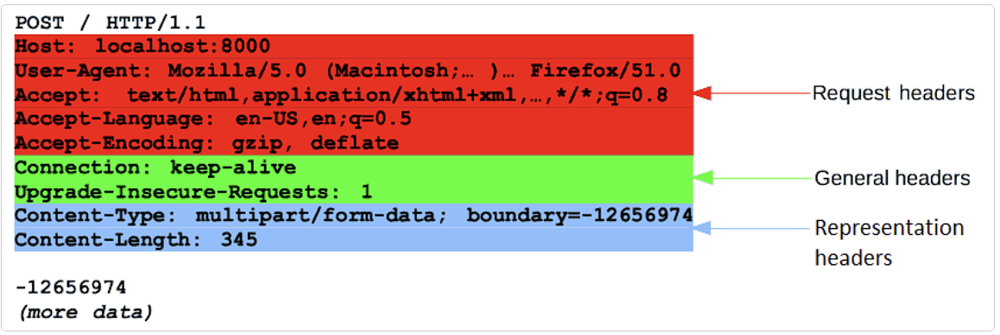

**go中request.go的简单解析**

代码位置位于`/src/net/http/request.go`

首先我们先看一个典型的http请求报文



# Request的结构体
```go
type Request struct {
    // 请求方法(Get,Post,Put,Delete等)
    Method string 

    // 请求URL
    URL *url.URL

    // http协议版本
    Proto string // "HTTP/1.0"
    ProtoMajor int // 1
    ProtoMinor int // 0

    // 请求头
    Header Header 

    // 请求体,Body是一个io.ReadCloser接口,必须允许读时并发的关闭
    // 特别是调用关闭应该接触一个等待输入的Read的堵塞
    Body io.ReadCloser

    // GetBody,可选项,可以传入一个函数,这个函数返回一个请求体的copy
    // 一般的使用场景是需要多次读取请求体时
    //
    // server request 使用这个参数
    GetBody func() (io.ReadCloser, error)

    // 报文请求头中的ContentLength字段,指名了请求体的长度(压缩后的实际长度)
    ContentLength int64

    // 报文请求头中的TransferEncoding字段,指名了请求体的传输编码方式
    // 一般是"chunked"或者"identity"
    // 例如 TransferEncoding: chunked,表明这个报文使用分块传输,这样在不需要提前知道报文主体长度的情况,也可以确定报文何时结束(TCP是字节流),简单的理解就是规定了特殊的符号当作结束和分割标志
    TransferEncoding []string

    // Close字段
    // for server端:表明在回复了这个请求后,连接是否关闭
    // for client端:表明在发送了这个请求并得到响应之后,连接是否关闭
    Close bool

    // 请求的主机名
    Host string

    // 该字段仅对server端生效
    // Form包含从数据包解析的表单数据
    // 包括
    // 1. URL字段中的query参数(请求行中的参数)
    // 2. POST或者PUT的表单数据(请求体中的内容)
    // 必须调用ParseForm方法或者ParseMultipartForm方法之后才能访问
    // client使用Body字段
    Form url.Values

    // 该字段仅对server端生效
    // PostForm包含从POST或者PUT请求解析的表单数据,仅包含请求体中内容
    // 必须调用ParseForm方法或者ParseMultipartForm方法之后才能访问
    // client使用Body字段
    PostForm url.Values

    // 该字段仅对server端生效
    // multipartForm包含从multipart表单解析的表单数据,包括上传的文件
    // 必须调用ParseMultipartForm方法之后才能访问
    // 
    // client使用Body字段
    MultiPartForm *multipart.Form

    // 不懂,没用过
    // Trailer字段规定了在请求体之后的额外的header
    Trailer Header

    // 记录发出请求的请求地址
    // client不使用
    RemoteAddr string

    // RequestURI是被客户端发送到服务端的请求的Request-Line中未修改的请求URI
    // 通常使用URL字段,在HTTP client request中不应该设置这个字段
    RequestURI string

    // 不了解,也没用过
    TLS *tls.ConnectionState

    // Deprecated: 推荐使用NewRequestWithContext代替
    Cancel <-chan struct{}

    // Response是导致创建此请求的重定向响应。
    // 只有在客户端重定向时，这个字段才会被填充。
    Response *Response

    // Context
    // ctx client和服务器端都可以使用,只能通过复制完整的请求内容来修改这个字段,
    // 可以使用的方法有 Clone 或者 WithContext
    ctx context.Context
}

```

**说明**

```go
// Header的类型
// 例如
//	Host: example.com
//	accept-encoding: gzip, deflate
//	Accept-Language: en-us
//	fOO: Bar
//	foo: two
// 对应的请求头
//	Header = map[string][]string{
//		"Accept-Encoding": {"gzip, deflate"},
//		"Accept-Language": {"en-us"},
//		"Foo": {"Bar", "two"},
//	}
type Header map[string][]string

// url.Values的类型
type Values map[string][]string

// multipart.Form的类型
type Form struct {
    Value map[string][]string
    File  map[string][]*FileHeader
}
```

当请求头中设置为`Content-Type: xxxx`时,我们才知道怎么解析这个请求体的内容

常见的设置类型
```
1. 以text开头的媒体格式
Content-Type: text/plain // 纯文本格式
Content-Type: text/html // HTML格式
Content-Type: text/xml // XML格式
Content-Type: image/gif // gif图片格式
Content-Type: image/jpeg // jpg图片格式
Content-Type: image/png // png图片格式

2. 以application开头的媒体格式
Content-Type: application/xhtml+xml // XHTML格式
Content-Type: application/xml // XML数据格式
Content-Type: application/atom+xml // Atom XML聚合格式
Content-Type: application/json // JSON数据格式
Content-Type: application/pdf // pdf格式
Content-Type: application/msword // Word文档格式
Content-Type: application/octet-stream // 二进制流数据（如常见的文件下载）
Content-Type: application/x-www-form-urlencoded // <form encType="">中默认的encType,form表单数据被编码为key/value格式发送到服务器(表单默认的提交数据的格式,不包含文件上传)

3. multipart开头
Content-Type: multipart/form-data // 需要在表单中进行文件上传时，就需要使用该格式
```

Multipart 允许客户端在一次 HTTP 请求中发送多个部分（part）数据，每部分数据之间的类型可以不同。
通俗来讲，一个 multipart 消息就是一个大包裹，包裹里面有多个不同类型的消息，每一个消息就是一个 part，每个 part 都会声明自己的消息类型（Content-Type）。除了消息类型，part 还可以附加一些元数据。

from [理解 HTTP 中的 multipart/form-data](https://juejin.cn/post/7209464086891036730)

每个 `multipart` 消息的 `Content-Type` 都必须包含一个叫做 `boundary` 的参数，`boundary` 声明了各个 `part` 之间的边界，记为 `${boundary}`。实际上，完整的边界定义为：一行由 `--` 加上`${boundary}`组成的字符串。假设我们在 `Content-Type` 里面指定的 `boundary=example-part-boundary`，那么按照协议规定，每个 `part` 之间的分隔行就是：`--example-part-boundary`。

最后一个 `part`之后的边界在末尾多了两个 `-`，表示后面不会再有其它的 part 了。这个边界的完整格式为：`--${boundary}--`，例如 `--example-part-boundary--`。

例如以下就是一个multipart/form-data的请求报文

```
POST /profile HTTP/1.1
HOST: example.com
Content-Type: multipart/form-data; boundary=example-part-boundary

--example-part-boundary
Content-Disposition: form-data; name="username"
Content-Type: text/plain

Nicholas
--example-part-boundary
Content-Disposition: form-data; name="address"
Content-Type: application/json

{
    "country": "China",
    "city": "Beijing"
}
--example-part-boundary
Content-Disposition: form-data; name="avatar"; filename="my_avatar.jpeg"
Content-Type: image/jpeg

<binary-image data>
--example-part-boundary--
```

方法
```go

// 返回请求的ctx
func (r *Request) Context() context.Context 

// 返回带有新ctx的请求
func (r *Request) WithContext(ctx context.Context) *Request 

// 复制请求,并赋值新的ctx
func (r *Request) Clone(ctx context.Context) *Request

// 解析http协议版本是否>=major.minor
func (r *Request) ProtoAtLeast(major, minor int) bool

// 获取 User-Agent 请求头
func (r *Request) UserAgent() string

// 获取全部Cookie
func (r *Request) Cookies() []*Cookie

// 根据name获取一个Cookie
func (r *Request) Cookie(name string) (*Cookie, error)

// 添加一个Cookie
func (r *Request) AddCookie(c *Cookie)

// 获取Referer请求头
func (r *Request) Referer() string

// 返回一个可以读取multipart/form-data格式的请求体的Reader
func (r *Request) MultipartReader() (*multipart.Reader, error)

// 向w写入一个HTTP/1.1请求，包括头部和主体，in wire format.
// 这个方法会参考请求的以下字段：
//
//	Host
//	URL
//	Method (defaults to "GET")
//	Header
//	ContentLength
//	TransferEncoding
//	如果Body存在，且Content-Length <= 0，且TransferEncoding
//  没有被设置为"identity"，Write会在头部添加"Transfer-Encoding: chunked"。
//  在发送后，Body会被关闭。
func (r *Request) Write(w io.Writer) error

// 通过代理向w写一个http/1.1请求
func (r *Request) WriteProxy(w io.Writer) error

// 解析HTTP版本
func ParseHTTPVersion(vers string) (major, minor int, ok bool)

// 构造一个请求
func NewRequest(method, url string, body io.Reader) (*Request, error)

// 构造一个请求,并且带有ctx
func NewRequestWithContext(ctx context.Context, method, url string, body io.Reader)

// 返回在请求头字段`Authorization`提供的用户名和密码
func (r *Request) BasicAuth() (username, password string, ok bool)

// 设置请求头字段`Authorization`,采用BasicAuth的方式
func (r *Request) SetBasicAuth(username, password string)

// 从b中读取一个请求
// 
// 该函数是一个low-level的函数,之应该在特定的应用中使用
// 多数代码应该使用 Server来读请求,然后使用Handler接口来处理他们
// 只支持HTTP/1.1 请求
func ReadRequest(b *bufio.Reader) (*Request, error)

// 有关MaxBytesReader的略过
func MaxBytesReader(w ResponseWriter, r io.ReadCloser, n int64) io.ReadCloser

type maxBytesReader struct {
	w   ResponseWriter
	r   io.ReadCloser // underlying reader
	i   int64         // max bytes initially, for MaxBytesError
	n   int64         // max bytes remaining
	err error         // sticky error
}

func (l *maxBytesReader) Read(p []byte) (n int, err error)
func (l *maxBytesReader) Close() error

// 解析表单数据包括URL字段中的query参数和POST或者PUT的表单数据
// 但是不包括multipart/form-data格式的表单数据
// 需要单独使用ParseMultipartForm方法
func (r *Request) ParseForm() error 

// 解析POST或者PUT的表单数据,类型为multipart/form-data
// 该方法会在Form == nil时自动调用ParseForm方法
func (r *Request) ParseMultipartForm(maxMemory int64) error

// 从Form中读值,如果From == nil,会先调用ParseMultipartForm方法
func (r *Request) FormValue(key string) string

// 从PostForm中读值,如果PostForm == nil,会先调用ParseMultipartForm方法
func (r *Request) PostFormValue(key string) string

// 从表单中读取文件,如果MultipartForm == nil,会先调用ParseMultipartForm方法
func (r *Request) FormFile(key string) (multipart.File, *multipart.FileHeader, error)
```