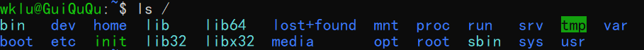

# linux系统文件目录

根目录 `ls /`



- **/bin**   该目录中存放了供所有用户使用的完成基本维护任务的命令。其中bin是binary的缩写，表示二进制文件，通常为可执行文件。一些常用的系统命令，如cp、ls等保存在该目录中。安装好的执行python文件的python3也是在bin里面

- **/boot**  该目录存放着Linux系统启动时需要加载的一些核心文件(LILO或GRUB)，包括一些连接文件以及镜像文件。

- **/dev**   dev是Device的缩写，该目录包含了**Linux使用的所有系统设备文件**，如CD-ROM，磁盘驱动器，调制解调器和内存等。系统设备都被看做文件，从该目录可以访问各种系统设备。在该目录中还包含有各种实用功能，如用于创建设备文件的MAKEDEV。

  **注:在Linux中访问设备和访问文件的方式是相同的**

- **/etc** 该目录中包含**系统和应用软件的配置文件**，也包含启动、关闭某个特定程序的脚本。

- **/home** 用户主目录，一般一个用户在这里都有一个以自己用户名命名的文件夹

- **/lib** lib 是 Library(库) 的缩写这个目录里存放着系统最基本的动态连接共享库，其作用类似于 Windows 里的 DLL 文件。几乎所有的应用程序都需要用到这些共享库。

- **/lost+found** 这个目录一般情况下是空的，当系统非法关机后，这里就存放了一些文件。

- **/media**  linux 系统会自动识别一些设备，例如U盘、光驱等等，当识别后，Linux 会把识别的设备挂载到这个目录下。

- **/mn**t 系统提供该目录是为了让用户临时挂载别的文件系统的

- **/opt** 可选的，这是给主机额外安装软件所摆放的目录

- **/proc** proc是process的缩写，/proc是伪文件系统，存储当前内核运行状态的一系列特殊文件，这个目录是一个虚拟的目录，他是系统内存的映射，我们可以通过直接访问这个目录来获取系统信息，这个目录内容不在硬盘上，而是在内存里。

- **/root**  该目录是root用户的主目录

- **/run**  是一个临时文件系统，存储系统启动以来的信息。当系统重启时，这个目录下的文件应该被删掉或清除。

- **/sbin** Super User bin,存放系统管理员的系统管理程序

- **/srv** 存在服务启动之后需要提取的数据

- **/sys** 系统文件

- **/tmp**  存放临时文件

- **/usr**    usr 是 unix shared resources(共享资源) 的缩写，这是一个非常重要的目录，用户的很多应用程序和文件都放在这个目录下，类似于 windows 下的 program files 目录。

- **/var** var 是 variable(变量) 的缩写，这个目录中存放着在不断扩充着的东西

用户根目录`ls ~`

# du df(磁盘空间)

`du`和`df`

`df`以磁盘分区为单位查看文件系统，可以获取硬盘被占用了多少空间，目前还剩小多少空间等信息

`df -h`查看磁盘使用情况

`df -h [目录文件]` 查看该目录/文件对应的磁盘使用情况

`du -sh [目录或文件]`,按照K，M，G显示该文件夹或者文件小大，不写目录名就是当前目录

`sudo du -sh /home/*` 查看各个用户的使用空间

`du -h [目录或文件]`，如果是文件则会递归显示该目录下所有文件夹和文件的大小

`-s` 对每个Names参数只给出占用的数据块总数

`-h` ，以K，M，G为单位提高可读性

# top

`top`,查看cpu和内存使用情况，并查看各进程的占用情况

https://www.cnblogs.com/baichunyu/p/15356162.html

`u username` 查看某个用户的全部进程

`f`查看指标具体信息，上下键选择,按中`s`之后会按这个指标排序

`E`,依次增大内存信息单位,top默认KiB

`e`依次增大进程内存信息单位，默认KiB

`htop` 提供了更好的可视化界面

https://zhuanlan.zhihu.com/p/296803907

# wget

wget [option] [url]

`-O file_name` 给下来下来的文件指定名字

`-P file_dir`指定下载到的文件夹

`-c` 指定断点续传

`-b`指定在后台下载

# ps

`ps [options] [--help]`

`-A`or`-e` 全部进程

`a`  all with tty,including other users

`-a` all with tty,except session leaders

`x` processes without controlling ttys

`u` 按照user排序

常用组合

`ps aux` 查看所有的用户的携带tty和没有携带tty的进程(全部进程)

`ps au` 查看所有的用户的携带tty的进程

`ps -e u` 查看所有进程，按用户排序

`ps -u [user-name]` 查看对应用户的进程

输出格式

`USER PID %CPU %MEM VSZ RSS TTY STAT START TIME COMMAND`

`USER`：进程拥有者

`PID`：pid

`%CPU`：占用CPU使用率

`%MEM`：占用内存使用率

`VSZ`：占用虚拟内存使用率

`RSS`:占用的内存大小

`TTY`：终端的次要装置号码，该进程在哪个终端上运行，如果终端无关，则显示？，若为pts/0，则表示由网络连接主机进程

`STAT`：进程状态

- `D` 无法终端的休眠状态
- `R` 正在运行
- `S` 休眠状态
- `T` 停止或被追踪
- `Z` 僵尸进程
- `W` 进入内存交换(从内核2.6开始无效)
- `<` 优先级高的进程
- `N` 优先级低的进程
- `L` 有些页被锁进内存
- `s` 进程的领导者(在它之下有子进程)
- `l` 多线程，克隆线程
- `+` 位于后台的进程组

`START` 进程开始时间

 `TIME` 进程执行时间

`COMMAND` 进程所执行的命令

# grep

grep在指定的文件中搜索包含PAATTERN匹配的行，如果不指定文件或者指定了"-",则从标准输入中进行搜索

`grep [options] PATTERN [FILE]`

从 [FILE]中找符合PATTERN的行输出，没有FILE的话则找标准输入

# Linux用户(add and del)

```
adduser username
设置密码
重复密码
# usermod -aG sudo username # 添加sudo权限
```

```
ps -u username #查看该用户的进程,然后清空该用户的进程
kill 9 pid
userdel -r username # 递归删除该用户的所有文件
```

```shell
sudo su root # 利用sudo权限可以切换root用户
sudo su wklu # 再切回来
```


# 查看文件和文件夹

`ls`

查看文件和文件夹

`ls -a`

查看文件和文件夹，包括隐藏文件

`ls -l`

查看文件和文件夹,还有所有者和该文件夹的读写权限

```
drwxr-xr-x 21 apnoman     apnoman      4096 Apr 22 01:38 apnoman
drwxr-xr-x  4 cjsun       cjsun        4096 Nov 29  2017 cjsun
drwxr-xr-x 13 gyzhang     gyzhang      4096 Mar 13 18:26 gyzhang
```

显示结果如上

第一个字符表示文件类型.`d`代表目录,`-`表示文件

接下来每三个字符为一组权限，分为三组，依次表示所有者权限，同组用户权限，其他用户权限

`r` 可读

`w` 可写

`x` 可执行

`-`无权限

# 杂项

`cat /etc/passwd`

查看当前机器下的所有账户

`who`

查看当前登录用户

`ag string`，在当前文件夹下全文搜索这个字符串

`Ctrl+C`终止当前进程

`Ctrl+Z`：挂起当前进程

`Ctrl+D`退出当前shell

# 显卡

`nvidia-smi`

显示基本的英伟达显卡信息

如果想要产看完整信息，命令为

`nvidia-smi -a`

# 复制粘贴

`shift+insert` or `ctrl+shift+v`粘贴

`ctrl+insert`  or  `ctrl+shfit+c`   or `选中右击`复制

# conda in server

- 下载了conda之后在.bashrc里面conda自动执行了conda init,一旦ssh连接上就是conda环境
- 修改conda的源的文件设置是.condarc,修改成了清华源

- 初始化conda，在conda/bin 下面找到conda可执行程序,运行./conda init bash，然后退出登录，下次登录就会自动加载conda环境，和在.bashrc里面修改效果相同。

# 网卡

`ifconfig` 查看当前服务器的所有网卡设置，是Interface Configuration的简写，interface表示 network interface，即网络接口。

`ifconfig` 查看有效的网络接口状态

`ifconfig -a`查看所有网络接口状态

`ifconfig eth0`查看特定的网络接口状态，以`eth0`为例。

特殊的网络接口

`lo(loop)`,IP地址为127.0.0.1，它是回环接口

# shell语法

shell是我们通过命令行与操作系统沟通的语言

shell脚本可以直接在命令行中运行，也可以将一套逻辑组织成一个文件，方便复用


Linux中常见的shell脚本有很多，常见的

- Bourne Shell(`/usr/bin/sh`或`/bin/sh`)
- Bourne Again Shell(`/bin/bash`)
- C Shell(`/usr/bin/csh`)
- K Shell(`/usr/bin/ksh`)
- zsh
  …

Linux中一般默认使用bash，所以接下来讲解bash的语法

文件开头需要写`#! /bin/bash`，指明bash为脚本解释器

脚本示例

```bash
#! /bin/bash
echo "Hello World!"
```

## 脚本运行方式

直接运行

```bash
chmod +x ./test.sh #给test.sh加上可执行权限
./test.sh
```

使用bash运行

```bash
bash ./test.sh
```

## 注释

```bash
# 这是一行注释

echo 'Hello World'  #  这也是注释
# 下面是多行注释
:<<EOF
line 1
line 2
line 3
EOF

# 其中EOF可以替换成任意其他字符
:<<abc
line 1
line 2
line 3
abc

:<<！
line 1
line 2
line 3
！
```

## 变量

**定义变量**

定义变量不需要加`$`符号。例如

```bash
name1='wkl' # 单引号表示字符串
name2="wkl"	# 双引号也表示字符串
name3=wkl	# 不加引号，同样表示字符串
```

**使用变量**

使用变量时需要加上`$`符号，或者是`${}`符号，花括号可选，主要帮助解释器识别变量边界

```bash
name=wkl
echo $name
echo ${name}
echo ${name}itnlp
```

**只读变量**

使用`readonly`或者`declare -r`可以将变量变为只读

```bash
name=wkl
readonly name
declare -r name #两种写法都可以

name=abc # 会报错,因为name只读
```

**删除变量**

`unset`可以删除变量

```bash
name=wkl
unset name
echo name # 输出空行
```

变量类型分为

- 自定义变量(局部变量)

  子进程不能访问

- 环境变量(全局变量)

  子进程可以访问

**自定义变量改成环境变量**

```bash
name=wkl # 定义变量
export name # 方法1
declare -x name # 方法2
```

**环境变量改为自定义变量**

```bash
export name=wkl # 定义环境变量
declare +x name # 改为自定义变量
```

**字符串**

字符串可以用单引号，也可以用双引号，也可以不用引号。

单引号和双引号的区别

- 单引号中的内容会原样输出，不会执行，也不会取变量
- 双引号中的内容可以执行，可以取变量

```bash
name=yxc # 不用引号
echo 'hello, ${name} ,\"hh\"'
ehco "hello, ${name} ,\"hh\""
# output
# hello, ${name} ,\"hh\"
# hello, yxc ,"hh"
```

获取字符串长度

```bash
name=wkl
echo ${#name} # 输出3
```

提取子串

```bash
name=“hello,wkl”
echo ${name:0:5} # 提取从0开始5个字符
```

## 默认变量

在执行shell脚本时，可以向脚本传递参数,`$1`是第一个参数，`$2`是第二个参数，依次类推。特殊的，`$0`表示文件名（包含路径）。`${0}`和`$0`是一样的，其他也相同

例如

```bash
#! /bin/bash
echo "文件名:"${0}
echo "第一个参数："$1
echo "第二个参数："$2
echo "第三个参数："$3
echo "第四个参数："$4
# run
./test.sh 1 2 3 4
# output
# 文件名：./test.sh
# 第一个参数：1
# 第二个参数：2
# 第三个参数：3
# 第四个参数：4
```

其他参数相关变量

| 参数         | 说明                                                         |
| ------------ | ------------------------------------------------------------ |
| `$#`         | 代表文件传入的参数个数，上例就是4                            |
| `$*`         | 由所有参数构成的用空格隔开的字符串，上例就是`"$1 $2 $3 $4"`  |
| `$@`         | 每个参数分别用双引号括起来的字符串，                         |
| `$$`         | 脚本当前运行的进程ID                                         |
| `$?`         | 上一条命令的退出状态(注意不是stdout，而是exit code)。0表示正常退出，其他值表示错误 |
| `$(command)` | 返回`command`这条命令的stdout（可嵌套）                      |
| `command`    | 返回`command`这条命令的stdout（不可嵌套）                    |

## 数组

数组中可以存放多个不同类型的值，只支持一维数组，初始化时不需要指明数组大小

**定义**

数组用小括号表示，元素之间用空格隔开。例如

```bash
array=(1 abc "def" wkl)
```

也可以直接定义数组中某个元素的值

```bash
array[0]=1
array[1]=abc
array[2]="def"
array[3]=wkl
```

**读取数组中某个值**

格式

```bash
${array[index]}
```

例如

```bash
array=(1 abc "def" wkl)
echo ${array[0]}
echo ${array[1]}
echo ${array[2]}
echo ${array[3]}
# output
# 1
# abc
# def
# wkl
```

**读取整个数组**

格式

```bash
${array[@]} # 格式2
${array[*]} # 格式1
```

使用

```bash
array=(1 abc "def" wkl)
echo ${array[@]}
echo ${array[*]}
# output
# 1 abc def wkl
# 1 abc def wkl
```

**数组长度**

类似于字符串

```bash
${#array[@]} # 写法1
${#array[*]} # 写法2
```

例如

```bash
array=(1 abc "def" wkl)
echo ${#array[@]}
echo ${#array[*]}
```

## expr命令

`expr`命令用于求解表达式的值，格式为

```
expr 表达式
```

表达式说明

- 用空格隔开每一项
- 用反斜杠放在shell特定字符前（发现表达式运行错误时，可以试试转义）
- expr会在`stdout`中输出结果，如果为逻辑表达式，则结果为真，`stdout`为1，否则为0.
- expr的`exit code`:如果为逻辑表达式，则结果为真，`exit code`为0，否则为1

**字符串表达式**

- `length STRING`

  返回`STRING`的长度

- `index STRING CHARSET`

  `CHARSET`中任意单个字符在`STRING`中最前面的字符位置，**下标从1开始**。如果在`STRING`中完全不存在`CHARSET`中的字符，则返回0

- `substr STRING POSITION LENGTH`

  返回`STRING`字符串从`POSITION`开始，长度最大为`LENGTH`的子串，如果`POSITION`或者`LENGTH`为负数，0或非数值，则返回空字符串。

示例

```bash
str="Hello World"
echo `expr length "$str"` # ``不是单引号，表示执行该命令
echo `expr index "$str" WcH` # 输出1
echo `expr substr "$str" 2 3` # ell
```

**整数表达式**

`expr`支持普通的算数操作，算术表达式优先级低于字符串表达式，高于逻辑表达式

- `+ -` 加减运算，两端参数会转为整数，转换失败报错
- `* / %` 乘，除，取模运算，两端参数会转为整数，如果转换失败则报错，`*`需要转义
- `()`可以改变优先级，但是需要用反斜杠转义

```bash
a=3
b=4

echo `expr $a + $b` # 输出7
echo `expr $a - $b` # 输出-1
echo `expr $a \* $b` # 输出12,*需要转义
echo `expr $a / $b` # 输出0 整除
echo `expr $a % $b` # 输出3
echo `expr \( $a + 1 \) \* \( $b + 1 \)` #输出20，(a + 1) * (b + 1)
```

**逻辑关系表达式**

- `|` 或运算，也具有短路性质。

  如果第一个参数非空且非0，则返回第一个参数的值，否则返回第二个参数的值，但要求第二个参数的值也是非空或非0，否则返回0。如果第一个参数是非空或非0时，不会计算第二个参数。

- `&`，与运算，具有短路性质

  如果两个参数都非空且非0，则返回第一个参数，否则返回0。如果第一个参为0或为空，则不会计算第二个参数。

- `< <= = == != >= >`

  比较两端的参数，如果为true，则返回1，否则返回0。”==”是”=”的同义词。”expr”首先尝试将两端参数转换为整数，并做算术比较，如果转换失败，则按字符集排序规则做字符比较。

- `()` 可以改变优先级，但是需要转义

示例

```bash
a=3
b=4

echo `expr $a \> $b` # 输出0, >需要转义
echo `expr $a ’<‘ $b` # 输出1 < 需要用单引号括起来
echo `expr $a '>=' $b` # 0 >=需要用单引号括起来
echo `expr $a \<\= $b` # 1

c=0
d=5

echo `expr $c \& $d` # 0
echo `expr $a \& $b` # 3
echo `expr $c \| $d` # 5
echo `expr $a \| $b` # 3
```

## read命令

`read`命令用于从标准输入中读取单行数据，当读到文件结束符时，`exit code`为1，否则为0。

参数

- `-p` 后面可以接提示信息
- `-t` 后面跟秒数，定义字符的等待时间，超过等待时间后会自动忽略此命令

```bash
(base) klwang@insun-72:~/code$ read name
wkl
(base) klwang@insun-72:~/code$ echo $name
wkl
(base) klwang@insun-72:~/code$ read -p "Please input name:" -t 30 name
Please input name:abc
(base) klwang@insun-72:~/code$ echo $name
abc
```

## printf命令

`printf`命令用于格式化输出，类似于`C/C++`中的`printf`函数

默认不会再字符串末尾添加换行符

命令格式

```bash
printf format-string [arguments]
```

用法示例

```bash
printf "%10d.\n" 123 # 占10位,右对齐
printf "%-10.2f.\n" 123.123321 # 占10位,保留两位小数,左对齐
printf "My name is %s\n" "wkl" # 格式化输出字符串
printf "%d * %d = %d\n" 2 3 `expr 2 \* 3` #表达式的值作为参数
```

## test命令于判断符号[]

- `&&`表示与，`||`表示或
- 二者都具有短路性质
- 表达式的`exit code`为0，表示真；为非零，表示假。（与`C/C++`中的定义相反）

**test命令**

再命令行中输入`man test`,可以查看`test`命令的用法

`test`命令用于判断文件类型，以及对变量作比较

`test`命令用`exit code`返回结果，而不是用`stdout`.0表示真，1表示假

例如

```shell
test 2 -lt 3 # 为真 返回值为0
echo $? # 输出上个命令exit code
```
**文件类型判断**

```shell
test -e filename # 判断文件是否存在
```

- `-e` 判断文件是否存在
- `-f`判断是否为文件
- `-d`判断是否为目录

**文件权限判断**

```bash
test -r filename # 判断文件是否可读
```

- `-r` 是否可读
- `-w` 是否可写
- `-x`是否可执行
- `-s` 是否为非空文件

**整数间的比较**

```shell
test $a -eq $b # a是否等于b
```

- `-eq`   是否等于
- `-ne`   是否不等于
- `-gt`   是否大于
- `-lt`    是否小于
- `-ge`    是否大于等于
- `-le`  是否小于等于

**字符串的比较**

- `test -z STRING` 判断字符串STRING是否为0，为空返回true
- `test -n STRING` 判断是否非空，非空返回true, -n可以省略
- `test str1 == str2` str1是否等于str2
- `test str1 != str2` str1是否不等于str2

**多重条件判断**

```shell
test -r filename -a -x filename
```

- `-a` 两个条件是否同时成立
- `-o` 至少一个成立
- `!`取反，例如 `test ! -x file`,当file不可执行时，返回true

**判断符号[]**

`[]`与`test`的用法几乎一模一样，更常用于`if`语句中，另外`[[]]`是`[]`加强版，支持的特性更多

```shell
[ 2 -lt 3 ] # return true 返回值为0
echo $?
```

**注意**

- `[]`中每一项都要用空格隔开
- `[]`内的变量最好用双引号括起来
- `[]`内的常熟，最好用单双引号括起来

```shell
name="wkl"
["$name" == "wkl" ]
```

## 判断语句

**单层if**

```shell
if condition
then
	语句1
	语句2
	...
fi
```

例如

```shell
a=3
b=4

if [ "$a" -lt "$b" ] && [ "$a" -gt 2 ]
then
	echo ${a}在范围内
fi
```

**单层if-else**

```shell
if codition
then
	语句1
	语句2
	...
else
	语句1
	语句2
	...
fi
```

示例

```shell
a=3
b=4

if ! [ "$a" -lt "$b" ]
then
    echo ${a}不小于${b}
else
    echo ${a}小于${b}
fi
```

**多层if-elif-elif-else**

```shell
if condition
then
    语句1
    语句2
    ...
elif condition
then
    语句1
    语句2
    ...
elif condition
then
    语句1
    语句2
else
    语句1
    语句2
    ...
fi
```

示例

```shell
a=4

if [ $a -eq 1 ]
then
    echo ${a}等于1
elif [ $a -eq 2 ]
then
    echo ${a}等于2
elif [ $a -eq 3 ]
then
    echo ${a}等于3
else
    echo 其他
fi
```

case...esac形式

类似于`switch`语句

```shell
case $变量名称 in
    值1)
        语句1
        语句2
        ...
        ;;  # 类似于C/C++中的break
    值2)
        语句1
        语句2
        ...
        ;;
    *)  # 类似于C/C++中的default
        语句1
        语句2
        ...
        ;;
esac
```

示例

```shell
a=4

case $a in
    1)
        echo ${a}等于1
        ;;  
    2)
        echo ${a}等于2
        ;;  
    3)                                                
        echo ${a}等于3
        ;;  
    *)
        echo 其他
        ;;  
esac
```

## 循环语句

**for... in ... do ... done**

命令格式

```shell
for var in val1 val2 val3
do
	语句1
	语句2
	...
done
```

示例1，输出`a 2 cc`，每个元素占一行

```shell
for var in a 2 cc
do
	echo ${var}
done
```

示例2，输出当前路径下的所有文件名，每个文件名一行

```shell
for file in `ls`
do
	echo ${file}
done
```

示例3，输出1-10

```shell
for i in $(seq 1 10)
do
	echo ${i}
done
```

示例4，使用`{1..10}`或者`{a..z}`

```shell
for i in {1..10}
do
	echo $i
done
```

**for ((...;...;...)) do ... done**

命令格式

```shell
for ((expression; condition; expression))
do
	语句1
	语句2
	...
done
```

示例

```shell
for ((i=1; i<=10; i++))
do
	echo ${i}
done
```

**while...do...done循环**

命令格式

```shell
while condition
do
	语句1
	语句2
	...
done
```

示例,文件结束符为`Ctrl+d`，输入文件结束符后`read`返回false

```shell
while read name
do
	echo $name
done
```

**until...do...done循环**

当条件为真时结束

```shell
until condition
do
	语句1
	语句2
	...
done
```

当用户输入yes或者YES时，结束否则一直等待

```shell
until [ "${word}" == "yes" ] || [ "${word}" == "YES" ]
do
    read -p "Please input yes/YES to stop this program: " word
done
```

**break命令**

跳出一层循环，break对于case语句无效

第一层循环read name,只有当输入`Ctrl+d`的结束。然后我们输入name进入，进入第二重循环，到8会被break，返回第一层循环中

```shell
while read name
do
	for ((i=1;i<=10;i++))
	do
		case $i in
			8)
				break
				;;
			*)
				echo ${i}
				;;
		esac
	done
done
```

**continue命令**

和`C/C++`中continue一样

```shell
for ((i=1;i<=10;i++))
do
    if [ `expr $i % 2` -eq 0 ]
    then
        continue
    fi
    echo $i
done
```

输出所有1-10中奇数

死循环的处理方式

- `Ctrl+c`杀死前台进行
- `kill -9 pid`找到对应进程的pid杀死

## 函数

`bash`中的函数类似于`C/C++`中的函数，但`return`的返回值与C++不同，返回的是`exit code`,取值为0-255。0表示正常结束

如果想获得函数的输出结果，可以通过`echo`输出到`stdout`,然后通过`$(function_name)`来获取`stdout`中的结果。

函数的返回值用`$?`获取

命令格式

```bash
[function] func_name() { # function可以省略
	语句1
	语句2
	...
}
```

**不获取`return`值和`stdout`值**

```sh
func() {
	name=wkl
	echo ${name}
}

func

# output
# wkl
```

**获取`return`值和`stdout`值**

不写`return`,默认`return 0`

示例

```shell
func() {
	name=wkl
	echo "Hello $name"
	
	return 123
}

output=$(func)
ret=$?

echo "output = $output"
echo "return = $ret"

# output
# output = Hello wkl
# return = 123
```

**函数的输入参数**

在函数中,`$1`是第一个参数，然后依次类推

注意`$0`依旧是文件名，而不是函数名

```shell
func() {  # 递归计算 $1 + ($1 - 1) + ($1 - 2) + ... + 0
    word=""
    while [ "${word}" != 'y' ] && [ "${word}" != 'n' ]
    do
        read -p "要进入func($1)函数吗？请输入y/n：" word
    done

    if [ "$word" == 'n' ]
    then
        echo 0
        return 0
    fi  

    if [ $1 -le 0 ] 
    then
        echo 0
        return 0
    fi  

    sum=$(func $(expr $1 - 1))
    echo $(expr $sum + $1)
}

echo $(func 10)
```

**函数内的局部变量**

函数内可以定义局部变量，作用范围仅在当前函数

命令格式

```
local 变量名=变量值
```

```shell
#！ /bin/bash

func() {
	local name=wkl
	echo ${name}
}

func

echo $name
```

输出

```
wkl

```

第一行是函数内输出，第二行为函数外调用name，发现该变量不存在。

## exit命令

`exit`命令用来退出当前`shell`进程/脚本，并且返回一个退出状态，使用`$?`可以接受这个退出状态

`exit`命令可以接受一个整数值作为参数，代表退出状态，如果不指定，默认状态值为0

`exit`退出状态只能是一个介于0~255之间的数，其中0表示成功，其他都表示失败

示例

```shell
#! /bin/bash
if [ $# -ne 1 ] #传入1个参数，正常退出，否则异常退出
then
	echo "arguments not valid"
	exit 1
else
	echo "arguments vaild"
	exit 0
fi
```

## 文件重定向

每个进程默认打开3个文件描述符：

- `stdin` 标准输入，从命令行读取数据，文件描述符为0
- `stdout`标准输出，向命令行输出数据，文件描述符为1
- `stderr`标准错误输出，向命令行输出数据，文件描述符为2

可以用文件重定向将这三个文件重定向到其他文件中

| 命令               | 说明                                        |
| ------------------ | ------------------------------------------- |
| `command > file`   | 将`stdout`重定向到`file`中                  |
| `command < file`   | 将`stdin`重定向到`file`中                   |
| `command >> file`  | 将`stdout`以追加的方式重定向到`file`中      |
| `command n> file`  | 将文件描述符`n`重定向到`file`中             |
| `command n>> file` | 将文件描述符`n`以追加的方式重定向到`file`中 |

示例

``` 
echo -e "Hello \c" > output.txt
echo "World" >> output.txt
read str < output.txt
echo $str
```

同时重定向stdin和stdout

```shell
#! /bin/bash

read a
read b

echo $(expr "$a" + "$b")
```

创建input.txt

```
2
3
```

​	bash中输入以下命令

```bash
./test.sh < input.txt > output.txt
cat output.txt
# outout 是 5
```

## 引入外部脚本

语法格式

```shell
. filename # 注意点和文件名之间有一个空格

或者
source filename
```

示例

创建`test1.sh`

```shell
#! /bin/bash

name=yxc  # 定义变量name
```

然后创建`test2.sh`.内容为

```shell
#! /bin/bash

source test1.sh # 或 . test1.sh

echo My name is: $name  # 可以使用test1.sh中的变量
```

执行

```shell
chmod +x ./test2.sh
./test.sh
# output
# My name is: wkl
```


