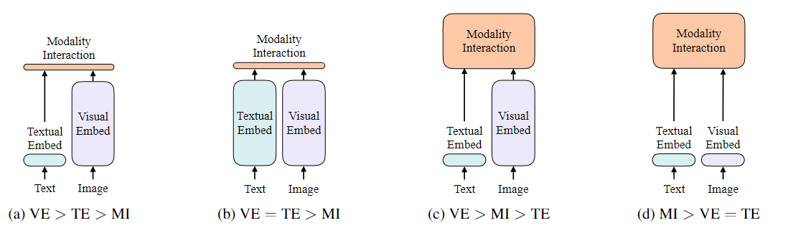
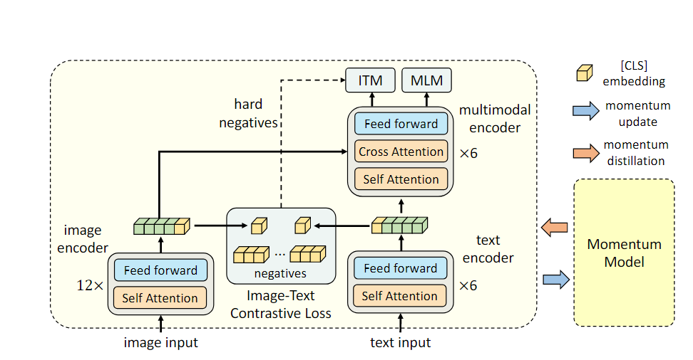
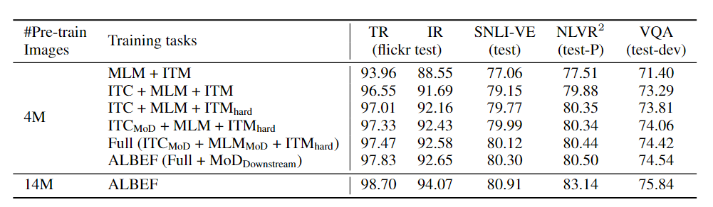
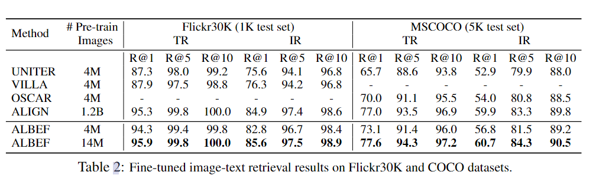
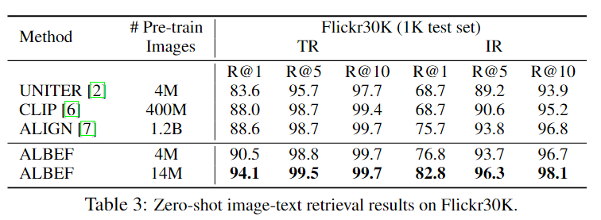
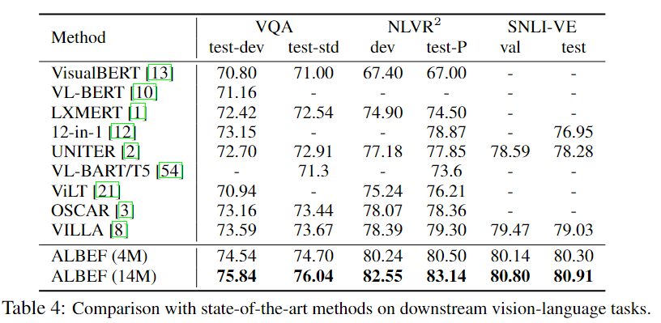

Align before Fuse: Vision and Language Representation Learning with Momentum Distillation

2021-10 Salesforce Research

参考ViLT中的一个分类图

这4幅分别表示图像端，文本端和和多模态交互层的复杂程度，越高则代表越复杂。

- (a)

- (b)

  CLIP是(b)的一个代表，图像端和文本端都使用了复杂的Transformer，但是在交互时仅仅使用了点乘交互。CLIP做图文检索方面效果很好，但是对于其他的下游任务的表现一般，说明仅仅做简单的点乘来作为多模态的交互是不够的。

  但是这种做法的好处对于图文检索任务有好处，可以使得图文检索推理变快。因为待检索数据库中的特征可以提前保存下来，然后检索实际上是$O(n)$次点乘

- (c) 

  则是一众采用目标检测框架的旧模型的大致架构，文本端采用简单的embedding，而图像端则套入复杂的目标检测框架，然后在交互时采用复杂的注意力机制进行交互，这种做法的最大问题推理和训练都很慢，并且目标检测模型是提前训练好的，固定住提取特征的，没有办法做多模态交互

- (d)

  ViLT模型采用的是(d)架构，文本端和图像端都很简单，只有embedding，然后再交互端使用transformer进行交互，特点的推理速度快，但是效果一般，说明编码文本端和图像端只做简单的embedding也不够。

**一般图像端都要比文本端复杂，效果可以更好一点**

# ALBEF

ALBEF的模型架构属于(c)这种，文本端简单，但是也没有完全只做embedding，图示如下

对于图像端，采用12层transformer。但是在文本端，只有前6层作为text encoder，将后6层做多模态交互。 符合第一张图中的(c)，但是也没有增加计算量。

**预训练任务**

总共采用了3个预训练任务，ITC loss(和CLIP相同的做法，对比学习损失)，ITM(图文匹配，二分类任务)，MLM(语言掩码建模任务，和BERT的一样)

**ITC loss**

做法和CLIP类似，并且在中间加入了MoCo的思想（两个模态两个momentum model），扩大了负例的采样池，得到损失$L_{itc}$

**ITM loss**

使用最后模态交互层的[CLS] token作为图像和文本的联合表示，来做图文是否匹配的二分类任务。得到损失$L_{itm}$

在ITM任务中，作者没有一股脑的把所有的图文对组合都送进去预训练，而是采用了**hard negative**的做法。

原因

- 正例少，负例多
- 判定负例比判定正例要简单得多，判定在多的负例也没法学习到有效的参数

因此作者只用hard negative pair来做负例，增加任务的挑战性。

hard negative pair是指语义相似细粒度的细节不同的文本对，是最难判定，最接近正例的负例。

hard negative pair的获取则依靠ITC任务，这里使用同一个batch内的相似度得分来判定，选取具有最高相似度得到的样本对作为负例。

**MLM loss**

同时利用图像特征和文本上下文特征来重建被mask的词，得到损失$L_{mlm}$

最终的损失是三者相加
$$
L = L_{itc} + L_{mlm} + L_{itm}
$$
在计算三个损失的时候，有细节内容。

对于ITC和ITM任务来说，图像和文本端的输入都是原来的图像和文本，但是对于MLM任务来说，需要输入被mask的文本。因此在计算三个损失的过程中，需要进行两次前向过程。

**momentum distillation**

 改善从noisy data中的训练效果，因为从网络中爬取的数据中有大量图文对实际上语义是不匹配的，也是弱相关的。对于ITC任务来说，负例文本也可能匹配图像中的内容，对于MLM任务来说，可能也存在比ground truth更好的词来填入，但是上述ITC和MLM任务中采用的交叉熵都是硬标签，惩罚了这种情况。

为了克服这个问题，作者提出了利用momentum model来产生伪目标(软标签)，也就是利用momentum model的softmax score作为软标签。

然后预测是分布，标签也是分布，因此采用KL散度来计算损失，代替交叉熵。

对于ITC loss

首先用momentum版本的文本图像编码器来得到momentum版本的相似度

$s^\prime(I,T) = g_v^\prime(v^\prime_{cls})^Tg_w(w_{cls}^\prime)$

$s^\prime(T,I) = g_w(w_{cls}^\prime)^Tg_v^\prime(v^\prime_{cls})$

然后得到对应的softmax得分$q^{t2i},q^{i2t}$用于计算损失
$$
L_{itc}^{mod} = (1 - \alpha) + \frac{\alpha}{2}E_{(I,T) -> D}[KL(q^{i2t}(I)|| p^{i2t}(T)) + KL(q^{t2i}(T)|| p^{t2i}(T))]
$$
对于MLM loss也是类似的，使用momentum 的模型得到$q^{msk}(I,\hat{T})$,采用混合$L_{mlm}$和KL散度的方式得到新的损失$L_{mlm}^{mod}$
$$
L_{mlm}^{mod} = (1-\alpha) L_{mlm} + \alpha E_{(I,\hat{T}) -> D} KL(q^{msk}(I,\hat{T})||p^{msk}(I,\hat{T})) 
$$
$\alpha$是超参数=0.4

预训练数据集： 4M 图文对，之后的消融实验也采用了12M的图文对

下游任务共有5个

1. 图文检索(包含image-to-text 检索和 text-to-image 检索)(IR,TR)

   作者在Flickr30K和COCO这两个数据集上做微调和评测。

   对于在Flickr30K上的zero-shot检索，在COCO上做了微调，微雕使用的损失为ITM loss + ITC loss

2. 视觉蕴含(Visual Entailment)（三分类任务）(SNLI-VE)

   预测图像和文本之间是否是蕴含关系(有3个结果，蕴含，矛盾和中立)，作为一个三分类任务来微调

3. 视觉问答（Visual Question Answering）(VQA)

   有两个版本，第一个版本就是做单选题

   第二个版本是额外训练一个decoder来生成文本，然后把文本限制到候选答案中，这里使用的是第二种

4. 自然语言的视觉推理(Natural Language for Visual Reasoning)(NLVR)

5. Visual Grounding，跳过了

模型的实现细节

在图像端，使用ViT-B/16初始化参数，文本端和多模态交互端使用BERT_base初始化参数，动量模型的更新参数取值为0.995，MoCo中使用的序列大小为65536

**实验结果**

比较训练方法

第二行，我们可以看是ITC任务可以很好的增加性能，是非常好用的任务

第三行，采用了hard negative pair之后，相比第二行性能也有提升，但是不如ITC明显，之后依次增加了ITC_MoD,MLM_MoD,MoD_Downstream,效果依次提升

和其他模型比较

微调检索任务，可以看到只在4M数据下训练的ALBEF对比于UNITER，VILLA等模型效果要好得多。同时，在14M数据下训练的ALBEF击败了在1.2B数据下训练的ALIGN。

zero-shot检索，但是根据作者的说法实际上ALBEF在COCO上做了微调，然后再Flickr30K上做zero-shot，但是作者对比的例如CLIP是直接做zero-shot的，没有经过任何微调。

这里个任务都是分类任务，因此可以使用同样的准确率指标，只看ALBEF(4M),结果也是比前面的模型都要好