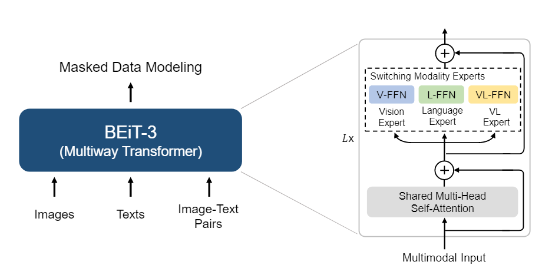
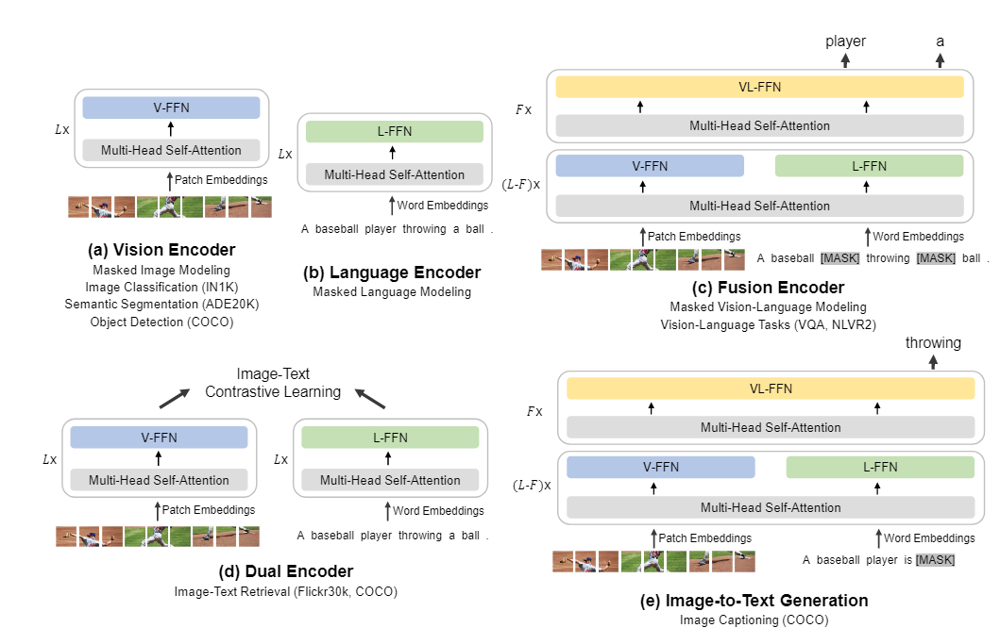
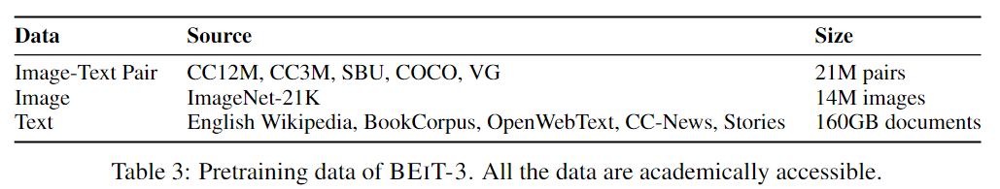
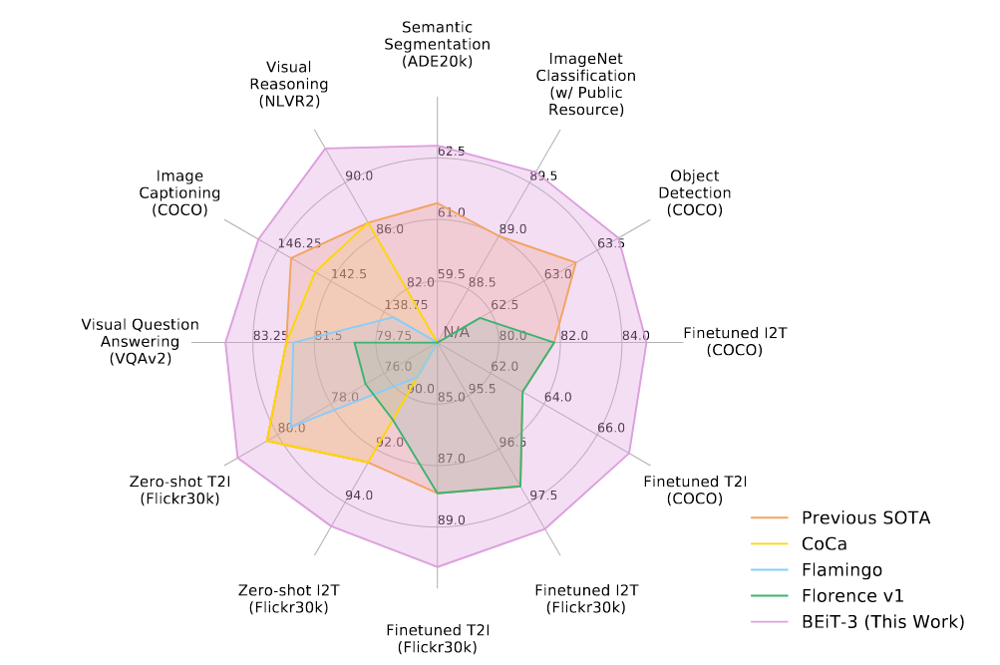
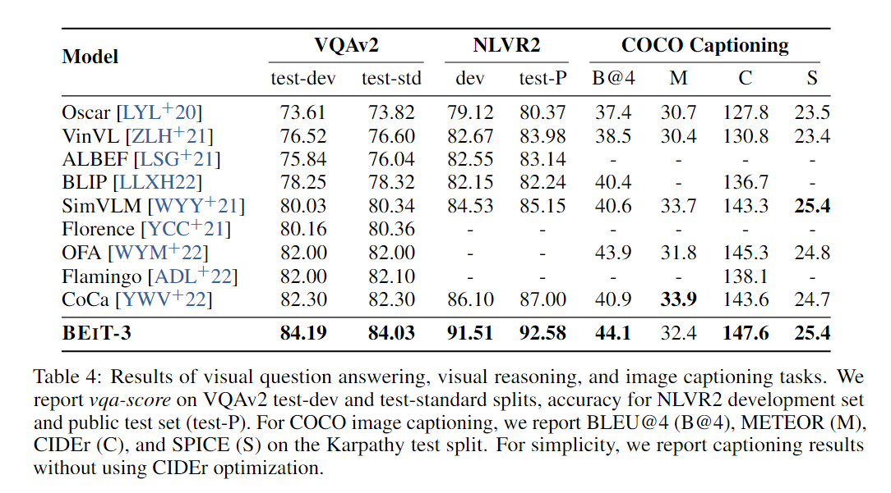
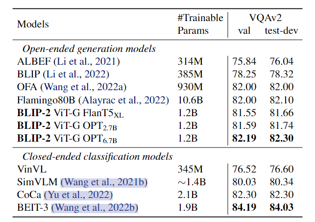
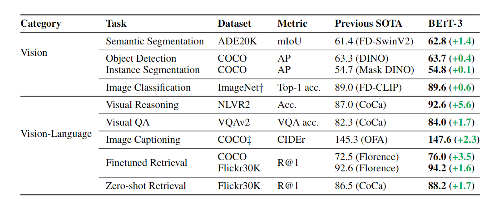

Image as a Foreign Language: BEIT Pretraining for All Vision and Vision-Language Tasks

2022-08-Microsoft Corporation

追求更加统一的模型

- part1：模型的模型结构
- part2： 高效的损失函数(Mask Data loss)
- 模型scale的扩大

## 模型结构

和VLMo是一样的，不过这里换了个名字，叫做Multiway Transformer

因此针对不同的下游任务，也需要进行不同的组合

a：视觉单模态

b：语言单模态

c：多模态理解任务

d：多模态检索

e：图像到文本生成（但是图中给的示例是a baseball）

## Pretraining Task

只有一个，就是Masked data modeling，Masked 图片或者文本，然后进行恢复

不使用多任务，因此scale 模型的大小会更容易，完全不用管多个任务之间的权重怎么分配

## 实验

数据

- 21M Image-Text pairs

- 14M images

- 160GB documents

(致敬图)

基本上也是分为

- 单模态Vision(Semantic Segmentation,Object Detection)

- 多模态理解(VQA,NLVR等)

  

  对比了之后，我发现BLIP的结果比起BEiTv3差了很多

  我对比了两者使用的数据集，应该差不太多，不过数据量有区别

  - BLIP 参数 385M，数据 14M(生成式VQA)
  - BeiT-3 参数 1.9B 数据 21M pair + 14 image + 160GB text(分类式VQA)

  这里**BLIP-2**里面有一张图可以比较好的表述清楚

  

- 多模态检索(zero-shot and finetune)

- Image Captioning

CoCa里面的ImagNet图像分类结果更好，但是这么作者给ImageNet后面加了记号，说明这里的ImageNet的结果是只使用了publicly accessible resource

基本上使用最开头那张六边形战士图就可以表示清楚

