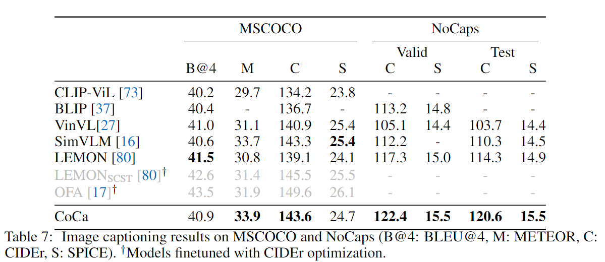

BLIP-2

BLIP-2: Bootstrapping Language-Image Pre-training with Frozen Image Encoders and Large Language Models

2023-01 Salesforce Research

看下来感觉跟第一篇BLIP没啥关系了

## 问题提出

像VLMo,BEiTv3这种模型，是通过利用单模态数据来增加多模态效果的。但是实际上的训练也不能少，因此模型参数很多，那么我能不能直接用单模态训练好的模型的呢？而且还不能额外的增加参数，因此单模态训练好的模型需要时Frozen的。

保有上述的特点，作者提出了一种两阶段训练的方法

## 模型结构

作者提出的模型结构Q-Former作为image encoder 和 LLM之间的bottleneck

Stage1

第一阶段

Image Encoder frozen

先让Image Encoder 和 Q-Former做交互，损失函数还是老三样(ITC,ITM,IGT)

Q-Former，左侧是decoder类似的结构，而且输入的Query是自定的，可学习的

- ITC（放弃了动量蒸馏）

  Due to the use of a frozen image encoder, we can fit more samples per GPU compared to end-to-end methods. Therefore, we use in-batch negatives instead of the momentum queue in BLIP

- ITM（使用hard negative mining）

- IGT （给定图像条件下生成文本）(使用了causal self-attention mask，使得生成时只能看到图像信息和已经生成的文本信息)

这里不同的任务使用的attention的mask策略不同，可以看到内容不同，可以看右图

Stage2

Image Encoder frozen and LLM Decoder frozen

LLM分为了两者

- LLM decoder，训练时使用 LM loss
- LLM encoder-decoder，训练时使用 Prefix LM loss

两者的计算是一样的，不过输入不同，Prefix需要额外输入一些前缀的文本

实际上作者使用的LLM

- OPT: Meta推出的GPT-3复刻版，源码完全开放 [Meta复刻GPT-3“背刺”OpenAI，完整模型权重及训练代码全公开](https://zhuanlan.zhihu.com/p/509100358)

- FlanT5

  Flan-T5是Google最新的一篇工作，通过在超大规模的任务上进行微调，让语言模型具备了极强的泛化性能，做到单个模型就可以在1800多个NLP任务上都能有很好的表现。这意味着模型一旦训练完毕，可以直接在几乎全部的NLP任务上直接使用，实现**One model for ALL tasks**

## 实验

**数据**

和BLIP相同，并且使用了BLIP中的CapFilt方法来生成合成数据

资源友好

our pre-training is more computational friendly than existing large-scale VLP methods. For example, using a single 16-A100(40G) machine, our largest model with ViT-G and FlanT5-XXL requires less than 6 days for the first stage and less than 3 days for the second stage.

**Overview**

Instructed Zero-shot Image-to-Text Generation

BLIP-2使用语言模型会追加prompt在visual prompt之后

下游任务

**Zero-shot VQA**

使用的prompt

- OPT "Question: {} Answer:"
- FlanT5 "Question: {} Short answer"

生成时使用beam search

Result

Observation

**a stronger image encoder or a stronger LLM both lead to better performance**

**Image Captioning**

微调

使用的prompt “a photo of”,使用 lm loss训练，在微调时LLM frozen，update Q-Former and image encoder

在COCO上微调，迁移到NoCaps上zero-shot

看了下疑问怎么没和CoCa比，遂把CoCa的结果搬过来

BLIP-2：121.6  15.8

CoCa：122.4 15.5

**VQA**

微调Q-Former和image encoder并且保持LLM frozen

使用the open-ended answer generation loss

LLM接受Q-Former的输出和q作为input，然后使用LLM生成答案

而且在训练时question token也会输入Q-Former中和query交互

Result

**Image-Text Retrieval**

直接微调第一阶段的模型，因为检索没有生成，在COCO上微调，然后在Flickr30K上zero-shot

使用阶段1的损失函数微调Image Encoder + Q-Former

对比ITG的效果

**Limitation**

- 提供in-context VQA examples做few-shot时，模型没有提高in-context的VQA的表现，作者归因于因为使用的训练数据都是单个图文对的，LLM不能学习到同一个序列内的多个图文对的相关性
- BLIP-2可能会生成无法令人满意的文本，因此frozen了LLM，因此BLIP继承了LLM的风险

