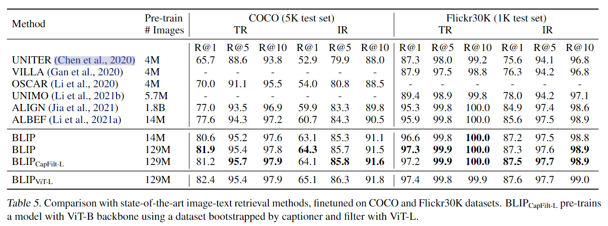
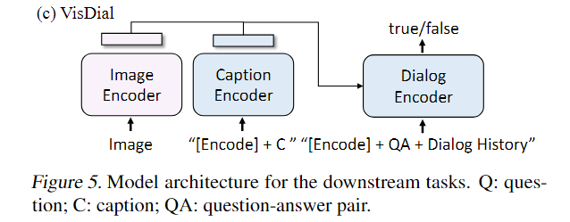
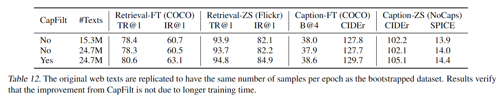

BLIP: Bootstrapping Language-Image Pre-training for Unified Vision-Language Understanding and Generation

2022-01 Salesforce Research

## 题目

1.Unified Vision-Language Understanding and Generation，加入decoder，可以同时做生成和理解任务

2.Bootstrapping，从数据角度促进在noisy数据上的训练的效果

BLIP是ALBEF的同团队的工作，结合了ALBEF和VLMo的思想

## 两个贡献

1.模型角度，提出了Multimodal mixture of Encoder-Decoder(MED),这部分和VLMo的想法类似，模型通过三个目标函数训练（1）ITC （2）ITM（3）LM

2.数据角度Captioning and Filtering(CapFilt),将从噪杂数据上预训练得到的模型微调为两个模型

​	（1）captioner,可以根据给定的图像生成合成的文本描述

​	（2）filter，用来从嘈杂的原图文对和合成的图文对中移除相关性较低的图文对。

## 模型结构

**图像中，颜色相同的部分参数是共享的**

左侧是图像端，使用ViT作为image encoder，右侧的三个均是文本端

- Text Encoder，和bert相同，出来的特征和图像端计算ITC，这部分在加上图像端就是原来的双塔结构，计算ITC时，引入了momentum encoder和soft label，和ALBEF一样的技巧。

- Image-grounded-Text-encoder

  这部分仍旧是encoder，让我们看一看ALBEF的模型结构，可以发现图像端+这两个部分和ALBEF的模型和结构是相同的，用来计算ITM，因此这部分要加上cross-attention来帮助图文深层次的模态融合，而且在计算ITM时，同样使用了hard negative pair mining

  

- Image-grounded text decoder

  这一部分是decoder部分，因此原来的在ALBEF中的MLM任务被换成了LM任务，给定图像，decoder生成文本，该任务优化交叉熵来训练模型以自回归的方式来生成具有最大似然值的文本

## CapFilt

这部分主要说明 Captioner和Filter的作用和用法

在图像左侧，红色的的$T_w$是web data，绿色的$T_h$是手工标注的data，web data多，而手工标注的data少，使用这些数据来预训练出MED，然后利用MED进行为微调，使用ITC和ITM作为目标微调得到Filter，使用LM作为目标微调得到Captioner。

利用Captioner合成数据，得到$(I_w,T_s)$

利用Filter过滤数据$(I_w,T_w)$(web data)和$(I_w,T_s)$(synthetic data),[红色]

得到过滤之后的数据$(I_w,T_w),(I_w,T_s)$,绿色

最后加上原来手工标注的数据，这样就得到了新的质量更好的数据集$D$

为什么不仅仅使用Filter，而是还要使用Captioner呢

使用Captioner可以增加数据的数量

而且这个Captioner的生成质量确实还可以

## 实验

**CapFit的效果**

对勾\_B是在CapFit中使用了ViT-B的MED，对勾\_L是在CapFit中使用了ViT-L的MED

可以看出使用了CapFit的数据来训练的BILP模型的表现是稳步提升的

下面是一些生成和原始文本的比较

**生成多样性的Captions**

解码策略为nucleus sampling，作者同时比较了使用beam search的结果。

不过这两个我都不太懂

**参数共享策略比较**

从实验结果看出，共享除了self-attention的参数得到了最好的结果

**和其他模型的比较**

**微调下游任务**

- 检索

看BLIP-14M和ALBEF-14M的比较，整体上比ALBEF性能更好

- zero-shot检索

主要还是比较ALBEF-14M和BLIP-14M，两者使用的训练数据都是一样的

Image-Caption

BLIP模型也可以像VLMo一样灵活组合，来适应不同的下游的任务

- VQA

  

  对于生成式的VQA，组合Image Encoder+Image-grounded Text encoder+Image-grounded Text Decoder来生成答案

- NLVR

  NLVR需要判断一句话是否可以描述一对图像，因此也需要组合一下模型的各个部分

  图像部分使用两次image-encoder做前向

  对于Image-grounded Encoder中每一个Transformer Block，从Image-grounded Encoder中使用相同的参数初始化两个Cross-Attention层，之后将两个出来的特征Merge，前6层Merge layer只做简单的average pooling，后6层拼接在做投影，随后使用[Encode]这个token做分类

=======================================VQA and NLVR=====================================

主要看ALBEF-14M和BLIP-14M比较，不过ALBEF的NLVR任务执行了额外的步骤，在4M的数据上，用三分类做了一个epoch的微调

- VisDial

  

VisDial扩展了VQA，模型不仅需要基于问题对，还要使用对话history和图像caption来回答问题。

模型结构如下

- Zero-shot Transfer to Video-Language Task

  zero-shot评测是直接拿在COCO和VQA上训练的模型，并且对于视频输入的处理，对于检索每一个视频统计采样8帧，对于QA统一采样16帧这种简单的做法

## 额外的消融实验

**CapFilt不是依靠更长的训练时间来获益的**

因为有新合成的数据，所以增强后的数据更多，因此采用相同的配置就需要更长的时间，这里作者将原来的web data进行重复，增加到和增强后的数据集相同的大小来进行训练，保证了时间一样，但是仍旧是使用了CapFilt的效果更好

**一个新的模型应该在bootstrapped 的data上重新训练，而不是继续训练**

这里作者对比了新训练的BLIP和继续训练的BLIP

