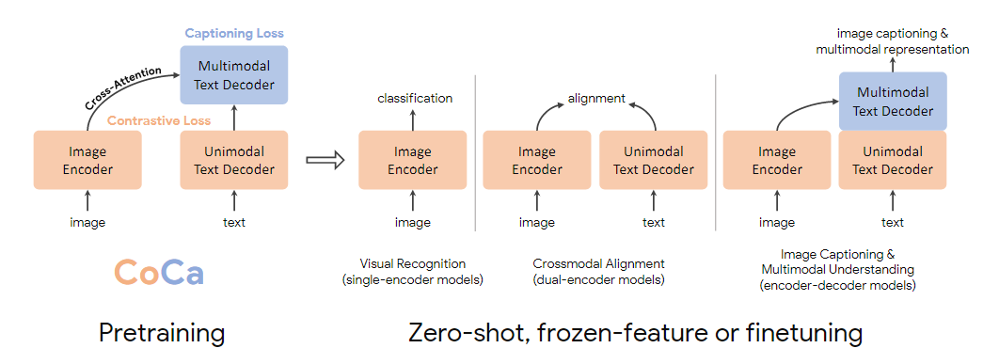
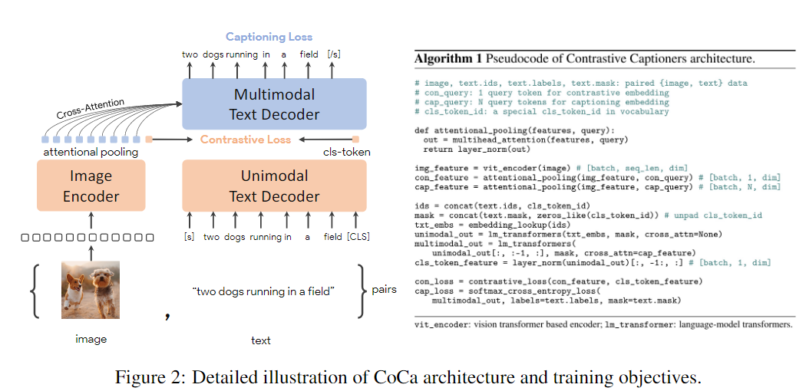
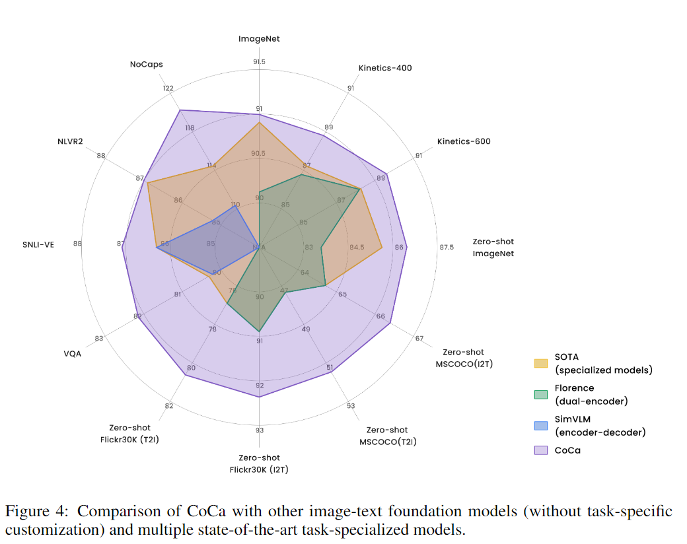
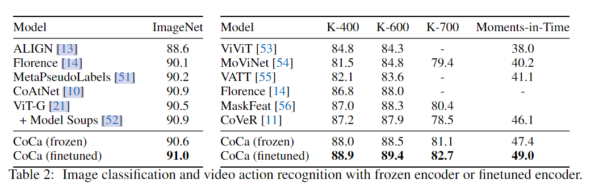
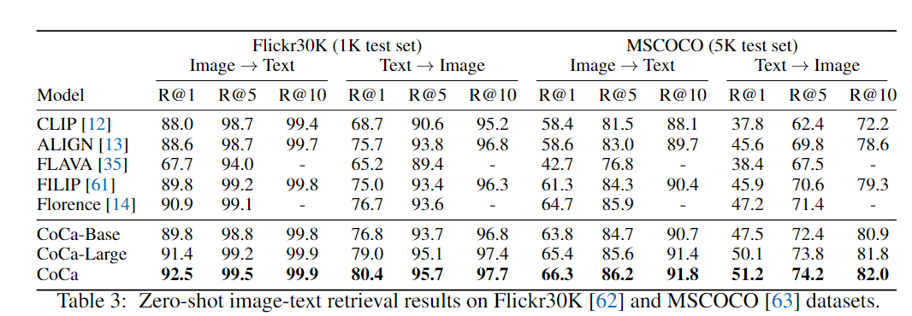
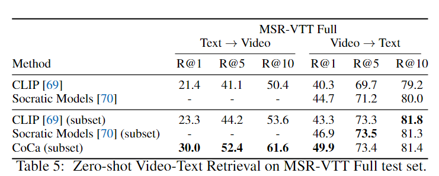
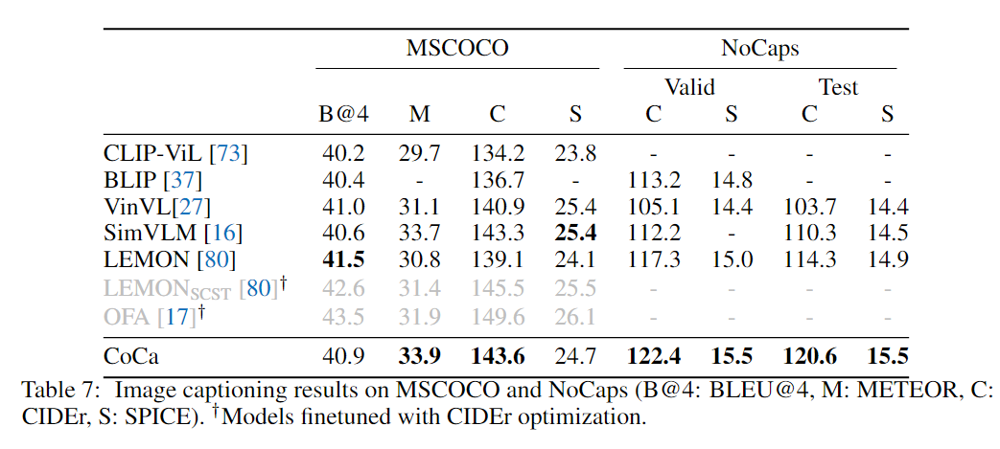
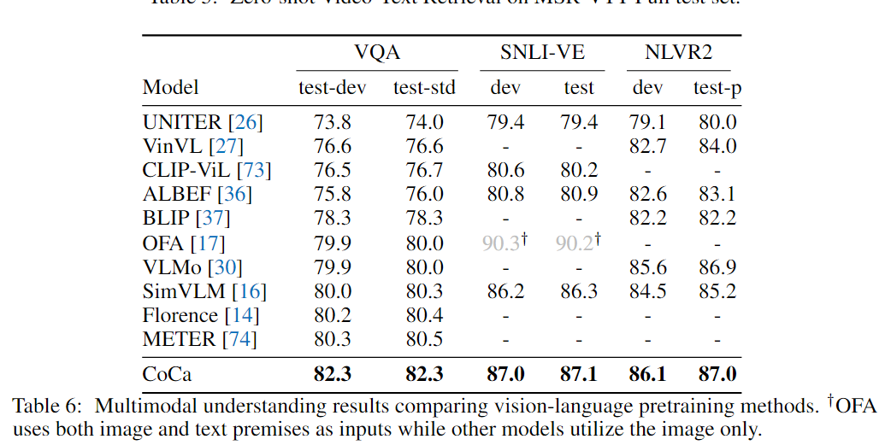

**CoCa: Contrastive Captioners are Image-Text Foundation Models**

2022-05 Google Research

CoCa => Contrastive Captioners

three line research引入问题

1. single-encoder line,可以用来处理这种下游的图像和视频理解任务，并且训练这些模型需要大量标注数据(指的应该是计算机视觉这边)
2. 训练两个encoder的，例如CLIP，ALIGN模型，可以使用在zero-shot分类和图文检索方面
3. 训练encoder-decoder模型，encoder接受图像，并且在decoder端使用 LM loss优化，对于下游任务来说，decoder的输出是多模态的联合表示，无法得到和图像对其的文本表示(因此就不好用在检索任务上)

这个问题，ALBEF的模型结构就可以解决了吧，不过就是要把第二个encoder换成decoder，来保留生成能力

## 模型结构

So，CoCa的模型结构就是这样

然后沿着ALBEF的思路，那么Image Encoder 和 Unimodel Text Decoder 的输出算ITC loss，不过因为换成了Decoder，因此就把MLM loss换成LM loss喽

不过ITM loss去哪里了？wait

如果要使用ITM loss，那么就需要另外一个encoder，需要另外一个encoder也就意味着text这边需要两边前向，作者专门提出了自己的模型训练效率的问题，因为使用的这两个损失函数都是只需要前向一次就可以计算完成，在每一次只前向一次的训练过程中，效率当然是更高效的。

下面是一张更清晰的模型结构图

虽然说前半Decoder用作编码文本，但是标准的Decoder不是需要cross-attention吗？那这部分怎么办？

> 答案是去掉(确实)

所以Unimodal Text Decoder的transformer block就是去掉cross-attention的decoder block

Multimodal Text Decoder是正常的decoder block

**Attentional Pooler**

Image Encoder的输出用于两个地方，第一个是计算ITC loss，第二个是参数cross-attention的计算，而且两者需要的query数是不一样的，因此这里使用了一个attention pooler来针对不同的任务获取不同输出。

## 实验

这个模型使用的数据集非常大，包括两部分

- JFT-3B 3 billion (非公开)
- ALIGN的数据集  1.2bilion (非公开)

这张总览图就可以看的差不多了，基本上这个模型把各种任务的sota刷了个遍

**单模态的下游任务**

多模态任务

zero-shot检索

Image Caption

多模态理解

