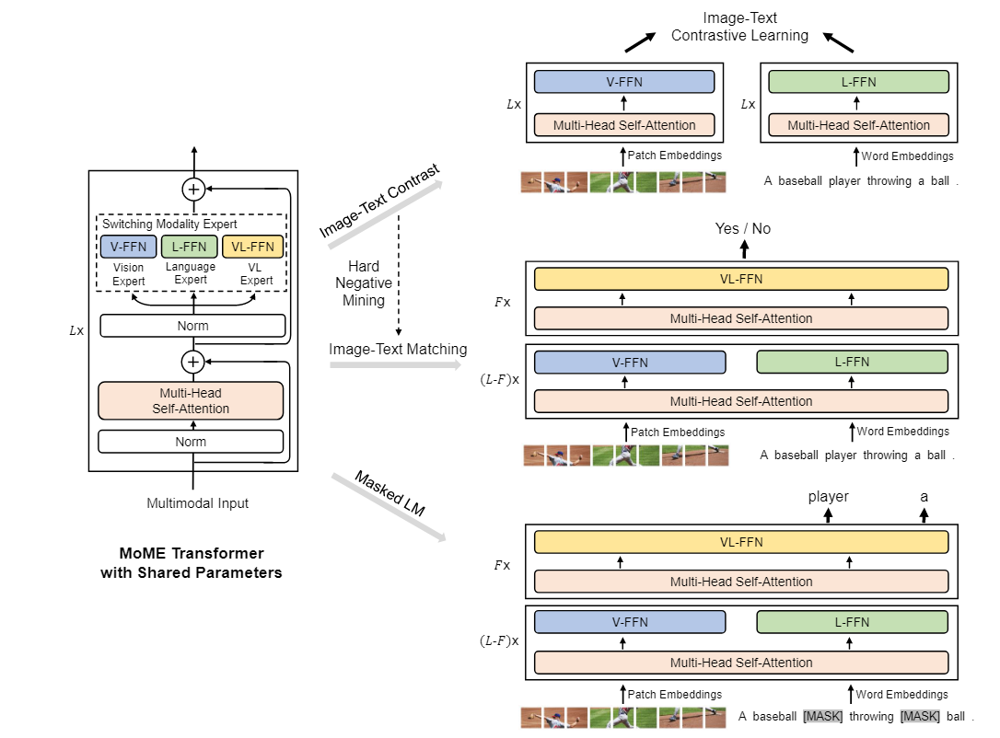
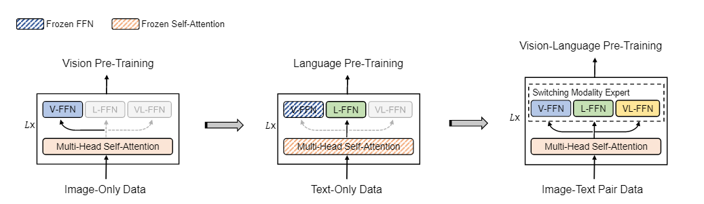
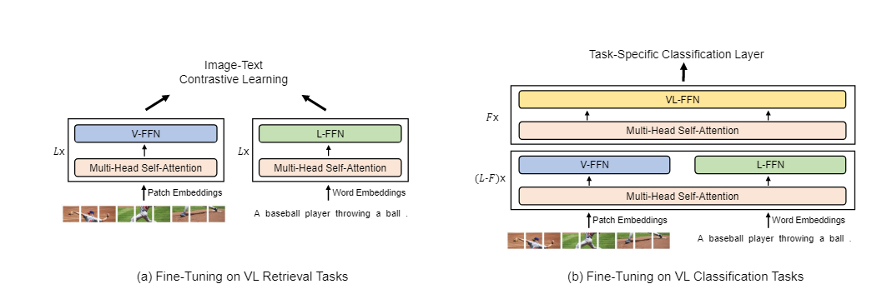
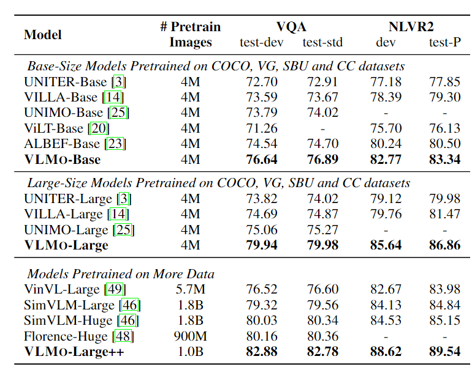
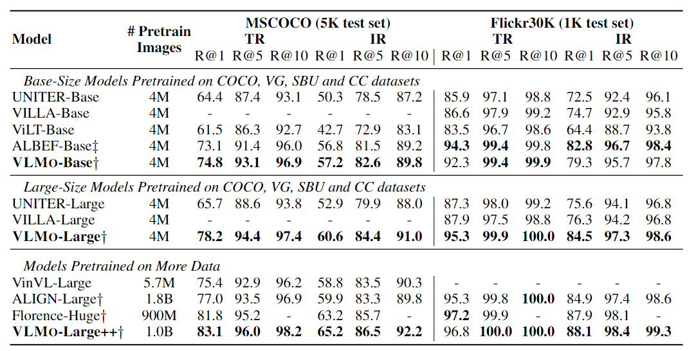
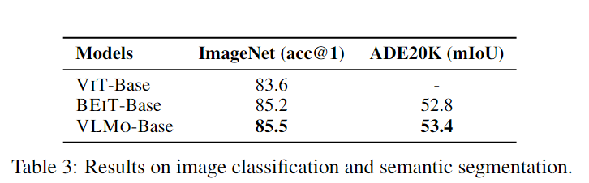
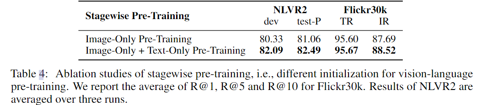
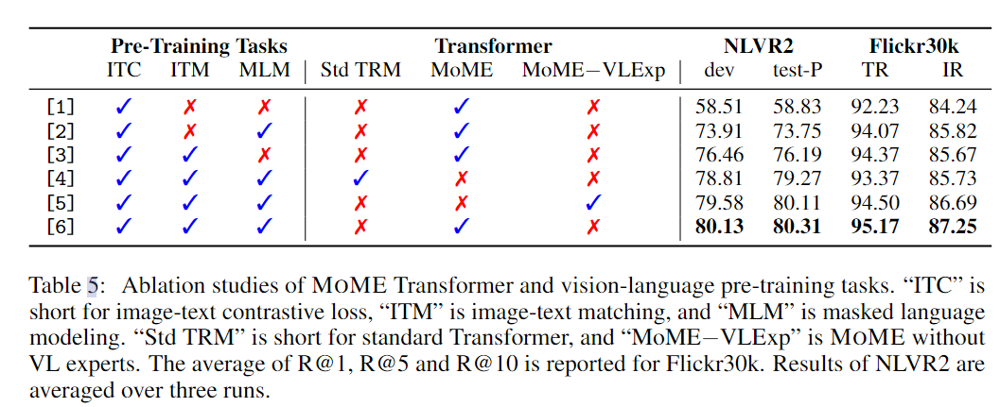
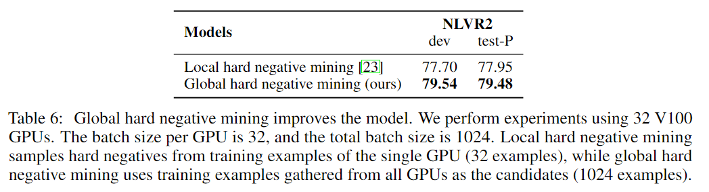

**VLMo:Unified Vision-Language Pre-Training with Mixture-of-Modality-Experts**

2021-11 Microsoft

## 标题解释

- 在transformer基础上引入的MoME,来使得模型框架变得更加灵活。，这里是Unified的，整体的模型框架包含了一个特定模态的expert和一个共享参数的的attention层
- Mixture-of-Modality-Experts：MoME

主要贡献：

1. Unified：在Transformer中加入MoME
2. 提出了一种利用单模态数据来帮助训练多模态模型的方法，多阶段训练

## 问题

问题：CLIP模型是适合于检索任务的，因为待检索的数据特征可以提前计算并且保存，因此时间是线性的。但是CLIP模型在其他图文理解任务上的表现较差，因为CLIP只采用了点积这种浅层次的交互。

既然浅层次的交互的建模能力还不够，那么我们就来采用深层次的交互呗。也就是利用`fusion encoder`,使用attention来建模多模态交互能力。但是这种结构不适合用来做检索，因为`fusion encoder`必须把一对数据输入进去，因此检索的时间就是$O(n^2)$，和CLIP这种线性的没法相比

这篇文章就是为了克服这个问题。VLMo既可以作为对偶编码器来分别独立的编码图像和文本，这样可以用于检索任务。同时也可以用作`fusion encoder`来进行深层次的图文交互

## 模型结构

MoME是图中的**V-FFN，L-FFN，-VL-FNN**这三个FC，并且前面的attention在这三个expert中是共享参数的，当仅处理vision数据时，就过V-FFN，而当仅处理图像数据时，就过L-FFN，而当处理图文对数据时，就过VL-FFN

### 多阶段训练

Stage1. 只利用Vision数据训练MHSA和V-FFN，作为BEiT模型(这个团队之前的工作)

Stage2. 固定V-FFN和MHSA，使用text data来训练L-FFN

Stage3. 解除所有参数冻结，使用图文对数据来训练

对于使用图文对的多模态数据，预训练是采用了3种任务，在上图中也可以看到具体的数据流向

1. ITC ，CLIP同款
2. ITM，分类输入的图文对是否匹配，受ALBEF启发，也采样hard negative image-pair来计算，但是实现有所不同，ALBEF仅从单个GPU采集负样本(Local hard negative mining)，但是VMLO会从所有的GPU上采集负样本(Global Hard Negative Mining)，计算的数量更多
3. Masked LM，语言掩码建模

## 微调的方式

从图中我们就可以看出VLMo的各个模块可以灵活组合来应对不同的下游任务

## 实验

Pre-Training Setup

数据集：4M images 和 10M的图文对数据

具体的参数设置跳过

**和其他模型在下游任务下的对比**

1.分类任务

2. 检索任务

   

3.单模态任务，图像的分类和分割任务

## 消融实验

1.证明多阶段的预训练的有效性

2.证明各个预训练任务的有效性和MoME结构的有效性

3.证明Global Hard Negative Mining比Local hard negative mining有效

## 疑问

1.关于共享attention层参数：https://www.jianshu.com/p/e7280a2f4137

2.

在实验设置阶段，文章有以下这句话，说明并不是所有的Transfromer block都会使用VL-FFN，但是我没从[源码仓库](https://github.com/microsoft/unilm/tree/master/vlmo)找到具体的配置信息

VLMOBase uses vision-language expert on the top two Transformer layers, and VLMO-Large introduces vision-language expert on the top three layers.