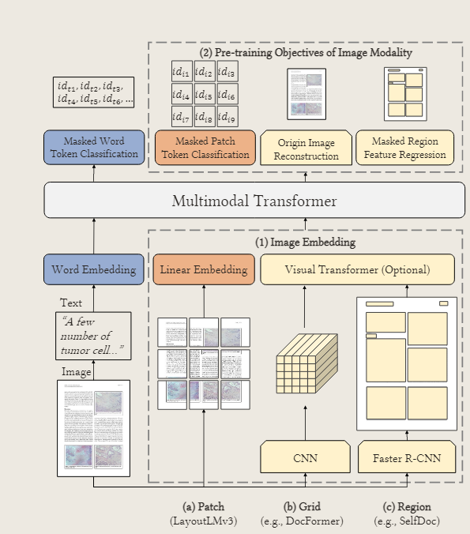

# LayoutLMv3： Pre-training for Document AI with Unified Text and Image Masking

首先,了解一下`Document AI`具体要做什么？

任务被分为两类
- text-centric tasks，以文本为中心的任务,例如表单理解,收据理解,文档问答等
- image-centric tasks，以图像为中心的任务,例如文档图像分类,文档布局分析等

- 表单理解的数据集:FUNSD
- 收据理解的数据集:CORD
- 文档问答的数据集:DocVQA
- 文档图像分类的数据集:RVL-CDIP
- 文档布局分析的数据集:PubLayNet

LayoutLMv3是在Document AI领域第一个不依靠预训练的CNN或Faster RCNN来抽取特征的多模型模型

LayoutLMv3是一个预训练模型,因此上面的5个数据集都是用来微调或者评测的

## 模型结构

### Text Embedding

text embedding是word embedding和position embedding的组合,作者使用离线的OCR工具预处理了文档图像,获取对应的文字和位置

作者使用了roBERTa中的word embedding来初始化word embedding

position embedding分为两个部分,包括1D position embedding和2D layout position embedding,

1D position embedding指的是这个token在文本序列中的索引,意义和其他transformer模型中的position embedding一样

2D layout position embedding指的是文本序列的bounding box坐标,这里存在一个粒度的问题，即我应该选择多少文字作为一个文本序列，框出一个bbox目标出来

LayoutLMv2 采用 word-level layout positions,即每一个词都有它自己的position, layoutLMv3采用segment-level级别的positions,即每一个段的词都共享相同的position

### Image Embedding
Image Embedding采用和ViT,ViLT相同的想法,对于一个$Image \in C \times H \times W$,分成$P \times P$大小的patch,将每一个patch采用linear project到D维,然后摊平展开,得到$HW / P^2$个向量,作为Image Embedding,添加1D position embedding等

## 预训练模型

MLM+MIM+WPA

## 下游微调评测