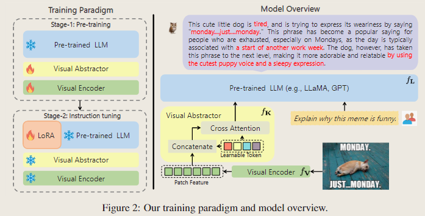
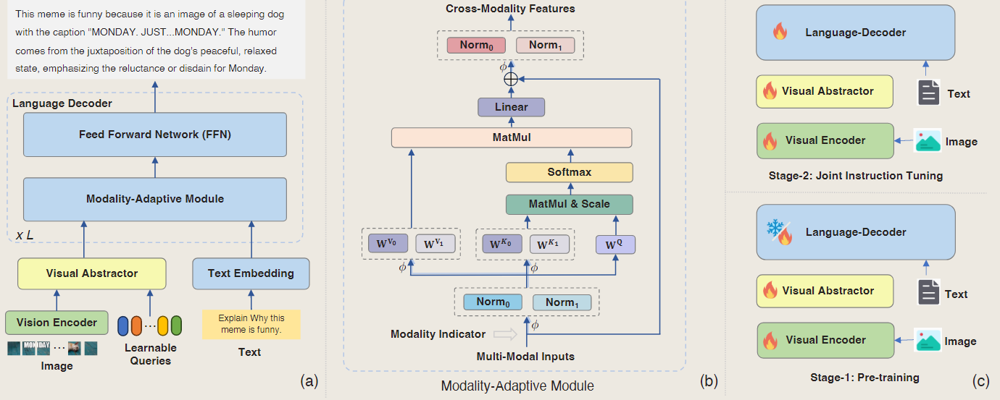
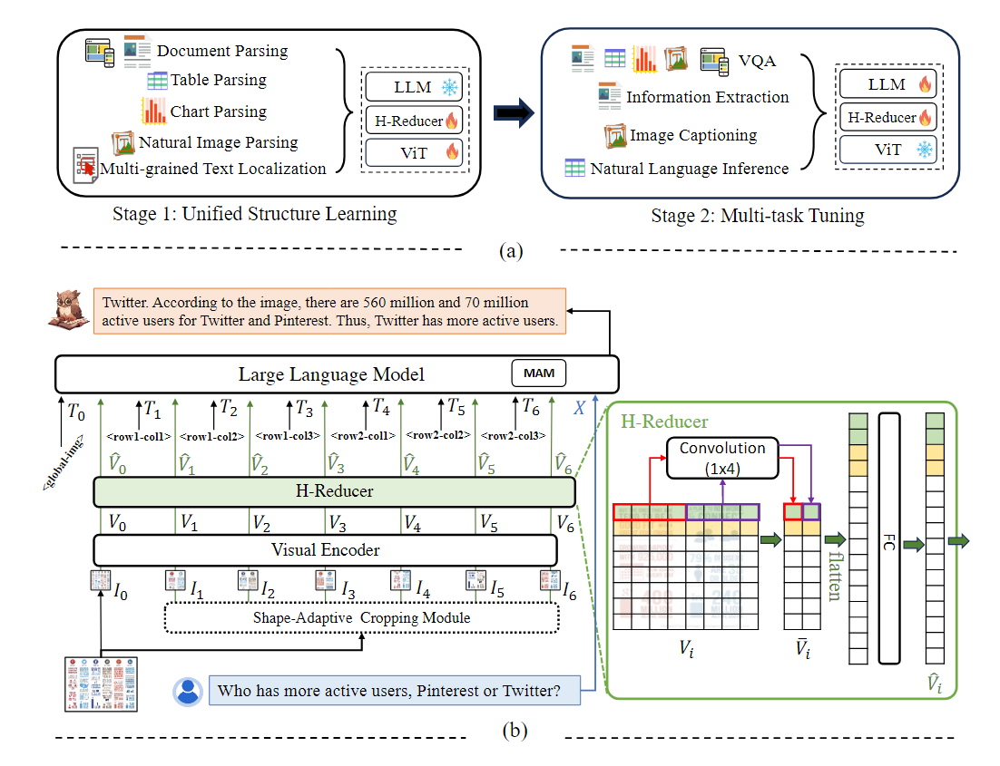

# mPLUG-Owl

[arixiv](https://arxiv.org/abs/2304.14178)

模型结构和其他MLLM模型类似,都是 Visual Encoder + 中间模块(这里叫visual Abstractor) + LLM

分为两阶段训练

1. stage1. 多模态预训练

冻结LLM参数,Visual Encoder和Visual Abstractor可调

2. stage2. Joint Instrcution Tuning  
 
冻结Visual Encoder和Visual Abstractor,和LLM参数,仅仅调LLM的LoRA参数,指令微调采用了纯语言指令数据和图文指令数据

两个阶段训练任务是 language modeling task

Visual Encoder采用 ViT-L/14,是从CLIP ViT-L/14初始化的
LLM 使用 LLaMA-7B

[CLIP ViT-L/14 huggingface repo](https://huggingface.co/laion/CLIP-ViT-L-14-laion2B-s32B-b82K),参数量为428M

总的参数量大约为7.2B

# mPLUG-Owl-2

[arxiv](https://arxiv.org/abs/2311.04257)

模型结构

1. Visual Encoder，用于编码图像
2. Visual Abstractor，Learning Queries和图像编码后的结果一起输入Visual Abstractor,得到一个图像的固定长度的表示
3. Text Embedding,Embedding层,用于编码文本
4. Modality-adaptive Module(MAM),用于融合文本和图像的信息

Visual Abstractor模块,和Qwen-VL的Resampler模块相似

图像编码后的输入通过cross-attn的方式和固定长度的learning queries进行交互,完成之后得到一个`[config.num_learnable_queries, config.hidden_size]`的向量表示,然后通过一个线形层`nn.Linear`来将维度转化为`[config.language_hidden_size]`,以供LLM使用

每一层会有独立的位置编码模块来加入位置信息
encoder_hidden_states不仅会加入k,v中,也会拼接到learning queries前面,即encoder_hidden_states不仅会合learning queries交互,也会和自己交互

MAM模块

源码位置[multiway.py](https://github.com/X-PLUG/mPLUG-Owl/blob/main/mPLUG-Owl2/mplug_owl2/model/multiway.py)

1. 个人感觉是针对不同的模态,准备

# mPLUG-DocOwl

# mPLUG-DocOwl 1.5

[arixv](https://arxiv.org/abs/2403.12895)

模型结构也是由三个部分组成

1. Visual Encoder
2. H-Reducer
3. LLM

H-Reducer是横向卷积结构(因为文本内容多是从左到右) (1x4大小的卷积核)

mPLUG-DocOwl1.5的LLM部分采用了mPLUG-Owl-2提出的Modality-adaptive Module(MAM)模块,来让LLM更好的分辨视觉和文本输入

mPLUG-DocOwl1.5采用了类似于UReader中图像处理方式,把一张图像划分成不同的224x224或者448x448的图像区域,然后加上一张resize之后的完整图像,把这些图像都送入图像编码器中独立编码,独立地使用Visual abstractor编码,一张图像(K+1)得到K+1个表示(K个图像区域),每个图像区域前面都会添加一个特殊的文本token`<rowx_coly>`来表征该图像的位置信息,全局图像则使用`<global_img>`来表征,随后把这K+1个 `[图像文信息;图像特征信息]` + 文本表示一起送入LLM中,最后LLM自回归的预测答案。

$$
   Y = LLM([T_0;\tilde{V}_0, T_1;\tilde{V}_1, \cdots, T_K;\tilde{V}_K;X])
$$

# InterVL
