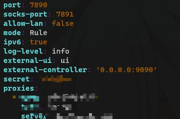

这篇文章主要说明如何在linux命令行终端中使用clash代理

不过代理的订阅地址请自行寻找

# 下载clash
在[clash官方仓库](https://github.com/Dreamacro/clash)下载,选择适合自己操作系统的版本的发行版本下载并解压

例如,如下我在ubuntu系统下进行下载
```
wget -O clash-linux.gz https://github.com/Dreamacro/clash/releases/download/premium/clash-linux-amd64-v3-2023.05.19.gz
gzip -d clash-linux.gz
```
解压得到一个二进制文件,可以使用`mv`重命名为`clash`

这里对设置的内容做总结
- `clash` 可指定程序
- `~/.config/clash` 配置文件夹

```shell
# 添加 user的可执行权
sudo chmod u+x clash
# clash 配置文件的默认位置
mkdir -p ~/.config/clash
# 进入对应文件夹
cd ~/.config/clash
```

# 获取订阅设置
```
curl -O config.yaml "订阅地址"
```
这样就会得到含有代理节点和代理规则的配置文件,我们需要做如下修改
- `allow-lan` 改为false,否则任何人都可以使用你的代理
- 添加`external-ui:ui` 为我们使用dashboard做准备
- 确实`external-controller`项的ip为0.0.0.0,这样可以保证任何ip都可以访问dashboard
- `secret`这是访问dashboard的密码,可选项

例如我的配置文件如下



# 下载dashboard对应前端代码

我使用的[yacd](https://github.com/haishanh/yacd),注意我们不需要下载源码,直接下载发行版内容即可=>[yacd-release is here](https://github.com/haishanh/yacd)

下载完成解压完成之后,我们得到一个名为`public`的文件夹,我们将其改名为`ui`,并且保持和`config.yaml`在同一级目录下。

这里`ui`不是绝对的，只要保证和`external-ui`中设置的相同即可。

# 运行clash

直接运行即可,根据log检查是否有错误,并使用`curl`确认确实可以走代理
然后确认dashboard确实可以访问

## Notice
**error: unsupported rule type RULE-SET**
```
FATA[0000] Parse config error: Rules[0] [RULE-SET,apple,REJECT] error: unsupported rule type RULE-SET
```
这是因为下载的clash版本不对，具体请参考[here](https://dreamacro.github.io/clash/introduction/faq.html#error-unsupported-rule-type-rule-set)

# 开启代理和关闭代理
修改`~/.bashrc`,添加如下两个函数
```shell
# open clash system proxy
function proxy_on() {
        export http_proxy=http://127.0.0.1:7890
        export https_proxy=http://127.0.0.1:7890
        export no_proxy=127.0.0.1,localhost
        echo -e "\033[32m[√] system proxy have opened\033[0m"
}

# close clash system proxy
function proxy_off(){
        unset http_proxy
        unset https_proxy
        unset no_proxy
        echo -e "\033[31m[×] system proxy have closed\033[0m"
}
```
这样我们就可以使用`proxy_on`和`proxy_off`控制代理的开启和关闭了

# 将clash设置为守护进程

这里先将文件位置做了转移,具体如下
```shell
sudo mkdir /etc/clash
sudo cp clash /usr/local/bin
sudo cp  ~/.config/clash/config.yaml /etc/clash/
sudo cp ~/.config/clash/Country.mmdb /etc/clash/
sudo cp -r ~/.config/ui /etc/clash
```

创建文件`/etc/systemd/system/clash.service`

写入如下内容
```
[Unit]
Description=Clash daemon, A rule-based proxy in Go.
After=network-online.target

[Service]
Type=simple
Restart=always
ExecStart=/usr/local/bin/clash -d /etc/clash

[Install]
WantedBy=multi-user.target
```

重新加载`systemd`,并且启用clash

```shell
systemctl daemon-reload
systemctl enable clash # 设置开启自启
systemctl start clash # 启动服务
systemctl status clash # 查看服务状态
journalctl -xe
```

**大功告成**

# 参考

[Clash Document](https://dreamacro.github.io/clash/)

[Clash for linux ](https://github.com/wanhebin/clash-for-linux)

[linux下部署Clash+dashboard](https://parrotsec-cn.org/t/linux-clash-dashboard/5169)

